# Manuel de SVT — Classe de T9

## Sciences de la vie et de la terre · 51 séances

**Établissement** : ____________________  **Enseignant** : ____________________  **Année scolaire** : ____________________

---

Ce document rassemble les **51 séances** du programme de SVT de la classe de T9 : 41 séances de contenu, 5 séances de révision et 5 sujets d'examen, chacun accompagné de son corrigé.

Il constitue une **proposition de réécriture** du manuel `SVT T9 [PE] Fiche de preparation sujet corrigés J-Learn (1).docx`, dont il corrige les écarts relevés lors de l'audit mené au regard du référentiel `jlearn-manuel-scolaire` v18. **Le document d'origine n'a pas été modifié.**

### Sources

| Source | Usage |
|---|---|
| **Programme d'Études T9 (SVT)**, DCRP, Ministère de l'Éducation Nationale | Résultats attendus, contenus, localités, stratégies, valeurs à véhiculer |
| FAO, CIRAD, OMS, Ligue contre le cancer, travaux de l'IRD et de l'université d'Antananarivo | Vérification et complément des données |


### Conventions de présentation

Barème de **20 points** par évaluation · page LEÇON complète · champ **Durée laissé vide**, à renseigner selon l'emploi du temps · colonne 1 intitulée **« Étapes »** · tableau de déroulement à 6 colonnes.

| | |
|---|---|
| **Discipline :** Sciences de la vie et de la terre | **Date :** ____________ |
| **Thème :** *(propre à l'unité)* | **Classe :** T9 |
| **Titre :** *(propre à la séance)* | **Séance n° :** *n* / 51 |
| **Objectif spécifique :** *(propre à la séance)* | **Durée :** ____________ |
| **Documentation :** Programme d'Études T9 (SVT), DCRP | |
| **Support et matériel :** *(propre à la séance)* | **Valeurs à véhiculer :** *(propres à l'unité)* |

Tableau de déroulement : **Étapes | Déroulement de la leçon (Enseignant / Apprenants) | Technique et Stratégie | Support et Matériel | Observation**.

### Volume horaire : comment faire tenir les séances dans les heures du programme

Le Programme d'Études fixe **4 h par semaine, soit 66 h** réparties entre les cinq
unités. Ce manuel compte **51 séances**. Les deux nombres ne se correspondent pas
unité par unité : le champ **Durée** est laissé vide précisément pour que vous
arbitriez selon votre emploi du temps et votre classe. Le tableau ci-dessous
donne le rapport à respecter pour ne pas dépasser le volume officiel.

| Unité | Durée PE | Séances | Temps moyen par séance | Marge |
|---|---:|---:|---|---|
| I — Alimentation | 10 h | 12 | **50 min** | serrée — regroupez 2 séances si besoin |
| II — Organisation des êtres vivants | 15 h | 12 | **1 h 15** | confortable |
| III — Santé et bien-être | 18 h | 11 | **1 h 35** | large — prenez le temps des travaux de groupe |
| IV — Reproduction humaine | 10 h | 8 | **1 h 15** | confortable |
| V — Géologie | 13 h | 8 | **1 h 35** | large |
| **Total** | **66 h** | **51** | | |

> **Unité I : le point de vigilance.** C'est la seule unité où le temps manque
> — 12 séances pour 10 h. Deux solutions, au choix : traiter les séances 2 et 3
> en une seule fois (les groupes de nutriments se prêtent au tableau unique), ou
> donner la séance 11 (révision) à faire à la maison et n'en corriger que les
> réponses en classe. **Ne sacrifiez pas la séance 12 (examen)** : elle est la
> seule évaluation notée de l'unité.
>
> À l'inverse, les unités III et V disposent de marge : c'est là qu'il faut
> placer les manipulations, les sorties et les mini-projets.

Ce rapport est indicatif. Une séance de découverte demande souvent plus de temps
qu'une séance d'application, et une classe nombreuse ralentit les travaux de
groupe. Le tableau donne la **moyenne à tenir sur l'unité**, pas un minutage à
appliquer séance par séance.

---

# Sommaire


## Unité I — Alimentation de l'homme

*Durée : 10 h · Valeurs à véhiculer : autonomie, créativité*

- **1.** [Ration alimentaire et groupes d'aliments](#séance-1-51-ration-alimentaire-et-groupes-daliments)
- **2.** [Glucides, lipides et protéines](#séance-2-51-glucides-lipides-et-protéines)
- **3.** [Vitamines, sels minéraux et eau](#séance-3-51-vitamines-sels-minéraux-et-eau)
- **4.** [Valeur énergétique des nutriments](#séance-4-51-valeur-énergétique-des-nutriments)
- **5.** [Métabolisme et besoins énergétiques](#séance-5-51-métabolisme-et-besoins-énergétiques)
- **6.** [Calculer les besoins énergétiques](#séance-6-51-calculer-les-besoins-énergétiques)
- **7.** [Construire un menu varié](#séance-7-51-construire-un-menu-varié)
- **8.** [Importance de l'équilibre alimentaire](#séance-8-51-importance-de-léquilibre-alimentaire)
- **9.** [Malnutrition aiguë et carences](#séance-9-51-malnutrition-aiguë-et-carences)
- **10.** [Surpoids, obésité et menus d'appoint](#séance-10-51-surpoids-obésité-et-menus-dappoint)
- **11.** [Révision de l'Unité I : sujet d'entraînement](#séance-11-51-révision-de-lunité-i-sujet-dentraînement) 🔁
- **12.** [Examen de l'Unité I : Alimentation](#séance-12-51-examen-de-lunité-i-alimentation) 📝

## Unité II — Organisation des êtres vivants

*Durée : 15 h · Valeurs à véhiculer : respect de toute vie, excellence*

- **13.** [Les besoins nutritifs des plantes](#séance-13-51-les-besoins-nutritifs-des-plantes)
- **14.** [Le lieu et le mode d'absorption de l'eau](#séance-14-51-le-lieu-et-le-mode-dabsorption-de-leau)
- **15.** [Les soins à apporter aux plantes cultivées](#séance-15-51-les-soins-à-apporter-aux-plantes-cultivées)
- **16.** [Les bio-agresseurs des cultures](#séance-16-51-les-bio-agresseurs-des-cultures)
- **17.** [Les méthodes naturelles de protection](#séance-17-51-les-méthodes-naturelles-de-protection)
- **18.** [Les méthodes chimiques et leur usage responsable](#séance-18-51-les-méthodes-chimiques-et-leur-usage-responsable)
- **19.** [Les besoins d'un animal d'élevage](#séance-19-51-les-besoins-dun-animal-délevage)
- **20.** [L'alimentation et l'habitat](#séance-20-51-lalimentation-et-lhabitat)
- **21.** [Les soins : vaccination et déparasitage](#séance-21-51-les-soins-vaccination-et-déparasitage)
- **22.** [La sélection et l'amélioration de l'élevage](#séance-22-51-la-sélection-et-lamélioration-de-lélevage)
- **23.** [Révision de l'Unité II : sujet d'entraînement](#séance-23-51-révision-de-lunité-ii-sujet-dentraînement) 🔁
- **24.** [Examen de l'Unité II : Agriculture et élevage](#séance-24-51-examen-de-lunité-ii-agriculture-et-élevage) 📝

## Unité III — Santé et bien-être

*Durée : 18 h · Valeurs à véhiculer : connaissance de soi, altruisme*

- **25.** [L'organisation du système nerveux](#séance-25-51-lorganisation-du-système-nerveux)
- **26.** [Les rôles des différentes parties](#séance-26-51-les-rôles-des-différentes-parties)
- **27.** [Le mouvement réflexe inné](#séance-27-51-le-mouvement-réflexe-inné)
- **28.** [Le mouvement réflexe acquis](#séance-28-51-le-mouvement-réflexe-acquis)
- **29.** [Le mouvement volontaire](#séance-29-51-le-mouvement-volontaire)
- **30.** [L'arc réflexe](#séance-30-51-larc-réflexe)
- **31.** [Les catégories de substances psychoactives](#séance-31-51-les-catégories-de-substances-psychoactives)
- **32.** [Les effets sur l'organisme et sur la vie sociale](#séance-32-51-les-effets-sur-lorganisme-et-sur-la-vie-sociale)
- **33.** [Hygiène du système nerveux et prévention](#séance-33-51-hygiène-du-système-nerveux-et-prévention)
- **34.** [Révision de l'Unité III : sujet d'entraînement](#séance-34-51-révision-de-lunité-iii-sujet-dentraînement) 🔁
- **35.** [Examen de l'Unité III : Santé et bien-être](#séance-35-51-examen-de-lunité-iii-santé-et-bien-être) 📝

## Unité IV — Reproduction humaine

*Durée : 10 h · Valeurs à véhiculer : estime de soi, responsabilité*

- **36.** [La fistule obstétricale : définition et symptômes](#séance-36-51-la-fistule-obstétricale-définition-et-symptômes)
- **37.** [Causes, conséquences et prévention de la fistule](#séance-37-51-causes-conséquences-et-prévention-de-la-fistule)
- **38.** [La grossesse précoce et le suivi médical](#séance-38-51-la-grossesse-précoce-et-le-suivi-médical)
- **39.** [Le cancer du col de l'utérus : anatomie, causes et symptômes](#séance-39-51-le-cancer-du-col-de-lutérus-anatomie-causes-et-symptômes)
- **40.** [Cancer du col : dépistage, vaccination et prévention](#séance-40-51-cancer-du-col-dépistage-vaccination-et-prévention)
- **41.** [Mini-projet : concevoir un message de sensibilisation](#séance-41-51-mini-projet-concevoir-un-message-de-sensibilisation)
- **42.** [Révision de l'Unité IV : sujet d'entraînement](#séance-42-51-révision-de-lunité-iv-sujet-dentraînement) 🔁
- **43.** [Examen de l'Unité IV : Reproduction humaine](#séance-43-51-examen-de-lunité-iv-reproduction-humaine) 📝

## Unité V — Géologie

*Durée : 13 h · Valeurs à véhiculer : responsabilité, sens du bien commun*

- **44.** [Les trois familles de pierres gemmes](#séance-44-51-les-trois-familles-de-pierres-gemmes)
- **45.** [Les propriétés physiques des pierres gemmes](#séance-45-51-les-propriétés-physiques-des-pierres-gemmes)
- **46.** [La répartition géographique des pierres gemmes à Madagascar](#séance-46-51-la-répartition-géographique-des-pierres-gemmes-à-madagascar)
- **47.** [Les utilisations des pierres gemmes](#séance-47-51-les-utilisations-des-pierres-gemmes)
- **48.** [Les techniques d'exploitation](#séance-48-51-les-techniques-dexploitation)
- **49.** [Les impacts environnementaux et la responsabilité](#séance-49-51-les-impacts-environnementaux-et-la-responsabilité)
- **50.** [Révision de l'Unité V : sujet d'entraînement](#séance-50-51-révision-de-lunité-v-sujet-dentraînement) 🔁
- **51.** [Examen de l'Unité V : Géologie](#séance-51-51-examen-de-lunité-v-géologie) 📝


🔁 séance de révision · 📝 sujet d'examen

---


# SÉANCE 1 / 51 — Ration alimentaire et groupes d'aliments

**Objectif spécifique** : définir la ration alimentaire et classer les aliments selon leur rôle.
**Support et matériel** : pyramide alimentaire dessinée au tableau, photo d'un repas malgache.

| Étapes | Enseignant | Apprenants | Technique | Support | Obs. |
|---|---|---|---|---|---|
| **I. RÉVISION** | Citez trois aliments que vous avez mangés hier.<br>Mange-t-on la même chose à chaque repas ? | R.A. : Du riz, des brèdes, du poisson.<br>R.A. : Non, les aliments changent d'un repas à l'autre. | Questionnement oral | — | |
| **II. NOUVELLE LEÇON** ||||||
| 1. Mise en situation | Soa mange du riz à tous les repas, tous les jours. Nivo mange du riz, des brèdes, des haricots et parfois du poisson. Laquelle des deux se nourrit le mieux ? | R.A. : Nivo, parce qu'elle mange des aliments variés. | Questionnement oral | Tableau noir | |
| 2. Présentation | Aujourd'hui nous allons apprendre : « Ration alimentaire et groupes d'aliments ». Après cette séance vous serez capables de définir une ration alimentaire et de classer les aliments en trois groupes. | Les élèves écoutent. | Exposé | Tableau noir, cahier | |
| 3. Observation | Regardez et observez bien cette pyramide alimentaire et la photo de ce repas malgache. | Les élèves observent silencieusement. | Observation dirigée | Pyramide alimentaire, photo de repas | |
| 4. Analyse | Que mange-t-on en plus grande quantité d'après la pyramide ?<br>Quels aliments sont tout en haut ?<br>Dans le repas photographié, quel aliment donne de la force pour travailler ?<br>Lequel aide le corps à grandir ?<br>Lequel protège contre les maladies ? | R.A. : Les céréales et les féculents, à la base.<br>R.A. : Les matières grasses et les produits sucrés, à consommer en petite quantité.<br>R.A. : Le riz, c'est un aliment énergétique.<br>R.A. : Le poisson, c'est un aliment bâtisseur.<br>R.A. : Les brèdes, ce sont des aliments protecteurs. | Étude de document, travail de groupe | Pyramide alimentaire, photo de repas | |
| 5. Synthèse | **Donc,** la ration alimentaire est l'ensemble de ce qu'une personne mange et boit en une journée. Les aliments se classent en trois groupes : les énergétiques qui donnent de la force, les bâtisseurs qui font grandir et réparent, les protecteurs qui défendent contre les maladies. Une bonne ration contient les trois. | Les élèves écoutent. | Exposé magistral | Tableau noir | |
| 6. Application | **Ex. 1** — Classe ces aliments en énergétique, bâtisseur ou protecteur : a) le riz · b) le poisson · c) les brèdes · d) l'huile<br><br>**Ex. 2** — Vrai ou Faux : 1. La ration alimentaire est ce qu'on mange en une semaine. 2. Le riz est un aliment bâtisseur. 3. Les brèdes protègent l'organisme. 4. Une bonne ration contient les trois groupes. | **Ex. 1** : a) **énergétique** · b) **bâtisseur** · c) **protecteur** · d) **énergétique**<br><br>**Ex. 2** : 1. **F** — c'est ce qu'on mange en **une journée**. 2. **F** — le riz est **énergétique**, le poisson est bâtisseur. 3. **V** 4. **V** | Travail de groupe | Grande ardoise | |
| **III. ÉVALUATION** | **Ex. 1** — Complète : a) La ration alimentaire correspond à …… b) Les aliments qui font grandir sont dits …… c) Les brèdes sont des aliments …… d) Le riz apporte de l'……<br><br>**Ex. 2** — Cite deux aliments de chaque groupe et explique pourquoi une ration qui ne contient que du riz est insuffisante. | **Ex. 1** : a) **une journée** b) **bâtisseurs** c) **protecteurs** d) **énergie**<br><br>**Ex. 2** : Énergétiques : riz, manioc. Bâtisseurs : poisson, haricots. Protecteurs : brèdes, mangue. Une ration de riz seul n'apporte **ni les matériaux pour grandir, ni les protections contre les maladies**. | Évaluation écrite | Cahier, feuille d'évaluation | |

### Page LEÇON

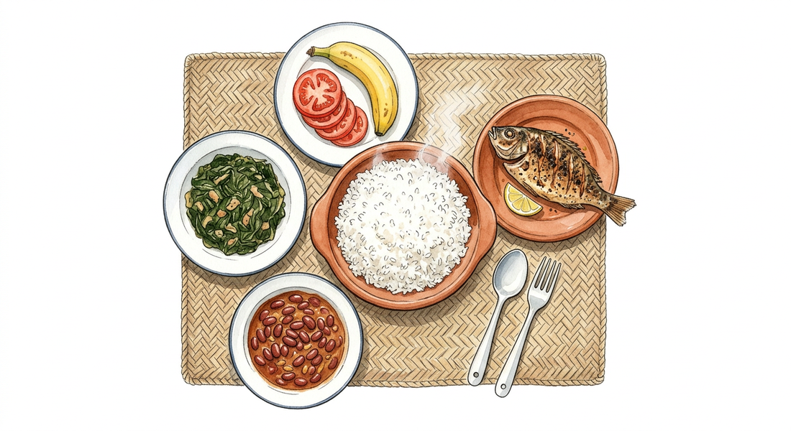


**<span style="color:#C00000">Ration alimentaire et groupes d'aliments</span>**

**<span style="color:#1E7B34">1. La ration alimentaire</span>**

La **ration alimentaire** est l'ensemble des aliments et des boissons qu'une personne consomme au cours d'une journée. Elle doit couvrir tout ce dont le corps a besoin pour vivre, travailler et grandir.

Une ration convenable est **variée** : elle puise dans plusieurs sortes d'aliments. Elle est aussi **adaptée** à celui qui la consomme, car les besoins ne sont pas les mêmes selon l'âge, le travail effectué et l'état de santé. Un cultivateur qui travaille aux champs ne mange pas comme un élève assis en classe.

**<span style="color:#1E7B34">2. Les trois groupes d'aliments</span>**

On classe les aliments d'après le service qu'ils rendent au corps.

**a. Les aliments énergétiques**
Ils fournissent la force nécessaire pour bouger, travailler et maintenir le corps chaud.
- Riz (*vary*), manioc, patate douce, maïs
- Huile, arachides

**b. Les aliments bâtisseurs**
Ils apportent les matériaux qui construisent le corps pendant la croissance et réparent ce qui s'use.
- Poisson (*trondro*), viande, œufs
- Haricots (*tsaramaso*), lait

**c. Les aliments protecteurs**
Ils défendent l'organisme contre les maladies et assurent son bon fonctionnement.
- Brèdes (*anana*), légumes verts
- Mangue, orange, papaye

**<span style="color:#1E7B34">3. Équilibrer sa ration</span>**

Une ration correcte associe les trois groupes à chaque repas. Manger beaucoup d'un seul groupe ne suffit pas : une assiette de riz seule apporte de l'énergie, mais rien pour grandir ni pour se protéger.

Un repas simple et complet peut être composé de riz, de haricots, de brèdes et d'un peu d'huile — des aliments disponibles partout à Madagascar.

### Section EXERCICES

**Exercice 1 (5 points)** — Classe chaque aliment dans son groupe : 1. le manioc · 2. les œufs · 3. la papaye · 4. l'arachide · 5. le lait

**Exercice 2 (5 points)** — Vrai ou Faux, et corrige les affirmations fausses :
1. La ration alimentaire est ce qu'on mange pendant une journée.
2. Les aliments protecteurs servent surtout à donner de la force.
3. Le poisson et les haricots sont des aliments bâtisseurs.
4. Une ration variée est préférable à une ration composée d'un seul aliment.
5. Tout le monde a besoin de la même ration.

**Exercice 3 (6 points)** — Voici le repas de Koto : riz, brèdes, huile. 1. Quel groupe manque ? 2. Quel aliment local pourrait-il ajouter ? 3. Pourquoi ce groupe est-il indispensable à son âge ?

**Exercice 4 (4 points)** — Choisis la bonne réponse :
1. La ration alimentaire couvre : **A.** un repas **B.** une journée **C.** une semaine
2. Les brèdes sont des aliments : **A.** énergétiques **B.** bâtisseurs **C.** protecteurs
3. Un adulte qui travaille aux champs a besoin : **A.** de moins d'énergie qu'un élève **B.** d'autant **C.** de plus
4. Une ration uniquement composée de riz est : **A.** complète **B.** insuffisante **C.** excessive

**TOTAL : 20 points**

### CORRIGÉ

**Ex. 1** — 1. **énergétique** · 2. **bâtisseur** · 3. **protecteur** · 4. **énergétique** · 5. **bâtisseur**

**Ex. 2** — 1. **V** · 2. **F** — ils **protègent contre les maladies** ; ce sont les énergétiques qui donnent de la force · 3. **V** · 4. **V** · 5. **F** — la ration **dépend de l'âge, de l'activité et de l'état de santé**

**Ex. 3** — 1. Il manque le groupe des **aliments bâtisseurs**. 2. Il peut ajouter du **poisson**, des **haricots** ou un **œuf**. 3. À son âge, **le corps grandit** : il a besoin de matériaux pour **construire ses muscles et ses os**.

**Ex. 4** — 1. **B** · 2. **C** · 3. **C** · 4. **B**


---


# SÉANCE 2 / 51 — Glucides, lipides et protéines

**Objectif spécifique** : distinguer les glucides, les lipides et les protéines et indiquer leur rôle.
**Support et matériel** : échantillons réels (riz, huile, arachides, haricots secs) dans quatre coupelles.

| Étapes | Enseignant | Apprenants | Technique | Support | Obs. |
|---|---|---|---|---|---|
| **I. RÉVISION** | Quels sont les trois groupes d'aliments ?<br>Donne un exemple d'aliment bâtisseur. | R.A. : Énergétiques, bâtisseurs, protecteurs.<br>R.A. : Le poisson, la viande, les haricots. | Questionnement oral | — | |
| **II. NOUVELLE LEÇON** ||||||
| 1. Mise en situation | Quand on écrase une arachide sur une feuille de papier, une tache grasse apparaît. Qu'est-ce que cela nous apprend sur l'arachide ? | R.A. : Elle contient de la matière grasse. | Questionnement oral | Arachide, feuille de papier | |
| 2. Présentation | Aujourd'hui nous allons apprendre : « Glucides, lipides et protéines ». Après cette séance vous serez capables de nommer ces trois nutriments et de citer leur rôle. | Les élèves écoutent. | Exposé | Tableau noir, cahier | |
| 3. Observation | Regardez et observez bien ces quatre coupelles : riz, huile, arachides, haricots secs. | Les élèves observent silencieusement. | Observation dirigée | Échantillons d'aliments | |
| 4. Analyse | Lequel de ces aliments laisse une tache grasse ?<br>Lequel est surtout composé d'amidon ?<br>Comment appelle-t-on la matière grasse en langage scientifique ?<br>Quel nutriment domine dans les haricots ?<br>À quoi servent les protéines dans le corps ? | R.A. : L'huile et l'arachide.<br>R.A. : Le riz.<br>R.A. : Les lipides.<br>R.A. : Les protéines.<br>R.A. : Elles construisent les muscles et réparent les tissus. | Observation, travail de groupe | Échantillons d'aliments | |
| 5. Synthèse | **Donc,** les glucides sont les sucres, ils fournissent l'énergie de tous les jours. Les lipides sont les matières grasses, ils stockent l'énergie et entrent dans la composition des cellules. Les protéines construisent et réparent le corps. Chaque aliment en contient, mais dans des proportions différentes. | Les élèves écoutent. | Exposé magistral | Tableau noir | |
| 6. Application | **Ex. 1** — Indique le nutriment dominant : a) l'huile · b) le riz · c) le poisson · d) le manioc<br><br>**Ex. 2** — Complète : a) Les sucres sont appelés …… b) Les matières grasses sont les …… c) Les …… construisent les muscles. d) L'amidon est un …… | **Ex. 1** : a) **lipides** · b) **glucides** · c) **protéines** · d) **glucides**<br><br>**Ex. 2** : a) **glucides** b) **lipides** c) **protéines** d) **glucide** | Travail de groupe | Grande ardoise | |
| **III. ÉVALUATION** | **Ex. 1** — Relie chaque nutriment à son rôle principal : glucides · lipides · protéines ↔ construire et réparer · fournir l'énergie quotidienne · stocker l'énergie<br><br>**Ex. 2** — Vrai ou Faux : 1. L'huile est riche en glucides. 2. Le poisson apporte des protéines. 3. L'amidon du riz est un glucide. 4. Les protéines servent à la croissance. | **Ex. 1** : glucides → **fournir l'énergie quotidienne** ; lipides → **stocker l'énergie** ; protéines → **construire et réparer**<br><br>**Ex. 2** : 1. **F** — l'huile est riche en **lipides** · 2. **V** · 3. **V** · 4. **V** | Évaluation écrite | Cahier, feuille d'évaluation | |

### Page LEÇON

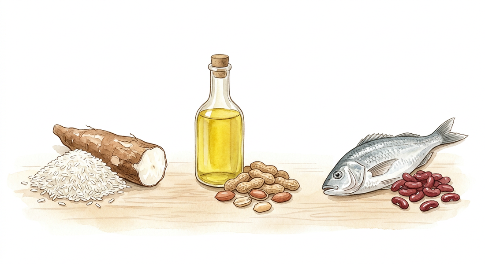


**<span style="color:#C00000">Glucides, lipides et protéines</span>**

**<span style="color:#1E7B34">1. Des aliments aux nutriments</span>**

Les aliments que nous mangeons sont des mélanges. Au cours de la digestion, ils sont découpés en petites substances que le corps peut absorber : les **nutriments**.

Un **nutriment** est une substance simple, assez petite pour traverser la paroi de l'intestin et passer dans le sang. Trois familles de nutriments apportent de la matière et de l'énergie : les glucides, les lipides et les protéines.

**<span style="color:#1E7B34">2. Les trois nutriments énergétiques</span>**

**a. Les glucides**
Ce sont les **sucres**. On les trouve dans le riz, le manioc, le maïs, le pain, les fruits. L'**amidon** du riz est un glucide complexe : la digestion le transforme en **glucose**, le sucre que les cellules utilisent directement.
Les glucides constituent la principale source d'énergie de l'alimentation, et la moins coûteuse à produire.

**b. Les lipides**
Ce sont les **matières grasses**, liquides comme l'huile ou solides comme le gras de viande. On les trouve dans l'huile, l'arachide, la noix de coco.
Ils jouent deux rôles : ils **stockent l'énergie** en réserve dans le corps, et ils entrent dans la **composition des membranes** de toutes les cellules.

**c. Les protéines**
On les trouve dans le poisson, la viande, les œufs, le lait, et aussi dans les légumineuses comme les haricots et les arachides.
Elles ont un rôle **bâtisseur** : elles forment les muscles et la peau, et remplacent les cellules usées tout au long de la vie. Elles participent aussi à la défense de l'organisme et au transport de l'oxygène dans le sang.

**<span style="color:#1E7B34">3. Reconnaître le nutriment dominant</span>**

Aucun aliment ne contient un seul nutriment, mais l'un domine souvent :

| Aliment | Nutriment dominant |
|---|---|
| Riz, manioc, maïs | Glucides |
| Huile, arachide | Lipides |
| Poisson, œuf, haricots | Protéines |

Un test simple permet de repérer les lipides : frotter l'aliment sur du papier. Si une **tache translucide** persiste après séchage, l'aliment contient des matières grasses.

### Section EXERCICES

**Exercice 1 (4 points)** — Indique le nutriment dominant de : 1. le maïs · 2. la noix de coco · 3. l'œuf · 4. la patate douce

**Exercice 2 (6 points)** — Complète avec : *glucose, amidon, lipides, protéines, nutriment, glucides*
1. Un …… est une substance assez petite pour passer dans le sang.
2. Le riz contient beaucoup d'…….
3. La digestion transforme l'amidon en …….
4. L'huile est riche en …….
5. Les …… construisent les muscles.
6. Les sucres sont des …….

**Exercice 3 (6 points)** — On frotte trois aliments sur du papier : l'arachide laisse une tache grasse, le riz n'en laisse pas, le poisson non plus. 1. Que contient l'arachide ? 2. Pourquoi le riz ne laisse-t-il pas de tache ? 3. Le poisson est-il dépourvu de tout nutriment ? Justifie.

**Exercice 4 (4 points)** — Choisis la bonne réponse :
1. L'amidon est : **A.** un lipide **B.** un glucide **C.** une protéine
2. Le rôle principal des protéines est de : **A.** construire et réparer **B.** donner un goût sucré **C.** stocker l'eau
3. Les lipides entrent dans la composition : **A.** des os uniquement **B.** des membranes des cellules **C.** du sang uniquement
4. Un nutriment traverse la paroi : **A.** de l'estomac **B.** de l'intestin **C.** du poumon

**TOTAL : 20 points**

### CORRIGÉ

**Ex. 1** — 1. **glucides** · 2. **lipides** · 3. **protéines** · 4. **glucides**

**Ex. 2** — 1. **nutriment** · 2. **amidon** · 3. **glucose** · 4. **lipides** · 5. **protéines** · 6. **glucides**

**Ex. 3** — 1. L'arachide contient des **lipides** (matières grasses). 2. Le riz est riche en **amidon**, un **glucide** : il ne contient presque pas de matière grasse. 3. **Non** : il ne contient pas de lipides en quantité, mais il est **riche en protéines**, qui ne laissent pas de tache grasse.

**Ex. 4** — 1. **B** · 2. **A** · 3. **B** · 4. **B**


---


# SÉANCE 3 / 51 — Vitamines, sels minéraux et eau

**Objectif spécifique** : expliquer le rôle des vitamines, des sels minéraux et de l'eau, et citer leurs sources.
**Support et matériel** : fruits et légumes locaux (mangue, orange, brèdes), verre d'eau, os sec.

| Étapes | Enseignant | Apprenants | Technique | Support | Obs. |
|---|---|---|---|---|---|
| **I. RÉVISION** | Quels sont les trois nutriments qui apportent de l'énergie ?<br>Quel nutriment construit les muscles ? | R.A. : Les glucides, les lipides et les protéines.<br>R.A. : Les protéines. | Questionnement oral | — | |
| **II. NOUVELLE LEÇON** ||||||
| 1. Mise en situation | On peut rester plusieurs jours sans manger, mais seulement deux ou trois jours sans boire. Pourquoi l'eau est-elle si importante ? | R.A. : Parce que le corps en est en grande partie constitué et en perd tous les jours. | Questionnement oral | Verre d'eau | |
| 2. Présentation | Aujourd'hui nous allons apprendre : « Vitamines, sels minéraux et eau ». Après cette séance vous serez capables d'expliquer leur rôle et de citer des aliments qui en apportent. | Les élèves écoutent. | Exposé | Tableau noir, cahier | |
| 3. Observation | Regardez et observez bien ces fruits et ces brèdes, ce verre d'eau et cet os. | Les élèves observent silencieusement. | Observation dirigée | Fruits, brèdes, eau, os sec | |
| 4. Analyse | Quel élément minéral rend cet os dur et solide ?<br>Que trouve-t-on surtout dans la mangue et l'orange ?<br>Ces nutriments apportent-ils de l'énergie ?<br>Comment le corps perd-il de l'eau chaque jour ?<br>Que se passe-t-il si l'alimentation manque de fer ? | R.A. : Le calcium.<br>R.A. : Des vitamines, surtout la vitamine C.<br>R.A. : Non, ils protègent et font fonctionner le corps.<br>R.A. : Par l'urine, la sueur et la respiration.<br>R.A. : Le sang est appauvri, la personne devient fatiguée et pâle. | Étude de document, travail de groupe | Fruits, brèdes, os sec | |
| 5. Synthèse | **Donc,** les vitamines, les sels minéraux et l'eau n'apportent aucune énergie, mais ils sont indispensables. Les vitamines font fonctionner l'organisme et protègent des maladies. Les sels minéraux construisent les os et les dents et entretiennent le sang. L'eau transporte les substances et élimine les déchets. | Les élèves écoutent. | Exposé magistral | Tableau noir | |
| 6. Application | **Ex. 1** — Vrai ou Faux : 1. Les vitamines apportent de l'énergie. 2. Le calcium renforce les os. 3. L'eau élimine les déchets. 4. Le fer est utile au sang.<br><br>**Ex. 2** — Cite : a) deux fruits riches en vitamines · b) un sel minéral des os · c) un sel minéral du sang · d) deux façons dont le corps perd de l'eau | **Ex. 1** : 1. **F** — elles **n'apportent aucune énergie** · 2. **V** · 3. **V** · 4. **V**<br><br>**Ex. 2** : a) **mangue, orange** b) **calcium** c) **fer** d) **urine, sueur** | Travail de groupe | Grande ardoise | |
| **III. ÉVALUATION** | **Ex. 1** — Complète : a) La vitamine C se trouve dans les …… b) Le …… solidifie les os. c) Le …… entre dans la composition du sang. d) Le corps perd de l'eau par la ……<br><br>**Ex. 2** — Une personne mange chaque jour du riz et rien d'autre. Cite deux nutriments qui lui manqueront et explique une conséquence pour sa santé. | **Ex. 1** : a) **fruits et légumes** b) **calcium** c) **fer** d) **sueur** (ou l'urine)<br><br>**Ex. 2** : Il lui manquera des **vitamines** et des **sels minéraux** (ainsi que des protéines). Conséquence : elle sera **plus exposée aux maladies** et pourra souffrir d'**anémie** par manque de fer. | Évaluation écrite | Cahier, feuille d'évaluation | |

### Page LEÇON

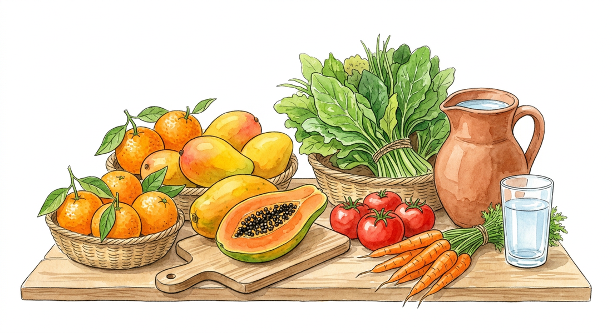


**<span style="color:#C00000">Vitamines, sels minéraux et eau</span>**

**<span style="color:#1E7B34">1. Des nutriments sans énergie</span>**

Les vitamines, les sels minéraux et l'eau sont des nutriments particuliers : ils **n'apportent aucune énergie** au corps. Ils ne sont pourtant pas facultatifs — sans eux, l'organisme ne peut pas fonctionner.

Ce sont aussi des **nutriments directs** : contrairement à l'amidon ou aux protéines, ils sont déjà assez petits pour passer dans le sang sans être digérés.

**<span style="color:#1E7B34">2. Les vitamines</span>**

Les vitamines sont nécessaires en très petite quantité, mais le corps **ne sait pas les fabriquer** : elles doivent venir de l'alimentation.

- **Vitamine C** — dans les fruits et légumes frais : orange, mangue, goyave, tomate. Elle aide à résister aux infections.
- **Vitamine A** — dans la carotte, la papaye, les brèdes. Elle est utile à la vision.
- **Vitamines du groupe B** — apportées par les céréales peu raffinées et les légumineuses.

Une alimentation dépourvue de fruits et de légumes expose à des carences, même si l'on mange à sa faim.

**<span style="color:#1E7B34">3. Les sels minéraux</span>**

Ce sont des éléments venus du sol, absorbés par les plantes puis transmis par les aliments.

**a. Le calcium**
Il durcit les **os** et les **dents**. On le trouve dans le lait, les produits laitiers, les petits poissons consommés avec leurs arêtes et les brèdes.

**b. Le fer**
Il entre dans la composition du **sang** et participe au transport de l'oxygène. Il est apporté par la viande, le poisson, les légumineuses et les brèdes. Un manque de fer provoque une **anémie** : fatigue, pâleur, essoufflement.

**c. L'iode**
Nécessaire en très faible quantité, il est apporté par le sel iodé et les produits de la mer.

**<span style="color:#1E7B34">4. L'eau</span>**

L'eau est le constituant le plus abondant du corps humain. Elle assure plusieurs fonctions vitales : elle **transporte** les nutriments dans le sang, **élimine les déchets** par l'urine et la sueur, et participe à la **régulation de la température**.

Le corps perd de l'eau en permanence — par l'urine, la sueur et la respiration. Ces pertes doivent être compensées chaque jour par les **boissons** et par l'eau que renferment les aliments — les fruits et les légumes frais en contiennent beaucoup.

### Section EXERCICES

**Exercice 1 (4 points)** — Indique ce qu'apporte principalement chaque aliment : 1. l'orange · 2. le lait · 3. les brèdes · 4. le sel iodé

**Exercice 2 (6 points)** — Vrai ou Faux, et corrige les affirmations fausses :
1. Les vitamines fournissent de l'énergie au corps.
2. Le calcium participe à la solidité des os.
3. Le corps fabrique lui-même toutes les vitamines dont il a besoin.
4. Le fer est nécessaire au sang.
5. L'eau permet d'éliminer les déchets.
6. Les sels minéraux sont des nutriments directs.

**Exercice 3 (6 points)** — Rakoto se sent souvent fatigué et son teint est pâle. Il mange surtout du riz et très peu de brèdes, de viande ou de poisson. 1. Quel sel minéral risque de lui manquer ? 2. Comment s'appelle ce trouble ? 3. Propose deux aliments locaux pour y remédier.

**Exercice 4 (4 points)** — Choisis la bonne réponse :
1. La vitamine C se trouve surtout dans : **A.** l'huile **B.** les fruits frais **C.** le riz blanc
2. Le calcium sert à : **A.** transporter l'oxygène **B.** solidifier les os **C.** fournir de l'énergie
3. Les vitamines sont nécessaires : **A.** en grande quantité **B.** en petite quantité **C.** uniquement chez l'adulte
4. L'eau apporte : **A.** 4 kcal par gramme **B.** 9 kcal par gramme **C.** aucune énergie

**TOTAL : 20 points**

### CORRIGÉ

**Ex. 1** — 1. des **vitamines** (vitamine C) · 2. du **calcium** · 3. des **vitamines** et du **fer** · 4. de l'**iode**

**Ex. 2** — 1. **F** — elles **n'apportent aucune énergie**, elles font fonctionner l'organisme · 2. **V** · 3. **F** — le corps **ne sait pas les fabriquer**, elles viennent de l'alimentation · 4. **V** · 5. **V** · 6. **V**

**Ex. 3** — 1. Le **fer**. 2. C'est l'**anémie**. 3. Il peut manger davantage de **brèdes (anana)** et de **poisson** ou de **haricots**.

**Ex. 4** — 1. **B** · 2. **B** · 3. **B** · 4. **C**


---


# SÉANCE 4 / 51 — Valeur énergétique des nutriments

**Rappel des données validées** : glucides **4 kcal/g**, protéines **4 kcal/g**, lipides **9 kcal/g** ; 1 kcal = 4,184 kJ ; l'énergie est libérée par la **respiration cellulaire**.

**Objectif spécifique** : calculer la valeur énergétique d'un aliment et d'un repas à partir de sa composition en nutriments
**Support et matériel** : étiquettes nutritionnelles d'emballages, tableau des coefficients, ardoises de groupe

| Étapes | Enseignant | Apprenants | Technique | Support | Obs. |
|---|---|---|---|---|---|
| **I. RÉVISION** | Citez les trois nutriments qui apportent de l'énergie.<br>Quel nutriment construit et répare le corps ?<br>Les vitamines apportent-elles de l'énergie ? | R.A. : Les glucides, les lipides et les protéines.<br>R.A. : Les protéines construisent et réparent l'organisme.<br>R.A. : Non, elles protègent et régulent, elles n'apportent pas d'énergie. | Questionnement oral | — | |
| **II. NOUVELLE LEÇON** ||||||
| 1. Mise en situation | Rakoto mange une assiette de riz. Nivo mange la même assiette de riz avec une cuillerée d'huile. Qui reçoit le plus d'énergie ? | R.A. : Nivo, parce que l'huile apporte de l'énergie en plus. | Questionnement oral | Tableau noir | |
| 2. Présentation | Aujourd'hui nous allons apprendre : « Valeur énergétique des nutriments ». Après cette séance vous serez capables de calculer l'énergie apportée par un aliment et par un repas. | Les élèves écoutent. | Exposé | Tableau noir, cahier | |
| 3. Observation | Regardez et observez bien cette étiquette nutritionnelle et le tableau des coefficients écrit au tableau. | Les élèves observent silencieusement. | Observation dirigée | Étiquette nutritionnelle, tableau des coefficients | |
| 4. Analyse | Quels nutriments figurent sur l'étiquette ?<br>Combien d'énergie apporte 1 g de glucides ?<br>Et 1 g de lipides ?<br>Lequel apporte le plus d'énergie pour la même masse ?<br>Comment calculer l'énergie de 20 g de glucides ? | R.A. : Les glucides, les protéines et les lipides.<br>R.A. : 1 g de glucides apporte 4 kcal.<br>R.A. : 1 g de lipides apporte 9 kcal.<br>R.A. : Les lipides, ils apportent plus du double des glucides.<br>R.A. : On multiplie la masse par le coefficient : 20 × 4 = 80 kcal. | Observation, étude de documents, travail de groupe | Étiquette nutritionnelle, tableau des coefficients | |
| 5. Synthèse | **Donc,** 1 g de glucides et 1 g de protéines apportent chacun 4 kcal, tandis que 1 g de lipides apporte 9 kcal. Cette énergie est libérée dans les cellules par la respiration cellulaire. Pour connaître l'énergie d'un aliment, on multiplie la masse de chaque nutriment par son coefficient, puis on additionne les résultats. | Les élèves écoutent. | Exposé magistral | Tableau noir | |
| 6. Application | **Exercice 1** — Complète le tableau (masse × coefficient) :<br>a) 30 g de glucides → ……<br>b) 10 g de protéines → ……<br>c) 5 g de lipides → ……<br>d) 12 g de lipides → ……<br><br>**Exercice 2** — Vrai ou Faux :<br>1. 1 g de lipides apporte 4 kcal.<br>2. Les protéines et les glucides ont le même coefficient.<br>3. Les vitamines apportent 4 kcal par gramme.<br>4. Pour la même masse, les lipides apportent plus d'énergie que les glucides. | **Ex. 1** : a) 30 × 4 = **120 kcal** · b) 10 × 4 = **40 kcal** · c) 5 × 9 = **45 kcal** · d) 12 × 9 = **108 kcal**<br><br>**Ex. 2** : 1. **F** — 1 g de lipides apporte **9 kcal**, pas 4. · 2. **V** — tous deux **4 kcal/g**. · 3. **F** — les vitamines **n'apportent pas d'énergie**. · 4. **V** — **9 kcal contre 4 kcal**. | Travail de groupe | Grande ardoise, cahier | |
| **III. ÉVALUATION** | **Exercice 1** — Calcule l'énergie de chaque quantité :<br>a) 25 g de glucides · b) 8 g de lipides · c) 15 g de protéines · d) 4 g de lipides<br><br>**Exercice 2** — Un morceau de manioc bouilli contient 32 g de glucides, 1 g de protéines et 0 g de lipides.<br>1. Calcule l'énergie apportée par les glucides.<br>2. Calcule celle apportée par les protéines.<br>3. Calcule le total.<br>4. Ce manioc est-il un aliment riche en lipides ? Justifie. | **Ex. 1** : a) 25 × 4 = **100 kcal** · b) 8 × 9 = **72 kcal** · c) 15 × 4 = **60 kcal** · d) 4 × 9 = **36 kcal**<br><br>**Ex. 2** : 1. 32 × 4 = **128 kcal** · 2. 1 × 4 = **4 kcal** · 3. 128 + 4 = **132 kcal** · 4. **Non**, il contient **0 g de lipides** : c'est un aliment **énergétique riche en glucides**. | Évaluation écrite individuelle | Cahier, feuille d'évaluation | |

---

> Couleurs : titre **rouge `#C00000`**, sections **vert `#1E7B34`**, mots clés **bleu gras `#1F4E79`**.

### <span style="color:#C00000">Valeur énergétique des nutriments</span>

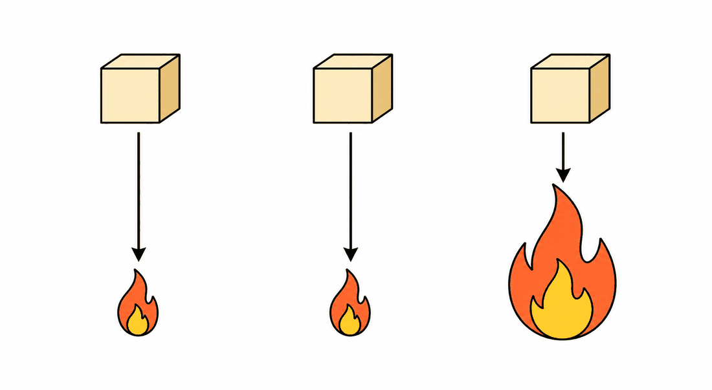

#### <span style="color:#1E7B34">1. La valeur énergétique</span>

On appelle **valeur énergétique** l'énergie qu'un aliment met à la disposition du corps. On la mesure en **kilocalories (kcal)** ou en **kilojoules (kJ)**.

Cette énergie n'est pas disponible immédiatement : elle est libérée à l'intérieur des cellules, qui utilisent du **dioxygène** pour brûler les nutriments et rejettent du **dioxyde de carbone**. C'est la **respiration cellulaire**. L'énergie ainsi libérée sert à faire battre le cœur, à maintenir le corps à 37 °C, à grandir et à bouger.

Seuls trois nutriments apportent de l'énergie : les **glucides**, les **protéines** et les **lipides**. Les vitamines, les sels minéraux et l'eau sont **indispensables**, mais ils **n'apportent aucune énergie** : ils protègent et régulent le fonctionnement du corps.

**a. Les coefficients énergétiques**

Chaque nutriment fournit une quantité d'énergie fixe par gramme :

| Nutriment | Énergie par gramme |
|---|---|
| Glucides | **4 kcal** (17 kJ) |
| Protéines | **4 kcal** (17 kJ) |
| Lipides | **9 kcal** (37 kJ) |

À retenir : pour une **même masse**, les **lipides** apportent **plus du double** d'énergie que les glucides ou les protéines.

#### <span style="color:#1E7B34">2. Calculer l'énergie d'un aliment</span>

On multiplie la masse de chaque nutriment par son coefficient, puis on additionne :

> **Énergie totale = (glucides × 4) + (protéines × 4) + (lipides × 9)**

**b. Exemple : une assiette de vary sy tsaramaso (riz et haricots)**

Elle contient 60 g de glucides, 8 g de protéines et 5 g de lipides.

- Glucides : 60 × 4 = **240 kcal**
- Protéines : 8 × 4 = **32 kcal**
- Lipides : 5 × 9 = **45 kcal**
- **Total : 240 + 32 + 45 = 317 kcal**

Les 5 g de lipides, bien que peu nombreux, apportent presque autant que les 8 g de protéines : c'est l'effet du coefficient 9.

#### <span style="color:#1E7B34">3. Pourquoi c'est utile</span>

**c. Lire une étiquette et composer un repas**

Connaître la valeur énergétique permet de comparer deux aliments et d'adapter les repas aux besoins de chacun.

- Une cuillerée d'**huile** (10 g de lipides) apporte 10 × 9 = **90 kcal** : un petit volume, beaucoup d'énergie.
- Une **mangue** (15 g de glucides, 1 g de protéines) apporte 60 + 4 = **64 kcal** : un grand volume, peu d'énergie.
- Un travailleur de force a besoin de plus d'énergie qu'un élève assis en classe : on augmente la part d'aliments énergétiques sans supprimer les aliments protecteurs.

---

## EXERCICES
**Exercice 1 (5 points)** — Calcule l'énergie apportée par chaque quantité.
1. 50 g de glucides 2. 20 g de protéines 3. 10 g de lipides 4. 7 g de lipides

**Exercice 2 (5 points)** — Écris V ou F et corrige les affirmations fausses.
1. Les lipides apportent 9 kcal par gramme.
2. Les vitamines apportent de l'énergie à l'organisme.
3. Les glucides et les protéines ont le même coefficient énergétique.
4. Pour 10 g, les glucides apportent plus d'énergie que les lipides.

**Exercice 3 (6 points)** — Calcule la valeur énergétique totale de chaque aliment.

| Aliment | Glucides | Protéines | Lipides |
|---|---|---|---|
| 1. Riz cuit (100 g) | 28 g | 2 g | 0 g |
| 2. Huile (1 c. à soupe, 10 g) | 0 g | 0 g | 10 g |
| 3. Tsaramaso cuits (100 g) | 20 g | 7 g | 1 g |
| 4. Mangue (100 g) | 15 g | 1 g | 0 g |

**Exercice 4 (4 points)** — Choisis la bonne réponse.
1. Un gramme de lipides apporte : **A.** 4 kcal **B.** 7 kcal **C.** 9 kcal
2. Un aliment contenant 10 g de glucides et 10 g de lipides apporte : **A.** 80 kcal **B.** 130 kcal **C.** 180 kcal
3. Pour une même masse, le nutriment le plus énergétique est : **A.** le glucide **B.** le lipide **C.** la vitamine
4. Les sels minéraux apportent : **A.** 4 kcal/g **B.** 9 kcal/g **C.** aucune énergie

**TOTAL : 20 points**

### CORRIGÉ

**Exercice 1** — 1. 50 × 4 = **200 kcal** · 2. 20 × 4 = **80 kcal** · 3. 10 × 9 = **90 kcal** · 4. 7 × 9 = **63 kcal**

**Exercice 2**
1. **V** — le coefficient des lipides est bien de **9 kcal par gramme**.
2. **F** — les vitamines **n'apportent pas d'énergie** ; elles protègent et régulent l'organisme.
3. **V** — les deux apportent **4 kcal par gramme**.
4. **F** — c'est l'inverse : 10 g de lipides donnent **90 kcal** contre **40 kcal** pour 10 g de glucides.

**Exercice 3**
1. Riz : (28 × 4) + (2 × 4) = 112 + 8 = **120 kcal**
2. Huile : 10 × 9 = **90 kcal**
3. Tsaramaso : (20 × 4) + (7 × 4) + (1 × 9) = 80 + 28 + 9 = **117 kcal**
4. Mangue : (15 × 4) + (1 × 4) = 60 + 4 = **64 kcal**

**Exercice 4** — 1. **C** (9 kcal) · 2. **B** — (10 × 4) + (10 × 9) = 40 + 90 = **130 kcal** · 3. **B** (le lipide) · 4. **C** (aucune énergie)


---


# SÉANCE 5 / 51 — Métabolisme et besoins énergétiques

**Objectif spécifique** : définir le métabolisme de base et citer les facteurs qui font varier les besoins énergétiques.
**Support et matériel** : tableau des besoins par âge écrit au tableau.

| Étapes | Enseignant | Apprenants | Technique | Support | Obs. |
|---|---|---|---|---|---|
| **I. RÉVISION** | Combien de kcal apporte 1 g de lipides ?<br>Comment calcule-t-on l'énergie d'un aliment ? | R.A. : 9 kcal.<br>R.A. : On multiplie la masse de chaque nutriment par son coefficient, puis on additionne. | Questionnement oral | — | |
| **II. NOUVELLE LEÇON** ||||||
| 1. Mise en situation | Même en dormant toute la journée sans bouger, le corps continue de dépenser de l'énergie. Pourquoi ? | R.A. : Parce que le cœur bat, les poumons respirent et le corps reste chaud. | Questionnement oral | Tableau noir | |
| 2. Présentation | Aujourd'hui nous allons apprendre : « Métabolisme et besoins énergétiques ». Après cette séance vous serez capables d'expliquer le métabolisme de base et de dire ce qui fait varier les besoins. | Les élèves écoutent. | Exposé | Tableau noir, cahier | |
| 3. Observation | Regardez et observez bien ce tableau des besoins énergétiques selon l'âge et l'activité. | Les élèves observent silencieusement. | Observation dirigée | Tableau des besoins | |
| 4. Analyse | Qui a le plus grand besoin : un enfant de 5 ans ou un adolescent de 14 ans ?<br>Pourquoi l'adolescent a-t-il davantage besoin d'énergie ?<br>Deux adolescents du même âge ont-ils toujours le même besoin ?<br>Qu'est-ce qui les différencie ?<br>À quoi sert l'énergie dépensée au repos ? | R.A. : L'adolescent de 14 ans.<br>R.A. : Parce qu'il grandit vite et bouge davantage.<br>R.A. : Non, cela dépend de leur activité.<br>R.A. : Leur sexe et la quantité d'effort fourni chaque jour.<br>R.A. : À faire battre le cœur, respirer et maintenir la température du corps. | Étude de tableau, travail de groupe | Tableau des besoins | |
| 5. Synthèse | **Donc,** le métabolisme de base est l'énergie minimale que le corps dépense au repos pour maintenir ses fonctions vitales. À cette dépense s'ajoute celle des activités. Les besoins totaux varient selon l'âge, le sexe, l'activité physique et l'état de l'organisme. | Les élèves écoutent. | Exposé magistral | Tableau noir | |
| 6. Application | **Ex. 1** — Vrai ou Faux : 1. Au repos, le corps ne dépense pas d'énergie. 2. Un adolescent a besoin de plus d'énergie qu'un enfant de 5 ans. 3. L'activité physique augmente les besoins. 4. Le métabolisme de base couvre les fonctions vitales.<br><br>**Ex. 2** — Cite quatre facteurs qui font varier les besoins énergétiques. | **Ex. 1** : 1. **F** — il dépense le **métabolisme de base** · 2. **V** · 3. **V** · 4. **V**<br><br>**Ex. 2** : L'**âge**, le **sexe**, l'**activité physique**, l'**état de l'organisme** (croissance, grossesse, maladie). | Travail de groupe | Grande ardoise | |
| **III. ÉVALUATION** | **Ex. 1** — Complète : a) L'énergie dépensée au repos s'appelle le …… b) Pendant la croissance, les besoins …… c) Un travailleur de force dépense …… qu'un employé assis. d) Les besoins dépendent aussi du ……<br><br>**Ex. 2** — Fara, 14 ans, aide sa famille aux champs. Sa sœur Lanto, 14 ans aussi, reste étudier à la maison. Laquelle a les besoins les plus élevés ? Justifie. | **Ex. 1** : a) **métabolisme de base** b) **augmentent** c) **plus** d) **sexe**<br><br>**Ex. 2** : **Fara**, car à âge égal, son **activité physique est plus intense** : elle dépense davantage d'énergie en plus de son métabolisme de base. | Évaluation écrite | Cahier, feuille d'évaluation | |

### Page LEÇON

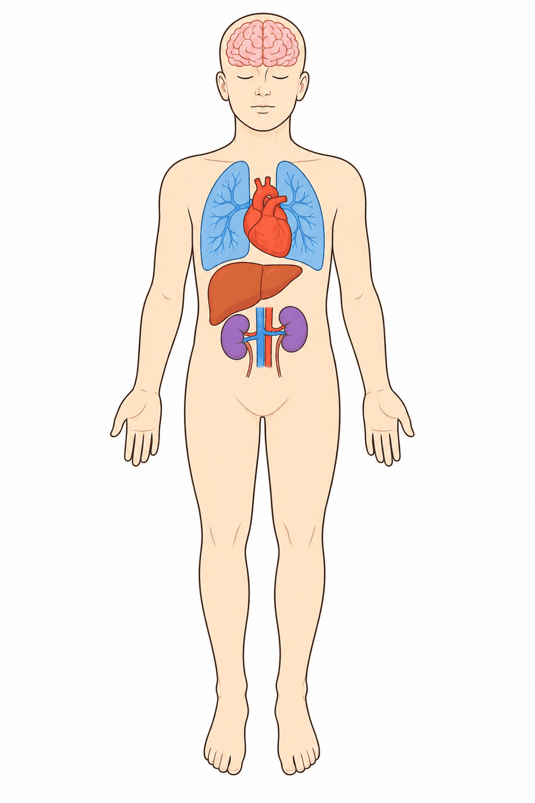


**<span style="color:#C00000">Métabolisme et besoins énergétiques</span>**

**<span style="color:#1E7B34">1. Le métabolisme de base</span>**

Même immobile et parfaitement au repos, le corps consomme de l'énergie. Le cœur bat, les poumons se remplissent, les cellules se renouvellent, et la température se maintient autour de **37 °C**.

On appelle **métabolisme de base** la plus petite quantité d'énergie que l'organisme consomme au repos pour faire tourner ces fonctions indispensables. C'est un plancher : on ne peut pas dépenser moins et rester en vie.

**<span style="color:#1E7B34">2. La dépense totale</span>**

À ce plancher s'ajoute l'énergie consommée par toutes les activités de la journée : marcher, porter, travailler, jouer.

> **Besoins totaux = métabolisme de base + dépenses liées aux activités**

C'est cette somme qui doit être couverte par la ration alimentaire. Si les apports sont durablement inférieurs, le corps puise dans ses réserves et s'affaiblit. S'ils sont durablement supérieurs, l'excédent est stocké sous forme de graisse.

**<span style="color:#1E7B34">3. Ce qui fait varier les besoins</span>**

**a. L'âge**
Les besoins augmentent pendant la croissance. Un adolescent, dont le corps se construit rapidement, a des besoins élevés — parfois supérieurs à ceux d'un adulte.

| Âge | Besoins approximatifs par jour |
|---|---|
| Enfant de 5 ans | 1 500 à 1 800 kcal |
| Enfant de 10 ans | 1 800 à 2 200 kcal |
| Adolescent de 13 à 15 ans | 2 200 à 2 900 kcal |
| Adulte, activité modérée | 2 000 kcal (femme) · 2 500 kcal (homme) |

**b. L'activité physique**
C'est le facteur le plus variable. Un cultivateur qui travaille aux champs toute la journée dépense nettement plus qu'une personne assise à un bureau, à âge et corpulence identiques.

**c. Le sexe et l'état de l'organisme**
Les besoins diffèrent entre hommes et femmes. Ils augmentent également lors de la **grossesse**, de l'**allaitement** et de la **puberté**, périodes où l'organisme se transforme ou nourrit un autre être.

### Section EXERCICES

**Exercice 1 (4 points)** — Classe ces personnes du besoin le plus faible au besoin le plus élevé : 1. un enfant de 5 ans · 2. un adolescent de 14 ans très actif · 3. une femme adulte peu active · 4. un enfant de 10 ans

**Exercice 2 (6 points)** — Complète avec : *métabolisme de base, activité, croissance, augmentent, réserves, 37*
1. Le corps maintient sa température autour de …… °C.
2. La dépense minimale au repos est le …….
3. Pendant la …… , les besoins sont élevés.
4. Le facteur le plus variable est l'…… physique.
5. Si les apports sont insuffisants, le corps puise dans ses …….
6. Pendant la grossesse, les besoins …….

**Exercice 3 (6 points)** — Deux frères de 14 ans : Hery travaille aux champs le matin, Tiana révise assis toute la journée. 1. Lequel a les besoins les plus élevés ? 2. Quel facteur explique la différence ? 3. Leur métabolisme de base est-il très différent ? Justifie.

**Exercice 4 (4 points)** — Choisis la bonne réponse :
1. Le métabolisme de base correspond à l'énergie dépensée : **A.** pendant le sport **B.** au repos **C.** pendant les repas
2. Un adolescent de 14 ans a des besoins : **A.** inférieurs à ceux d'un enfant de 5 ans **B.** supérieurs **C.** identiques
3. Les besoins augmentent pendant : **A.** la grossesse **B.** le sommeil **C.** la vieillesse
4. Un excédent d'apport durable est : **A.** éliminé entièrement **B.** stocké en graisse **C.** sans effet

**TOTAL : 20 points**

### CORRIGÉ

**Ex. 1** — Du plus faible au plus élevé : **1** (enfant de 5 ans) → **4** (enfant de 10 ans) → **3** (femme adulte peu active) → **2** (adolescent très actif).

**Ex. 2** — 1. **37** · 2. **métabolisme de base** · 3. **croissance** · 4. **activité** · 5. **réserves** · 6. **augmentent**

**Ex. 3** — 1. **Hery**. 2. L'**activité physique** : le travail aux champs dépense beaucoup plus d'énergie que la révision assise. 3. **Non**, leur métabolisme de base est **voisin** : même âge et corpulence proche. C'est la **dépense liée à l'activité** qui les sépare, pas le plancher vital.

**Ex. 4** — 1. **B** · 2. **B** · 3. **A** · 4. **B**


---


# SÉANCE 6 / 51 — Calculer les besoins énergétiques

**Objectif spécifique** : calculer l'apport énergétique d'une journée et le comparer aux besoins d'une personne.
**Support et matériel** : tableau de composition d'aliments, tableau des besoins par âge.

| Étapes | Enseignant | Apprenants | Technique | Support | Obs. |
|---|---|---|---|---|---|
| **I. RÉVISION** | Qu'est-ce que le métabolisme de base ?<br>Quels sont les besoins d'un adolescent de 14 ans ? | R.A. : L'énergie minimale dépensée au repos pour les fonctions vitales.<br>R.A. : Entre 2 200 et 2 900 kcal par jour. | Questionnement oral | — | |
| **II. NOUVELLE LEÇON** ||||||
| 1. Mise en situation | Comment savoir si ce qu'on a mangé aujourd'hui suffit à couvrir nos besoins ? | R.A. : En calculant l'énergie des aliments et en la comparant aux besoins. | Questionnement oral | Tableau noir | |
| 2. Présentation | Aujourd'hui nous allons apprendre : « Calculer les besoins énergétiques ». Après cette séance vous serez capables de calculer l'apport d'une journée et de dire s'il est suffisant. | Les élèves écoutent. | Exposé | Tableau noir, cahier | |
| 3. Observation | Regardez et observez bien ce tableau de composition d'aliments et ce tableau des besoins. | Les élèves observent silencieusement. | Observation dirigée | Tableaux de composition et de besoins | |
| 4. Analyse | Que faut-il connaître pour calculer l'énergie d'un plat ?<br>Quelle opération applique-t-on à chaque nutriment ?<br>Comment obtient-on le total de la journée ?<br>À quoi compare-t-on ce total ?<br>Que conclure si le total est nettement inférieur au besoin ? | R.A. : La masse de glucides, de protéines et de lipides.<br>R.A. : On multiplie la masse par le coefficient : 4, 4 ou 9.<br>R.A. : On additionne l'énergie de tous les repas.<br>R.A. : Au besoin correspondant à l'âge et à l'activité.<br>R.A. : L'apport est insuffisant, la personne risque de s'affaiblir. | Calcul, travail de groupe | Tableaux, ardoise | |
| 5. Synthèse | **Donc,** pour évaluer une journée alimentaire, on calcule l'énergie de chaque repas en multipliant chaque masse de nutriment par son coefficient, on additionne le tout, puis on compare la somme aux besoins de la personne selon son âge et son activité. | Les élèves écoutent. | Exposé magistral | Tableau noir | |
| 6. Application | **Ex. 1** — Calcule : a) 40 g de glucides · b) 12 g de lipides · c) 25 g de protéines · d) 6 g de lipides<br><br>**Ex. 2** — Un repas contient 80 g de glucides, 20 g de protéines et 15 g de lipides. 1. Énergie des glucides ? 2. Des protéines ? 3. Des lipides ? 4. Total ? | **Ex. 1** : a) 40 × 4 = **160 kcal** · b) 12 × 9 = **108 kcal** · c) 25 × 4 = **100 kcal** · d) 6 × 9 = **54 kcal**<br><br>**Ex. 2** : 1. 80 × 4 = **320 kcal** · 2. 20 × 4 = **80 kcal** · 3. 15 × 9 = **135 kcal** · 4. 320 + 80 + 135 = **535 kcal** | Travail de groupe | Grande ardoise, cahier | |
| **III. ÉVALUATION** | **Ex. 1** — Calcule l'énergie : a) 55 g de glucides · b) 18 g de protéines · c) 9 g de lipides · d) 30 g de glucides<br><br>**Ex. 2** — Sur une journée, Nivo (14 ans, peu active) a consommé 250 g de glucides, 60 g de protéines et 50 g de lipides. 1. Calcule l'apport total. 2. Compare-le au besoin d'un adolescent (2 200 à 2 900 kcal). 3. Conclus. | **Ex. 1** : a) **220 kcal** · b) **72 kcal** · c) **81 kcal** · d) **120 kcal**<br><br>**Ex. 2** : 1. (250 × 4) + (60 × 4) + (50 × 9) = 1000 + 240 + 450 = **1 690 kcal**. 2. C'est **inférieur** au minimum de 2 200 kcal. 3. L'apport est **insuffisant** : Nivo risque fatigue et ralentissement de sa croissance. | Évaluation écrite | Cahier, feuille d'évaluation | |

### Page LEÇON

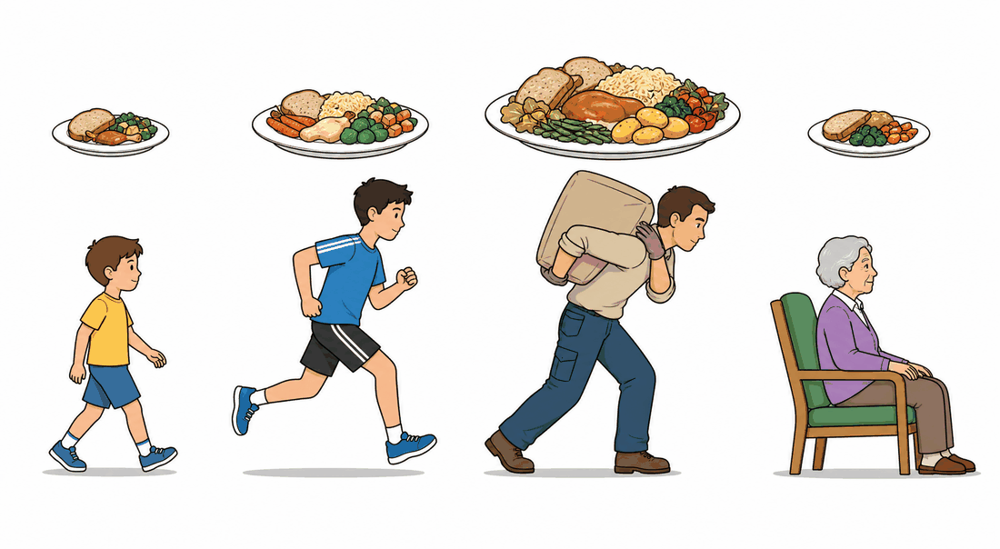


**<span style="color:#C00000">Calculer les besoins énergétiques</span>**

**<span style="color:#1E7B34">1. La méthode de calcul</span>**

Évaluer une journée alimentaire se fait en trois temps.

**a. Calculer l'énergie de chaque repas**
On multiplie la masse de chaque nutriment par son coefficient, puis on additionne.

> Énergie = (glucides × 4) + (protéines × 4) + (lipides × 9)

**b. Additionner les repas**
On fait la somme du petit-déjeuner, du déjeuner, du goûter et du dîner pour obtenir l'apport total de la journée.

**c. Comparer aux besoins**
On confronte ce total au besoin de la personne, qui dépend de son âge et de son activité.

**<span style="color:#1E7B34">2. Un exemple complet</span>**

Hery, 14 ans, a consommé dans la journée 300 g de glucides, 80 g de protéines et 70 g de lipides.

- Glucides : 300 × 4 = **1 200 kcal**
- Protéines : 80 × 4 = **320 kcal**
- Lipides : 70 × 9 = **630 kcal**
- **Total : 1 200 + 320 + 630 = 2 150 kcal**

Un adolescent de 14 ans a besoin de 2 200 à 2 900 kcal. Avec 2 150 kcal, Hery est **légèrement en dessous** du minimum. L'écart est faible, mais s'il se répète chaque jour, sa croissance peut en souffrir.

**<span style="color:#1E7B34">3. Interpréter le résultat</span>**

Le calcul n'a de sens que comparé à un besoin :

- **Apport nettement inférieur au besoin** — le corps puise dans ses réserves. À la longue : amaigrissement, fatigue, retard de croissance chez l'enfant.
- **Apport équivalent au besoin** — situation recherchée, le corps fonctionne et grandit normalement.
- **Apport nettement supérieur au besoin** — l'excédent est stocké en graisse ; à la longue, surpoids.

Un total correct ne garantit pas pour autant une bonne alimentation : une journée composée uniquement de riz et d'huile peut atteindre le bon nombre de kilocalories tout en manquant de protéines, de vitamines et de sels minéraux. **La quantité d'énergie et la qualité de la ration sont deux questions distinctes.**

### Section EXERCICES

**Exercice 1 (4 points)** — Calcule l'énergie de : 1. 60 g de glucides · 2. 35 g de protéines · 3. 14 g de lipides · 4. 22 g de lipides

**Exercice 2 (6 points)** — Un déjeuner contient 110 g de glucides, 30 g de protéines et 20 g de lipides.
1. Énergie apportée par les glucides ? 2. Par les protéines ? 3. Par les lipides ?
4. Quel est le total ? 5. Quel nutriment apporte le plus d'énergie ici ? 6. Est-ce celui dont la masse est la plus élevée ?

**Exercice 3 (6 points)** — Journée de Fara (14 ans, très active) : 280 g de glucides, 75 g de protéines, 85 g de lipides.
1. Calcule l'apport total. 2. Le besoin d'une adolescente très active est d'environ 2 700 kcal : l'apport suffit-il ? 3. Justifie ta réponse par la comparaison des deux nombres.

**Exercice 4 (4 points)** — Choisis la bonne réponse :
1. 50 g de lipides apportent : **A.** 200 kcal **B.** 450 kcal **C.** 500 kcal
2. Un apport durablement supérieur au besoin entraîne : **A.** un amaigrissement **B.** un stockage en graisse **C.** aucun effet
3. Pour comparer un apport à un besoin, il faut connaître : **A.** seulement l'âge **B.** l'âge et l'activité **C.** seulement le poids
4. Une journée de 2 400 kcal composée uniquement de riz est : **A.** parfaitement équilibrée **B.** suffisante en énergie mais déséquilibrée **C.** insuffisante en énergie

**TOTAL : 20 points**

### CORRIGÉ

**Ex. 1** — 1. 60 × 4 = **240 kcal** · 2. 35 × 4 = **140 kcal** · 3. 14 × 9 = **126 kcal** · 4. 22 × 9 = **198 kcal**

**Ex. 2** — 1. 110 × 4 = **440 kcal** · 2. 30 × 4 = **120 kcal** · 3. 20 × 9 = **180 kcal** · 4. 440 + 120 + 180 = **740 kcal** · 5. Les **glucides** (440 kcal) · 6. **Oui** ici, car leur masse est la plus grande ; mais 20 g de lipides apportent déjà 180 kcal, plus que 30 g de protéines (120 kcal) — **la masse la plus élevée ne donne pas toujours le plus d'énergie**.

**Ex. 3** — 1. (280 × 4) + (75 × 4) + (85 × 9) = 1120 + 300 + 765 = **2 185 kcal**. 2. **Non**, l'apport ne suffit pas. 3. 2 185 kcal est **inférieur** à 2 700 kcal : il manque environ **515 kcal**. Fara doit augmenter sa ration, par exemple en ajoutant des aliments énergétiques à son goûter.

**Ex. 4** — 1. **B** — 50 × 9 = 450 · 2. **B** · 3. **B** · 4. **B**


---


# SÉANCE 7 / 51 — Construire un menu varié

**Objectif spécifique** : composer un menu d'une journée équilibré à partir d'aliments locaux.
**Support et matériel** : étiquettes d'aliments locaux à disposer, assiette dessinée au tableau.

| Étapes | Enseignant | Apprenants | Technique | Support | Obs. |
|---|---|---|---|---|---|
| **I. RÉVISION** | Comment calcule-t-on l'apport énergétique d'une journée ?<br>À quoi compare-t-on ce total ? | R.A. : On additionne l'énergie de tous les repas.<br>R.A. : Aux besoins liés à l'âge et à l'activité. | Questionnement oral | — | |
| **II. NOUVELLE LEÇON** ||||||
| 1. Mise en situation | Deux assiettes contiennent le même nombre de kilocalories : l'une ne contient que du riz, l'autre du riz, des haricots et des brèdes. Sont-elles équivalentes ? | R.A. : Non, la seconde apporte en plus des protéines et des vitamines. | Questionnement oral | Tableau noir | |
| 2. Présentation | Aujourd'hui nous allons apprendre : « Construire un menu varié ». Après cette séance vous serez capables de composer un menu équilibré pour une journée. | Les élèves écoutent. | Exposé | Tableau noir, cahier | |
| 3. Observation | Regardez et observez bien cette assiette dessinée au tableau et ces étiquettes d'aliments locaux. | Les élèves observent silencieusement. | Observation dirigée | Assiette dessinée, étiquettes d'aliments | |
| 4. Analyse | Quelle part de l'assiette occupent les légumes et les fruits ?<br>Quelle part pour les féculents ?<br>Quelle part pour les aliments bâtisseurs ?<br>Combien de repas prend-on dans la journée ?<br>Pourquoi répartir les apports sur plusieurs repas ? | R.A. : Environ la moitié.<br>R.A. : Environ un quart.<br>R.A. : Environ un quart.<br>R.A. : Trois repas, avec parfois un goûter.<br>R.A. : Pour fournir de l'énergie régulièrement, sans surcharger l'organisme d'un coup. | Étude de document, travail de groupe | Assiette dessinée, étiquettes | |
| 5. Synthèse | **Donc,** un menu équilibré répartit les apports sur les repas de la journée et associe, à chaque repas, un féculent, un aliment bâtisseur et des légumes ou des fruits. Visuellement : la moitié de l'assiette en légumes et fruits, un quart en féculents, un quart en aliments bâtisseurs. | Les élèves écoutent. | Exposé magistral | Tableau noir | |
| 6. Application | **Ex. 1** — Complète ce déjeuner incomplet — riz + huile — en ajoutant : a) un aliment bâtisseur · b) un aliment protecteur · c) un fruit · d) une boisson<br><br>**Ex. 2** — Vrai ou Faux : 1. Un menu équilibré contient les trois groupes. 2. Les légumes occupent un quart de l'assiette. 3. On peut sauter le petit-déjeuner sans conséquence. 4. Les fruits apportent des vitamines. | **Ex. 1** : a) **poisson** (ou haricots, œuf) · b) **brèdes** (ou autres légumes) · c) **mangue** (ou banane) · d) **eau**<br><br>**Ex. 2** : 1. **V** · 2. **F** — ils occupent environ **la moitié** · 3. **F** — il **fournit l'énergie de la matinée** · 4. **V** | Travail de groupe | Grande ardoise | |
| **III. ÉVALUATION** | **Ex. 1** — Compose un petit-déjeuner équilibré avec trois aliments locaux et justifie chaque choix.<br><br>**Ex. 2** — Un élève déjeune uniquement de riz et d'huile. 1. Quels groupes manquent ? 2. Cite deux aliments locaux à ajouter. 3. Quelle conséquence si cela se répète chaque jour ? | **Ex. 1** : Par exemple **vary sosoa** (énergie), **lait** (bâtisseur, calcium), **mangue** (vitamines). Chaque groupe est représenté.<br><br>**Ex. 2** : 1. Les **bâtisseurs** et les **protecteurs**. 2. Du **poisson** ou des **haricots**, et des **brèdes**. 3. Risque de **carences** : croissance ralentie, fatigue, sensibilité aux maladies. | Évaluation écrite | Cahier, feuille d'évaluation | |

### Page LEÇON

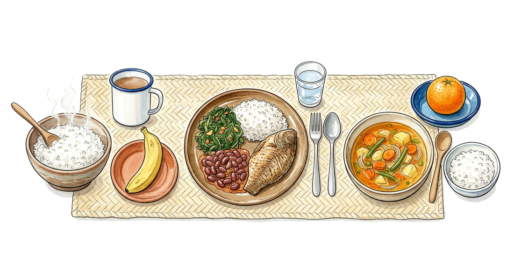


**<span style="color:#C00000">Construire un menu varié</span>**

**<span style="color:#1E7B34">1. Le principe de l'assiette équilibrée</span>**

Un repas équilibré se reconnaît à la façon dont l'assiette est remplie :

- **la moitié** — légumes et fruits, pour les vitamines, les sels minéraux et les fibres ;
- **un quart** — féculents et céréales : riz, manioc, maïs, pour l'énergie ;
- **un quart** — aliments bâtisseurs : poisson, viande, œuf, légumineuses.

À cela s'ajoute de l'**eau**, la boisson qui accompagne tous les repas.

**<span style="color:#1E7B34">2. Répartir sur la journée</span>**

Les apports se répartissent sur trois repas, complétés au besoin par un goûter. Prendre toute sa ration en une seule fois fatiguerait l'organisme et laisserait le corps sans énergie le reste de la journée.

Le **petit-déjeuner** est particulièrement important : il fournit l'énergie de la matinée. Le sauter expose à une baisse de régime et à des difficultés de concentration en fin de matinée.

**<span style="color:#1E7B34">3. Un exemple de menu malgache pour un adolescent</span>**

| Repas | Composition | Énergie |
|---|---|---|
| Petit-déjeuner | *Vary sosoa*, lait, mangue | 469 kcal |
| Déjeuner | Riz, *tsaramaso*, *anana* à l'huile, banane | 769 kcal |
| Goûter | *Mofo gasy*, *voanjo* (arachides) | 307 kcal |
| Dîner | Riz, *trondro* (poisson), légumes à l'huile | 665 kcal |
| **Total** | | **2 210 kcal** |

Ce menu apporte au total 304 g de glucides, 82 g de protéines et 74 g de lipides. Il couvre les besoins d'un adolescent de 14 ans (2 200 à 2 900 kcal) et respecte un bon équilibre entre les nutriments : environ **55 %** de l'énergie vient des glucides, **15 %** des protéines et **30 %** des lipides.

**<span style="color:#1E7B34">4. Varier avec ce dont on dispose</span>**

Un menu équilibré n'est pas un menu coûteux. Les aliments locaux suffisent à le composer :

- féculents — riz, manioc, patate douce, maïs ;
- bâtisseurs — *tsaramaso*, arachides, petits poissons, œufs ;
- protecteurs — *anana*, tomate, mangue, papaye, orange.

Varier d'un jour à l'autre à l'intérieur de chaque groupe évite la monotonie et limite le risque de carence.

### Section EXERCICES

**Exercice 1 (4 points)** — Pour chaque repas, indique le groupe manquant : 1. riz + huile · 2. poisson + brèdes · 3. riz + haricots · 4. mangue + banane

**Exercice 2 (6 points)** — Complète avec : *moitié, quart, petit-déjeuner, eau, trois, varier*
1. Les légumes et fruits occupent la …… de l'assiette.
2. Les féculents occupent un …….
3. On prend en général …… repas par jour.
4. Le …… fournit l'énergie de la matinée.
5. La boisson qui accompagne les repas est l'…….
6. Il faut …… les aliments d'un jour à l'autre.

**Exercice 3 (6 points)** — Compose un menu d'une journée (4 repas) pour un adolescent, en n'utilisant que des aliments disponibles à Madagascar. Pour chaque repas, indique un féculent, un bâtisseur et un protecteur.

**Exercice 4 (4 points)** — Choisis la bonne réponse :
1. Dans une assiette équilibrée, les légumes occupent : **A.** un quart **B.** la moitié **C.** un huitième
2. Sauter le petit-déjeuner provoque surtout : **A.** une fatigue en fin de matinée **B.** une prise de poids immédiate **C.** aucun effet
3. Un menu équilibré est nécessairement : **A.** coûteux **B.** composé d'aliments importés **C.** réalisable avec des aliments locaux
4. Deux repas de même valeur énergétique : **A.** se valent toujours **B.** peuvent différer en qualité **C.** ont la même composition

**TOTAL : 20 points**

### CORRIGÉ

**Ex. 1** — 1. Manquent les **bâtisseurs** et les **protecteurs** · 2. Manquent les **énergétiques** (féculents) · 3. Manquent les **protecteurs** · 4. Manquent les **énergétiques** et les **bâtisseurs**

**Ex. 2** — 1. **moitié** · 2. **quart** · 3. **trois** · 4. **petit-déjeuner** · 5. **eau** · 6. **varier**

**Ex. 3** — Exemple accepté : *Petit-déjeuner* — vary sosoa (féculent), lait (bâtisseur), mangue (protecteur). *Déjeuner* — riz, tsaramaso, anana. *Goûter* — mofo gasy, arachides, banane. *Dîner* — riz, trondro, légumes. **Tout menu associant les trois groupes à chaque repas est valable.**

**Ex. 4** — 1. **B** · 2. **A** · 3. **C** · 4. **B**


---


# SÉANCE 8 / 51 — Importance de l'équilibre alimentaire

**Objectif spécifique** : justifier l'importance d'une alimentation équilibrée pour la santé et la croissance.
**Support et matériel** : deux menus imprimés à comparer.

| Étapes | Enseignant | Apprenants | Technique | Support | Obs. |
|---|---|---|---|---|---|
| **I. RÉVISION** | Comment se répartit une assiette équilibrée ?<br>Pourquoi varier les aliments ? | R.A. : Moitié légumes et fruits, un quart féculents, un quart bâtisseurs.<br>R.A. : Pour apporter tous les nutriments et éviter les carences. | Questionnement oral | — | |
| **II. NOUVELLE LEÇON** ||||||
| 1. Mise en situation | Deux élèves de la même classe : l'un est souvent malade et fatigué, l'autre rarement. Leur alimentation peut-elle expliquer cette différence ? | R.A. : Oui, une alimentation équilibrée aide à résister aux maladies. | Questionnement oral | Tableau noir | |
| 2. Présentation | Aujourd'hui nous allons apprendre : « Importance de l'équilibre alimentaire ». Après cette séance vous serez capables d'expliquer pourquoi l'équilibre alimentaire protège la santé. | Les élèves écoutent. | Exposé | Tableau noir, cahier | |
| 3. Observation | Regardez et observez bien ces deux menus : le menu A composé de riz et d'huile, le menu B composé de riz, poisson, brèdes et fruit. | Les élèves observent silencieusement. | Observation dirigée | Deux menus imprimés | |
| 4. Analyse | Quel menu apporte le plus de protéines ?<br>Lequel apporte des vitamines ?<br>Les deux apportent-ils de l'énergie ?<br>Lequel convient à un adolescent en croissance ?<br>Que risque celui qui mange le menu A chaque jour ? | R.A. : Le menu B, grâce au poisson.<br>R.A. : Le menu B, grâce aux brèdes et au fruit.<br>R.A. : Oui, les deux apportent de l'énergie.<br>R.A. : Le menu B.<br>R.A. : Des carences, de la fatigue et un retard de croissance. | Comparaison de documents, travail de groupe | Deux menus imprimés | |
| 5. Synthèse | **Donc,** une alimentation équilibrée ne se juge pas seulement à la quantité d'énergie. Elle doit apporter tous les nutriments en proportions convenables. Elle permet au corps de grandir et de se renforcer, aide à résister aux maladies, et réduit le risque de troubles liés à l'excès comme à l'insuffisance. | Les élèves écoutent. | Exposé magistral | Tableau noir | |
| 6. Application | **Ex. 1** — Vrai ou Faux : 1. Un menu suffisant en énergie est forcément équilibré. 2. L'équilibre alimentaire aide à résister aux maladies. 3. Les besoins d'un adolescent sont ceux d'un adulte. 4. Manger varié réduit le risque de carence.<br><br>**Ex. 2** — Cite trois bénéfices d'une alimentation équilibrée. | **Ex. 1** : 1. **F** — il peut manquer de **protéines, vitamines ou sels minéraux** · 2. **V** · 3. **F** — l'adolescent **grandit**, ses besoins sont parfois **supérieurs** · 4. **V**<br><br>**Ex. 2** : Elle permet **la croissance**, aide à **résister aux maladies**, et **prévient** les troubles liés à l'excès ou à l'insuffisance. | Travail de groupe | Grande ardoise | |
| **III. ÉVALUATION** | **Ex. 1** — Complète : a) Un menu peut être suffisant en énergie mais …… b) L'équilibre alimentaire renforce les …… du corps. c) Une alimentation trop riche expose au …… d) Chez l'adolescent, une alimentation insuffisante ralentit la ……<br><br>**Ex. 2** — Explique en quelques phrases pourquoi deux menus de même valeur énergétique ne se valent pas forcément. | **Ex. 1** : a) **déséquilibré** b) **défenses** c) **surpoids** d) **croissance**<br><br>**Ex. 2** : Deux menus peuvent apporter le même nombre de kilocalories tout en différant par leur **composition**. L'un peut manquer de **protéines, de vitamines ou de sels minéraux**. L'énergie mesure la **quantité**, pas la **qualité** de la ration. | Évaluation écrite | Cahier, feuille d'évaluation | |

### Page LEÇON

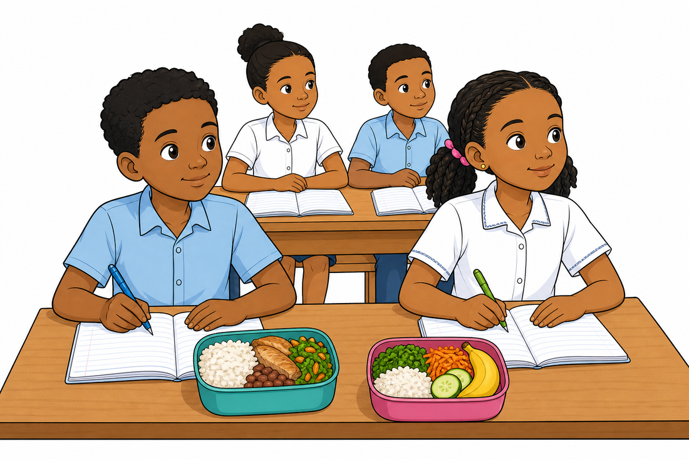


**<span style="color:#C00000">Importance de l'équilibre alimentaire</span>**

**<span style="color:#1E7B34">1. Quantité et qualité</span>**

Une alimentation équilibrée doit répondre aux besoins du corps en **quantité** — assez d'énergie — mais aussi en **qualité** — tous les nutriments, dans de bonnes proportions.

Ces deux exigences sont indépendantes. Un menu composé de riz et d'huile peut fournir assez de kilocalories tout en laissant le corps sans protéines pour grandir, sans vitamines pour se défendre et sans sels minéraux pour ses os et son sang. **Un apport suffisant en énergie ne garantit donc pas une alimentation correcte.**

**<span style="color:#1E7B34">2. Ce qu'apporte une alimentation équilibrée</span>**

**a. Elle permet la croissance**
Chez l'enfant et l'adolescent, le corps se construit. Les protéines forment les muscles, le calcium solidifie les os. Une alimentation insuffisante ou mal composée pendant cette période ralentit la croissance, et le retard accumulé n'est pas toujours rattrapable.

**b. Elle renforce les défenses de l'organisme**
Les vitamines et les sels minéraux participent à la résistance aux infections. Une personne carencée tombe malade plus souvent et se rétablit plus lentement.

**c. Elle soutient l'activité physique et intellectuelle**
L'énergie régulièrement apportée permet de travailler, d'apprendre et de se concentrer. Un élève qui n'a pas pris de petit-déjeuner suit moins bien en fin de matinée.

**d. Elle prévient plusieurs maladies**
Un déséquilibre durable, par excès comme par insuffisance, favorise l'apparition de maladies : surpoids, obésité, diabète, maladies du cœur d'un côté ; carences et affaiblissement de l'autre.

**<span style="color:#1E7B34">3. Adapter à chacun</span>**

Il n'existe pas une ration unique valable pour tous. Un adolescent en pleine croissance, une femme enceinte, un cultivateur et une personne âgée peu active ont des besoins différents. L'équilibre consiste à **ajuster la ration à la personne**, pas à appliquer une règle unique.

### Section EXERCICES

**Exercice 1 (4 points)** — Indique si chaque situation relève d'un excès ou d'une insuffisance : 1. surpoids · 2. anémie par manque de fer · 3. obésité · 4. retard de croissance

**Exercice 2 (6 points)** — Vrai ou Faux, et corrige les affirmations fausses :
1. Un menu suffisant en énergie est toujours équilibré.
2. Les vitamines participent à la résistance aux infections.
3. Une alimentation déséquilibrée peut favoriser le diabète.
4. Tout le monde a besoin de la même ration.
5. Un retard de croissance se rattrape toujours facilement.
6. Le petit-déjeuner aide à se concentrer en classe.

**Exercice 3 (6 points)** — Menu A : 120 g de glucides, 20 g de protéines, 10 g de lipides. Menu B : 70 g de glucides, 28 g de protéines, 25 g de lipides.
1. Calcule l'énergie du menu A. 2. Celle du menu B. 3. Les deux valeurs sont-elles proches ? 4. Lequel convient le mieux à un adolescent ? Justifie.

**Exercice 4 (4 points)** — Choisis la bonne réponse :
1. Une alimentation équilibrée répond à un besoin de : **A.** quantité seulement **B.** qualité seulement **C.** quantité et qualité
2. Un manque prolongé de protéines chez l'adolescent entraîne : **A.** un retard de croissance **B.** une meilleure résistance **C.** aucun effet
3. Un excès durable d'apport favorise : **A.** l'anémie **B.** le surpoids **C.** la carence en fer
4. La ration convenable est : **A.** la même pour tous **B.** adaptée à chaque personne **C.** fonction du seul poids

**TOTAL : 20 points**

### CORRIGÉ

**Ex. 1** — 1. **excès** · 2. **insuffisance** · 3. **excès** · 4. **insuffisance**

**Ex. 2** — 1. **F** — il peut manquer de protéines, de vitamines ou de sels minéraux · 2. **V** · 3. **V** · 4. **F** — la ration **dépend de l'âge, de l'activité et de l'état de la personne** · 5. **F** — le retard accumulé **n'est pas toujours rattrapable** · 6. **V**

**Ex. 3** — 1. (120 × 4) + (20 × 4) + (10 × 9) = 480 + 80 + 90 = **650 kcal**. 2. (70 × 4) + (28 × 4) + (25 × 9) = 280 + 112 + 225 = **617 kcal**. 3. **Oui**, elles sont proches (33 kcal d'écart). 4. Le **menu B** : à énergie presque égale, il apporte **plus de protéines** (28 g contre 20 g), nécessaires à la croissance. Cela montre que **deux menus de même valeur énergétique ne se valent pas**.

**Ex. 4** — 1. **C** · 2. **A** · 3. **B** · 4. **B**


---


# SÉANCE 9 / 51 — Malnutrition aiguë et carences

**Objectif spécifique** : distinguer les formes de malnutrition par insuffisance et en citer les causes et conséquences.
**Support et matériel** : courbe de croissance, tableau des quatre formes de malnutrition.

| Étapes | Enseignant | Apprenants | Technique | Support | Obs. |
|---|---|---|---|---|---|
| **I. RÉVISION** | Que permet une alimentation équilibrée ?<br>Que risque une personne dont la ration est insuffisante ? | R.A. : La croissance, la résistance aux maladies et l'activité.<br>R.A. : Des carences, de la fatigue et un affaiblissement. | Questionnement oral | — | |
| **II. NOUVELLE LEÇON** ||||||
| 1. Mise en situation | Deux enfants ont le même âge, mais l'un est nettement plus petit que l'autre. Quelle peut en être la cause ? | R.A. : Une alimentation insuffisante depuis longtemps. | Questionnement oral | Tableau noir | |
| 2. Présentation | Aujourd'hui nous allons apprendre : « Malnutrition aiguë et carences ». Après cette séance vous serez capables de distinguer les formes de malnutrition et d'en citer les causes. | Les élèves écoutent. | Exposé | Tableau noir, cahier | |
| 3. Observation | Regardez et observez bien cette courbe de croissance et ce tableau des formes de malnutrition. | Les élèves observent silencieusement. | Observation dirigée | Courbe de croissance, tableau | |
| 4. Analyse | Que compare-t-on dans la malnutrition chronique ?<br>Et dans la malnutrition aiguë ?<br>Laquelle s'installe lentement ?<br>Qu'est-ce qu'une carence en micronutriments ?<br>Pourquoi parle-t-on de « faim cachée » ? | R.A. : La taille par rapport à l'âge.<br>R.A. : Le poids par rapport à la taille.<br>R.A. : La malnutrition chronique.<br>R.A. : Un manque de vitamines ou de sels minéraux.<br>R.A. : Parce que la personne mange à sa faim mais manque de nutriments essentiels. | Étude de document, travail de groupe | Courbe, tableau | |
| 5. Synthèse | **Donc,** la malnutrition par insuffisance prend trois formes. La malnutrition chronique se traduit par une taille trop petite pour l'âge, après des privations prolongées. La malnutrition aiguë se traduit par un poids trop faible pour la taille, après une baisse rapide des apports. Les carences en micronutriments correspondent à un manque de vitamines ou de sels minéraux, même lorsque la personne mange à sa faim. | Les élèves écoutent. | Exposé magistral | Tableau noir | |
| 6. Application | **Ex. 1** — Identifie la forme : a) taille insuffisante pour l'âge · b) poids très faible pour la taille · c) manque de fer · d) manque de vitamine A<br><br>**Ex. 2** — Vrai ou Faux : 1. La malnutrition aiguë s'installe lentement. 2. La faim cachée touche aussi ceux qui mangent à leur faim. 3. Le manque de fer provoque une anémie. 4. La malnutrition chronique résulte de privations prolongées. | **Ex. 1** : a) **chronique** · b) **aiguë** · c) et d) **carences en micronutriments**<br><br>**Ex. 2** : 1. **F** — elle apparaît au contraire **brutalement**, en quelques semaines · 2. **V** · 3. **V** · 4. **V** | Travail de groupe | Grande ardoise | |
| **III. ÉVALUATION** | **Ex. 1** — Complète : a) La malnutrition chronique se mesure par la taille rapportée à l'…… b) La malnutrition aiguë se mesure par le poids rapporté à la …… c) Le manque de fer provoque une …… d) Les carences en micronutriments sont appelées la faim ……<br><br>**Ex. 2** — Un enfant du village mange presque uniquement du manioc. 1. Quels nutriments lui manquent ? 2. Quelle forme de malnutrition risque-t-il ? 3. Propose deux aliments locaux pour améliorer sa ration. | **Ex. 1** : a) **âge** b) **taille** c) **anémie** d) **cachée**<br><br>**Ex. 2** : 1. Des **protéines**, des **vitamines** et des **sels minéraux**. 2. Une **malnutrition chronique** avec **carences en micronutriments**. 3. Des **haricots** ou du **poisson**, et des **brèdes**. | Évaluation écrite | Cahier, feuille d'évaluation | |

### Page LEÇON

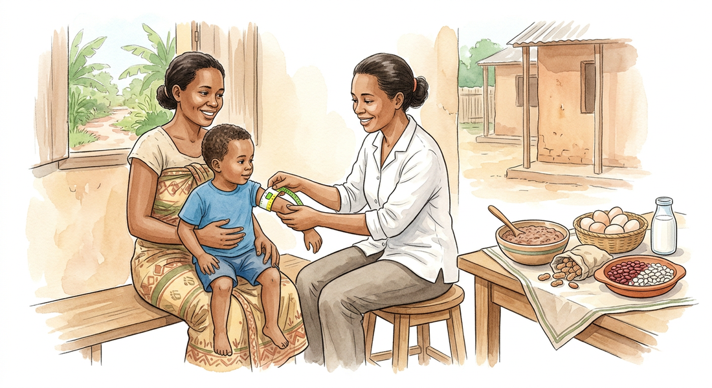


**<span style="color:#C00000">Malnutrition aiguë et carences</span>**

**<span style="color:#1E7B34">1. Qu'est-ce que la malnutrition ?</span>**

La **malnutrition** est un état résultant d'une alimentation mal adaptée aux besoins. Elle peut provenir d'un **manque** — ration insuffisante ou mal composée — ou d'un **excès**.

Cette séance traite des formes par insuffisance. La forme par excès est étudiée à la séance suivante.

**<span style="color:#1E7B34">2. Les formes par insuffisance</span>**

**a. La malnutrition chronique**
On la repère en comparant la **taille de l'enfant à celle attendue pour son âge** : elle est trop petite. Elle s'installe quand l'alimentation reste trop pauvre pendant de longs mois, ou que les privations reviennent régulièrement durant la croissance. Son évolution est lente, ce qui la rend difficile à remarquer : l'enfant paraît simplement de petite taille. Le retard accumulé se rattrape mal.

**b. La malnutrition aiguë**
On la repère cette fois en comparant le **poids à la taille** : l'enfant est beaucoup trop léger pour sa stature. Le corps a fondu, les muscles ont diminué et les côtes deviennent apparentes. Elle apparaît lorsque l'alimentation chute brutalement, ou après une maladie sévère. À la différence de la précédente, elle se déclare en quelques semaines et impose une prise en charge urgente.

**c. Les carences en micronutriments**
C'est le manque d'une vitamine ou d'un sel minéral précis, alors même que la quantité d'aliments peut être suffisante. On l'appelle la **« faim cachée »**, parce qu'elle ne se voit pas : la personne mange à sa faim mais son alimentation est trop peu variée.

| Élément manquant | Conséquence principale |
|---|---|
| Fer | Anémie : fatigue, pâleur, essoufflement |
| Vitamine A | Troubles de la vision |
| Iode | Troubles du développement |
| Calcium | Fragilité des os et des dents |

**<span style="color:#1E7B34">3. Causes et conséquences</span>**

Les causes sont à la fois alimentaires et sociales : ration trop pauvre ou trop peu variée, maladies répétées, pauvreté, accès difficile à une alimentation diversifiée.

Les conséquences dépassent le corps : outre le retard de croissance et l'affaiblissement des défenses, la malnutrition réduit la capacité de concentration et **retentit sur les résultats scolaires**.

**<span style="color:#1E7B34">4. Prévenir</span>**

La prévention repose sur des gestes accessibles : **varier** les aliments à l'intérieur de chaque groupe, intégrer chaque jour des **brèdes** et des **fruits**, associer aux féculents une source de protéines comme les **haricots** ou le **poisson**, utiliser du **sel iodé**, et surveiller la croissance des jeunes enfants.

### Section EXERCICES

**Exercice 1 (4 points)** — Associe chaque description à sa forme : 1. taille trop petite pour l'âge · 2. poids trop faible pour la taille · 3. manque de vitamine A · 4. installation lente après privations répétées

**Exercice 2 (6 points)** — Complète avec : *chronique, aiguë, cachée, anémie, iodé, variée*
1. La malnutrition …… se mesure par la taille rapportée à l'âge.
2. La malnutrition …… survient après une baisse rapide des apports.
3. Les carences en micronutriments forment la faim …….
4. Le manque de fer provoque une …….
5. Il faut utiliser du sel …….
6. Une alimentation …… limite le risque de carence.

**Exercice 3 (6 points)** — Dans un village, plusieurs enfants sont plus petits que la moyenne de leur âge et tombent souvent malades. Leur alimentation repose surtout sur le riz et le manioc.
1. Quelle forme de malnutrition est la plus probable ? 2. Quels groupes d'aliments manquent ? 3. Propose trois mesures concrètes pour améliorer la situation.

**Exercice 4 (4 points)** — Choisis la bonne réponse :
1. La malnutrition aiguë se reconnaît à : **A.** une taille faible pour l'âge **B.** un poids faible pour la taille **C.** un excès de poids
2. La « faim cachée » désigne : **A.** le fait de sauter un repas **B.** une carence en micronutriments **C.** la faim nocturne
3. Le manque de fer provoque : **A.** une anémie **B.** une obésité **C.** une carie
4. Le retard de taille dû à une malnutrition chronique est : **A.** toujours réversible **B.** difficilement rattrapable **C.** sans conséquence

**TOTAL : 20 points**

### CORRIGÉ

**Ex. 1** — 1. malnutrition **chronique** · 2. malnutrition **aiguë** · 3. **carence en micronutriments** · 4. malnutrition **chronique**

**Ex. 2** — 1. **chronique** · 2. **aiguë** · 3. **cachée** · 4. **anémie** · 5. **iodé** · 6. **variée**

**Ex. 3** — 1. Une **malnutrition chronique** accompagnée de **carences en micronutriments**. 2. Il manque les **aliments bâtisseurs** (protéines) et les **protecteurs** (vitamines, sels minéraux). 3. Ajouter des **haricots ou du poisson** aux repas ; intégrer chaque jour des **brèdes et des fruits** ; utiliser du **sel iodé** et **surveiller la croissance** des jeunes enfants.

**Ex. 4** — 1. **B** · 2. **B** · 3. **A** · 4. **B**


---


# SÉANCE 10 / 51 — Surpoids, obésité et menus d'appoint

**Objectif spécifique** : expliquer l'origine du surpoids et proposer un menu d'appoint adapté à une situation de malnutrition.
**Support et matériel** : balance, deux fiches de menus d'appoint.

| Étapes | Enseignant | Apprenants | Technique | Support | Obs. |
|---|---|---|---|---|---|
| **I. RÉVISION** | Cite les trois formes de malnutrition par insuffisance.<br>Qu'est-ce que la faim cachée ? | R.A. : Chronique, aiguë et carences en micronutriments.<br>R.A. : Un manque de vitamines ou de sels minéraux alors qu'on mange à sa faim. | Questionnement oral | — | |
| **II. NOUVELLE LEÇON** ||||||
| 1. Mise en situation | La malnutrition concerne-t-elle uniquement les personnes qui manquent de nourriture ? | R.A. : Non, elle concerne aussi celles qui mangent trop ou mal. | Questionnement oral | Tableau noir | |
| 2. Présentation | Aujourd'hui nous allons apprendre : « Surpoids, obésité et menus d'appoint ». Après cette séance vous serez capables d'expliquer l'origine du surpoids et de proposer un menu d'appoint. | Les élèves écoutent. | Exposé | Tableau noir, cahier | |
| 3. Observation | Regardez et observez bien ces deux fiches de menus d'appoint et cette balance. | Les élèves observent silencieusement. | Observation dirigée | Fiches de menus, balance | |
| 4. Analyse | Que se passe-t-il si l'on absorbe plus d'énergie qu'on n'en dépense ?<br>Sous quelle forme l'excédent est-il conservé ?<br>Le surpoids est-il une forme de malnutrition ?<br>Que doit contenir un menu pour un enfant dénutri ?<br>Et pour une personne en surpoids ? | R.A. : L'excédent est stocké par l'organisme.<br>R.A. : Sous forme de graisse.<br>R.A. : Oui, c'est une malnutrition par excès.<br>R.A. : Des aliments riches en énergie et en protéines, en petites quantités fréquentes.<br>R.A. : Moins de matières grasses et de sucres, plus de légumes, avec de l'activité physique. | Étude de document, travail de groupe | Fiches de menus | |
| 5. Synthèse | **Donc,** le surpoids et l'obésité résultent d'un déséquilibre durable entre l'énergie absorbée et l'énergie dépensée : l'excédent est stocké en graisse. Ce sont des formes de malnutrition par excès. Un menu d'appoint est une ration adaptée, corrigeant le déséquilibre : enrichie en énergie et en protéines pour un dénutri, allégée en graisses et en sucres pour une personne en surpoids. | Les élèves écoutent. | Exposé magistral | Tableau noir | |
| 6. Application | **Ex. 1** — Vrai ou Faux : 1. Le surpoids est une forme de malnutrition. 2. L'excédent d'énergie est éliminé par le corps. 3. L'activité physique augmente la dépense. 4. Un menu d'appoint est identique pour tous.<br><br>**Ex. 2** — Pour un enfant en malnutrition aiguë, indique : a) le type d'aliments · b) la fréquence des repas · c) deux aliments locaux adaptés · d) l'accompagnement nécessaire | **Ex. 1** : 1. **V** · 2. **F** — il est **stocké sous forme de graisse** · 3. **V** · 4. **F** — il est **adapté à la situation** de la personne<br><br>**Ex. 2** : a) **riches en énergie et en protéines** b) **petites quantités, fréquentes** c) **arachides, œufs** (ou lait, haricots) d) un **suivi médical** | Travail de groupe | Grande ardoise | |
| **III. ÉVALUATION** | **Ex. 1** — Complète : a) L'excédent d'énergie est stocké sous forme de …… b) Le surpoids est une malnutrition par …… c) Un menu d'appoint est …… à la personne. d) L'activité physique augmente la ……<br><br>**Ex. 2** — Propose un menu d'appoint pour un enfant en malnutrition aiguë : cite trois aliments locaux, précise la fréquence des repas et indique une précaution. | **Ex. 1** : a) **graisse** b) **excès** c) **adapté** d) **dépense**<br><br>**Ex. 2** : Trois aliments : **arachides**, **œufs**, **lait** (ou haricots, poisson). Fréquence : **plusieurs petits repas** par jour plutôt que deux gros. Précaution : **reprendre progressivement** l'alimentation, **sous suivi médical**. | Évaluation écrite | Cahier, feuille d'évaluation | |

### Page LEÇON

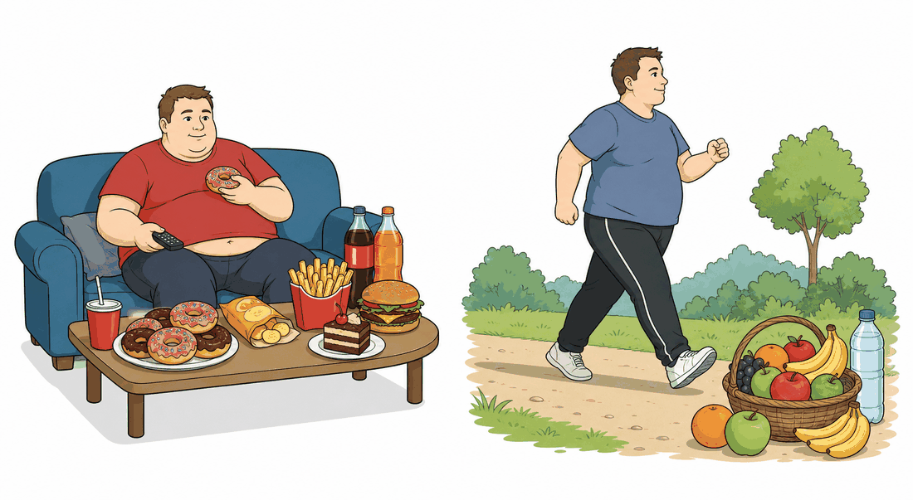


**<span style="color:#C00000">Surpoids, obésité et menus d'appoint</span>**

**<span style="color:#1E7B34">1. La malnutrition par excès</span>**

La malnutrition ne concerne pas seulement le manque. Le **surpoids** et l'**obésité** en sont deux formes, dues cette fois à un excès.

Leur origine est un **déséquilibre durable** entre deux quantités :

> énergie absorbée par l'alimentation **>** énergie dépensée par l'organisme

L'excédent n'est pas éliminé : il est **stocké sous forme de graisse**. Répété jour après jour, ce stockage conduit au surpoids, puis à l'obésité lorsqu'il devient important.

**<span style="color:#1E7B34">2. Facteurs et conséquences</span>**

Plusieurs facteurs y contribuent : une alimentation trop riche en matières grasses et en produits sucrés, des boissons sucrées consommées régulièrement, et un **manque d'activité physique** qui réduit la dépense.

Les conséquences sont importantes pour la santé : essoufflement, fatigue, douleurs articulaires, et à long terme un risque accru de **diabète**, d'**hypertension** et de **maladies du cœur**.

**<span style="color:#1E7B34">3. Les menus d'appoint</span>**

Un **menu d'appoint** est une ration temporaire, adaptée à une personne dont l'alimentation est déséquilibrée. Son contenu dépend du sens du déséquilibre.

**a. Pour une personne dénutrie**
L'objectif est de restaurer les réserves et de relancer la croissance.
- Aliments **riches en énergie et en protéines** : arachides, œufs, lait, haricots, poisson
- **Plusieurs petits repas** par jour plutôt que deux repas copieux, mieux tolérés par un organisme affaibli
- Reprise **progressive** de l'alimentation, sous **suivi médical** en cas de malnutrition aiguë

**b. Pour une personne en surpoids**
L'objectif est de réduire l'excédent sans créer de carence.
- **Diminuer** les matières grasses, les produits sucrés et les boissons sucrées
- **Augmenter** la part des légumes et des fruits, qui rassasient pour peu d'énergie
- Maintenir les **aliments bâtisseurs**, nécessaires même en cas de réduction
- Reprendre une **activité physique** régulière pour augmenter la dépense

**<span style="color:#1E7B34">4. Un principe commun</span>**

Dans les deux cas, le menu d'appoint ne se contente pas d'ajouter ou de retirer de la nourriture : il **rétablit l'équilibre entre les groupes d'aliments**, en tenant compte de l'âge, de l'activité et de l'état de santé de la personne. Il n'existe pas de menu d'appoint universel.

### Section EXERCICES

**Exercice 1 (4 points)** — Indique s'il s'agit d'un excès ou d'une insuffisance : 1. obésité · 2. malnutrition aiguë · 3. surpoids · 4. anémie

**Exercice 2 (6 points)** — Vrai ou Faux, et corrige les affirmations fausses :
1. L'excédent d'énergie est éliminé par l'organisme.
2. Le surpoids est une forme de malnutrition.
3. L'activité physique augmente la dépense énergétique.
4. Un menu d'appoint pour un dénutri doit être pauvre en protéines.
5. L'obésité augmente le risque de diabète.
6. Un menu d'appoint est le même pour toutes les personnes.

**Exercice 3 (6 points)** — Deux situations. **A** : un enfant de 8 ans en malnutrition aiguë. **B** : un adulte en surpoids peu actif.
1. Pour A, cite deux aliments à privilégier et la fréquence des repas.
2. Pour B, cite deux aliments à limiter et une mesure non alimentaire.
3. Qu'ont en commun ces deux menus d'appoint ?

**Exercice 4 (4 points)** — Choisis la bonne réponse :
1. Le surpoids résulte d'un apport : **A.** inférieur à la dépense **B.** supérieur à la dépense **C.** égal à la dépense
2. L'excédent d'énergie est : **A.** éliminé dans l'urine **B.** stocké en graisse **C.** transformé en vitamines
3. Pour un enfant dénutri, on recommande : **A.** deux gros repas **B.** plusieurs petits repas **C.** un seul repas
4. Une personne en surpoids doit surtout limiter : **A.** les légumes **B.** les matières grasses et les sucres **C.** l'eau

**TOTAL : 20 points**

### CORRIGÉ

**Ex. 1** — 1. **excès** · 2. **insuffisance** · 3. **excès** · 4. **insuffisance**

**Ex. 2** — 1. **F** — il est **stocké sous forme de graisse** · 2. **V** · 3. **V** · 4. **F** — il doit être **riche en protéines** pour reconstruire l'organisme · 5. **V** · 6. **F** — il est **adapté** à chaque situation

**Ex. 3** — 1. Pour A : **arachides** et **œufs** (ou lait, haricots, poisson), en **plusieurs petits repas** par jour. 2. Pour B : limiter les **matières grasses** et les **produits sucrés** ; reprendre une **activité physique** régulière. 3. Tous deux visent à **rétablir l'équilibre entre les groupes d'aliments**, en s'adaptant à l'état de la personne — l'un en enrichissant, l'autre en allégeant.

**Ex. 4** — 1. **B** · 2. **B** · 3. **B** · 4. **B**


---


# SÉANCE 11 / 51 — Révision de l'Unité I : sujet d'entraînement

**Thème** : Alimentation · **Valeurs à véhiculer** : autonomie, créativité
**Objectif spécifique** : traiter un sujet complet portant sur les séances 1 à 10, puis identifier ses propres erreurs à l'aide du corrigé commenté.
**Support et matériel** : sujet recopié au tableau ou polycopié, cahier de brouillon, calculatrice si disponible.

| Étapes | Enseignant | Apprenants | Technique | Support | Obs. |
|---|---|---|---|---|---|
| **I. RÉVISION** | Sans ouvrir votre cahier : combien de kilocalories apporte 1 g de lipides ? Et 1 g de glucides ? | R.A. : 9 kcal.<br>R.A. : 4 kcal. | Questionnement oral | — | |
| **II. NOUVELLE LEÇON** ||||||
| 1. Mise en situation | Aujourd'hui vous composez un sujet complet, comme le jour de l'examen. Mais celui-ci ne compte pas dans la moyenne : il sert à repérer ce qui n'est pas encore acquis. | Les élèves s'installent en condition d'examen. | Consigne | Tableau noir | |
| 2. Présentation | Quatre exercices, 20 points. Cahiers fermés. Vous travaillez seuls. | Les élèves écoutent. | Exposé | Tableau noir | |
| 3. Passation | L'enseignant distribue ou recopie le sujet, puis surveille sans intervenir sur le fond. | Les élèves traitent le sujet. | Travail individuel | Sujet, cahier | |
| 4. Correction collective | Exercice par exercice, l'enseignant interroge, fait justifier, puis donne la réponse et **nomme l'erreur fréquente**. | Les élèves corrigent au stylo de couleur. | Correction dirigée | Tableau noir | |
| 5. Synthèse | **Donc,** les points faibles de la classe sont relevés au tableau. Chaque élève note les deux notions qu'il doit retravailler avant la séance 12. | Les élèves notent leurs deux points à revoir. | Bilan collectif | Cahier | |
| **III. ÉVALUATION** | L'auto-évaluation tient lieu d'évaluation : chaque élève reporte son score sur 20 et le compare aux repères donnés. | Les élèves calculent leur score. | Auto-évaluation | Cahier | |

---

## Sujet d'entraînement — Unité I (Alimentation) — **/20**

### Exercice 1 — Connaissances *(4 points)*

**A. Associe chaque nutriment à son rôle principal** *(2 points)*

| Nutriment | | Rôle |
|---|---|---|
| 1. Glucides | | a. Construire et réparer les tissus |
| 2. Protéines | | b. Réserve d'énergie, isolation |
| 3. Lipides | | c. Protéger contre les maladies, en très petite quantité |
| 4. Vitamines | | d. Fournir l'énergie immédiate |

**B. Vrai ou faux — justifie en une phrase** *(2 points)*

1. L'eau est un nutriment énergétique.
2. Une personne obèse est toujours bien nourrie.

### Exercice 2 — Exercice chiffré *(6 points)*

Voici le déjeuner de Hanta, élève de T9 :

| Aliment | Glucides | Protéines | Lipides |
|---|---|---|---|
| Riz | 110 g | 8 g | 1 g |
| Haricots | 20 g | 12 g | 1 g |
| Huile et brèdes | 0 g | 5 g | 18 g |
| **Total** | **130 g** | **25 g** | **20 g** |

1. Calcule l'énergie apportée par chaque famille de nutriments. *(3 pts)*
2. Calcule l'énergie totale du repas. *(1 pt)*
3. Calcule le pourcentage d'énergie apporté par les glucides. *(1 pt)*
4. Les repères conseillent 50 à 55 % de glucides. Ce repas respecte-t-il ce repère ? *(1 pt)*

### Exercice 3 — Étude de document *(6 points)*

Dans un centre de santé, 200 enfants de moins de 5 ans sont pesés et mesurés.

| Situation | Nombre d'enfants |
|---|---|
| Croissance normale | 128 |
| Retard de croissance (malnutrition chronique) | 48 |
| Maigreur sévère (malnutrition aiguë) | 24 |

1. Quel pourcentage d'enfants présente un problème nutritionnel ? *(2 pts)*
2. Quelle est la différence entre malnutrition chronique et malnutrition aiguë ? *(2 pts)*
3. Le centre veut ramener la proportion d'enfants en croissance normale à 80 %. Combien d'enfants supplémentaires cela représente-t-il ? *(2 pts)*

### Exercice 4 — Situation *(4 points)*

Un commerçant affirme : « Mon riz suffit à nourrir un enfant. Il est plein d'énergie, c'est tout ce qui compte. »

Réponds-lui en deux arguments tirés de la leçon.

---

## Corrigé commenté — séance 11

### Exercice 1 *(4 pts)*

**A.** 1 → **d** · 2 → **a** · 3 → **b** · 4 → **c** *(0,5 pt par association)*

**B.** *(1 pt par item : 0,5 pour vrai/faux, 0,5 pour la justification)*

1. **Faux.** L'eau n'apporte **aucune énergie** : 0 kcal/g. Elle est indispensable, mais comme constituant et comme milieu des réactions, pas comme carburant.
2. **Faux.** L'obésité est un **trouble de la nutrition**, pas un signe de bonne alimentation. On peut consommer trop d'énergie tout en manquant de protéines, de fer ou de vitamines.

> ⚠️ **Erreur fréquente.** Beaucoup d'élèves écrivent que l'eau « donne de la force ». Elle permet aux réactions de se faire ; elle ne fournit pas de calories. La nuance doit être explicite.

### Exercice 2 *(6 pts)*

1. Glucides : 130 × 4 = **520 kcal** · Protéines : 25 × 4 = **100 kcal** · Lipides : 20 × 9 = **180 kcal** *(1 pt chacun)*
2. 520 + 100 + 180 = **800 kcal** *(1 pt)*
3. 520 ÷ 800 = 0,65 = **65 %** *(1 pt)*
4. **Non.** 65 % dépasse nettement le repère de 50-55 %. Le repas est **trop riche en glucides** et, en contrepartie, trop pauvre en lipides (22,5 % pour un repère de 30-35 %). *(1 pt)*

> ⚠️ **Erreur fréquente.** Multiplier les lipides par 4 au lieu de 9. Les lipides sont le nutriment le plus énergétique : **plus du double** des deux autres à masse égale.

### Exercice 3 *(6 pts)*

1. 48 + 24 = 72 enfants concernés ; 72 ÷ 200 = 0,36 = **36 %** *(2 pts)*
2. La malnutrition **chronique** s'installe lentement et se lit sur la **taille** : l'enfant est trop petit pour son âge, la croissance a été freinée durablement. La malnutrition **aiguë** est récente et se lit sur le **poids** : l'enfant est trop maigre pour sa taille. L'une raconte des années, l'autre des semaines. *(2 pts)*
3. 80 % de 200 = **160 enfants** en croissance normale ; il y en a 128 ; il faut donc **32 enfants de plus**. *(2 pts)*

> ⚠️ **Erreur fréquente.** Répondre « 80 % − 64 % = 16 % » et s'arrêter là. La question demande un **nombre d'enfants**, pas un écart de pourcentage. Toujours revenir à l'unité demandée.

### Exercice 4 *(4 pts)*

*(2 pts par argument correctement développé)*

- **Argument 1 — l'énergie ne fait pas tout.** Le riz apporte surtout des glucides. Un enfant a aussi besoin de **protéines** pour construire ses tissus, et de **vitamines et sels minéraux** pour se défendre contre les maladies. Un régime de riz seul conduit à des **carences**, même si l'enfant mange à sa faim.
- **Argument 2 — la variété est la règle.** Aucun aliment ne contient tout. C'est la **combinaison** des groupes d'aliments qui équilibre un repas : associer au riz des légumineuses (haricots, lentilles) apporte les protéines qui manquent, pour un coût modeste.

**Repères de score** : 16-20 acquis · 11-15 à consolider · 6-10 fragile · 0-5 reprendre les séances 1 à 10.


---


# SÉANCE 12 / 51 — Examen de l'Unité I : Alimentation

**Thème** : Alimentation · **Valeurs à véhiculer** : autonomie, créativité
**Objectif spécifique** : évaluer la maîtrise des notions des séances 1 à 10 — nutriments, valeur énergétique, besoins, équilibre alimentaire, malnutrition.
**Support et matériel** : sujet polycopié ou recopié au tableau, cahier de composition.

| Étapes | Enseignant | Apprenants | Technique | Support | Obs. |
|---|---|---|---|---|---|
| **I. RÉVISION** | Rappel des consignes d'examen. Aucune question sur le fond ne sera prise pendant l'épreuve. | Les élèves rangent cahiers et livres. | Consigne | — | |
| **II. NOUVELLE LEÇON** ||||||
| 1. Mise en situation | L'enseignant écrit au tableau le barème : 4 + 6 + 6 + 4 = 20. | Les élèves notent le barème. | Consigne | Tableau noir | |
| 2. Présentation | Lecture à voix haute de l'intégralité du sujet, sans commentaire. | Les élèves suivent et signalent un mot illisible. | Lecture dirigée | Sujet | |
| 3. Passation | Surveillance active. L'enseignant ne reformule aucune consigne portant sur le fond. | Les élèves composent individuellement. | Évaluation écrite | Sujet, cahier | |
| 4. Ramassage | Ramassage des copies, vérification des noms. | Les élèves rendent leur copie. | Organisation | Copies | |
| 5. Synthèse | **Donc,** la correction sera rendue à la séance suivante. Les notions les moins réussies feront l'objet d'une reprise. | Les élèves écoutent. | Bilan | — | |
| **III. ÉVALUATION** | *(L'épreuve elle-même constitue l'évaluation.)* | | Évaluation écrite | Copies | |

---

## SUJET D'EXAMEN — Unité I : Alimentation — **Durée : ____________ — /20**

### Exercice 1 — Connaissances *(4 points)*

**A. Complète avec le mot exact** *(2 points)*

1. Les aliments qui apportent l'énergie immédiate sont les ……………… .
2. Le …………………………… est l'ensemble des réactions chimiques de l'organisme.
3. Une carence en …………… provoque l'anémie.
4. Les …………………… sont les nutriments bâtisseurs de l'organisme.

**B. QCM — une seule réponse exacte** *(2 points)*

1. 1 gramme de protéines apporte : **A.** 4 kcal · **B.** 9 kcal · **C.** 0 kcal
2. Le métabolisme de base correspond à l'énergie dépensée : **A.** pendant le sport · **B.** au repos complet · **C.** pendant la digestion
3. Le kwashiorkor résulte d'une carence en : **A.** glucides · **B.** protéines · **C.** lipides
4. Le groupe des aliments protecteurs est celui des : **A.** céréales · **B.** fruits et légumes · **C.** huiles

### Exercice 2 — Exercice chiffré *(6 points)*

Rakoto, 15 ans, a des besoins énergétiques journaliers de **2 400 kcal**.

Son petit-déjeuner lui apporte **480 kcal**. Son déjeuner lui apporte **960 kcal**.

1. Quel pourcentage de ses besoins le petit-déjeuner couvre-t-il ? *(1,5 pt)*
2. Quel pourcentage le déjeuner couvre-t-il ? *(1,5 pt)*
3. Combien de kilocalories reste-t-il pour le goûter et le dîner réunis ? *(1,5 pt)*
4. Sur ces 2 400 kcal, les repères conseillent 55 % de glucides. À combien de **grammes** de glucides cela correspond-il ? *(1,5 pt)*

### Exercice 3 — Étude de document *(6 points)*

Un centre de santé suit pendant un an deux groupes d'enfants recevant la même quantité d'énergie. Le groupe B reçoit en plus une ration quotidienne de légumineuses.

| | Groupe A | Groupe B |
|---|---|---|
| Nombre d'enfants | 150 | 150 |
| Énergie journalière | 1 600 kcal | 1 600 kcal |
| Protéines journalières | 18 g | 42 g |
| Gain de taille moyen en 1 an | 4 cm | 7 cm |
| Enfants malades plus de 3 fois dans l'année | 66 | 30 |

1. Quelle est la seule différence alimentaire entre les deux groupes ? *(1 pt)*
2. Calcule, pour chaque groupe, le pourcentage d'enfants souvent malades. *(2 pts)*
3. Les deux groupes reçoivent la même énergie. Comment expliques-tu alors la différence de croissance ? *(2 pts)*
4. Quelle conclusion tires-tu sur la notion d'équilibre alimentaire ? *(1 pt)*

### Exercice 4 — Situation *(4 points)*

Une famille dispose d'un budget très limité. Elle mange du riz matin, midi et soir.

1. Quel type de problème nutritionnel cette famille risque-t-elle ? *(1 pt)*
2. Propose **deux** aliments peu coûteux et disponibles localement pour compléter ce régime, en précisant ce que chacun apporte. *(3 pts)*

---

## CORRIGÉ ET BARÈME — séance 12

### Exercice 1 *(4 pts)*

**A.** *(0,5 pt par mot)*
1. **glucides** — 2. **métabolisme** — 3. **fer** — 4. **protéines**

**B.** *(0,5 pt par item)*
1. **A** (4 kcal) — 2. **B** (au repos complet) — 3. **B** (protéines) — 4. **B** (fruits et légumes)

*Renvoi : séances 2, 3, 5, 9.*

### Exercice 2 *(6 pts)*

1. 480 ÷ 2 400 = 0,20 = **20 %** *(1,5 pt — 1 pt pour le calcul, 0,5 pt pour le pourcentage)*
2. 960 ÷ 2 400 = 0,40 = **40 %** *(1,5 pt)*
3. 2 400 − 480 − 960 = **960 kcal**, soit 40 % des besoins. *(1,5 pt)*
4. 55 % de 2 400 = 0,55 × 2 400 = 1 320 kcal ; 1 320 ÷ 4 = **330 g de glucides**. *(1,5 pt — 0,75 pt pour l'énergie, 0,75 pt pour la conversion en grammes)*

> **Consigne au correcteur.** À la question 4, l'erreur consistant à répondre « 1 320 » sans diviser par 4 vaut **0,75 pt** : le raisonnement énergétique est juste, la conversion en masse est manquante.

*Renvoi : séances 4, 6.*

### Exercice 3 *(6 pts)*

1. La quantité de **protéines** : 18 g contre 42 g. L'énergie, elle, est identique. *(1 pt)*
2. Groupe A : 66 ÷ 150 = 0,44 = **44 %** · Groupe B : 30 ÷ 150 = 0,20 = **20 %** *(1 pt chacun)*
3. L'énergie ne suffit pas à grandir. La croissance exige des **protéines**, qui servent de matériaux de construction des tissus. Le groupe B en reçoit plus du double, il grandit donc davantage — **7 cm contre 4 cm** — alors que l'apport énergétique est le même. *(2 pts)*
4. Un régime équilibré ne se juge pas au seul nombre de kilocalories : c'est la **composition** de la ration qui compte. À énergie égale, deux régimes peuvent avoir des effets très différents sur la croissance et sur la résistance aux maladies. *(1 pt)*

*Renvoi : séances 2, 8, 9.*

### Exercice 4 *(4 pts)*

1. Un régime de riz seul expose à une **carence en protéines**, et plus largement à une **malnutrition par déséquilibre** : l'enfant peut manger à sa faim tout en manquant de nutriments bâtisseurs et protecteurs. *(1 pt)*
2. *(1,5 pt par aliment : 0,5 pt pour l'aliment, 1 pt pour l'apport correctement identifié)*

Deux réponses attendues parmi :

| Aliment | Apport |
|---|---|
| **Haricots, lentilles, pois du Cap** | protéines végétales, à coût très inférieur à la viande |
| **Brèdes (feuilles vertes locales)** | vitamines, fer, fibres |
| **Petits poissons séchés** | protéines et **calcium** (arêtes consommées) |
| **Œufs** | protéines complètes |
| **Arachides** | protéines et lipides |

> **Consigne au correcteur.** Accepter tout aliment local pertinent hors de cette liste, dès lors que l'apport nutritionnel est correctement énoncé. Refuser les réponses qui se contentent de nommer l'aliment sans indiquer ce qu'il apporte.

*Renvoi : séances 1, 7, 9.*

**TOTAL : 20 points**


---


# SÉANCE 13 / 51 — Les besoins nutritifs des plantes

**Objectif spécifique** : identifier, à partir d'expériences, les quatre éléments dont une plante a besoin pour vivre et croître.
**Support et matériel** : 8 jeunes plants de même taille, bocaux ou boîtes de conserve, eau de pluie, eau salée minéralisée, carton pour l'obscurité.

| Étapes | Enseignant | Apprenants | Technique | Support | Obs. |
|---|---|---|---|---|---|
| **I. RÉVISION** | De quoi l'être humain a-t-il besoin chaque jour pour vivre ?<br>Une plante mange-t-elle comme nous ? | R.A. : De nourriture, d'eau, d'air.<br>R.A. : Non, elle n'a pas de bouche. | Questionnement oral | — | |
| **II. NOUVELLE LEÇON** ||||||
| 1. Mise en situation | Deux pieds de brèdes ont été plantés le même jour. Celui du jardin est vert et vigoureux. Celui qu'on a laissé dans un coin sombre de la cuisine est jaune et mou. Pourtant, on les a arrosés tous les deux. Que manque-t-il au second ? | R.A. : Il manque la lumière du soleil. | Questionnement oral | Tableau noir | |
| 2. Présentation | Aujourd'hui : « Les besoins nutritifs des plantes ». À la fin, vous saurez nommer les quatre éléments nécessaires à une plante et dire quelle expérience le prouve. | Les élèves écoutent. | Exposé | Tableau noir | |
| 3. Observation | Voici quatre montages préparés il y a six jours. Dans chacun, deux plantes identiques ont été traitées différemment : on n'a fait varier **qu'une seule chose** à la fois. Observez et notez l'état de chaque plante. | Les élèves observent et notent. | Observation dirigée, travail de groupe | Les 4 montages | |
| 4. Analyse | Montage 1, l'une a reçu de l'eau, l'autre non : que voyez-vous ?<br>Montage 2, l'une a de l'eau avec sels minéraux, l'autre de l'eau pure : laquelle a le mieux poussé ?<br>Montage 3, l'une est à l'air libre, l'autre privée de dioxyde de carbone : que constatez-vous ?<br>Montage 4, l'une à la lumière, l'autre sous un carton : décrivez.<br>Pourquoi ne change-t-on qu'un seul élément par montage ? | R.A. : Celle sans eau est fanée, elle meurt.<br>R.A. : Celle qui a reçu les sels minéraux ; l'autre reste chétive.<br>R.A. : Celle privée de CO₂ ne grandit presque pas.<br>R.A. : Celle du carton est jaune pâle et sa tige s'allonge anormalement.<br>R.A. : Pour savoir lequel est responsable du changement. | Expérimentation, travail de groupe | Les 4 montages, cahier | |
| 5. Synthèse | **Donc,** une plante a besoin de quatre éléments : **l'eau**, les **sels minéraux**, le **dioxyde de carbone** et la **lumière**. Chaque montage compare deux plantes qui ne diffèrent que par un seul élément : c'est ce qui permet de conclure. La plante sans lumière jaunit parce qu'elle ne fabrique plus sa matière verte. | Les élèves recopient. | Exposé magistral | Tableau noir | |
| 6. Application | **Ex. 1** — Associe chaque montage à l'élément qu'il teste : 1. avec/sans eau · 2. eau minéralisée/eau pure · 3. avec/sans CO₂ · 4. lumière/obscurité<br><br>**Ex. 2** — Vrai ou Faux : 1. Une plante mange de la terre. 2. La plante privée de lumière jaunit. 3. Les sels minéraux sont visibles dans l'eau. 4. Il faut changer plusieurs éléments à la fois pour bien conclure. | **Ex. 1** : 1. **l'eau** · 2. **les sels minéraux** · 3. **le dioxyde de carbone** · 4. **la lumière**<br><br>**Ex. 2** : 1. **F** — elle y puise l'eau et les sels minéraux, elle ne la mange pas. 2. **V** 3. **F** — ils y sont dissous, donc invisibles. 4. **F** — un seul à la fois. | Travail de groupe | Grande ardoise | |
| **III. ÉVALUATION** | **Ex. 1** — Cite les quatre besoins d'une plante.<br><br>**Ex. 2** — Un élève place deux plantes sous un carton, l'une arrosée, l'autre non. Il conclut que la lumière est indispensable. A-t-il raison ? Justifie. | **Ex. 1** : eau, sels minéraux, dioxyde de carbone, lumière.<br><br>**Ex. 2** : **Non.** Les deux plantes sont dans le noir, il n'a donc pas comparé lumière et obscurité. Son montage teste l'eau, pas la lumière. | Évaluation écrite | Cahier | |

### Page LEÇON

**<span style="color:#C00000">Les besoins nutritifs des plantes</span>**

**<span style="color:#1E7B34">1. Une question ancienne</span>**


*Dessin de référence pour situer les organes dont il sera question dans toute l'unité. Il ne porte pas de légende : les élèves peuvent les placer sur leur cahier.*

Une plante grandit sans jamais se déplacer et sans rien avaler. Pendant longtemps, on a cru qu'elle « mangeait la terre ». Pour savoir de quoi elle a réellement besoin, il faut **expérimenter** : priver la plante d'un élément et observer ce qui se passe.

**<span style="color:#1E7B34">2. Le principe de l'expérience</span>**

On compare toujours **deux plantes semblables** — même espèce, même taille, même récipient. L'une, appelée **témoin**, reçoit tout ce qu'il lui faut. L'autre est privée d'**un seul** élément. Si elle pousse moins bien, c'est que cet élément lui était nécessaire.

La règle est stricte : **on ne fait varier qu'une chose à la fois**. Si l'on modifiait deux éléments en même temps, on ne saurait plus lequel des deux explique le résultat. L'expérience doit durer assez longtemps pour que la différence devienne visible — cinq à six jours suffisent pour de jeunes plants.

**<span style="color:#1E7B34">3. Les quatre besoins mis en évidence</span>**

| Montage | Ce que l'on compare | Résultat observé | Conclusion |
|---|---|---|---|
| 1 | avec eau / sans eau | la plante privée d'eau se fane, puis meurt | l'**eau** est indispensable |
| 2 | eau minéralisée / eau pure | la plante en eau pure reste chétive | les **sels minéraux** sont indispensables |
| 3 | avec CO₂ / sans CO₂ | sans dioxyde de carbone, la croissance s'arrête | le **dioxyde de carbone** est indispensable |
| 4 | lumière / obscurité | à l'obscurité, la plante jaunit et sa tige s'allonge anormalement | la **lumière** est indispensable |

**<span style="color:#1E7B34">4. Ce que ces besoins signifient</span>**

L'**eau** transporte les substances dissoutes et maintient la plante rigide : une plante qui manque d'eau s'affaisse. Les **sels minéraux** — azote, phosphore, potassium principalement — sont des éléments que la plante puise dans le sol pour fabriquer sa propre matière. Le **dioxyde de carbone** est prélevé dans l'air par les feuilles. La **lumière** fournit l'énergie nécessaire à la fabrication de la matière organique ; privée de lumière, la plante ne produit plus sa matière verte, d'où son aspect jaune pâle.

Ces quatre besoins expliquent tous les gestes du jardinier : arroser, fumer le sol, espacer les plants, les exposer au soleil.

> **Repère historique.** Vers 1860, deux chercheurs allemands, **Wilhelm Knop** et **Julius von Sachs**, sont parvenus à faire pousser des plantes dans de l'eau additionnée de sels minéraux, sans aucune terre. Cette expérience a démontré que ce n'est pas la terre elle-même qui nourrit la plante, mais les éléments minéraux qu'elle contient. C'est l'origine des cultures hors-sol pratiquées aujourd'hui.

### Section EXERCICES

**Exercice 1 (4 points)** — Indique, pour chaque montage, l'élément dont on veut prouver la nécessité.
1. Deux plantes, l'une arrosée, l'autre non.
2. Deux plantes dans l'eau, l'une avec sels minéraux, l'autre sans.
3. Deux plantes, l'une à l'air libre, l'autre dans une enceinte sans dioxyde de carbone.
4. Deux plantes, l'une au soleil, l'autre sous un seau renversé.

**Exercice 2 (6 points)** — Complète avec : *témoin, sels minéraux, lumière, un seul, dissous, jaunit*
1. La plante qui reçoit tout ce qu'il lui faut sert de …….
2. On ne fait varier que …… élément à la fois.
3. Les sels minéraux sont …… dans l'eau.
4. Privée de lumière, la plante …….
5. La plante puise dans le sol l'eau et les …….
6. L'énergie nécessaire à la fabrication de matière vient de la …….

**Exercice 3 (6 points)** — Rakoto veut savoir si les sels minéraux sont utiles. Il met un pied de brèdes dans un bocal d'eau de pluie posé sur le rebord ensoleillé de la fenêtre, et un autre dans un bocal d'eau minéralisée posé sous la table.
1. Quels sont les **deux** éléments qui diffèrent entre ses deux bocaux ?
2. Pourquoi ne pourra-t-il rien conclure sur les sels minéraux ?
3. Propose une correction de son montage.

**Exercice 4 (4 points)** — Choisis la bonne réponse.
1. Une plante prélève le dioxyde de carbone : **A.** dans le sol **B.** dans l'air **C.** dans l'eau d'arrosage
2. Une plante privée de lumière devient : **A.** verte et haute **B.** jaune pâle **C.** rouge
3. Le rôle du montage témoin est de : **A.** servir de point de comparaison **B.** pousser plus vite **C.** remplacer la plante malade
4. Faire pousser une plante dans l'eau sans terre prouve que : **A.** la terre est inutile à tout **B.** ce sont les minéraux, et non la terre elle-même, qui nourrissent **C.** les plantes n'ont pas besoin de minéraux

**TOTAL : 20 points**

### CORRIGÉ

**Ex. 1** — 1. **l'eau** · 2. **les sels minéraux** · 3. **le dioxyde de carbone** · 4. **la lumière**

**Ex. 2** — 1. **témoin** · 2. **un seul** · 3. **dissous** · 4. **jaunit** · 5. **sels minéraux** · 6. **lumière**

**Ex. 3** — 1. La **présence de sels minéraux** et l'**exposition à la lumière**. 2. Deux éléments changent en même temps : si une plante pousse mieux, il ne saura pas si c'est grâce aux sels minéraux ou grâce au soleil. 3. Placer les **deux bocaux au même endroit ensoleillé** et ne faire varier que la présence des sels minéraux.

**Ex. 4** — 1. **B** · 2. **B** · 3. **A** · 4. **B**


---


# SÉANCE 14 / 51 — Le lieu et le mode d'absorption de l'eau

**Objectif spécifique** : localiser la zone d'absorption de l'eau sur une racine et décrire le trajet de l'eau jusqu'aux vaisseaux conducteurs.
**Support et matériel** : jeunes plants de maïs ou de haricot germés sur coton humide (racines visibles), loupe, schéma de racine au tableau, deux tubes avec huile.

| Étapes | Enseignant | Apprenants | Technique | Support | Obs. |
|---|---|---|---|---|---|
| **I. RÉVISION** | Citez les quatre besoins d'une plante.<br>Par quelle partie la plante prend-elle l'eau du sol ? | R.A. : Eau, sels minéraux, dioxyde de carbone, lumière.<br>R.A. : Par les racines. | Questionnement oral | — | |
| **II. NOUVELLE LEÇON** ||||||
| 1. Mise en situation | La racine est parfois très longue. L'eau entre-t-elle partout sur toute sa longueur, ou seulement à un endroit précis ? | R.A. : Les élèves proposent des hypothèses. | Questionnement oral | Tableau noir | |
| 2. Présentation | Aujourd'hui : « Le lieu et le mode d'absorption de l'eau ». Vous saurez situer la zone qui absorbe et expliquer le trajet de l'eau dans la racine. | Les élèves écoutent. | Exposé | Tableau noir | |
| 3. Observation | Observez à la loupe la racine de ces jeunes plants. Regardez bien les trois zones : l'extrémité pointue, la région un peu plus haut couverte d'un duvet blanc, et la partie lisse près de la tige. | Les élèves observent à la loupe. | Observation dirigée | Plants germés, loupe | |
| 4. Analyse | Décrivez le duvet blanc que vous voyez.<br>Voici deux tubes contenant la même quantité d'eau, recouverte d'huile pour empêcher l'évaporation. Dans le premier, la racine trempe par son duvet ; dans le second, seule la partie lisse trempe. Dans lequel le niveau a-t-il baissé ?<br>Qu'en concluez-vous ?<br>À quoi sert la couche d'huile ? | R.A. : Ce sont de très fins poils blancs, serrés les uns contre les autres.<br>R.A. : Dans le premier, celui où trempe le duvet.<br>R.A. : C'est le duvet qui absorbe l'eau.<br>R.A. : À empêcher l'eau de s'évaporer, pour être sûr que la baisse vient bien de la plante. | Étude de document, expérimentation | Tubes, huile, plants | |
| 5. Synthèse | **Donc,** l'eau et les sels minéraux entrent par les **poils absorbants**, groupés sur la **zone pilifère** de la racine, un peu en arrière de l'extrémité. De là, l'eau traverse l'épaisseur de la racine jusqu'au centre, où des vaisseaux appelés **xylème** la conduisent vers la tige et les feuilles. | Les élèves recopient le schéma. | Exposé magistral | Schéma au tableau | |
| 6. Application | **Ex. 1** — Nomme les trois zones de la racine, de la pointe vers la tige.<br><br>**Ex. 2** — Complète : a) Les poils absorbants sont groupés sur la zone ……. b) L'eau circule ensuite dans le ……. c) La racine sert aussi à …… la plante au sol. | **Ex. 1** : la **coiffe** à l'extrémité, la **zone pilifère** couverte de poils, la **zone lisse** (ou subéreuse).<br><br>**Ex. 2** : a) **pilifère** b) **xylème** c) **fixer** (ancrer) | Travail de groupe | Grande ardoise | |
| **III. ÉVALUATION** | **Ex. 1** — Dessine une racine et place : coiffe, zone pilifère, xylème.<br><br>**Ex. 2** — Pourquoi une plante arrachée brutalement du sol reprend-elle difficilement, même bien arrosée ? | **Ex. 1** : schéma correct, trois légendes bien placées.<br><br>**Ex. 2** : L'arrachage **détruit les poils absorbants**, très fragiles. Privée d'eux, la plante n'absorbe presque plus d'eau, même si le sol en contient. Il faut le temps qu'elle en forme de nouveaux. | Évaluation écrite | Cahier | |

### Page LEÇON


**<span style="color:#C00000">Le lieu et le mode d'absorption de l'eau</span>**

**<span style="color:#1E7B34">1. Les rôles de la racine</span>**

Chez la plupart des plantes, la racine forme l'appareil enfoui dans le sol. Trois rôles lui reviennent :

- elle **absorbe** l'eau et les sels minéraux du sol ;
- elle **fixe** solidement la plante, qui résiste ainsi au vent et à la pluie ;
- chez certaines espèces, elle **met en réserve** des substances nutritives. Le manioc, la patate douce et la carotte sont des racines de réserve, et c'est précisément ce que nous mangeons.

**<span style="color:#1E7B34">2. Où l'eau entre-t-elle ?</span>**

En observant une jeune racine à la loupe, on distingue trois régions :

| Région | Situation | Aspect |
|---|---|---|
| La **coiffe** | tout à l'extrémité | petit capuchon dur qui protège la pointe quand elle s'enfonce |
| La **zone pilifère** | juste en arrière de la pointe | couverte d'un duvet blanc très fin |
| La **zone lisse** | vers la tige | plus âgée, sans duvet |


*Schéma à reproduire au tableau. Il ne porte aucune légende : les élèves les placent eux-mêmes, en s'aidant du tableau ci-dessus. Le même dessin sert à l'examen de l'unité (séance 24).*

Ce duvet est formé de **poils absorbants**. Chaque poil est le prolongement en doigt de gant d'une cellule de la surface de la racine. Ils sont extrêmement nombreux et très fins.

C'est **par eux, et presque uniquement par eux, que l'eau pénètre**. On le démontre simplement : on place une racine dans un tube d'eau recouverte d'une mince couche d'huile. L'huile flotte et bloque l'évaporation ; toute baisse du niveau est donc due à la plante. Quand la zone pilifère trempe, le niveau baisse nettement. Quand seule la zone lisse trempe, il ne bouge presque pas.

La finesse et le nombre des poils absorbants offrent une immense surface de contact avec le sol, alors que la racine occupe peu de place. Mais cette finesse a un prix : **les poils absorbants sont très fragiles** et se déchirent au moindre arrachage. C'est pourquoi on repique les jeunes plants avec leur motte de terre.

**<span style="color:#1E7B34">3. Le trajet de l'eau dans la racine</span>**

Une fois entrée par un poil absorbant, l'eau ne reste pas sur place. Elle progresse **de la surface vers le centre** de la racine, en traversant les cellules. Au centre se trouvent les **vaisseaux du xylème**, sortes de tuyaux qui conduisent l'eau chargée de sels minéraux — appelée **sève brute** — vers la tige, puis vers les feuilles.

Le trajet complet tient en une phrase : *sol → poil absorbant → cellules de la racine → xylème → tige → feuilles*.

**<span style="color:#1E7B34">4. Pourquoi l'eau entre-t-elle toute seule ?</span>**

L'eau n'est pas aspirée par une pompe. Elle passe spontanément à travers la paroi du poil absorbant parce que le liquide contenu dans la cellule est plus concentré en substances dissoutes que l'eau du sol. Ce passage spontané à travers une paroi porte le nom d'**osmose**. Il a été décrit et nommé par le physiologiste français **Henri Dutrochet**, qui en a présenté les premiers résultats à l'Académie des sciences en 1826.

### Section EXERCICES

**Exercice 1 (5 points)** — Range dans l'ordre suivi par l'eau, de son entrée jusqu'à la feuille :
*xylème · poil absorbant · feuille · cellules de la racine · tige*

**Exercice 2 (5 points)** — Vrai ou Faux. Corrige les affirmations fausses.
1. L'eau entre sur toute la longueur de la racine.
2. Les poils absorbants sont des prolongements de cellules.
3. La coiffe absorbe l'eau.
4. Le xylème conduit la sève brute.
5. Le manioc est une racine de réserve.

**Exercice 3 (6 points)** — On dispose deux tubes d'eau de même niveau, chacun recouvert d'une couche d'huile. Dans le tube A, un jeune plant trempe par sa zone pilifère. Dans le tube B, un plant identique trempe seulement par sa zone lisse. Après deux jours, le niveau a baissé dans A et n'a presque pas bougé dans B.
1. Que conclut-on de cette expérience ?
2. À quoi sert la couche d'huile ?
3. Pourquoi faut-il deux plants de même taille ?

**Exercice 4 (4 points)** — Choisis la bonne réponse.
1. Les poils absorbants se trouvent : **A.** sur la coiffe **B.** sur la zone pilifère **C.** sur la tige
2. La sève brute est composée : **A.** d'eau chargée de sels minéraux **B.** de sucre uniquement **C.** d'huile
3. Dans la racine, l'eau va : **A.** du centre vers la surface **B.** de la surface vers le centre **C.** de haut en bas
4. On repique les plants avec leur motte pour : **A.** les alourdir **B.** protéger les poils absorbants **C.** les faire fleurir

**TOTAL : 20 points**

### CORRIGÉ

**Ex. 1** — poil absorbant → cellules de la racine → xylème → tige → feuille

**Ex. 2** — 1. **F** — elle entre essentiellement par la **zone pilifère**. 2. **V** 3. **F** — la coiffe **protège** la pointe, elle n'absorbe pas. 4. **V** 5. **V**

**Ex. 3** — 1. L'absorption de l'eau se fait **au niveau de la zone pilifère**, donc par les poils absorbants. 2. Elle **empêche l'évaporation** : la baisse observée ne peut venir que de la plante. 3. Pour que les deux tubes ne diffèrent **que par la zone en contact avec l'eau** ; sinon une plante plus grande boirait davantage et fausserait la comparaison.

**Ex. 4** — 1. **B** · 2. **A** · 3. **B** · 4. **B**


---


# SÉANCE 15 / 51 — Les soins à apporter aux plantes cultivées

**Objectif spécifique** : décrire et justifier les quatre principaux soins d'entretien d'une culture.
**Support et matériel** : sarcloir ou angady, plate-bande de l'école ou pot de semis trop dense, arrosoir.

| Étapes | Enseignant | Apprenants | Technique | Support | Obs. |
|---|---|---|---|---|---|
| **I. RÉVISION** | Par où la plante absorbe-t-elle l'eau ?<br>Que se passe-t-il si les poils absorbants sont détruits ? | R.A. : Par les poils absorbants, groupés sur la zone pilifère.<br>R.A. : Elle n'absorbe presque plus d'eau. | Questionnement oral | — | |
| **II. NOUVELLE LEÇON** ||||||
| 1. Mise en situation | Dans un jardin laissé à l'abandon pendant deux mois, les plants de brèdes sont petits et étouffés par d'autres herbes. Que s'est-il passé ? | R.A. : Les mauvaises herbes ont pris la place et la nourriture. | Questionnement oral | Tableau noir | |
| 2. Présentation | Aujourd'hui : « Les soins à apporter aux plantes cultivées ». Vous saurez nommer quatre soins et expliquer à quel besoin de la plante chacun répond. | Les élèves écoutent. | Exposé | Tableau noir | |
| 3. Observation | Sortons observer la plate-bande. Regardez : ici les plants sont serrés, là des herbes poussent entre les rangs, là le sol est dur et craquelé. | Les élèves observent et complètent la fiche. | Observation dirigée, enquête | Plate-bande, fiche d'observation | |
| 4. Analyse | Pourquoi les herbes qui poussent entre les rangs gênent-elles nos plants ?<br>Ces jeunes plants serrés les uns contre les autres pourront-ils tous grossir ?<br>Faut-il arroser tous les jours, même en saison des pluies ?<br>Que devient un sol tassé quand on l'arrose ? | R.A. : Elles prennent l'eau et les sels minéraux du sol.<br>R.A. : Non, ils vont se gêner ; il faut en enlever.<br>R.A. : Non, c'est inutile quand le sol est déjà humide.<br>R.A. : L'eau ruisselle au lieu de pénétrer. | Travail de groupe, enquête | Plate-bande | |
| 5. Synthèse | **Donc,** entretenir une culture consiste à supprimer la concurrence et à donner à chaque plant la place, l'eau et les éléments nutritifs dont il a besoin. Quatre gestes principaux : le **désherbage**, le **sarclage**, l'**éclaircissage** et l'**arrosage raisonné**. | Les élèves recopient. | Exposé magistral | Tableau noir | |
| 6. Application | **Ex. 1** — Nomme le soin décrit : a) arracher les mauvaises herbes à la main · b) enlever quelques plantules trop serrées · c) couper les herbes sous la surface du sol avec un outil<br><br>**Ex. 2** — Vrai ou Faux : 1. Les mauvaises herbes concurrencent les cultures. 2. Il faut arroser tous les jours en toute saison. 3. L'éclaircissage consiste à ajouter des plants. 4. Le sarclage ameublit aussi le sol. | **Ex. 1** : a) **désherbage** b) **éclaircissage** c) **sarclage**<br><br>**Ex. 2** : 1. **V** 2. **F** — on arrose selon l'état du sol. 3. **F** — on en **retire**. 4. **V** | Travail de groupe | Grande ardoise | |
| **III. ÉVALUATION** | **Ex. 1** — Cite quatre soins et, pour chacun, le besoin de la plante auquel il répond.<br><br>**Ex. 2** — Un paysan arrose son champ tous les matins, même après une nuit de pluie. Que lui conseilles-tu et pourquoi ? | **Ex. 1** : désherbage/sarclage → accès à l'eau et aux sels minéraux ; éclaircissage → place et lumière ; arrosage → eau ; apport de fumier → sels minéraux.<br><br>**Ex. 2** : Lui conseiller de **vérifier l'humidité du sol avant d'arroser**. Arroser un sol déjà gorgé d'eau gaspille l'eau et son travail, et l'excès d'eau chasse l'air du sol, ce qui asphyxie les racines. | Évaluation écrite | Cahier | |

### Page LEÇON


**<span style="color:#C00000">Les soins à apporter aux plantes cultivées</span>**

**<span style="color:#1E7B34">1. Pourquoi entretenir une culture ?</span>**

Semer ne suffit pas. Une plante cultivée est en **concurrence** permanente : d'autres végétaux poussent autour d'elle et puisent dans le même sol la même eau et les mêmes sels minéraux. Ses voisines de rang lui disputent la lumière. Entretenir, c'est réduire cette concurrence et répondre aux quatre besoins étudiés en séance 13.

**<span style="color:#1E7B34">2. Les quatre soins principaux</span>**

**a. Le désherbage**
Il consiste à arracher à la main les herbes indésirables. C'est la seule méthode possible dans les endroits difficiles d'accès, près des pieds ou entre des plants serrés. Il est bien plus efficace quand les herbes sont **encore jeunes** — leurs racines cèdent facilement — et quand le sol est **ameubli**, ce qui évite de le casser en tirant.

**b. Le sarclage**
À l'aide d'un instrument tranchant — sarcloir, petite houe ou angady — on sectionne les herbes indésirables **un peu en dessous du niveau de la terre**, de façon à trancher le collet. Le travail avance beaucoup plus vite qu'à la main. Le sarclage présente un second avantage : il **ameublit la couche superficielle**, si bien que l'eau de pluie pénètre au lieu de ruisseler sur un sol durci.

**c. L'éclaircissage**
Quand les graines ont été semées dru, les plantules lèvent serrées les unes contre les autres. On en retire alors une partie pour ne garder que les plus vigoureuses, régulièrement espacées. Les plants conservés disposent enfin d'assez de place, de lumière et d'éléments nutritifs pour se développer. Un semis trop dense reste par ailleurs humide longtemps, ce qui favorise les maladies.

**d. L'arrosage raisonné**
On arrose **en fonction de l'état du sol**, pas par habitude. Avant d'arroser, on vérifie l'humidité en enfonçant un doigt dans la terre : si elle est encore fraîche en profondeur, on attend. En saison sèche, mieux vaut un arrosage abondant et espacé qu'un petit arrosage quotidien : l'eau descend alors en profondeur et les racines la suivent, au lieu de rester en surface. On arrose de préférence tôt le matin ou en fin de journée, pour limiter l'évaporation.

Attention toutefois : ne jamais arroser n'est pas un « soin ». Un sol desséché en profondeur tue les jeunes plants avant que leurs racines aient pu s'installer. La règle est d'**observer avant d'agir**.

**<span style="color:#1E7B34">3. Nourrir le sol</span>**

Une culture prélève chaque saison des sels minéraux. Si l'on ne rend rien au sol, il s'appauvrit. L'apport de **fumier** ou de **compost** reconstitue cette réserve, tout en améliorant la structure du sol, qui retient mieux l'eau.

**<span style="color:#1E7B34">4. À retenir</span>**

| Soin | Geste | Besoin satisfait |
|---|---|---|
| Désherbage | arracher à la main | eau, sels minéraux |
| Sarclage | couper sous la surface | eau, sels minéraux, pénétration de l'eau |
| Éclaircissage | retirer les plants en surnombre | place, lumière |
| Arrosage raisonné | arroser selon l'état du sol | eau |
| Fumure | apporter fumier ou compost | sels minéraux |

### Section EXERCICES

**Exercice 1 (4 points)** — Nomme le soin correspondant à chaque geste.
1. Retirer une partie des plantules d'une ligne trop dense.
2. Couper les herbes indésirables sous la surface du sol avec un outil tranchant.
3. Répandre du fumier avant le semis.
4. Arracher à la main les herbes poussant au pied des plants.

**Exercice 2 (6 points)** — Complète avec : *concurrence, ameublit, jeunes, motte, compost, humidité*
1. Les mauvaises herbes exercent une …… sur les cultures.
2. Le désherbage est plus facile quand les herbes sont encore …….
3. Le sarclage …… la couche superficielle du sol.
4. Avant d'arroser, on vérifie l'…… du sol.
5. Le fumier ou le …… enrichit le sol en sels minéraux.
6. On repique un jeune plant avec sa …….

**Exercice 3 (6 points)** — Deux voisins cultivent des brèdes sur des parcelles identiques. Naivo sarcle deux fois et arrose quand le sol est sec. Bema n'a pas le temps de sarcler mais arrose tous les jours. À la récolte, Naivo obtient de belles brèdes, Bema de petites.
1. Donne **deux** raisons expliquant le mauvais résultat de Bema.
2. Bema affirme qu'il a pourtant donné plus d'eau. Explique pourquoi cela n'a pas suffi.
3. Quel conseil lui donnes-tu pour la saison prochaine ?

**Exercice 4 (4 points)** — Choisis la bonne réponse.
1. L'éclaircissage consiste à : **A.** ajouter des plants **B.** retirer des plants en surnombre **C.** arroser davantage
2. Le sarclage se pratique : **A.** au-dessus des feuilles **B.** légèrement en dessous du niveau de la terre **C.** à un mètre de profondeur
3. Un semis trop dense favorise : **A.** les maladies **B.** la floraison **C.** l'enracinement
4. On arrose de préférence : **A.** à midi en plein soleil **B.** tôt le matin ou en fin de journée **C.** jamais

**TOTAL : 20 points**

### CORRIGÉ

**Ex. 1** — 1. **éclaircissage** · 2. **sarclage** · 3. **fumure** (apport de fumier) · 4. **désherbage**

**Ex. 2** — 1. **concurrence** · 2. **jeunes** · 3. **ameublit** · 4. **humidité** · 5. **compost** · 6. **motte**

**Ex. 3** — 1. Les **mauvaises herbes non supprimées** ont prélevé l'eau et les sels minéraux ; le **sol non ameubli** est resté tassé, l'eau ruisselait au lieu de pénétrer. 2. Parce que l'eau apportée était en partie **captée par les mauvaises herbes** et en partie **perdue par ruissellement** sur le sol durci : elle n'atteignait pas les racines des brèdes. L'excès d'eau quotidien chasse en outre l'air du sol. 3. **Sarcler régulièrement** et arroser en fonction de l'état du sol plutôt que tous les jours.

**Ex. 4** — 1. **B** · 2. **B** · 3. **A** · 4. **B**


---


# SÉANCE 16 / 51 — Les bio-agresseurs des cultures

**Objectif spécifique** : définir un bio-agresseur et classer des exemples dans les trois grandes familles.
**Support et matériel** : feuilles attaquées récoltées par les élèves (trouées, tachées, enroulées), loupe, tableau de classement.

| Étapes | Enseignant | Apprenants | Technique | Support | Obs. |
|---|---|---|---|---|---|
| **I. RÉVISION** | Cite deux soins apportés aux cultures.<br>Pourquoi supprime-t-on les mauvaises herbes ? | R.A. : Le sarclage et l'arrosage raisonné.<br>R.A. : Parce qu'elles prennent l'eau et les sels minéraux. | Questionnement oral | — | |
| **II. NOUVELLE LEÇON** ||||||
| 1. Mise en situation | J'ai ici trois feuilles ramassées dans trois jardins. La première est percée de trous, la deuxième porte des taches brunes poudreuses, la troisième est intacte mais poussait au milieu des herbes. Les trois plantes vont mal. Est-ce pour la même raison ? | R.A. : Non, les dégâts ne se ressemblent pas. | Questionnement oral | Les 3 feuilles | |
| 2. Présentation | Aujourd'hui : « Les bio-agresseurs des cultures ». Vous saurez définir un bio-agresseur et reconnaître à quelle famille il appartient. | Les élèves écoutent. | Exposé | Tableau noir | |
| 3. Observation | Observez à la loupe les feuilles que vous avez rapportées. Notez ce que vous voyez : des trous ? des taches ? un insecte ? | Les élèves observent et notent. | Observation dirigée | Feuilles, loupe | |
| 4. Analyse | Qu'est-ce qui peut percer une feuille de cette façon ?<br>Ces taches poudreuses, est-ce un animal ?<br>Et la plante étouffée par les herbes, a-t-elle été mangée ou malade ?<br>Peut-on ranger ces trois cas dans une même catégorie ? | R.A. : Un insecte, une chenille qui l'a mangée.<br>R.A. : Non, on ne voit pas de bête ; cela ressemble à une moisissure.<br>R.A. : Ni l'un ni l'autre, elle a manqué de place et de nourriture.<br>R.A. : Non, il faut trois catégories. | Travail de groupe, étude de document | Feuilles, tableau | |
| 5. Synthèse | **Donc,** un **bio-agresseur** est un être vivant qui nuit aux cultures ou aux récoltes. On en distingue trois familles : les **agents pathogènes** qui provoquent des maladies, les **ravageurs** qui dévorent ou parasitent la plante, et les **adventices**, ces plantes qui poussent là où on ne les veut pas et entrent en concurrence avec la culture. | Les élèves recopient. | Exposé magistral | Tableau noir | |
| 6. Application | **Ex. 1** — Classe : a) le criquet · b) le champignon de la rouille · c) le chiendent · d) le puceron<br><br>**Ex. 2** — Vrai ou Faux : 1. Un bio-agresseur est toujours un insecte. 2. Les adventices sont des plantes. 3. Un champignon est un agent pathogène. 4. Les bio-agresseurs peuvent attaquer aussi les récoltes stockées. | **Ex. 1** : a) **ravageur** b) **agent pathogène** c) **adventice** d) **ravageur**<br><br>**Ex. 2** : 1. **F** — ce peut être un champignon, une bactérie, un virus ou une plante. 2. **V** 3. **V** 4. **V** | Travail de groupe | Grande ardoise | |
| **III. ÉVALUATION** | **Ex. 1** — Définis « bio-agresseur » et cite les trois familles.<br><br>**Ex. 2** — Deux plants de haricot sont chétifs. Sur le premier, les feuilles sont couvertes de petits insectes verts. Le second est sain mais entouré d'herbes hautes. Identifie le bio-agresseur dans chaque cas. | **Ex. 1** : Tout être vivant dont la présence abîme une culture ou une récolte. Trois familles : agents pathogènes, ravageurs, adventices.<br><br>**Ex. 2** : Premier plant : des **pucerons**, donc des **ravageurs**. Second plant : les herbes hautes sont des **adventices** qui lui font concurrence. | Évaluation écrite | Cahier | |

### Page LEÇON

**<span style="color:#C00000">Les bio-agresseurs des cultures</span>**

**<span style="color:#1E7B34">1. Définition</span>**

Un **bio-agresseur** — appelé aussi « ennemi des cultures » — désigne tout **être vivant** dont la présence abîme une culture sur pied ou une récolte déjà rentrée. Le mot contient « bio », qui signifie vivant : la grêle, la sécheresse ou le gel abîment les cultures, mais ce ne sont pas des bio-agresseurs, car ce ne sont pas des êtres vivants.

**<span style="color:#1E7B34">2. Les trois familles</span>**

**a. Les agents pathogènes**
Ce sont des organismes, souvent microscopiques, qui rendent la plante **malade** : champignons, bactéries, virus. On ne voit généralement pas l'agresseur lui-même, seulement les **symptômes** : taches sur les feuilles, poudre blanche ou rouille, pourriture des racines, flétrissement brutal.

**b. Les ravageurs**


*Le criquet est le ravageur le plus redouté des cultures malgaches. Ses mandibules broyeuses expliquent les dégâts observés sur les feuilles.*

Ce sont des animaux qui **dévorent** la plante ou vivent à ses dépens : criquets, chenilles, pucerons, mouches mineuses, larves du sol, mais aussi rats et oiseaux dans les récoltes stockées.


*Le rat ne s'attaque pas seulement aux plantes sur pied : il s'en prend surtout au riz stocké. Ses incisives, qui poussent en permanence, l'obligent à ronger sans cesse — d'où les dégâts sur les sacs et les greniers.* Les dégâts sont directement visibles : feuilles trouées ou dévorées, tiges sectionnées, fruits percés.

**c. Les adventices**
Cette troisième famille regroupe des **végétaux** installés à un endroit où le cultivateur n'en veut pas : au milieu d'un champ, d'un jardin ou d'une planche de fleurs. L'usage courant les nomme « mauvaises herbes ». Elles ne sont ni malades ni voraces : elles nuisent par **concurrence**, en prélevant l'eau, les sels minéraux et la lumière que la culture aurait utilisés. Certaines sont d'ailleurs des plantes utiles ailleurs ; c'est leur emplacement qui pose problème, pas leur nature.

**<span style="color:#1E7B34">3. Reconnaître par les dégâts</span>**

| Ce que l'on observe | Famille probable |
|---|---|
| Feuilles trouées, bords grignotés | ravageur |
| Taches brunes, poudre blanche, rouille | agent pathogène |
| Culture étouffée par d'autres plantes | adventice |
| Petits insectes groupés sous les feuilles | ravageur (pucerons) |
| Plant qui flétrit sans raison apparente | agent pathogène (racines atteintes) |

**<span style="color:#1E7B34">4. Pourquoi les identifier ?</span>**

Le traitement dépend entièrement de la famille en cause. Un produit contre les insectes n'aura **aucun effet** sur un champignon, et désherber ne guérira pas une plante malade. Traiter sans avoir identifié le bio-agresseur, c'est dépenser de l'argent et répandre des produits pour rien. La première étape est donc toujours l'**observation attentive** de la plante atteinte.

**<span style="color:#1E7B34">5. Prévenir avant de traiter</span>**

Beaucoup d'attaques s'évitent par de bonnes pratiques : semer à la bonne densité pour que l'air circule entre les plants, supprimer les adventices dès qu'elles lèvent, ramasser et détruire les feuilles malades au lieu de les laisser au pied, et **alterner les cultures** d'une saison à l'autre sur une même parcelle — les agresseurs spécialisés d'une plante ne retrouvent alors pas leur hôte.

### Section EXERCICES

**Exercice 1 (4 points)** — Indique la famille de chaque bio-agresseur.
1. La chenille légionnaire
2. Le champignon responsable de la rouille
3. Le chiendent poussant entre les pieds de maïs
4. La bactérie provoquant le flétrissement de la tomate

**Exercice 2 (6 points)** — Vrai ou Faux. Corrige les affirmations fausses.
1. La grêle est un bio-agresseur.
2. Les adventices nuisent par concurrence.
3. Un agent pathogène est toujours visible à l'œil nu.
4. Un insecticide soigne les maladies dues aux champignons.
5. Les rats qui attaquent le riz stocké sont des ravageurs.
6. Alterner les cultures aide à limiter les bio-agresseurs.

**Exercice 3 (6 points)** — Trois parcelles de la même école présentent des problèmes différents.
*Parcelle A* : les feuilles de haricot sont couvertes d'une poudre blanche.
*Parcelle B* : les jeunes pousses de maïs sont sectionnées au ras du sol.
*Parcelle C* : les plants de brèdes sont noyés sous des herbes plus hautes qu'eux.
1. Identifie la famille de bio-agresseur en cause dans chaque parcelle.
2. Pourquoi serait-il inutile d'appliquer le même produit sur les trois parcelles ?
3. Propose une action adaptée à la parcelle C.

**Exercice 4 (4 points)** — Choisis la bonne réponse.
1. Un bio-agresseur est : **A.** un phénomène climatique **B.** un être vivant nuisible aux cultures **C.** un engrais
2. Les pucerons appartiennent aux : **A.** adventices **B.** ravageurs **C.** agents pathogènes
3. Les « mauvaises herbes » sont des : **A.** adventices **B.** champignons **C.** virus
4. Avant de traiter, il faut d'abord : **A.** acheter un produit **B.** identifier le bio-agresseur **C.** arroser

**TOTAL : 20 points**

### CORRIGÉ

**Ex. 1** — 1. **ravageur** · 2. **agent pathogène** · 3. **adventice** · 4. **agent pathogène**

**Ex. 2** — 1. **F** — la grêle n'est pas un être vivant. 2. **V** 3. **F** — il est souvent microscopique ; on n'en voit que les symptômes. 4. **F** — un insecticide agit sur les insectes, pas sur les champignons. 5. **V** 6. **V**

**Ex. 3** — 1. A : **agent pathogène** (champignon) · B : **ravageur** (larve ou insecte du sol) · C : **adventices**. 2. Parce que chaque famille exige un traitement différent : un produit contre les insectes n'agit ni sur un champignon ni sur des herbes. 3. **Désherber ou sarcler** la parcelle C pour supprimer la concurrence, puis entretenir régulièrement.

**Ex. 4** — 1. **B** · 2. **B** · 3. **A** · 4. **B**


---


# SÉANCE 17 / 51 — Les méthodes naturelles de protection

**Objectif spécifique** : préparer et utiliser une protection naturelle à partir de plantes locales.
**Support et matériel** : feuilles de voandelaka, piments mûrs, seau, filtre en tissu, savon, pulvérisateur ou bouteille percée.

| Étapes | Enseignant | Apprenants | Technique | Support | Obs. |
|---|---|---|---|---|---|
| **I. RÉVISION** | Cite les trois familles de bio-agresseurs.<br>Pourquoi faut-il identifier l'agresseur avant de traiter ? | R.A. : Agents pathogènes, ravageurs, adventices.<br>R.A. : Parce que le traitement n'est pas le même. | Questionnement oral | — | |
| **II. NOUVELLE LEÇON** ||||||
| 1. Mise en situation | Un paysan voit ses brèdes envahies de pucerons. Il n'a pas d'argent pour acheter un produit au marché. Autour de lui poussent des voandelaka et des piments. Peut-il s'en servir ? | R.A. : Oui, certaines plantes éloignent les insectes. | Questionnement oral | Tableau noir | |
| 2. Présentation | Aujourd'hui : « Les méthodes naturelles de protection ». Vous saurez préparer un purin de feuilles et expliquer comment l'utiliser sans danger. | Les élèves écoutent. | Exposé | Tableau noir | |
| 3. Observation | Observez ces feuilles de voandelaka et ces piments. Sentez les feuilles froissées. Goûteriez-vous ces feuilles ? | Les élèves observent, froissent, sentent. | Observation dirigée | Feuilles, piments | |
| 4. Analyse | Que remarquez-vous à l'odeur ?<br>D'après vous, pourquoi les insectes évitent-ils ces feuilles ?<br>Si ces substances éloignent les insectes, peuvent-elles être dangereuses pour nous ?<br>Comment faire passer la substance des feuilles dans l'eau ? | R.A. : Elle est forte, amère, désagréable.<br>R.A. : À cause de cette substance au goût amer.<br>R.A. : Oui, il faut faire attention, surtout aux fruits.<br>R.A. : En les écrasant et en les laissant tremper. | Travail de groupe, expérimentation | Feuilles, seau d'eau | |
| 5. Synthèse | **Donc,** certaines plantes locales contiennent des substances qui repoussent ou tuent les insectes. En faisant macérer leurs feuilles dans l'eau, on obtient un **purin** que l'on filtre, que l'on dilue et que l'on pulvérise. Ces produits sont peu coûteux et se dégradent vite, mais ils **ne sont pas inoffensifs** : les fruits du voandelaka sont toxiques et ne doivent jamais être consommés. | Les élèves recopient. | Exposé magistral | Tableau noir | |
| 6. Application | **Ex. 1** — Remets dans l'ordre : filtrer · récolter et écraser les feuilles · pulvériser · laisser macérer · diluer<br><br>**Ex. 2** — Vrai ou Faux : 1. Le purin s'applique pur. 2. On filtre avant de pulvériser. 3. Les fruits du voandelaka se mangent. 4. Le piment agit contre les pucerons. | **Ex. 1** : récolter et écraser → laisser macérer → filtrer → diluer → pulvériser<br><br>**Ex. 2** : 1. **F** — on le **dilue**. 2. **V** 3. **F** — ils sont **toxiques**. 4. **V** | Travail de groupe | Grande ardoise | |
| **III. ÉVALUATION** | **Ex. 1** — Décris en quatre étapes la préparation d'un purin de feuilles.<br><br>**Ex. 2** — Cite deux avantages et deux précautions de ces méthodes naturelles. | **Ex. 1** : écraser les feuilles → faire macérer dans l'eau → filtrer → diluer avant pulvérisation.<br><br>**Ex. 2** : Avantages : coût quasi nul, matière disponible localement, dégradation rapide. Précautions : ne jamais consommer les fruits ni les feuilles, se laver les mains après manipulation, tenir les préparations hors de portée des jeunes enfants. | Évaluation écrite | Cahier | |

### Page LEÇON


**<span style="color:#C00000">Les méthodes naturelles de protection</span>**

**<span style="color:#1E7B34">1. Le principe</span>**

Certaines plantes se défendent seules contre les insectes : elles fabriquent des substances au goût amer ou à l'odeur forte que les ravageurs fuient. L'idée des méthodes naturelles est simple : **extraire ces substances** et les appliquer sur les cultures que l'on veut protéger. La matière première pousse au village, la préparation ne coûte presque rien.

**<span style="color:#1E7B34">2. Deux plantes disponibles à Madagascar</span>**

**a. Le voandelaka**
Cet arbre est commun sur les Hautes Terres. Ses feuilles broyées et macérées donnent un liquide efficace contre de nombreux insectes : pucerons, chenilles, mouches mineuses. Il agit aussi contre certaines maladies dues à des champignons. On peut également enfouir des feuilles dans le sol ou dans le compost pour limiter les larves qui s'y développent.

> **Attention à la confusion.** On lit souvent que le voandelaka est le « neem ». Ce sont en réalité **deux arbres différents** de la même famille : le neem proprement dit est *Azadirachta indica*, tandis que l'arbre appelé voandelaka sur les Hautes Terres malgaches est *Melia azedarach*, aussi nommé lilas de Perse ou faux neem. Leurs feuilles ont des propriétés voisines, ce qui explique la confusion, mais ce ne sont pas les mêmes espèces.

**b. Le piment**
Les fruits mûrs, leur enveloppe et surtout les graines concentrent les substances actives. Broyés et macérés, ils éloignent fourmis, pucerons et chenilles. Le piment pousse partout en zone tropicale et se trouve sur tous les marchés.

**<span style="color:#1E7B34">3. Préparer un purin de feuilles</span>**

1. **Récolter et broyer** les feuilles — compter environ 1 kg de feuilles pour 10 litres d'eau.
2. **Laisser macérer** dans un récipient couvert, à l'ombre, pendant 24 heures au moins.
3. **Filtrer** à travers un tissu, pour que la préparation ne bouche pas le pulvérisateur.
4. **Diluer** avant emploi : en général une part de purin pour quatre parts d'eau.
5. **Ajouter un peu de savon** — il fait adhérer le liquide aux feuilles cireuses au lieu de le laisser glisser.
6. **Pulvériser** sur l'ensemble du feuillage, sans oublier le **dessous des feuilles**, où se cachent les pucerons.

On traite de préférence **en fin de journée** : le soleil de midi dégrade les substances actives, et les gouttes peuvent brûler les feuilles. L'effet ne dure que quelques jours ; après une forte pluie, il faut recommencer.

**<span style="color:#1E7B34">4. Avantages et limites</span>**

| Avantages | Limites |
|---|---|
| Coût très faible, matière locale | Effet de courte durée, à renouveler |
| Se dégrade vite, ne s'accumule pas | Préparation à refaire régulièrement |
| Pas de matériel spécial nécessaire | Efficacité variable selon l'attaque |

**<span style="color:#1E7B34">5. Naturel ne veut pas dire sans danger</span>**

C'est le point le plus important de cette leçon. Une substance capable de tuer un insecte n'est pas anodine pour l'être humain. **Les fruits du voandelaka sont toxiques** : leur ingestion provoque des troubles digestifs graves et peut être mortelle pour un jeune enfant. Toutes les parties de cet arbre doivent être considérées comme non comestibles.

Les règles sont donc les mêmes que pour n'importe quel produit de traitement : ne jamais goûter, se laver les mains après la préparation, ne pas laisser le seau de macération à portée des jeunes enfants ni des animaux, et rincer les légumes avant de les consommer.

### Section EXERCICES

**Exercice 1 (4 points)** — Remets les étapes dans l'ordre : *diluer · filtrer · broyer les feuilles · pulvériser · laisser macérer 24 h*

**Exercice 2 (6 points)** — Complète avec : *savon, dessous, toxiques, voandelaka, diluer, fin de journée*
1. Le …… est un arbre commun des Hautes Terres.
2. Il faut …… le purin avant de l'appliquer.
3. On ajoute un peu de …… pour faire adhérer le liquide.
4. On pulvérise surtout le …… des feuilles.
5. Le traitement se fait de préférence en …….
6. Les fruits de cet arbre sont …….

**Exercice 3 (6 points)** — Un jardinier doit traiter une parcelle qui nécessite **12 litres** de préparation prête à l'emploi. Il utilise une dilution d'**une part de purin pour quatre parts d'eau**, et son purin se prépare à raison d'**1 kg de feuilles pour 10 litres d'eau**.
1. Quel volume de purin doit-il préparer ? Quel volume d'eau ajoutera-t-il ?
2. Quelle masse de feuilles doit-il récolter ?
3. Il envisage de pulvériser à midi pour « profiter de la chaleur ». Que lui réponds-tu ?

**Exercice 4 (4 points)** — Choisis la bonne réponse.
1. Le voandelaka et le neem sont : **A.** le même arbre **B.** deux arbres différents de la même famille **C.** sans rapport
2. On filtre le purin pour : **A.** le rendre plus fort **B.** éviter de boucher le pulvérisateur **C.** le colorer
3. L'effet d'un purin naturel : **A.** dure toute la saison **B.** ne dure que quelques jours **C.** est définitif
4. Une préparation naturelle est : **A.** toujours sans danger **B.** à manipuler avec précaution **C.** comestible

**TOTAL : 20 points**

### CORRIGÉ

**Ex. 1** — broyer les feuilles → laisser macérer 24 h → filtrer → diluer → pulvériser

**Ex. 2** — 1. **voandelaka** · 2. **diluer** · 3. **savon** · 4. **dessous** · 5. **fin de journée** · 6. **toxiques**

**Ex. 3** — 1. Une part de purin pour quatre d'eau donne **cinq parts au total**. Purin : 12 ÷ 5 = **2,4 L**. Eau à ajouter : 12 − 2,4 = **9,6 L**. 2. Pour 2,4 L de purin à raison d'1 kg pour 10 L : 2,4 ÷ 10 = 0,24 kg, soit **240 g de feuilles**. 3. **Mauvaise idée** : le soleil de midi dégrade les substances actives et les gouttes risquent de brûler les feuilles. Il faut traiter **en fin de journée**.

**Ex. 4** — 1. **B** · 2. **B** · 3. **B** · 4. **B**


---


# SÉANCE 18 / 51 — Les méthodes chimiques et leur usage responsable

**Objectif spécifique** : distinguer les trois classes de pesticides et énoncer les règles de sécurité de leur emploi.
**Support et matériel** : emballages vides et **rincés** de produits du commerce (étiquettes lisibles), gants, verre gradué, affiche des pictogrammes de danger.

| Étapes | Enseignant | Apprenants | Technique | Support | Obs. |
|---|---|---|---|---|---|
| **I. RÉVISION** | Comment prépare-t-on un purin de feuilles ?<br>Combien de temps dure son effet ? | R.A. : On broie, on fait macérer, on filtre, on dilue.<br>R.A. : Quelques jours seulement. | Questionnement oral | — | |
| **II. NOUVELLE LEÇON** ||||||
| 1. Mise en situation | Une attaque de criquets ravage un champ de maïs en deux jours. Le purin de feuilles ne suffira pas. Que peut faire le paysan ? | R.A. : Utiliser un produit acheté, plus puissant. | Questionnement oral | Tableau noir | |
| 2. Présentation | Aujourd'hui : « Les méthodes chimiques et leur usage responsable ». Vous saurez nommer les trois classes de pesticides et citer les règles à respecter. | Les élèves écoutent. | Exposé | Tableau noir | |
| 3. Observation | Voici des emballages vides et rincés. Lisez les étiquettes : cherchez le nom du produit, contre quoi il agit, la dose indiquée et les dessins d'avertissement. | Les élèves lisent et relèvent les informations. | Observation dirigée, travail de groupe | Emballages, affiche | |
| 4. Analyse | Contre quoi agit chacun de ces produits ?<br>Que se passerait-il si on doublait la dose indiquée ?<br>Pourquoi l'étiquette indique-t-elle un délai avant la récolte ?<br>Pourquoi ne faut-il pas traiter un jour de vent ? | R.A. : L'un contre les herbes, l'autre contre les insectes, l'autre contre les champignons.<br>R.A. : On gaspille, on pollue et on peut brûler la plante.<br>R.A. : Pour que le produit disparaisse avant qu'on mange les légumes.<br>R.A. : Le produit serait emporté sur nous ou sur le champ voisin. | Étude de document, travail de groupe | Emballages | |
| 5. Synthèse | **Donc,** les pesticides se répartissent en trois classes selon leur cible : les **herbicides** contre les adventices, les **insecticides** contre les insectes, les **fongicides** contre les champignons. Ils sont efficaces mais dangereux : leur usage impose de respecter la dose, de se protéger, et d'attendre le délai indiqué avant la récolte. | Les élèves recopient. | Exposé magistral | Tableau noir | |
| 6. Application | **Ex. 1** — Quel produit contre : a) les pucerons · b) la rouille (champignon) · c) le chiendent ?<br><br>**Ex. 2** — Vrai ou Faux : 1. Doubler la dose double l'efficacité. 2. Il faut porter des gants. 3. On peut récolter juste après avoir traité. 4. On traite par temps calme. | **Ex. 1** : a) **insecticide** b) **fongicide** c) **herbicide**<br><br>**Ex. 2** : 1. **F** — on gaspille et on pollue. 2. **V** 3. **F** — il faut respecter le **délai avant récolte**. 4. **V** | Travail de groupe | Grande ardoise | |
| **III. ÉVALUATION** | **Ex. 1** — Cite les trois classes de pesticides et leur cible.<br><br>**Ex. 2** — Énonce quatre règles de sécurité à respecter lors d'un traitement. | **Ex. 1** : herbicide → adventices ; insecticide → insectes ; fongicide → champignons.<br><br>**Ex. 2** : lire l'étiquette et respecter la dose ; porter gants et vêtements couvrants ; ne pas traiter par temps venteux ; respecter le délai avant récolte ; se laver après traitement ; ne jamais réutiliser les emballages. | Évaluation écrite | Cahier | |

### Page LEÇON


**<span style="color:#C00000">Les méthodes chimiques et leur usage responsable</span>**

**<span style="color:#1E7B34">1. Qu'est-ce qu'un pesticide ?</span>**

Un **pesticide** est un produit fabriqué pour détruire ou limiter un bio-agresseur. On y a recours quand l'attaque est trop forte ou trop rapide pour les méthodes naturelles. Ces produits sont puissants — c'est leur intérêt, et c'est aussi tout leur danger.

**<span style="color:#1E7B34">2. Les trois classes</span>**

| Classe | Cible | Exemple de situation |
|---|---|---|
| **Herbicide** | les adventices | un champ envahi de chiendent |
| **Insecticide** | les insectes | une invasion de criquets |
| **Fongicide** | les champignons | de la rouille sur les feuilles de haricot |

Chaque classe n'agit que sur sa cible. C'est pourquoi l'identification du bio-agresseur, vue en séance 16, est indispensable **avant** tout achat : un insecticide appliqué sur une maladie fongique ne sert à rien, sinon à polluer et à dépenser de l'argent.

Certains produits agissent **par contact** : ils détruisent l'agresseur qu'ils touchent directement. D'autres sont **systémiques** : absorbés par la plante, ils la rendent toxique pour l'agresseur qui s'en nourrit. Ces derniers restent plus longtemps dans le végétal, ce qui rend le délai avant récolte d'autant plus important.

**<span style="color:#1E7B34">3. Les dangers</span>**

Un pesticide ne fait pas le tri entre l'agresseur visé et le reste du vivant. Il peut :

- **intoxiquer la personne qui traite**, par la peau, par les yeux ou par les gouttelettes respirées ;
- **laisser des résidus** sur les légumes récoltés trop tôt après le traitement ;
- **tuer des animaux utiles** — abeilles qui pollinisent, coccinelles qui dévorent les pucerons, vers de terre qui aèrent le sol ;
- **contaminer l'eau** des rizières, des puits et des rivières par ruissellement.

**<span style="color:#1E7B34">4. Les règles d'un usage responsable</span>**

1. **Identifier d'abord** le bio-agresseur, puis choisir la classe adaptée.
2. **Lire l'étiquette** entièrement : cible, dose, délai avant récolte, pictogrammes de danger.
3. **Respecter exactement la dose.** Augmenter la dose n'augmente pas l'efficacité : cela gaspille le produit, peut brûler la plante et aggrave la pollution.
4. **Se protéger** : gants, vêtements à manches longues, ne pas manger, boire ni fumer pendant le traitement.
5. **Choisir le bon moment** : par temps calme, jamais par grand vent qui emporterait le produit ; plutôt en fin de journée, quand les abeilles ne butinent plus.
6. **Respecter le délai avant récolte** indiqué sur l'emballage — souvent une à plusieurs semaines. C'est le temps nécessaire pour que le produit se dégrade.
7. **Se laver** soigneusement après le traitement, et laver les vêtements à part.
8. **Ne jamais réutiliser un emballage vide** pour contenir de l'eau ou de la nourriture.

**<span style="color:#1E7B34">5. Combiner plutôt qu'opposer</span>**

Méthodes naturelles et chimiques ne s'excluent pas. La démarche raisonnable consiste à **prévenir d'abord** — rotation des cultures, sarclage, densité de semis correcte, ramassage des feuilles malades —, à **recourir ensuite aux préparations naturelles** pour les attaques modérées, et à **réserver le pesticide** aux situations où la récolte est réellement menacée. On protège ainsi à la fois le champ, la santé de la famille et l'environnement.

### Section EXERCICES

**Exercice 1 (4 points)** — Indique la classe de pesticide adaptée à chaque situation.
1. Les feuilles de haricot sont couvertes de rouille.
2. Une invasion de criquets menace le maïs.
3. Le chiendent envahit la parcelle avant le semis.
4. Des pucerons colonisent les jeunes pousses.

**Exercice 2 (6 points)** — Vrai ou Faux. Corrige les affirmations fausses.
1. Doubler la dose rend le traitement deux fois plus efficace.
2. On peut traiter par grand vent sans risque.
3. Le délai avant récolte permet au produit de se dégrader.
4. Les pesticides peuvent tuer des insectes utiles.
5. Un emballage vide peut servir à transporter de l'eau.
6. Un fongicide agit contre les insectes.

**Exercice 3 (6 points)** — L'étiquette d'un fongicide indique : **20 mL pour 10 litres d'eau**, délai avant récolte **14 jours**.
1. Quelle quantité de produit faut-il pour une cuve de 5 L ? pour une cuve de 15 L ?
2. Un jardinier traite ses brèdes et veut les vendre au marché **six jours** plus tard. A-t-il le droit ? Justifie.
3. Il pense que « le double fera plus d'effet ». Donne-lui deux arguments pour l'en dissuader.

**Exercice 4 (4 points)** — Choisis la bonne réponse.
1. Un herbicide agit contre : **A.** les insectes **B.** les adventices **C.** les champignons
2. Un produit systémique est : **A.** absorbé par la plante **B.** posé sur le sol **C.** sans effet
3. On traite de préférence : **A.** par grand vent **B.** par temps calme **C.** sous la pluie
4. La première chose à faire avant de traiter est de : **A.** lire l'étiquette **B.** doubler la dose **C.** récolter

**TOTAL : 20 points**

### CORRIGÉ

**Ex. 1** — 1. **fongicide** · 2. **insecticide** · 3. **herbicide** · 4. **insecticide**

**Ex. 2** — 1. **F** — cela gaspille le produit, risque de brûler la plante et pollue davantage, sans gain d'efficacité. 2. **F** — le vent emporte le produit sur l'applicateur ou les parcelles voisines. 3. **V** 4. **V** 5. **F** — un emballage de pesticide ne doit **jamais** être réutilisé. 6. **F** — un fongicide agit contre les **champignons**.

**Ex. 3** — 1. Pour 5 L : 20 × 5 ÷ 10 = **10 mL**. Pour 15 L : 20 × 15 ÷ 10 = **30 mL**. 2. **Non.** Le délai avant récolte est de **14 jours** ; six jours après le traitement, des résidus subsistent sur les feuilles. Il doit attendre **8 jours supplémentaires**. 3. Le surdosage **n'augmente pas l'efficacité** — le produit agit à la dose prévue ; il **gaspille de l'argent**, **risque de brûler les plants** et **aggrave la pollution** de l'eau et du sol.

**Ex. 4** — 1. **B** · 2. **A** · 3. **B** · 4. **A**


---


# SÉANCE 19 / 51 — Les besoins d'un animal d'élevage

**Objectif spécifique** : établir les besoins d'un animal élevé dans sa localité en complétant une fiche d'observation.
**Support et matériel** : la fiche d'enquête ci-dessous recopiée au tableau ou polycopiée, cahier, crayon ; si possible un animal observable à proximité de l'école (poule, canard, porcelet) ou des photographies.

| Étapes | Enseignant | Apprenants | Technique | Support | Obs. |
|---|---|---|---|---|---|
| **I. RÉVISION** | Quels sont les quatre besoins d'une plante ?<br>Un animal a-t-il les mêmes besoins qu'une plante ? | R.A. : Eau, sels minéraux, dioxyde de carbone, lumière.<br>R.A. : Non, il mange et il se déplace. | Questionnement oral | — | |
| **II. NOUVELLE LEÇON** ||||||
| 1. Mise en situation | Deux familles du même village élèvent des poules. Chez l'une, les poules pondent souvent et les poussins grandissent. Chez l'autre, les poules sont maigres et beaucoup de poussins meurent. Pourtant, ce sont les mêmes poules, sous le même climat. D'où peut venir la différence ? | R.A. : Les élèves proposent : la nourriture, l'abri, les maladies. | Questionnement oral | Tableau noir | |
| 2. Présentation | Aujourd'hui : « Les besoins d'un animal d'élevage ». À la fin, vous saurez nommer les cinq besoins d'un animal et remplir une fiche d'enquête sur un animal de chez vous. | Les élèves écoutent. | Exposé | Tableau noir | |
| 3. Observation | Choisissez chacun **un animal élevé chez vous ou chez un voisin** : un animal de basse-cour (poule, canard, oie), un animal de pacage (zébu, mouton, chèvre) ou un animal de compagnie. Observez-le, puis interrogez la personne qui s'en occupe. | Les élèves choisissent un animal et l'observent. | Observation, travail individuel | Fiche d'enquête | |
| 4. Analyse | Que mange votre animal, et combien de fois par jour ?<br>Où boit-il ? L'eau est-elle propre ?<br>Où dort-il la nuit ? Est-il à l'abri de la pluie et des voleurs ?<br>A-t-il déjà été vacciné ou soigné ?<br>A-t-il assez de place pour bouger ? | R.A. : Du son de riz, des restes, des insectes qu'il trouve.<br>R.A. : Dans une bassine, parfois dans une flaque.<br>R.A. : Dans un panier, sous la maison, ou dans un arbre.<br>R.A. : Souvent non, on ne sait pas.<br>R.A. : Cela dépend, certains sont attachés. | Étude de document, travail de groupe | Fiche remplie | |
| 5. Synthèse | **Donc,** tout animal d'élevage a **cinq besoins** : se **nourrir**, **boire**, être **abrité**, être **soigné**, et disposer d'un **espace** suffisant. Quand l'un de ces besoins n'est pas satisfait, l'animal produit moins, tombe malade plus facilement, ou meurt. L'éleveur qui veut de meilleurs résultats commence par vérifier lequel de ces cinq besoins manque. | Les élèves recopient. | Exposé magistral | Tableau noir | |
| 6. Application | **Ex. 1** — Classe ces animaux en *basse-cour*, *pacage*, *compagnie* : poule · zébu · chien · canard · chèvre · oie.<br><br>**Ex. 2** — Pour chaque situation, dis quel besoin n'est pas satisfait : 1. La poule boit dans une flaque boueuse. 2. Le porcelet dort dehors sous la pluie. 3. Le zébu est attaché à un piquet sur un sol nu depuis trois jours. 4. Le veau tousse depuis une semaine et personne ne l'a vu. | **Ex. 1** : basse-cour = **poule, canard, oie** · pacage = **zébu, chèvre** · compagnie = **chien**<br><br>**Ex. 2** : 1. **boire** (eau propre) · 2. **abri** · 3. **nourriture** et **espace** · 4. **soins** | Travail de groupe | Grande ardoise | |
| **III. ÉVALUATION** | **Ex. 1** — Cite les cinq besoins d'un animal d'élevage.<br><br>**Ex. 2** — Une famille possède six poules enfermées jour et nuit dans un panier, nourries une fois par jour. Cite **deux** besoins mal satisfaits et propose une amélioration pour chacun. | **Ex. 1** : se nourrir, boire, être abrité, être soigné, disposer d'espace.<br><br>**Ex. 2** : (deux réponses attendues parmi) **l'espace** — les laisser sortir gratter dans la journée ; **la nourriture** — donner le grain matin **et** soir ; **l'eau** — placer un récipient d'eau propre renouvelée. | Évaluation écrite | Cahier | |

### 📋 Fiche d'enquête à recopier ou à polycopier

> *Le PE impose une « fiche préalablement conçue ». La voici, prête à l'emploi.*

| | |
|---|---|
| **Nom de l'élève** | ____________________ |
| **Animal choisi** | ____________________ |
| **Catégorie** (entourer) | basse-cour · pacage · compagnie |
| **Nombre d'animaux dans la famille** | ____________________ |
| **1. NOURRITURE** — que mange-t-il ? | ____________________ |
| Combien de fois par jour ? | ____________________ |
| Cherche-t-il lui-même sa nourriture ? | oui · non · en partie |
| **2. EAU** — où boit-il ? | ____________________ |
| L'eau est-elle renouvelée ? | oui · non |
| **3. ABRI** — où passe-t-il la nuit ? | ____________________ |
| Est-il protégé de la pluie ? | oui · non |
| Est-il protégé des voleurs et des prédateurs ? | oui · non |
| **4. SOINS** — a-t-il déjà été vacciné ? | oui · non · je ne sais pas |
| A-t-il été malade cette année ? | oui · non |
| **5. ESPACE** — peut-il se déplacer librement ? | oui · non · une partie de la journée |
| **Observation personnelle** : selon toi, quel besoin est le moins bien satisfait ? | ____________________ |

### Page LEÇON

**<span style="color:#C00000">Les besoins d'un animal d'élevage</span>**

**<span style="color:#1E7B34">1. Élever, ce n'est pas seulement posséder</span>**

Posséder un animal et l'élever ne sont pas la même chose. Un animal laissé à lui-même survit, mais il produit peu : la poule pond quelques œufs, le zébu met des années à atteindre son poids adulte. **Élever, c'est prendre en charge les besoins de l'animal** pour qu'il vive mieux et produise davantage.

À Madagascar, l'élevage familial est présent dans presque tous les foyers ruraux. Les animaux les plus répandus se classent en trois groupes :

| Catégorie | Définition | Exemples courants |
|---|---|---|
| **Animaux de basse-cour** | petits animaux élevés autour de la maison | poule, canard, oie, dinde, lapin |
| **Animaux de pacage** | animaux menés paître dans les pâturages | zébu, mouton, chèvre |
| **Animaux de compagnie** | animaux vivant auprès de l'homme | chien, chat |


*La poule et le zébu servent d'exemples dans toute l'unité. Le zébu se reconnaît à sa **bosse** et à son **fanon**, le repli de peau sous le cou.*

**<span style="color:#1E7B34">2. Les cinq besoins</span>**

Quelle que soit l'espèce, les besoins sont les mêmes ; seule la façon de les satisfaire change.

**a) Se nourrir.** L'animal a besoin d'une nourriture suffisante **en quantité** et **en qualité**. Un animal qui ne trouve que des restes maigrit, même s'il mange tous les jours.

**b) Boire.** L'eau doit être **propre et renouvelée**. Une eau stagnante transmet des maladies à tout le troupeau d'un seul coup.

**c) Être abrité.** L'abri protège de la pluie, du froid de la nuit, du soleil, mais aussi des **prédateurs** et des **voleurs**. Un animal qui a froid dépense en chaleur l'énergie qu'il aurait consacrée à grandir ou à pondre.

**d) Être soigné.** Cela comprend la **prévention** — vacciner, déparasiter, nettoyer — et le **traitement** de l'animal malade. La prévention coûte toujours moins cher que la maladie.

**e) Disposer d'espace.** Un animal serré se blesse, se bat, et les maladies s'y propagent très vite.

**<span style="color:#1E7B34">3. Le besoin le plus faible commande le résultat</span>**

Voici l'idée essentielle de toute cette unité :

> **Un élevage ne vaut pas mieux que son besoin le plus mal satisfait.**

Donner la meilleure nourriture du monde à des poules qui meurent d'une maladie évitable ne sert à rien. Construire un poulailler parfait pour des poules qui ne mangent pas à leur faim ne sert pas davantage. L'éleveur efficace ne cherche pas à tout améliorer en même temps : il **repère le besoin qui manque le plus** et commence par celui-là.

C'est pourquoi la première chose à faire devant un élevage qui produit mal n'est pas d'acheter quelque chose, mais **d'observer et de poser des questions** — exactement ce que fait la fiche d'enquête.

> **À retenir.** La FAO souligne qu'en aviculture familiale, des changements portant uniquement sur la **manière d'élever** peuvent augmenter la production **sans achat supplémentaire**. Mieux organiser coûte souvent moins cher qu'acheter.

### Section EXERCICES

**Exercice 1 (4 points)** — Classe ces six animaux en trois catégories (basse-cour, pacage, compagnie) : **oie · mouton · chat · dinde · zébu · lapin**.

**Exercice 2 (6 points)** — Complète avec : *prévention, espace, renouvelée, abri, qualité, observer*
1. L'eau de boisson doit être propre et ……
2. Vacciner et déparasiter relèvent de la ……
3. Le …… protège de la pluie, des prédateurs et des voleurs.
4. Une nourriture suffisante doit l'être en quantité et en ……
5. Un animal serré manque d'……
6. Devant un élevage qui produit mal, il faut d'abord ……

**Exercice 3 (6 points)** — Naivo élève huit poules. Elles dorment dans un arbre derrière la maison. Il leur donne une poignée de son de riz le matin. Elles boivent dans une vieille bassine remplie il y a quatre jours. Deux poules sont mortes le mois dernier sans qu'on sache pourquoi.
1. Relève **trois** besoins mal satisfaits chez Naivo.
2. Pour chacun, propose une amélioration simple et réalisable.
3. Selon toi, par lequel devrait-il commencer ? Justifie ta réponse en une phrase.

**Exercice 4 (4 points)** — Choisis la bonne réponse.
1. Un animal de pacage est un animal : **A.** élevé dans la maison **B.** mené paître dans les pâturages **C.** vendu au marché
2. Une eau stagnante est dangereuse parce qu'elle : **A.** est trop froide **B.** transmet des maladies à tout le troupeau **C.** fait maigrir
3. Un animal qui a froid la nuit : **A.** grandit plus vite **B.** dépense en chaleur l'énergie de sa croissance **C.** ne change pas
4. Améliorer un élevage commence par : **A.** acheter des médicaments **B.** observer quel besoin manque **C.** augmenter le nombre d'animaux

**TOTAL : 20 points**

### CORRIGÉ

**Ex. 1** — basse-cour = **oie, dinde, lapin** · pacage = **mouton, zébu** · compagnie = **chat**

**Ex. 2** — 1. **renouvelée** · 2. **prévention** · 3. **abri** · 4. **qualité** · 5. **espace** · 6. **observer**

**Ex. 3** — 1. (trois parmi) **l'abri** : les poules dorment dans un arbre, exposées à la pluie, aux prédateurs et aux voleurs ; **l'eau** : non renouvelée depuis quatre jours ; **la nourriture** : une seule distribution par jour ; **les soins** : deux morts inexpliquées, aucune vaccination. 2. Construire un abri fermé la nuit avec des matériaux locaux · renouveler l'eau chaque jour · donner le grain **matin et soir** · faire vacciner le troupeau. 3. Réponse acceptée si justifiée. **Les soins** sont le choix le plus défendable : deux morts inexpliquées annoncent une maladie contagieuse qui peut emporter tout le troupeau, alors que les autres manques agissent plus lentement.

**Ex. 4** — 1. **B** · 2. **B** · 3. **B** · 4. **B**


---


# SÉANCE 20 / 51 — L'alimentation et l'habitat

**Objectif spécifique** : proposer une ration et un abri adaptés à un animal d'élevage à partir des ressources disponibles localement.
**Support et matériel** : échantillons d'aliments locaux (son de riz, manioc, patate douce, feuilles d'amarante), balance si disponible, croquis de poulailler au tableau, cahier.

| Étapes | Enseignant | Apprenants | Technique | Support | Obs. |
|---|---|---|---|---|---|
| **I. RÉVISION** | Citez les cinq besoins d'un animal d'élevage.<br>Lequel commande le résultat de l'élevage ? | R.A. : Nourriture, eau, abri, soins, espace.<br>R.A. : Le besoin le plus mal satisfait. | Questionnement oral | — | |
| **II. NOUVELLE LEÇON** ||||||
| 1. Mise en situation | Un éleveur dit : « Je ne peux pas améliorer mes poules, je n'ai pas d'argent pour acheter de la provende. » Pourtant, dans son champ, il y a du manioc, de la patate douce et des brèdes. A-t-il raison ? | R.A. : Non, il peut utiliser ce qu'il a. | Questionnement oral | Tableau noir | |
| 2. Présentation | Aujourd'hui : « L'alimentation et l'habitat ». Vous saurez composer une ration avec des produits de chez vous et décrire un bon abri. | Les élèves écoutent. | Exposé | Tableau noir | |
| 3. Observation | Observez ces aliments : son de riz, manioc séché, patate douce cuite, feuilles d'amarante, termites. Lesquels donne-t-on déjà aux poules chez vous ? Lesquels n'y avez-vous jamais pensé ? | Les élèves observent, manipulent et répondent. | Observation dirigée, travail de groupe | Échantillons | |
| 4. Analyse | Une poule de basse-cour trouve seule une partie de sa nourriture. Pourquoi lui donner quand même du grain matin et soir ?<br>Le manioc et la patate douce peuvent remplacer une partie du grain acheté. Pourquoi faut-il les cuire ou les sécher ?<br>Regardez ce croquis de poulailler : pourquoi la porte est-elle étroite ? pourquoi le sol est-il surélevé ?<br>Pourquoi mettre la mère poule et ses poussins dans un panier séparé ? | R.A. : Parce qu'elle ne trouve pas assez toute seule, surtout en saison sèche.<br>R.A. : Pour qu'ils soient digestes et se conservent.<br>R.A. : Contre les voleurs et les prédateurs ; pour que l'humidité ne monte pas.<br>R.A. : Pour protéger les poussins, qui meurent facilement. | Étude de document, travail de groupe | Croquis, échantillons | |
| 5. Synthèse | **Donc,** bien nourrir ne veut pas dire acheter : les **ressources locales** — manioc, patate douce, brèdes, son — remplacent une partie des aliments du commerce. Un complément d'environ **35 g de grain par poule et par jour**, donné matin et soir, améliore nettement la production. L'**habitat** se construit en matériaux locaux : fermé la nuit, aéré le jour, sol sec, porte étroite, avec un espace séparé pour la mère poule et ses poussins. | Les élèves recopient. | Exposé magistral | Tableau noir | |
| 6. Application | **Ex. 1** — Vrai ou Faux : 1. Une poule de basse-cour n'a besoin d'aucun complément. 2. Le manioc cru se conserve mieux que le manioc séché. 3. Un sol de poulailler humide favorise les maladies. 4. Le fumier de volaille est un bon engrais.<br><br>**Ex. 2** — Calcule : 10 poules, 35 g de grain par poule et par jour. Quelle quantité par jour ? Et pour 7 jours ? | **Ex. 1** : 1. **F** 2. **F** 3. **V** 4. **V**<br><br>**Ex. 2** : 10 × 35 = **350 g par jour** ; 350 × 7 = 2450 g = **2,45 kg par semaine**. | Travail de groupe | Grande ardoise | |
| **III. ÉVALUATION** | **Ex. 1** — Cite trois ressources locales utilisables pour nourrir des volailles.<br><br>**Ex. 2** — Explique en deux phrases pourquoi un poulailler doit être fermé la nuit mais aéré le jour. | **Ex. 1** : (trois parmi) son de riz, manioc, patate douce, feuilles d'amarante, colocase, graines oléagineuses, termites.<br><br>**Ex. 2** : Fermé la nuit, il protège des prédateurs et des voleurs, et garde les animaux au chaud. Aéré le jour, il évite l'accumulation d'humidité et d'air vicié, qui favorise les maladies respiratoires. | Évaluation écrite | Cahier | |

### Page LEÇON

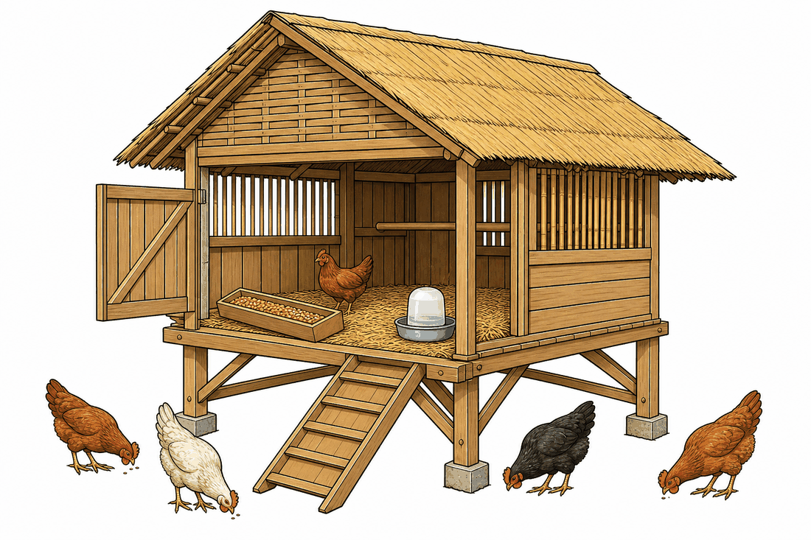


**<span style="color:#C00000">L'alimentation et l'habitat</span>**

**<span style="color:#1E7B34">1. Nourrir sans acheter</span>**

L'idée la plus répandue chez les petits éleveurs est qu'améliorer son élevage suppose d'acheter des aliments du commerce. C'est faux dans la plupart des cas. La FAO recense plusieurs ressources qui, **disponibles dans les champs malgaches**, remplacent une partie des aliments achetés :

| Ressource locale | Précaution d'emploi | Ce qu'elle apporte |
|---|---|---|
| **Manioc** | séché ou bouilli, jamais cru en grande quantité | énergie |
| **Patate douce** | bouillie ; jusqu'à environ un tiers de la ration | énergie |
| **Colocase** (*saonjo*) | cuite | énergie |
| **Feuilles d'amarante** (*anamamy*) et autres brèdes | fraîches, hachées | vitamines, minéraux |
| **Son de riz** | tel quel | énergie, fibres |
| **Graines oléagineuses** | concassées | matières grasses, protéines |
| **Termites, insectes, vers** | récoltés | protéines |

**<span style="color:#1E7B34">2. Les trois manières d'élever les volailles</span>**

| Système | Comment | Résultat |
|---|---|---|
| **En liberté totale** | les volailles cherchent tout leur repas et dorment dans les arbres | production faible, pertes élevées |
| **En basse-cour** | libres le jour, **enfermées la nuit**, grain matin et soir | **bon compromis, à la portée de toute famille** |
| **En claustration** | enfermées en permanence, nourriture entièrement fournie | production élevée, mais coûteuse |

Le système de **basse-cour** est celui que ces séances recommandent : il ne demande aucun achat important, seulement un abri et deux distributions de grain par jour.

**<span style="color:#1E7B34">3. Combien donner ?</span>**

En système de basse-cour, un complément d'environ **35 grammes de grain par poule et par jour** est un repère fiable, réparti **matin et soir**. Le matin, avant de lâcher les animaux ; le soir, pour les faire rentrer d'elles-mêmes — ce qui évite d'avoir à leur courir après.

Pour un petit troupeau, le calcul est immédiat :

| Nombre de poules | Par jour | Par semaine | Par mois (30 j) |
|---:|---:|---:|---:|
| 5 | 175 g | 1,225 kg | 5,25 kg |
| 10 | 350 g | 2,45 kg | 10,5 kg |
| 20 | 700 g | 4,9 kg | 21 kg |

**<span style="color:#1E7B34">4. L'habitat</span>**

Un bon abri se construit avec ce que l'on a : briques, bois, tôle, bambou. Cinq règles suffisent.

1. **Fermé la nuit, ouvert le jour.** La nuit protège ; le jour, les animaux doivent sortir gratter.
2. **Porte étroite.** Elle décourage les voleurs et empêche l'entrée des prédateurs.
3. **Sol sec et surélevé.** L'humidité du sol est la première cause de maladies respiratoires et de parasites.
4. **Aéré, mais sans courant d'air direct.** L'air doit se renouveler au-dessus des animaux, pas sur eux.
5. **Un espace séparé pour la mère poule et ses poussins.** Un simple panier suffit. Les poussins sont les plus fragiles du troupeau : les isoler les premières semaines réduit fortement la mortalité.

**<span style="color:#1E7B34">5. Le fumier n'est pas un déchet</span>**

Les déjections des volailles sont un **excellent engrais azoté**. L'élevage nourrit ainsi le champ, et le champ nourrit l'élevage : le manioc et les brèdes qui poussent grâce au fumier retournent dans la mangeoire. C'est le même cycle de la matière que celui étudié avec les plantes.

### Section EXERCICES

**Exercice 1 (4 points)** — Cite quatre ressources locales utilisables pour nourrir des volailles, et indique pour chacune si elle apporte surtout de l'**énergie** ou surtout des **protéines**.

**Exercice 2 (6 points)** — Complète avec : *surélevé, étroite, basse-cour, azoté, séparé, aéré*
1. Le système de …… laisse les volailles libres le jour et les enferme la nuit.
2. La porte du poulailler doit être …… contre les voleurs.
3. Le sol doit être sec et …… pour éviter l'humidité.
4. Le poulailler doit être …… pour renouveler l'air.
5. La mère poule et ses poussins sont placés dans un espace ……
6. Le fumier de volaille est un engrais ……

**Exercice 3 (6 points)** — Hanta élève **15 poules** en basse-cour. Elle donne le complément conseillé de **35 g de grain par poule et par jour**.
1. Quelle quantité de grain doit-elle prévoir chaque jour ?
2. Quelle quantité pour une semaine ? Exprime le résultat en kilogrammes.
3. Elle achète le grain par sacs de 25 kg. Combien de jours un sac dure-t-il ? (arrondis au jour entier inférieur)

**Exercice 4 (4 points)** — Choisis la bonne réponse.
1. Le manioc destiné aux volailles doit être : **A.** donné cru en grande quantité **B.** séché ou bouilli **C.** jeté
2. Le meilleur compromis pour une famille est le système : **A.** en liberté totale **B.** en basse-cour **C.** en claustration
3. Un sol de poulailler humide provoque surtout : **A.** des maladies et des parasites **B.** une meilleure ponte **C.** rien du tout
4. On donne le grain du soir pour : **A.** faire rentrer les poules d'elles-mêmes **B.** les empêcher de dormir **C.** remplacer l'eau

**TOTAL : 20 points**

### CORRIGÉ

**Ex. 1** — Exemples acceptés : **manioc** → énergie · **patate douce** → énergie · **son de riz** → énergie · **colocase** → énergie · **termites / insectes** → protéines · **graines oléagineuses** → protéines (et matières grasses) · **brèdes / amarante** → ni l'un ni l'autre principalement : vitamines et minéraux (réponse acceptée si l'élève le précise).

**Ex. 2** — 1. **basse-cour** · 2. **étroite** · 3. **surélevé** · 4. **aéré** · 5. **séparé** · 6. **azoté**

**Ex. 3** —
1. 15 × 35 = **525 g par jour**.
2. 525 × 7 = 3675 g = **3,675 kg par semaine**.
3. 25 kg = 25 000 g ; 25 000 ÷ 525 ≈ 47,6 → le sac dure **47 jours** (soit un peu plus d'un mois et demi).

**Ex. 4** — 1. **B** · 2. **B** · 3. **A** · 4. **A**


---


# SÉANCE 21 / 51 — Les soins : vaccination et déparasitage

**Objectif spécifique** : expliquer le rôle de la vaccination et du déparasitage dans un élevage et justifier qu'il faut vacciner avant l'apparition de la maladie.
**Support et matériel** : flacon de vaccin vide ou photographie, calendrier de l'année au tableau, cahier.

| Étapes | Enseignant | Apprenants | Technique | Support | Obs. |
|---|---|---|---|---|---|
| **I. RÉVISION** | Quel complément journalier conseille-t-on par poule ?<br>Citez deux règles de construction d'un bon poulailler. | R.A. : Environ 35 g de grain.<br>R.A. : Porte étroite, sol sec et surélevé. | Questionnement oral | — | |
| **II. NOUVELLE LEÇON** ||||||
| 1. Mise en situation | Dans un village, une maladie est arrivée. En une semaine, presque toutes les poules sont mortes. Un seul éleveur n'a rien perdu : il avait fait vacciner son troupeau **trois mois plus tôt**. Pourquoi les autres n'ont-ils pas pu vacciner au moment où la maladie est arrivée ? | R.A. : Les élèves émettent des hypothèses. | Questionnement oral | Tableau noir | |
| 2. Présentation | Aujourd'hui : « Les soins : vaccination et déparasitage ». Vous saurez expliquer comment agit un vaccin et pourquoi il faut vacciner à l'avance. | Les élèves écoutent. | Exposé | Tableau noir | |
| 3. Observation | Observez ce flacon : il contient **100 doses**. Une dose par animal. Lisez l'étiquette : voie d'administration, délai avant l'immunité, durée de protection. | Les élèves observent et relèvent les indications. | Observation dirigée | Flacon ou photo | |
| 4. Analyse | Le vaccin met **une à deux semaines** à protéger l'animal. Que se passe-t-il si on vaccine le jour où la maladie arrive au village ?<br>Pourquoi ne faut-il **jamais** vacciner un animal déjà malade ?<br>Le flacon contient 100 doses et ne se conserve pas une fois ouvert. Comment faire quand on n'a que 30 poules ?<br>Quelle différence entre vacciner et déparasiter ? | R.A. : C'est trop tard, l'animal n'est pas encore protégé.<br>R.A. : Le vaccin ne soigne pas, il prévient ; l'animal malade est déjà atteint.<br>R.A. : Se regrouper entre voisins et vacciner le même jour.<br>R.A. : Le vaccin protège d'une maladie ; le déparasitage enlève les vers. | Étude de document, questionnement | Flacon, tableau | |
| 5. Synthèse | **Donc,** un vaccin **prévient** une maladie, il ne la soigne pas. Il faut donc vacciner **avant** l'arrivée de la maladie, en tenant compte du délai d'une à deux semaines nécessaire à la protection. Le **déparasitage** élimine les vers qui affaiblissent l'animal et freinent sa croissance. Ces deux gestes coûtent peu et évitent des pertes considérables. | Les élèves recopient. | Exposé magistral | Tableau noir | |
| 6. Application | **Ex. 1** — Vrai ou Faux : 1. Un vaccin guérit un animal malade. 2. Le vaccin protège immédiatement. 3. On peut partager un flacon entre voisins le même jour. 4. Le déparasitage sert à éliminer les vers.<br><br>**Ex. 2** — Un vaccin protège pendant 4 mois. Combien de campagnes par an ? | **Ex. 1** : 1. **F** 2. **F** 3. **V** 4. **V**<br><br>**Ex. 2** : 12 ÷ 4 = **3 campagnes par an**. | Travail de groupe | Grande ardoise | |
| **III. ÉVALUATION** | **Ex. 1** — Explique en une phrase la différence entre prévenir et guérir.<br><br>**Ex. 2** — Pourquoi est-il inutile de vacciner un troupeau le jour où la maladie se déclare dans le village voisin ? | **Ex. 1** : Prévenir, c'est empêcher la maladie d'arriver ; guérir, c'est soigner un animal déjà atteint.<br><br>**Ex. 2** : Parce que la protection n'apparaît qu'au bout d'une à deux semaines : la maladie atteindra le troupeau avant que le vaccin n'ait agi. | Évaluation écrite | Cahier | |

### Page LEÇON

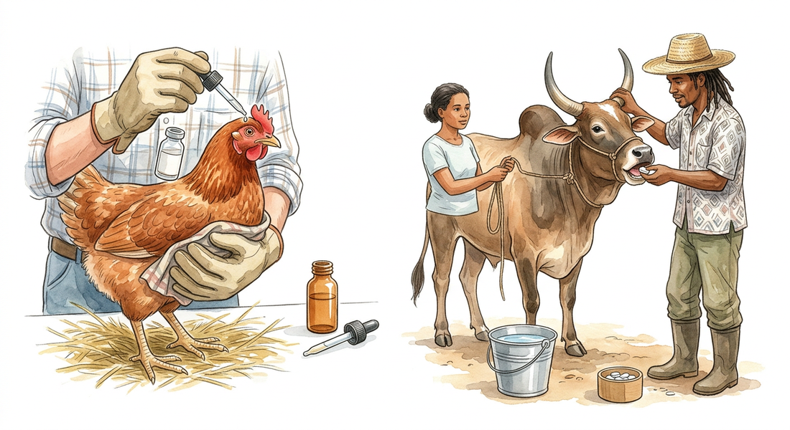


**<span style="color:#C00000">Les soins : vaccination et déparasitage</span>**

**<span style="color:#1E7B34">1. La maladie la plus redoutée des basses-cours</span>**

La **maladie de Newcastle**, appelée aussi **pseudo-peste aviaire**, est d'origine **virale** et extrêmement contagieuse. Elle provoque des troubles **respiratoires**, **digestifs** et **nerveux**, et sa mortalité peut atteindre **100 %** d'un troupeau. Dans les villages, les pertes sont particulièrement lourdes en saison sèche.

Il n'existe **aucun traitement** contre cette maladie une fois déclarée. La **vaccination est le seul moyen efficace** de s'en protéger. C'est précisément ce qui rend la prévention si importante : ici, ne pas prévenir signifie tout perdre.

**<span style="color:#1E7B34">2. Comment agit un vaccin</span>**

Un vaccin **n'est pas un médicament**. Il ne soigne pas l'animal malade : il **prépare ses défenses** à reconnaître la maladie avant qu'elle n'arrive. L'organisme met **une à deux semaines** à mettre en place cette protection.

Trois conséquences pratiques en découlent, et elles expliquent presque toutes les erreurs des éleveurs :

> **a)** Il faut vacciner **au moins un mois avant** la période où la maladie apparaît habituellement.
> **b)** On ne vaccine **jamais** un animal déjà malade, ni dans un village où la maladie sévit déjà.
> **c)** Vacciner le jour où la maladie arrive ne sert à rien : la protection arrivera trop tard.

> 🏠 **L'image de la FAO.** *Un vaccin, c'est comme le toit d'une case : il faut l'avoir fait avant que la pluie n'arrive.* On ne construit pas son toit pendant l'orage.

**<span style="color:#1E7B34">3. Organiser la vaccination</span>**

Le vaccin contre la maladie de Newcastle s'administre le plus souvent **en goutte dans l'œil** — une méthode simple, qui donne une bonne protection et se pratique sans matériel compliqué. La protection dure environ **quatre mois**, ce qui conduit à **trois campagnes par an**.

Les flacons contiennent en général **100 doses** et ne se conservent pas une fois ouverts. Un éleveur qui n'a que vingt ou trente poules ne doit donc pas renoncer : **les familles se regroupent et vaccinent le même jour**. Un flacon sert alors plusieurs basses-cours du même hameau, et le coût par animal devient négligeable.

⚠️ **La vaccination proprement dite relève de l'agent vétérinaire ou du technicien d'élevage formé.** Le rôle de l'éleveur — et l'objet de cette leçon — est de **savoir quand la demander et pourquoi ne pas attendre**.

**<span style="color:#1E7B34">4. Le déparasitage</span>**

Les **parasites internes** — les vers de l'intestin — ne tuent pas brutalement comme un virus. Ils agissent en silence : l'animal mange normalement mais ne profite pas de sa nourriture. Il reste maigre, grandit lentement, pond moins, et résiste mal aux autres maladies.

Le déparasitage des jeunes animaux est l'un des gestes dont l'effet est le plus visible pour le prix le plus faible. Il complète la vaccination : **le vaccin protège d'une maladie précise, le déparasitage remet l'animal en état de bien utiliser ce qu'il mange.**

**<span style="color:#1E7B34">5. Et les autres animaux ?</span>**

Le raisonnement vaut pour toutes les espèces. Chez le **zébu**, les jeunes veaux supportent mal la saison des pluies et sont très exposés aux parasites ; ils abordent la saison sèche affaiblis, au moment même où le pâturage devient pauvre. Là encore, prévenir — déparasiter les jeunes, prévoir du fourrage pour la saison sèche — vaut mieux que constater les pertes.

### Section EXERCICES

**Exercice 1 (4 points)** — Réponds par une phrase.
1. Quelle est l'origine de la maladie de Newcastle ?
2. Existe-t-il un traitement une fois la maladie déclarée ?
3. Combien de temps faut-il au vaccin pour protéger l'animal ?
4. Que fait le déparasitage ?

**Exercice 2 (6 points)** — Vrai ou Faux. Corrige les affirmations fausses.
1. Le vaccin soigne les animaux malades.
2. On peut vacciner dans un village où la maladie sévit déjà.
3. La protection du vaccin contre la maladie de Newcastle dure environ quatre mois.
4. Un flacon ouvert se conserve plusieurs semaines.
5. Les vers intestinaux font maigrir l'animal même s'il mange.
6. La vaccination coûte plus cher que la perte du troupeau.

**Exercice 3 (6 points)** — Trois familles d'un même hameau décident de vacciner ensemble : Rasoa a **30 poules**, Jean a **25 poules**, Voahangy a **45 poules**. Un flacon contient **100 doses** (une dose par poule) et doit être utilisé le jour même.
1. Combien de doses faut-il au total ? Combien de flacons doivent-ils acheter ?
2. La protection dure 4 mois. Combien de campagnes de vaccination devront-ils organiser dans l'année ?
3. Combien de flacons cela représente-t-il pour l'année entière, si le troupeau reste le même ?

**Exercice 4 (4 points)** — Choisis la bonne réponse.
1. La maladie de Newcastle est d'origine : **A.** bactérienne **B.** virale **C.** parasitaire
2. Un vaccin sert à : **A.** guérir **B.** prévenir **C.** nourrir
3. Il faut vacciner : **A.** le jour de l'épidémie **B.** au moins un mois avant **C.** après les premiers morts
4. Un animal parasité : **A.** mange et profite normalement **B.** mange mais reste maigre **C.** ne mange plus du tout

**TOTAL : 20 points**

### CORRIGÉ

**Ex. 1** — 1. Elle est d'origine **virale**. 2. **Non**, il n'existe aucun traitement ; seule la vaccination protège. 3. **Une à deux semaines.** 4. Il **élimine les vers intestinaux**, qui empêchent l'animal de profiter de sa nourriture.

**Ex. 2** — 1. **F** — le vaccin prévient, il ne soigne pas. 2. **F** — on ne vaccine jamais dans un village déjà atteint, ni un animal malade. 3. **V** 4. **F** — un flacon ouvert doit être utilisé le jour même. 5. **V** 6. **F** — la vaccination coûte très peu au regard de la perte possible de tout le troupeau.

**Ex. 3** —
1. 30 + 25 + 45 = **100 doses**, soit exactement **1 flacon**.
2. 12 ÷ 4 = **3 campagnes** par an.
3. 3 campagnes × 1 flacon = **3 flacons** pour l'année. *(On remarquera que le regroupement des trois familles permet d'utiliser le flacon entier sans rien gaspiller : seule, aucune des trois n'aurait rempli les 100 doses.)*

**Ex. 4** — 1. **B** · 2. **B** · 3. **B** · 4. **B**


---


# SÉANCE 22 / 51 — La sélection et l'amélioration de l'élevage

**Objectif spécifique** : associer différentes techniques d'amélioration aux espèces élevées dans la communauté et évaluer chiffrement leur effet.
**Support et matériel** : tableau des résultats d'essais à recopier, fiches d'enquête de la séance 19, cahier.

| Étapes | Enseignant | Apprenants | Technique | Support | Obs. |
|---|---|---|---|---|---|
| **I. RÉVISION** | Pourquoi faut-il vacciner avant l'arrivée de la maladie ?<br>Que fait le déparasitage ? | R.A. : Parce que la protection met une à deux semaines à s'installer.<br>R.A. : Il élimine les vers qui affaiblissent l'animal. | Questionnement oral | — | |
| **II. NOUVELLE LEÇON** ||||||
| 1. Mise en situation | À Madagascar, des essais ont été menés chez de petits éleveurs de volailles. Sans acheter de nouvelles races, la ponte est passée de **45 à 96 œufs** par poule et par an. Comment est-ce possible ? | R.A. : Les élèves proposent : meilleure nourriture, vaccination, soins. | Questionnement oral | Tableau noir | |
| 2. Présentation | Aujourd'hui : « La sélection et l'amélioration de l'élevage ». Vous saurez associer une technique d'amélioration à chaque espèce et mesurer son effet. | Les élèves écoutent. | Exposé | Tableau noir | |
| 3. Observation | Voici les résultats de ces essais menés auprès d'éleveurs malgaches. Trois mesures seulement ont été appliquées : vaccination contre la maladie de Newcastle, déparasitage des poussins, et mangeoire réservée aux poussins. Lisez le tableau. | Les élèves lisent et relèvent les chiffres. | Étude de document | Tableau des résultats | |
| 4. Analyse | De combien d'œufs la production a-t-elle augmenté par poule et par an ?<br>Et la survie des poussins ?<br>A-t-on changé de race d'animaux ?<br>Qu'est-ce que la sélection ? Sur quels critères choisit-on un reproducteur ?<br>Pourquoi ne pas faire reproduire un animal avec son propre descendant ? | R.A. : De 45 à 96, soit 51 œufs de plus.<br>R.A. : De 43 % à 87 %, soit le double environ.<br>R.A. : Non, ce sont les mêmes animaux.<br>R.A. : Choisir les meilleurs pour la reproduction : bonne ponte, bonne croissance, résistance.<br>R.A. : Les petits sont plus faibles et plus souvent malades. | Étude de document, travail de groupe | Tableau, cahier | |
| 5. Synthèse | **Donc,** on améliore un élevage de deux façons. Par les **techniques d'élevage** — nourriture, habitat, vaccination, déparasitage — qui agissent vite et sans changer d'animaux. Par la **sélection**, qui consiste à choisir comme reproducteurs les sujets les plus productifs et les plus résistants, et à éviter les accouplements entre proches parents ; son effet est plus lent mais durable. Les deux se complètent. | Les élèves recopient. | Exposé magistral | Tableau noir | |
| 6. Application | **Ex. 1** — Associe chaque espèce à une technique adaptée : poule · zébu · porc → *(vaccination Newcastle · fourrage de saison sèche · abri sec et propre)*<br><br>**Ex. 2** — Calcule le gain de ponte pour 10 poules passant de 45 à 96 œufs par an. | **Ex. 1** : poule → **vaccination Newcastle** · zébu → **fourrage de saison sèche** · porc → **abri sec et propre**<br><br>**Ex. 2** : (96 − 45) × 10 = 51 × 10 = **510 œufs de plus par an**. | Travail de groupe | Grande ardoise | |
| **III. ÉVALUATION** | **Ex. 1** — Cite deux critères de choix d'un bon reproducteur.<br><br>**Ex. 2** — Explique pourquoi les techniques d'élevage donnent des résultats plus rapides que la sélection. | **Ex. 1** : (deux parmi) bonne production (ponte, croissance, lait), bonne santé et résistance aux maladies, bon comportement maternel, absence de parenté proche avec les femelles du troupeau.<br><br>**Ex. 2** : Les techniques d'élevage agissent sur les animaux **déjà présents** et leur effet se voit en quelques semaines ; la sélection n'agit que sur les **générations suivantes**, il faut donc attendre que les descendants naissent et grandissent. | Évaluation écrite | Cahier | |

### 📊 Tableau des résultats à recopier au tableau

*Essais d'amélioration de l'aviculture villageoise conduits à Madagascar (méthode FAO/AIEA).*

| Indicateur | Avant | Après les 3 mesures |
|---|---:|---:|
| Œufs par poule et par an | **45** | **96** |
| Poussins survivants (sur 100 nés) | **43** | **87** |

*Les trois mesures appliquées : vaccination contre la maladie de Newcastle · déparasitage interne des poussins · mangeoire réservée aux poussins.*

### Page LEÇON


**<span style="color:#C00000">La sélection et l'amélioration de l'élevage</span>**

**<span style="color:#1E7B34">1. Deux façons d'améliorer un élevage</span>**

Améliorer un élevage, c'est obtenir **plus et mieux** avec les mêmes moyens. Deux voies existent, et il est essentiel de ne pas les confondre.

| | **Les techniques d'élevage** | **La sélection** |
|---|---|---|
| Sur quoi on agit | les animaux déjà présents | les générations suivantes |
| Moyens | alimentation, habitat, vaccination, déparasitage | choix des reproducteurs |
| Délai | quelques semaines | plusieurs années |
| Coût | faible | faible, mais demande de la rigueur |
| Effet | rapide, mais à entretenir | lent, mais durable |

**<span style="color:#1E7B34">2. Ce que montrent les essais malgaches</span>**

Des essais conduits auprès de petits éleveurs malgaches ont appliqué **trois mesures seulement** : la vaccination contre la maladie de Newcastle, le déparasitage interne des poussins, et une mangeoire réservée aux poussins pour qu'ils mangent sans être bousculés par les adultes.

Les résultats obtenus **sans changer de race** :

- la ponte est passée d'environ **45 à 96 œufs** par poule et par an — elle a plus que doublé ;
- la survie des poussins est passée de **43 % à 87 %** — sur 100 poussins nés, 44 de plus atteignent l'âge adulte.

Ce résultat est l'argument central de toute l'unité : **ce ne sont pas les animaux qui manquaient, c'étaient les soins.**

**<span style="color:#1E7B34">3. La sélection</span>**

Sélectionner, c'est **choisir les animaux qui donneront la génération suivante**. On garde comme reproducteurs les sujets :

- les plus **productifs** — la poule qui pond le plus, la vache qui donne le plus de lait, le porcelet qui grandit le plus vite ;
- les plus **résistants** — ceux qui ont traversé les saisons difficiles sans tomber malades ;
- les **meilleures mères** — chez les volailles, la poule qui couve bien et protège ses poussins.

Deux règles accompagnent ce choix :

> **a)** On **élimine de la reproduction** les animaux chétifs ou souvent malades, même s'ils sont beaux.
> **b)** On **évite les accouplements entre proches parents**. Les descendants issus de parents apparentés sont plus faibles et plus souvent malades. Échanger un coq avec un hameau voisin est la solution la plus simple et ne coûte rien.

**<span style="color:#1E7B34">4. À chaque espèce sa technique prioritaire</span>**

| Espèce | Point faible habituel | Technique qui change le plus de choses |
|---|---|---|
| **Poule** | mortalité par maladie de Newcastle, mortalité des poussins | **vaccination** + protection des poussins |
| **Zébu** | sous-alimentation en saison sèche | **fourrage de réserve** pour la saison sèche |
| **Porc** | maladies liées à l'humidité et à la saleté | **abri sec, propre, bien drainé** |
| **Chèvre, mouton** | parasites internes | **déparasitage** régulier |

Le cas du **zébu** mérite d'être détaillé, car il illustre parfaitement la leçon. L'animal traditionnel vit toute l'année au pâturage sans complément. En saison sèche, l'herbe se dessèche et s'appauvrit : les animaux perdent du poids, parfois un quart de leur masse. Or il a été constaté que **distribuer une simple ration de fourrage pendant la saison sèche** permet d'atteindre le poids d'abattage **en trois ans de moins** qu'avec la conduite habituelle. Aucune race nouvelle, aucun matériel : uniquement du fourrage mis de côté au bon moment.

**<span style="color:#1E7B34">5. La règle à retenir</span>**

> **On améliore d'abord la conduite de l'élevage, ensuite les animaux.**

Changer de race avant d'avoir réglé la nourriture et les soins conduit presque toujours à l'échec : un animal plus exigeant, mal nourri et non vacciné, produit moins bien que l'animal local qu'il remplace. L'ordre des étapes n'est pas indifférent — c'est lui qui fait la différence entre un élevage qui progresse et un investissement perdu.

### Section EXERCICES

**Exercice 1 (4 points)** — Associe chaque espèce à la technique d'amélioration la plus utile, et justifie en quelques mots.
**Espèces** : poule · zébu · porc · chèvre
**Techniques** : déparasitage régulier · abri sec et propre · vaccination contre Newcastle · fourrage de saison sèche

**Exercice 2 (6 points)** — Complète avec : *reproducteurs, parents, conduite, générations, résistants, chétifs*
1. La sélection agit sur les …… suivantes.
2. On choisit comme …… les animaux les plus productifs.
3. On garde aussi les animaux les plus ……
4. On écarte de la reproduction les sujets ……
5. Il faut éviter les accouplements entre proches ……
6. On améliore d'abord la …… de l'élevage, ensuite les animaux.

**Exercice 3 (6 points)** — Dans les essais menés à Madagascar, la ponte est passée de **45 à 96 œufs** par poule et par an, et la survie des poussins de **43 %** à **87 %**.
1. Quel est le gain de ponte par poule et par an ?
2. Un éleveur possède **20 poules**. Combien d'œufs supplémentaires obtient-il sur une année ?
3. Sur **50 poussins** nés, combien survivaient avant l'amélioration ? Combien survivent après ? (arrondis au poussin entier)

**Exercice 4 (4 points)** — Choisis la bonne réponse.
1. Les essais malgaches ont obtenu ces résultats : **A.** en important une nouvelle race **B.** sans changer de race **C.** en réduisant le troupeau
2. La sélection consiste à : **A.** vendre les animaux malades **B.** choisir les reproducteurs **C.** acheter de la provende
3. Accoupler des animaux proches parents donne des descendants : **A.** plus forts **B.** plus faibles et plus souvent malades **C.** identiques
4. Pour le zébu, la mesure la plus efficace est : **A.** un abri fermé **B.** du fourrage en saison sèche **C.** un changement de race

**TOTAL : 20 points**

### CORRIGÉ

**Ex. 1** — poule → **vaccination contre Newcastle** (maladie très contagieuse, mortalité pouvant atteindre 100 %) · zébu → **fourrage de saison sèche** (c'est la période où l'animal perd du poids) · porc → **abri sec et propre** (l'humidité et la saleté sont ses principales sources de maladie) · chèvre → **déparasitage régulier** (les parasites internes freinent sa croissance).

**Ex. 2** — 1. **générations** · 2. **reproducteurs** · 3. **résistants** · 4. **chétifs** · 5. **parents** · 6. **conduite**

**Ex. 3** —
1. 96 − 45 = **51 œufs de plus** par poule et par an.
2. 51 × 20 = **1 020 œufs supplémentaires** par an. *(Vérification : avant 20 × 45 = 900 œufs ; après 20 × 96 = 1 920 œufs ; différence 1 020.)*
3. Avant : 50 × 43 / 100 = 21,5 → environ **21 poussins**. Après : 50 × 87 / 100 = 43,5 → environ **43 poussins**. Soit **22 poussins sauvés** sur 50.

**Ex. 4** — 1. **B** · 2. **B** · 3. **B** · 4. **B**


---


# SÉANCE 23 / 51 — Révision de l'Unité II : sujet d'entraînement

**Thème** : Agriculture et élevage · **Valeurs à véhiculer** : respect de toute vie, excellence
**Objectif spécifique** : traiter un sujet complet portant sur les séances 13 à 22, puis identifier ses propres erreurs à l'aide du corrigé commenté.
**Support et matériel** : sujet recopié au tableau ou polycopié, cahier de brouillon.

| Étapes | Enseignant | Apprenants | Technique | Support | Obs. |
|---|---|---|---|---|---|
| **I. RÉVISION** | Sans ouvrir votre cahier : par où une plante absorbe-t-elle l'eau ? Citez une maladie qui décime les volailles. | R.A. : Par les poils absorbants des racines.<br>R.A. : La maladie de Newcastle. | Questionnement oral | — | |
| **II. NOUVELLE LEÇON** ||||||
| 1. Mise en situation | Un sujet d'entraînement, dans les conditions de l'examen. Il ne compte pas dans la moyenne : il sert à repérer ce qui n'est pas acquis. | Les élèves s'installent. | Consigne | Tableau noir | |
| 2. Présentation | Quatre exercices, 20 points. Cahiers fermés, travail individuel. | Les élèves écoutent. | Exposé | Tableau noir | |
| 3. Passation | L'enseignant distribue le sujet et surveille sans intervenir sur le fond. | Les élèves traitent le sujet. | Travail individuel | Sujet, cahier | |
| 4. Correction collective | Exercice par exercice : interroger, faire justifier, donner la réponse, **nommer l'erreur fréquente**. | Les élèves corrigent au stylo de couleur. | Correction dirigée | Tableau noir | |
| 5. Synthèse | **Donc,** les points faibles sont relevés au tableau. Chacun note les deux notions à retravailler avant la séance 24. | Les élèves notent. | Bilan collectif | Cahier | |
| **III. ÉVALUATION** | Chaque élève reporte son score sur 20 et le situe dans les repères. | Les élèves calculent leur score. | Auto-évaluation | Cahier | |

---

## Sujet d'entraînement — Unité II (Agriculture et élevage) — **/20**

### Exercice 1 — Connaissances *(4 points)*

**A. Remets dans l'ordre les cinq étapes de préparation d'un purin de feuilles** *(2 points)*

> pulvériser · récolter et écraser les feuilles · diluer · filtrer · laisser macérer

**B. Vrai ou faux — justifie en une phrase** *(2 points)*

1. Les fruits du voandelaka peuvent se manger sans danger.
2. Un poulailler au sol humide favorise les maladies.

### Exercice 2 — Exercice chiffré *(6 points)*

Un éleveur possède **15 poules**. Chaque poule consomme **35 g de grain par jour**.

1. Quelle quantité de grain consomme le troupeau par jour ? *(1,5 pt)*
2. Et en une semaine ? Exprime le résultat en kilogrammes. *(1,5 pt)*
3. L'éleveur achète le grain en sacs de **25 kg**. Combien de jours entiers un sac dure-t-il ? *(1,5 pt)*
4. Il veut passer à 20 poules. Quelle sera la consommation hebdomadaire, en kilogrammes ? *(1,5 pt)*

### Exercice 3 — Étude de document *(6 points)*

Deux élevages de volailles sont suivis pendant un an. L'élevage B applique la vaccination et le déparasitage, l'élevage A non.

| | Élevage A | Élevage B |
|---|---|---|
| Nombre de poules | 40 | 40 |
| Œufs par poule et par an | 45 | 96 |
| Poussins nés | 200 | 200 |
| Poussins survivants | 86 | 174 |

1. Calcule la production totale d'œufs de chaque élevage. *(2 pts)*
2. Calcule le taux de survie des poussins dans chaque élevage. *(2 pts)*
3. Quelle pratique explique l'écart ? Justifie en t'appuyant sur les deux indicateurs. *(2 pts)*

### Exercice 4 — Situation *(4 points)*

Un agriculteur voisin vous dit : « Les produits chimiques, c'est plus rapide. J'en mets le double de ce qui est écrit sur l'emballage, comme ça les insectes meurent plus vite. »

Réponds-lui en deux arguments.

---

## Corrigé commenté — séance 23

### Exercice 1 *(4 pts)*

**A.** *(2 pts — 0,4 pt par étape bien placée)*

> récolter et écraser les feuilles → laisser macérer → filtrer → diluer → pulvériser

**B.** *(1 pt par item)*

1. **Faux.** Les fruits du voandelaka (*Melia azedarach*) sont **toxiques** et ne doivent jamais être consommés. La plante sert à préparer un purin insecticide, pas un aliment.
2. **Vrai.** L'humidité du sol favorise le développement des parasites et des microbes ; une litière sèche est une des premières mesures d'hygiène de l'élevage.

> ⚠️ **Erreur fréquente.** Confondre « naturel » et « inoffensif ». Un purin végétal est peu coûteux et se dégrade vite, mais il reste un produit actif, à manipuler avec précaution.

### Exercice 2 *(6 pts)*

1. 15 × 35 = **525 g par jour** *(1,5 pt)*
2. 525 × 7 = 3 675 g = **3,675 kg par semaine** *(1,5 pt)*
3. 25 kg = 25 000 g ; 25 000 ÷ 525 ≈ 47,6 → le sac dure **47 jours entiers** *(1,5 pt)*
4. 20 × 35 = 700 g/jour ; 700 × 7 = 4 900 g = **4,9 kg par semaine** *(1,5 pt)*

> ⚠️ **Erreur fréquente.** Oublier la conversion g → kg, ou arrondir 47,6 à 48 alors que la question demande des **jours entiers** : au 48ᵉ jour, le sac est déjà vide.

### Exercice 3 *(6 pts)*

1. Élevage A : 40 × 45 = **1 800 œufs** · Élevage B : 40 × 96 = **3 840 œufs** *(1 pt chacun)*
2. Élevage A : 86 ÷ 200 = 0,43 = **43 %** · Élevage B : 174 ÷ 200 = 0,87 = **87 %** *(1 pt chacun)*
3. La différence tient à la **vaccination et au déparasitage**. Sur les deux indicateurs, l'écart est considérable : l'élevage B produit **2 040 œufs de plus** et sauve **88 poussins de plus**. Des animaux protégés des maladies et débarrassés de leurs parasites utilisent leur nourriture pour produire et pour grandir, au lieu de lutter contre l'infection. *(2 pts)*

> ⚠️ **Erreur fréquente.** Répondre « parce que l'élevage B est mieux tenu » sans citer les chiffres. Un raisonnement scientifique **s'appuie sur les données du document**.

### Exercice 4 *(4 pts)*

*(2 pts par argument)*

- **Argument 1 — le surdosage est dangereux et inutile.** La dose portée sur l'emballage est celle qui tue le ravageur. Au-delà, on n'améliore pas l'efficacité : on augmente les **résidus** sur les récoltes, le risque pour celui qui pulvérise, et la pollution du sol et de l'eau.
- **Argument 2 — le surdosage accélère les résistances.** Un traitement excessif et répété sélectionne les individus les plus résistants ; au bout de quelques saisons, le produit ne fait plus effet et il faut en changer. La lutte raisonnée — seuil d'intervention, alternance, méthodes naturelles en complément — protège l'efficacité du produit dans la durée.

**Repères de score** : 16-20 acquis · 11-15 à consolider · 6-10 fragile · 0-5 reprendre les séances 13 à 22.


---


# SÉANCE 24 / 51 — Examen de l'Unité II : Agriculture et élevage

**Thème** : Agriculture et élevage · **Valeurs à véhiculer** : respect de toute vie, excellence
**Objectif spécifique** : évaluer la maîtrise des notions des séances 13 à 22 — nutrition des plantes, protection des cultures, besoins et soins des animaux d'élevage.
**Support et matériel** : sujet polycopié ou recopié au tableau, cahier de composition.

| Étapes | Enseignant | Apprenants | Technique | Support | Obs. |
|---|---|---|---|---|---|
| **I. RÉVISION** | Rappel des consignes d'examen. Aucune question de fond pendant l'épreuve. | Les élèves rangent cahiers et livres. | Consigne | — | |
| **II. NOUVELLE LEÇON** ||||||
| 1. Mise en situation | L'enseignant écrit le barème au tableau : 4 + 6 + 6 + 4 = 20. | Les élèves notent le barème. | Consigne | Tableau noir | |
| 2. Présentation | Lecture à voix haute du sujet, sans commentaire. | Les élèves suivent. | Lecture dirigée | Sujet | |
| 3. Passation | Surveillance active, sans reformulation de fond. | Les élèves composent individuellement. | Évaluation écrite | Sujet, cahier | |
| 4. Ramassage | Ramassage des copies, vérification des noms. | Les élèves rendent leur copie. | Organisation | Copies | |
| 5. Synthèse | **Donc,** la correction sera rendue à la séance suivante. | Les élèves écoutent. | Bilan | — | |
| **III. ÉVALUATION** | *(L'épreuve elle-même constitue l'évaluation.)* | | Évaluation écrite | Copies | |

---

## SUJET D'EXAMEN — Unité II : Agriculture et élevage — **Durée : ____________ — /20**

### Exercice 1 — Connaissances *(4 points)*

**A. Schéma à légender** *(2 points)*

Reproduis l'extrémité de racine ci-dessous et place les quatre légendes suivantes :

> zone des poils absorbants · coiffe · zone de croissance · vaisseaux conducteurs


*Schéma à reproduire au tableau ou à photocopier. Les légendes ne figurent pas sur le dessin : c'est à l'élève de les placer.*

**B. QCM — une seule réponse exacte** *(2 points)*

1. L'eau pénètre dans la plante principalement par : **A.** les feuilles · **B.** les poils absorbants · **C.** la tige
2. Les sels minéraux sont puisés : **A.** dans l'air · **B.** dans le sol · **C.** dans la lumière
3. Le déparasitage vise à éliminer : **A.** les virus · **B.** les vers et parasites · **C.** les mauvaises herbes
4. Un vaccin protège l'animal : **A.** avant l'infection · **B.** après l'infection · **C.** pendant toute maladie

### Exercice 2 — Exercice chiffré *(6 points)*

Une éleveuse veut vacciner ses volailles contre la maladie de Newcastle. Un flacon contient **100 doses** ; une dose par animal. Le rappel se fait **tous les 4 mois**.

Elle possède **60 volailles**.

1. Combien de doses utilise-t-elle à chaque vaccination ? *(1 pt)*
2. Combien de vaccinations réalise-t-elle en un an ? *(1,5 pt)*
3. Combien de doses cela représente-t-il sur l'année ? *(1,5 pt)*
4. Combien de flacons doit-elle prévoir pour l'année ? Justifie l'arrondi. *(2 pts)*

### Exercice 3 — Étude de document *(6 points)*

Un troupeau de zébus est suivi pendant une saison sèche. Le lot 2 reçoit un complément de paille traitée à l'urée.

| | Lot 1 (sans complément) | Lot 2 (avec complément) |
|---|---|---|
| Nombre de zébus | 25 | 25 |
| Poids moyen en début de saison sèche | 320 kg | 320 kg |
| Poids moyen en fin de saison sèche | 248 kg | 336 kg |

1. Calcule la variation de poids moyen de chaque lot. *(2 pts)*
2. Exprime la perte du lot 1 en pourcentage du poids initial. *(2 pts)*
3. Que montre cette comparaison sur l'alimentation en saison sèche ? *(2 pts)*

### Exercice 4 — Situation *(4 points)*

Dans un village, les cultures de riz sont attaquées par des insectes. Le comité de village hésite entre deux solutions : pulvériser immédiatement un insecticide chimique sur toute la surface, ou commencer par des méthodes naturelles.

Rédige un court avis argumenté (5 à 8 lignes) proposant une démarche raisonnée.

---

## CORRIGÉ ET BARÈME — séance 24

### Exercice 1 *(4 pts)*

**A.** *(0,5 pt par légende correctement placée)* — De l'extrémité vers la tige, soit **de bas en haut sur le schéma** :

| Position sur le dessin | Légende attendue | Rôle |
|---|---|---|
| Petit capuchon brun, tout en bas | **coiffe** | protège la pointe qui progresse dans le sol |
| Zone lisse et verdâtre, sans filaments | **zone de croissance** | c'est là que la racine s'allonge |
| Zone couverte de fins filaments | **zone des poils absorbants** | c'est par là qu'entrent l'eau et les sels minéraux |
| Partie large, en haut, à stries internes | **vaisseaux conducteurs** | acheminent la sève vers la tige et les feuilles |

> **Consigne au correcteur.** Le sens de lecture est le point délicat : beaucoup d'élèves placent la coiffe en haut. Accepter une légende juste même si l'orthographe est approximative, mais pas une inversion coiffe / vaisseaux, qui traduit une incompréhension du trajet de l'eau.

**B.** *(0,5 pt par item)*
1. **B** · 2. **B** · 3. **B** · 4. **A**

*Renvoi : séances 13, 14, 21.*

### Exercice 2 *(6 pts)*

1. **60 doses** (une par animal) *(1 pt)*
2. 12 ÷ 4 = **3 vaccinations par an** *(1,5 pt)*
3. 60 × 3 = **180 doses** *(1,5 pt)*
4. 180 ÷ 100 = 1,8 → il faut **2 flacons**. On arrondit **à l'entier supérieur** : un flacon et huit dixièmes ne s'achètent pas, et il vaut mieux un reliquat que des animaux non vaccinés. *(2 pts — 1 pt pour le résultat, 1 pt pour la justification de l'arrondi)*

> **Consigne au correcteur.** À la question 4, la réponse « 1,8 flacon » sans arrondi vaut **1 pt**. La justification de l'arrondi vers le haut est le cœur de la question.

*Renvoi : séance 21.*

### Exercice 3 *(6 pts)*

1. Lot 1 : 248 − 320 = **−72 kg** (perte) · Lot 2 : 336 − 320 = **+16 kg** (gain) *(1 pt chacun)*
2. 72 ÷ 320 = 0,225 = **22,5 %** du poids initial perdu *(2 pts)*
3. En saison sèche, le fourrage naturel se raréfie et perd sa valeur nutritive : sans complément, les animaux **puisent dans leurs réserves** et maigrissent fortement. Le complément inverse la tendance — le lot 2 gagne du poids au lieu d'en perdre — ce qui représente un écart de **88 kg** entre les deux lots en fin de saison. L'alimentation de soudure n'est donc pas un luxe : elle conditionne la survie et la valeur du troupeau. *(2 pts)*

*Renvoi : séances 19, 20.*

### Exercice 4 *(4 pts)*

*(Barème : 1 pt par élément présent, dans la limite de 4 pts)*

L'avis attendu comporte :

- **Observer et identifier avant de traiter** — reconnaître le ravageur et estimer l'ampleur de l'attaque ; un insecte présent n'est pas forcément nuisible en nombre suffisant pour justifier un traitement.
- **Commencer par les méthodes naturelles** — purin de feuilles, rotation des cultures, élimination des plants atteints, maintien des prédateurs naturels : coût faible, pas de résidus.
- **Réserver le produit chimique aux attaques importantes**, en traitant **la zone atteinte** plutôt que toute la surface, à la dose indiquée et au bon moment.
- **Respecter les précautions** — protection de celui qui pulvérise, délai avant récolte, éloignement des points d'eau et des habitations.

> **Consigne au correcteur.** Valoriser toute copie qui propose une **démarche par étapes** plutôt qu'un choix tranché entre les deux options. Le programme vise l'usage **responsable**, non le rejet, des produits phytosanitaires.

*Renvoi : séances 16, 17, 18.*

**TOTAL : 20 points**


---


# SÉANCE 25 / 51 — L'organisation du système nerveux

**Objectif spécifique** : distinguer le système nerveux central du système nerveux périphérique et nommer leurs constituants.
**Support et matériel** : schéma du système nerveux au tableau, silhouette humaine dessinée sur papier kraft.

| Étapes | Enseignant | Apprenants | Technique | Support | Obs. |
|---|---|---|---|---|---|
| **I. RÉVISION** | Quand vous touchez un objet très chaud, que fait votre main ?<br>Qui a commandé ce mouvement ? | R.A. : Elle se retire tout de suite.<br>R.A. : Le cerveau, ou quelque chose dans le corps. | Questionnement oral | — | |
| **II. NOUVELLE LEÇON** ||||||
| 1. Mise en situation | Vous marchez pieds nus et vous posez le pied sur une épine. Votre pied se relève avant même que vous ayez eu le temps d'y penser. Pourtant, l'épine est loin de la tête. Comment l'information a-t-elle voyagé aussi vite ? | R.A. : Il y a quelque chose qui transporte le message dans le corps. | Questionnement oral | Tableau noir | |
| 2. Présentation | Aujourd'hui : « L'organisation du système nerveux ». Vous saurez nommer les deux grandes parties du système nerveux et ce qui les compose. | Les élèves écoutent. | Exposé | Tableau noir | |
| 3. Observation | Observez ce schéma. Repérez la partie enfermée dans le crâne, celle qui descend le long du dos, et les fils blanchâtres qui partent vers les bras, les jambes, la peau. | Les élèves observent et repèrent. | Observation dirigée | Schéma, silhouette | |
| 4. Analyse | Que protège la boîte crânienne ?<br>Que protège la colonne vertébrale ?<br>Où mènent les fils blanchâtres ?<br>Pourquoi ces deux organes sont-ils les seuls du corps protégés par des os aussi épais ?<br>Si l'on coupait un de ces fils, que se passerait-il pour la partie du corps qu'il dessert ? | R.A. : L'encéphale, dont le cerveau.<br>R.A. : La moelle épinière.<br>R.A. : Vers tous les organes et toute la peau.<br>R.A. : Parce qu'ils sont fragiles et très importants.<br>R.A. : Elle ne recevrait plus de message, on ne la sentirait plus. | Étude de document, travail de groupe | Schéma | |
| 5. Synthèse | **Donc,** le système nerveux comprend deux ensembles. Le **système nerveux central** réunit l'**encéphale**, logé dans le crâne, et la **moelle épinière**, protégée par la colonne vertébrale. Le **système nerveux périphérique** est formé des **nerfs** et des **ganglions** qui relient ce centre à toutes les régions du corps. | Les élèves recopient le schéma. | Exposé magistral | Tableau noir | |
| 6. Application | **Ex. 1** — Classe en central ou périphérique : a) la moelle épinière · b) un nerf du bras · c) l'encéphale · d) un ganglion<br><br>**Ex. 2** — Vrai ou Faux : 1. Le cerveau fait partie du système nerveux périphérique. 2. La moelle épinière est protégée par les vertèbres. 3. Les nerfs ne transportent les messages que dans un sens. 4. L'encéphale est logé dans le crâne. | **Ex. 1** : a) **central** b) **périphérique** c) **central** d) **périphérique**<br><br>**Ex. 2** : 1. **F** — il appartient au système **central**. 2. **V** 3. **F** — les messages circulent **dans les deux sens**. 4. **V** | Travail de groupe | Grande ardoise | |
| **III. ÉVALUATION** | **Ex. 1** — Complète : a) Le système nerveux central comprend …… et ……. b) Le système nerveux périphérique est formé de …… et de …….<br><br>**Ex. 2** — Explique pourquoi une blessure de la colonne vertébrale peut entraîner la paralysie des jambes. | **Ex. 1** : a) **l'encéphale**, **la moelle épinière** b) **nerfs**, **ganglions**<br><br>**Ex. 2** : La colonne vertébrale abrite la **moelle épinière**. Si elle est atteinte, les messages ne passent plus entre l'encéphale et les nerfs des jambes : les ordres n'arrivent plus aux muscles et les sensations ne remontent plus. | Évaluation écrite | Cahier | |

### Page LEÇON

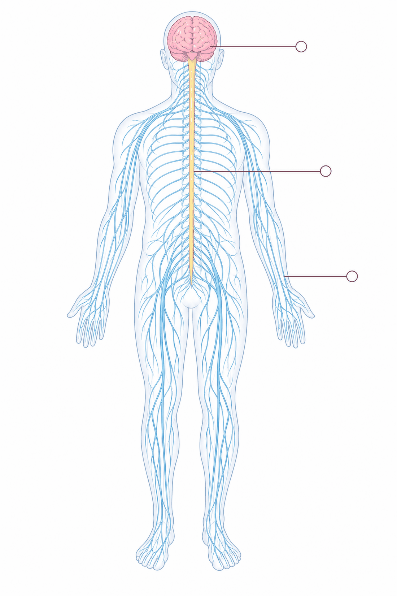


**<span style="color:#C00000">L'organisation du système nerveux</span>**

**<span style="color:#1E7B34">1. À quoi sert le système nerveux ?</span>**

Le corps humain est fait d'organes très différents qui doivent travailler ensemble. Quand vous marchez, vos yeux surveillent le sol, vos muscles se contractent dans le bon ordre, votre cœur accélère. Rien de tout cela ne fonctionnerait si ces organes ne pouvaient pas communiquer.

Le **système nerveux** est le réseau qui assure cette communication. Il recueille les informations venues du corps et du milieu extérieur, les traite, puis envoie des ordres aux organes. Il travaille en permanence, y compris pendant le sommeil.

**<span style="color:#1E7B34">2. Deux grands ensembles</span>**

**a. Le système nerveux central**

Il est constitué de deux organes, et l'un comme l'autre est enfermé dans un étui osseux, ce qui témoigne de leur importance et de leur fragilité.

- L'**encéphale** occupe la boîte crânienne. Il comprend le **cerveau**, le **cervelet** et le **tronc cérébral**.
- La **moelle épinière** prolonge l'encéphale vers le bas. C'est un long cordon nerveux qui descend dans le canal formé par l'empilement des **vertèbres**.

**b. Le système nerveux périphérique**

Il regroupe tout ce qui se trouve en dehors des deux organes précédents : les **nerfs**, longs cordons blanchâtres qui rayonnent dans tout le corps, et les **ganglions**, petits renflements situés sur leur trajet.

Les nerfs relient le système central à la peau, aux muscles, aux organes des sens et aux viscères. Ils fonctionnent **dans les deux sens** : certains font remonter les informations vers le centre, d'autres redescendent les ordres vers les organes.

**<span style="color:#1E7B34">3. Deux modes de commande</span>**

Le système nerveux périphérique se partage lui-même en deux domaines :

| Domaine | Ce qu'il commande | Exemples |
|---|---|---|
| **Somatique** | les mouvements que nous décidons | marcher, écrire, parler |
| **Autonome** | les fonctions que le corps règle seul | battements du cœur, digestion, respiration |

C'est grâce au domaine autonome que votre cœur continue de battre et que votre digestion se poursuit sans que vous ayez à y penser — y compris quand vous dormez.

**<span style="color:#1E7B34">4. La cellule nerveuse</span>**

Le système nerveux est bâti à partir d'un type de cellule particulier : le **neurone**. Un neurone possède un corps cellulaire et de longs prolongements, ce qui lui permet de transmettre un message d'un point à un autre du corps. Un nerf n'est rien d'autre qu'un faisceau de très nombreux prolongements de neurones réunis en câble.

Le message qui circule le long d'un neurone porte le nom d'**influx nerveux**. Il se déplace très vite — c'est pourquoi votre pied se relève presque instantanément quand vous marchez sur une épine.

**<span style="color:#1E7B34">5. Un système fragile</span>**

Les cellules nerveuses se renouvellent très mal. Une lésion du système nerveux laisse souvent des séquelles définitives : c'est ce qui rend si graves les traumatismes crâniens et les atteintes de la colonne vertébrale. D'où l'importance du casque à moto et des précautions lors des chutes.

### Section EXERCICES

**Exercice 1 (4 points)** — Indique, pour chaque élément, s'il appartient au système nerveux **central** ou **périphérique**.
1. Le cervelet
2. Un nerf de la jambe
3. La moelle épinière
4. Un ganglion nerveux

**Exercice 2 (6 points)** — Complète avec : *vertèbres, neurone, influx nerveux, encéphale, autonome, ganglions*
1. L'…… est protégé par la boîte crânienne.
2. La moelle épinière est protégée par les …….
3. La cellule du système nerveux s'appelle le …….
4. Le message qui circule dans un nerf est l'…….
5. Les nerfs et les …… forment le système périphérique.
6. Le système nerveux …… commande la digestion.

**Exercice 3 (6 points)** — Après une chute, un blessé ne sent plus ses jambes et ne peut plus les bouger, mais son cœur bat normalement et il respire sans difficulté.
1. Quelle partie du système nerveux a probablement été touchée ?
2. Pourquoi les jambes sont-elles à la fois insensibles et immobiles ?
3. Pourquoi le cœur continue-t-il de battre malgré cette atteinte ?

**Exercice 4 (4 points)** — Choisis la bonne réponse.
1. L'encéphale comprend : **A.** cerveau, cervelet, tronc cérébral **B.** cerveau seulement **C.** cerveau et nerfs
2. Les nerfs transportent les messages : **A.** dans un seul sens **B.** dans les deux sens **C.** jamais
3. La respiration est commandée par le système : **A.** somatique **B.** autonome **C.** osseux
4. Un nerf est : **A.** un os creux **B.** un faisceau de prolongements de neurones **C.** un vaisseau sanguin

**TOTAL : 20 points**

### CORRIGÉ

**Ex. 1** — 1. **central** · 2. **périphérique** · 3. **central** · 4. **périphérique**

**Ex. 2** — 1. **encéphale** · 2. **vertèbres** · 3. **neurone** · 4. **influx nerveux** · 5. **ganglions** · 6. **autonome**

**Ex. 3** — 1. La **moelle épinière**, au niveau de la colonne vertébrale. 2. Parce que la moelle conduit les messages **dans les deux sens** : les sensations ne remontent plus vers l'encéphale, et les ordres de mouvement ne descendent plus jusqu'aux muscles. 3. Le cœur est commandé par le système nerveux **autonome**, dont les commandes partent du tronc cérébral et empruntent d'autres voies que celles atteintes par la lésion.

**Ex. 4** — 1. **A** · 2. **B** · 3. **B** · 4. **B**


---


# SÉANCE 26 / 51 — Les rôles des différentes parties

**Objectif spécifique** : attribuer à chaque partie du système nerveux la fonction qu'elle assure.
**Support et matériel** : schéma de l'encéphale, tableau de correspondance à compléter.

| Étapes | Enseignant | Apprenants | Technique | Support | Obs. |
|---|---|---|---|---|---|
| **I. RÉVISION** | Cite les deux parties du système nerveux central.<br>De quoi est fait le système périphérique ? | R.A. : L'encéphale et la moelle épinière.<br>R.A. : Des nerfs et des ganglions. | Questionnement oral | — | |
| **II. NOUVELLE LEÇON** ||||||
| 1. Mise en situation | Un élève récite une leçon apprise hier : il se souvient. Un autre marche sur une poutre étroite sans tomber : il garde l'équilibre. Un troisième dort : il respire quand même. Est-ce la même partie du système nerveux qui agit dans les trois cas ? | R.A. : Sans doute pas, ce sont des choses très différentes. | Questionnement oral | Tableau noir | |
| 2. Présentation | Aujourd'hui : « Les rôles des différentes parties ». Vous saurez dire ce que fait chaque partie du système nerveux. | Les élèves écoutent. | Exposé | Tableau noir | |
| 3. Observation | Observez le schéma de l'encéphale. Repérez la grande masse plissée en haut, la petite masse striée en arrière et en bas, et la tige qui se prolonge vers la moelle épinière. | Les élèves observent et nomment. | Observation dirigée | Schéma de l'encéphale | |
| 4. Analyse | Un boxeur reçoit un coup à l'arrière de la tête et titube sans pouvoir marcher droit : quelle partie a été ébranlée ?<br>Une personne perd la mémoire des mots après un accident : quelle partie est touchée ?<br>Pendant le sommeil, qui commande la respiration ?<br>Quand vous retirez votre main d'un objet brûlant avant d'avoir eu mal, qui a commandé ? | R.A. : La petite masse en arrière, le cervelet.<br>R.A. : Le cerveau.<br>R.A. : Une partie qui fonctionne sans nous, à la base.<br>R.A. : Sûrement pas le cerveau, c'est allé trop vite. | Étude de document, travail de groupe | Schéma | |
| 5. Synthèse | **Donc,** le **cerveau** assure les fonctions conscientes : sensations, mouvements voulus, pensée, parole, mémoire. Le **cervelet** coordonne les mouvements et maintient l'équilibre. Le **tronc cérébral** règle les fonctions vitales — respiration, rythme du cœur — et sert de passage entre l'encéphale et la moelle. La **moelle épinière** conduit les messages dans les deux sens et commande seule les réflexes. Les **nerfs** transportent ces messages. | Les élèves recopient. | Exposé magistral | Tableau noir | |
| 6. Application | **Ex. 1** — Qui commande ? a) réciter un poème · b) garder l'équilibre à vélo · c) la respiration pendant le sommeil · d) retirer la main d'une flamme<br><br>**Ex. 2** — Vrai ou Faux : 1. Le cervelet sert à la mémoire. 2. Le tronc cérébral règle le rythme cardiaque. 3. La moelle épinière ne fait que transmettre. 4. Le cerveau commande les mouvements voulus. | **Ex. 1** : a) **cerveau** b) **cervelet** c) **tronc cérébral** d) **moelle épinière**<br><br>**Ex. 2** : 1. **F** — c'est le **cerveau** ; le cervelet coordonne et équilibre. 2. **V** 3. **F** — elle **commande aussi les réflexes**. 4. **V** | Travail de groupe | Grande ardoise | |
| **III. ÉVALUATION** | **Ex. 1** — Associe chaque partie à son rôle : cerveau, cervelet, tronc cérébral, moelle épinière, nerfs.<br><br>**Ex. 2** — Une personne âgée marche en titubant et ne parvient plus à saisir précisément les objets, mais elle parle et se souvient parfaitement. Quelle partie est probablement atteinte ? Justifie. | **Ex. 1** : cerveau → pensée, mémoire, mouvements voulus ; cervelet → coordination et équilibre ; tronc cérébral → fonctions vitales ; moelle épinière → conduction et réflexes ; nerfs → transport des messages.<br><br>**Ex. 2** : Le **cervelet**. La parole et la mémoire, qui relèvent du cerveau, sont intactes ; ce sont **l'équilibre et la précision des gestes** qui sont perturbés, et ce sont précisément les fonctions du cervelet. | Évaluation écrite | Cahier | |

### Page LEÇON

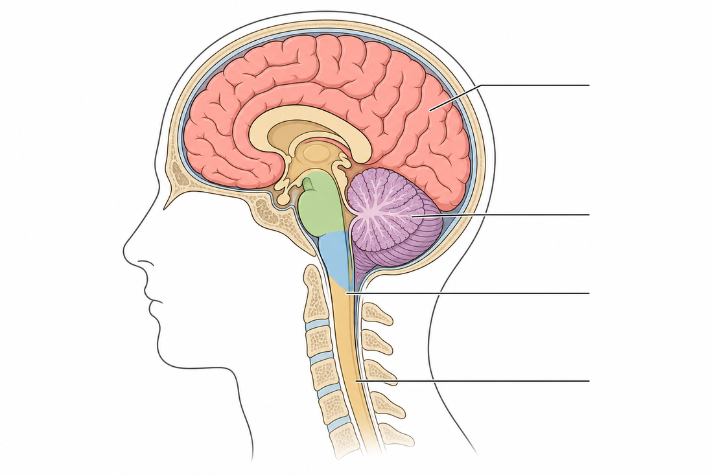


**<span style="color:#C00000">Les rôles des différentes parties</span>**

**<span style="color:#1E7B34">1. Le cerveau</span>**

C'est la partie la plus volumineuse de l'encéphale, reconnaissable à sa surface plissée. Il assure tout ce dont nous avons **conscience** :

- recevoir et interpréter les **sensations** — voir, entendre, sentir, avoir mal ;
- décider et commander les **mouvements volontaires** ;
- la **pensée**, le raisonnement, le jugement ;
- la **parole** et la compréhension du langage ;
- la **mémoire**, qui conserve les apprentissages.

Le cerveau est divisé en deux moitiés, les hémisphères. Fait remarquable : chaque hémisphère commande le **côté opposé** du corps. Une atteinte de l'hémisphère droit se traduit par des troubles du côté gauche.

**<span style="color:#1E7B34">2. Le cervelet</span>**

Bien plus petit, situé en arrière et en dessous du cerveau, le cervelet ne décide pas des mouvements : il les **ajuste**. Il règle la force, la vitesse et l'enchaînement des gestes, et maintient l'**équilibre** du corps.

Sans lui, un mouvement voulu reste possible mais devient maladroit et imprécis : la main dépasse l'objet qu'elle veut saisir, la marche devient hésitante. C'est le cervelet qui vous permet de tenir sur un vélo ou de porter un seau d'eau sur la tête sans le renverser.

**<span style="color:#1E7B34">3. Le tronc cérébral</span>**

Cette tige relie l'encéphale à la moelle épinière. Elle a deux fonctions :

- elle constitue le **passage obligé** de tous les messages échangés entre l'encéphale et le reste du corps ;
- elle abrite les **centres des fonctions vitales** : rythme respiratoire, rythme cardiaque, pression du sang. Elle commande aussi des réactions de protection comme la toux, l'éternuement et le vomissement.

Ces fonctions ne s'arrêtent jamais. C'est parce que le tronc cérébral travaille sans relâche que nous continuons de respirer pendant notre sommeil.

**<span style="color:#1E7B34">4. La moelle épinière</span>**

On la réduit souvent à un simple câble, mais elle remplit deux rôles distincts :

- elle **conduit** les messages dans les deux sens, du corps vers l'encéphale et de l'encéphale vers le corps ;
- elle constitue un **centre nerveux à part entière** : elle reçoit certaines informations, élabore une réponse et commande un mouvement **sans consulter l'encéphale**. C'est ce qui explique la rapidité des réflexes, que nous étudierons en séance 30.

**<span style="color:#1E7B34">5. Les nerfs</span>**

Ils assurent le transport. On distingue :

| Type de nerf | Sens de circulation | Rôle |
|---|---|---|
| **Nerfs sensitifs** | du corps vers le centre | font remonter les sensations |
| **Nerfs moteurs** | du centre vers le corps | portent les ordres aux muscles |

La plupart des nerfs contiennent à la fois des fibres sensitives et des fibres motrices : ce sont des nerfs mixtes.

**<span style="color:#1E7B34">6. Tableau de synthèse</span>**

| Partie | Rôle principal |
|---|---|
| Cerveau | sensations conscientes, mouvements voulus, pensée, parole, mémoire |
| Cervelet | coordination des gestes, équilibre |
| Tronc cérébral | fonctions vitales, passage des messages |
| Moelle épinière | conduction des messages, centre des réflexes |
| Nerfs | transport des messages dans les deux sens |

### Section EXERCICES

**Exercice 1 (4 points)** — Indique la partie responsable de chaque fonction.
1. Se souvenir d'une table de multiplication
2. Rester debout sur un pied sans tomber
3. Respirer pendant le sommeil
4. Retirer sa main d'une braise sans réfléchir

**Exercice 2 (6 points)** — Vrai ou Faux. Corrige les affirmations fausses.
1. Le cervelet décide des mouvements.
2. Le tronc cérébral commande le rythme cardiaque.
3. Chaque hémisphère commande le côté opposé du corps.
4. Les nerfs moteurs font remonter les sensations.
5. La moelle épinière est uniquement un câble de transmission.
6. La parole relève du cerveau.

**Exercice 3 (6 points)** — Trois patients présentent des troubles différents.
*Patient A* : il comprend et parle normalement, mais ses gestes sont imprécis et il marche en titubant.
*Patient B* : il ne se souvient plus des événements récents et cherche ses mots.
*Patient C* : après une blessure au milieu du dos, il ne sent plus ses jambes.
1. Indique pour chacun la partie du système nerveux probablement atteinte.
2. Pourquoi le patient A parvient-il encore à bouger, alors que ses gestes sont maladroits ?
3. Pourquoi le patient C respire-t-il normalement malgré sa blessure ?

**Exercice 4 (4 points)** — Choisis la bonne réponse.
1. L'équilibre du corps dépend surtout : **A.** du cerveau **B.** du cervelet **C.** des nerfs
2. Les nerfs sensitifs conduisent les messages : **A.** vers les centres nerveux **B.** vers les muscles **C.** vers les os
3. La toux et l'éternuement sont commandés par : **A.** le cervelet **B.** le tronc cérébral **C.** la peau
4. La moelle épinière peut commander un mouvement : **A.** jamais **B.** sans l'intervention de l'encéphale **C.** seulement la nuit

**TOTAL : 20 points**

### CORRIGÉ

**Ex. 1** — 1. **cerveau** · 2. **cervelet** · 3. **tronc cérébral** · 4. **moelle épinière**

**Ex. 2** — 1. **F** — il ne décide pas, il **coordonne et ajuste** les mouvements décidés par le cerveau. 2. **V** 3. **V** 4. **F** — ce sont les nerfs **sensitifs** ; les nerfs moteurs portent les ordres aux muscles. 5. **F** — elle est aussi le **centre des réflexes**. 6. **V**

**Ex. 3** — 1. A : le **cervelet** · B : le **cerveau** · C : la **moelle épinière**. 2. Parce que la décision du mouvement vient du **cerveau**, qui est intact ; c'est seulement l'**ajustement** du geste, assuré par le cervelet, qui fait défaut. 3. Parce que la respiration est commandée par le **tronc cérébral**, situé bien au-dessus de la blessure : les centres respiratoires et leurs voies ne sont pas touchés.

**Ex. 4** — 1. **B** · 2. **A** · 3. **B** · 4. **B**


---


# SÉANCE 27 / 51 — Le mouvement réflexe inné

**Objectif spécifique** : caractériser le mouvement réflexe inné et en reconnaître des exemples.
**Support et matériel** : marteau à réflexes ou règle, lampe de poche, quartier de citron.

| Étapes | Enseignant | Apprenants | Technique | Support | Obs. |
|---|---|---|---|---|---|
| **I. RÉVISION** | Quel est le centre des réflexes ?<br>Que commande le cerveau ? | R.A. : La moelle épinière.<br>R.A. : Les mouvements voulus, la pensée, la mémoire. | Questionnement oral | — | |
| **II. NOUVELLE LEÇON** ||||||
| 1. Mise en situation | Je vais approcher ma main de vos yeux sans vous toucher. *(L'enseignant fait le geste.)* Vos paupières se sont fermées. Qui parmi vous avait décidé de les fermer ? | R.A. : Personne, cela s'est fait tout seul. | Questionnement oral, expérimentation | — | |
| 2. Présentation | Aujourd'hui : « Le mouvement réflexe inné ». Vous saurez le reconnaître et citer ses caractères. | Les élèves écoutent. | Exposé | Tableau noir | |
| 3. Observation | Par deux, réalisez trois essais : l'un tapote doucement sous la rotule de l'autre, jambe pendante ; puis on éclaire brièvement l'œil et on observe la pupille ; enfin on observe ce qui se passe dans la bouche en croquant le citron. Notez chaque réaction. | Les élèves réalisent les essais et notent. | Expérimentation, travail de groupe | Marteau, lampe, citron | |
| 4. Analyse | La jambe s'est-elle levée parce que votre camarade l'avait décidé ?<br>Pouviez-vous empêcher votre pupille de se rétrécir ?<br>Ces réactions, les avez-vous apprises à l'école ?<br>Obtient-on toujours le même résultat en refaisant l'essai ?<br>À quoi servent ces réactions ? | R.A. : Non, cela s'est fait sans lui.<br>R.A. : Non, c'est impossible.<br>R.A. : Non, nous savons faire cela depuis toujours.<br>R.A. : Oui, cela se reproduit à chaque fois.<br>R.A. : À nous protéger. | Expérimentation, travail de groupe | Matériel des essais | |
| 5. Synthèse | **Donc,** un **mouvement réflexe inné** est une réaction déclenchée par une excitation. Il est **involontaire**, **automatique**, **présent dès la naissance** et **inévitable** : il se reproduit toujours de la même façon. Son centre est la **moelle épinière** ou le **tronc cérébral**, jamais le cerveau. Son rôle est le plus souvent de **protéger** le corps. | Les élèves recopient. | Exposé magistral | Tableau noir | |
| 6. Application | **Ex. 1** — Réflexe inné ou non ? a) fermer les paupières devant une projection · b) éternuer · c) écrire son nom · d) retirer la main d'une braise<br><br>**Ex. 2** — Vrai ou Faux : 1. On peut empêcher un réflexe inné par la volonté. 2. Il s'apprend à l'école. 3. Son centre peut être la moelle épinière. 4. Il protège souvent l'organisme. | **Ex. 1** : a) **oui** b) **oui** c) **non** d) **oui**<br><br>**Ex. 2** : 1. **F** — il est **inévitable**. 2. **F** — il est **inné**. 3. **V** 4. **V** | Travail de groupe | Grande ardoise | |
| **III. ÉVALUATION** | **Ex. 1** — Cite quatre caractères du réflexe inné.<br><br>**Ex. 2** — Pourquoi dit-on que le réflexe inné est une réaction de défense ? Donne deux exemples. | **Ex. 1** : involontaire, automatique, inné, inévitable (toujours identique).<br><br>**Ex. 2** : Parce qu'il **écarte le corps d'un danger plus vite que la réflexion**. Exemples : retirer la main d'un objet brûlant avant de ressentir la douleur ; fermer les paupières pour protéger l'œil d'une projection. | Évaluation écrite | Cahier | |

### Page LEÇON

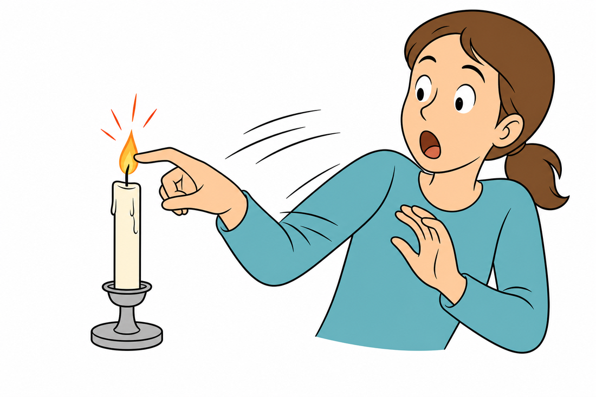


**<span style="color:#C00000">Le mouvement réflexe inné</span>**

**<span style="color:#1E7B34">1. Une réaction que nul n'a décidée</span>**

Approchez brusquement la main du visage de quelqu'un : ses paupières se ferment. Il n'a rien décidé, et il n'aurait pas pu s'en empêcher. Voilà un **mouvement réflexe inné** : une réponse du corps déclenchée par une **excitation**, sans aucune intervention de la volonté.

**<span style="color:#1E7B34">2. Ses quatre caractères</span>**

| Caractère | Ce que cela signifie |
|---|---|
| **Involontaire** | la volonté n'intervient pas ; on ne peut ni le déclencher ni l'empêcher à son gré |
| **Automatique** | la même excitation produit toujours la même réponse |
| **Inné** | il est présent dès la naissance, sans aucun apprentissage |
| **Inévitable** | il se produit à chaque fois, de façon prévisible |

C'est ce dernier caractère qui en fait un outil médical : en tapotant sous la rotule, le médecin vérifie que le trajet nerveux est intact. Si le réflexe manque, quelque chose est interrompu sur le parcours.

**<span style="color:#1E7B34">3. Exemples</span>**

- Retirer vivement la main d'un objet brûlant ou piquant.
- Fermer les paupières quand un objet approche de l'œil ou quand une poussière l'irrite.
- Le rétrécissement de la pupille sous une lumière vive.
- La salivation quand un aliment acide se trouve **dans la bouche**.
- L'éternuement, la toux, le vomissement.
- Le redressement de la jambe quand on frappe le tendon sous la rotule.

**<span style="color:#1E7B34">4. Le centre nerveux mis en jeu</span>**

Le réflexe inné n'est **pas commandé par le cerveau**. Selon le cas, son centre est :

- la **moelle épinière** — on parle alors de réflexe rachidien : retrait de la main, réflexe de la rotule ;
- le **tronc cérébral** — pour la toux, l'éternuement, le vomissement, le rétrécissement de la pupille.

Cette différence est capitale. Le message n'a pas à monter jusqu'au cerveau ni à en redescendre : le trajet est bien plus court, donc bien plus rapide. Vous retirez la main **avant** d'avoir ressenti la douleur. La sensation, elle, atteint le cerveau une fraction de seconde plus tard — c'est pourquoi on a mal *après* avoir retiré la main.

> **Attention à une confusion fréquente.** On lit parfois que le **cervelet** serait un centre de réflexes. C'est inexact : le cervelet coordonne les mouvements et maintient l'équilibre, il n'est pas le centre des réflexes innés. Les centres à retenir sont la **moelle épinière** et le **tronc cérébral**.

**<span style="color:#1E7B34">5. À quoi servent-ils ?</span>**

Presque tous les réflexes innés sont des **réactions de protection**. Ils mettent le corps à l'abri, ou rétablissent son équilibre, dans un délai que la réflexion ne permettrait jamais d'atteindre. Le temps de comprendre qu'un objet est brûlant et de décider de lâcher, la brûlure serait déjà profonde.

Certains réflexes ne sont observables que chez le nouveau-né et disparaissent ensuite, comme l'agrippement de la main lorsqu'on lui pose un doigt dans la paume. Leur présence, puis leur disparition au bon âge, renseignent le médecin sur le bon développement de l'enfant.

### Section EXERCICES

**Exercice 1 (5 points)** — Indique si la réaction est un réflexe inné. Réponds par **oui** ou **non**.
1. Éternuer quand on respire du poivre
2. Lever la main pour demander la parole
3. Le rétrécissement de la pupille en pleine lumière
4. Retirer le pied qui s'est posé sur une épine
5. Réciter l'alphabet

**Exercice 2 (5 points)** — Complète avec : *inné, involontaire, moelle épinière, protection, inévitable*
1. Le réflexe est …… : la volonté n'y participe pas.
2. Il est …… : il existe dès la naissance.
3. Il est …… : il se produit à chaque fois.
4. Son centre est souvent la …….
5. Son rôle est le plus souvent la …… de l'organisme.

**Exercice 3 (6 points)** — Naivo saisit une marmite brûlante. Sa main s'ouvre aussitôt, puis il ressent la douleur et s'écrie.
1. Pourquoi la main s'ouvre-t-elle **avant** qu'il ait mal ?
2. Quel est le centre nerveux qui a commandé le lâcher ?
3. Quel avantage la rapidité de cette réaction présente-t-elle ?

**Exercice 4 (4 points)** — Choisis la bonne réponse.
1. Un réflexe inné s'acquiert : **A.** par apprentissage **B.** dès la naissance **C.** vers 15 ans
2. Le centre du réflexe de retrait de la main est : **A.** le cerveau **B.** la moelle épinière **C.** le cervelet
3. On peut empêcher un réflexe inné : **A.** facilement **B.** pas du tout **C.** en fermant les yeux
4. Le réflexe de la rotule sert au médecin à : **A.** mesurer la taille **B.** vérifier que le trajet nerveux est intact **C.** tester la mémoire

**TOTAL : 20 points**

### CORRIGÉ

**Ex. 1** — 1. **oui** · 2. **non** · 3. **oui** · 4. **oui** · 5. **non**

**Ex. 2** — 1. **involontaire** · 2. **inné** · 3. **inévitable** · 4. **moelle épinière** · 5. **protection**

**Ex. 3** — 1. Parce que le message ne monte pas jusqu'au cerveau : la **moelle épinière** reçoit l'information et commande directement le lâcher. La sensation de douleur, elle, poursuit son chemin jusqu'au cerveau et n'est perçue qu'ensuite. 2. La **moelle épinière**. 3. Elle **limite la gravité de la brûlure** : le contact cesse en une fraction de seconde, bien avant qu'une décision réfléchie ait pu être prise.

**Ex. 4** — 1. **B** · 2. **B** · 3. **B** · 4. **B**


---


# SÉANCE 28 / 51 — Le mouvement réflexe acquis

**Objectif spécifique** : caractériser le mouvement réflexe acquis et le distinguer du réflexe inné.
**Support et matériel** : image d'un plat très apprécié des élèves, tableau comparatif à compléter.

| Étapes | Enseignant | Apprenants | Technique | Support | Obs. |
|---|---|---|---|---|---|
| **I. RÉVISION** | Cite deux caractères du réflexe inné.<br>Quel est son centre nerveux ? | R.A. : Involontaire et inné.<br>R.A. : La moelle épinière ou le tronc cérébral. | Questionnement oral | — | |
| **II. NOUVELLE LEÇON** ||||||
| 1. Mise en situation | Regardez cette image de *ravitoto* fumant. *(pause)* Plusieurs d'entre vous ont la bouche qui salive. Pourtant, il n'y a rien dans votre bouche : seulement une image. Un enfant qui n'aurait jamais goûté ce plat saliverait-il aussi ? | R.A. : Non, il ne saurait pas que c'est bon. | Questionnement oral | Image | |
| 2. Présentation | Aujourd'hui : « Le mouvement réflexe acquis ». Vous saurez le reconnaître et le distinguer du réflexe inné. | Les élèves écoutent. | Exposé | Tableau noir | |
| 3. Observation | Réfléchissez à ces situations : un cycliste expérimenté qui redresse son guidon sans y penser ; un élève qui se lève dès qu'il entend la cloche ; un conducteur qui freine en voyant un enfant traverser. | Les élèves observent et notent. | Étude de cas, travail de groupe | Tableau noir | |
| 4. Analyse | Le cycliste débutant sait-il redresser son guidon du premier coup ?<br>Comment y est-il arrivé ?<br>Une fois qu'il sait, doit-il encore y penser ?<br>Un élève d'une autre école se lèverait-il à cette cloche ?<br>Que faut-il donc pour que cette réaction existe ? | R.A. : Non, il tombe souvent au début.<br>R.A. : En s'entraînant plusieurs fois.<br>R.A. : Non, cela se fait tout seul.<br>R.A. : Non, il ne connaît pas ce signal.<br>R.A. : Il faut l'avoir appris. | Travail de groupe, étude de cas | Tableau noir | |
| 5. Synthèse | **Donc,** un **mouvement réflexe acquis** est lui aussi involontaire et automatique, mais il **n'existe pas à la naissance** : il s'installe par **apprentissage** ou par **répétition**. Son centre met en jeu le **cerveau**, qui a enregistré l'association entre un signal et une réaction. Faute d'entretien, il peut **s'affaiblir et disparaître**. | Les élèves recopient. | Exposé magistral | Tableau noir | |
| 6. Application | **Ex. 1** — Inné ou acquis ? a) saliver en voyant un plat qu'on aime · b) éternuer · c) freiner en voyant un obstacle · d) fermer l'œil sur une projection<br><br>**Ex. 2** — Vrai ou Faux : 1. Le réflexe acquis existe dès la naissance. 2. Il devient automatique avec la répétition. 3. Il met en jeu le cerveau. 4. Il peut disparaître faute de pratique. | **Ex. 1** : a) **acquis** b) **inné** c) **acquis** d) **inné**<br><br>**Ex. 2** : 1. **F** — il s'acquiert par **apprentissage**. 2. **V** 3. **V** 4. **V** | Travail de groupe | Grande ardoise | |
| **III. ÉVALUATION** | **Ex. 1** — Définis le réflexe acquis et cite deux exemples.<br><br>**Ex. 2** — Pourquoi la salivation devant un citron **vu** est-elle acquise, alors que la salivation due à un citron **mis dans la bouche** est innée ? | **Ex. 1** : Réaction involontaire et automatique installée par apprentissage ou répétition. Exemples : freiner à la vue d'un obstacle, saliver devant un plat connu.<br><br>**Ex. 2** : Dans le second cas, le contact de l'acide sur la langue déclenche directement la sécrétion : aucune expérience préalable n'est nécessaire, c'est **inné**. Dans le premier, la vue seule ne suffirait pas si l'on n'avait **jamais goûté** de citron : le cerveau a **appris** à associer cette image au goût acide. La réaction est donc **acquise**. | Évaluation écrite | Cahier | |

### Page LEÇON

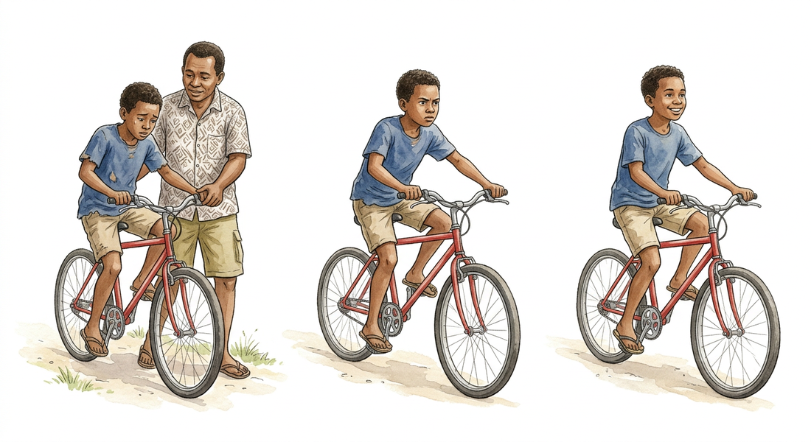


**<span style="color:#C00000">Le mouvement réflexe acquis</span>**

**<span style="color:#1E7B34">1. Une réaction apprise, puis devenue automatique</span>**

Un débutant à vélo tombe sans cesse : chaque correction du guidon lui demande un effort de réflexion. Après quelques semaines, il roule en bavardant, sans plus penser à son équilibre. Les mêmes gestes sont devenus **automatiques**.

Voilà le **mouvement réflexe acquis** : une réaction involontaire et rapide, **qui n'existait pas à la naissance** et que la répétition a installée.

**<span style="color:#1E7B34">2. Comment il se construit</span>**

Le principe est celui d'une **association**. Un signal qui, au départ, ne déclenchait rien se trouve répété en même temps qu'une situation qui, elle, provoque une réaction. Au bout d'un certain nombre de répétitions, le signal seul suffit à déclencher la réaction.

C'est ce qu'a établi le physiologiste russe **Ivan Pavlov** à la fin du XIXᵉ siècle. Il avait remarqué que ses chiens salivaient non seulement devant la nourriture — réaction innée — mais aussi en entendant les pas de la personne qui les nourrissait. En faisant systématiquement précéder le repas d'un signal sonore, il obtint une salivation déclenchée par ce seul signal. Pavlov a ainsi distingué les réflexes **innés**, présents dès la naissance, des réflexes **conditionnés**, construits par l'expérience.

**<span style="color:#1E7B34">3. Ses caractères</span>**

| Caractère | Réflexe acquis |
|---|---|
| Volonté | **involontaire** une fois installé |
| Automatisme | **automatique**, rapide |
| Origine | **acquis** par apprentissage ou répétition |
| Durabilité | **peut disparaître** faute de pratique |
| Centre nerveux | met en jeu le **cerveau** |

Deux points le rapprochent du réflexe inné : il est involontaire et automatique. Deux points l'en séparent nettement : il s'**apprend**, et il peut se **perdre**.

**<span style="color:#1E7B34">4. Exemples</span>**

- Saliver à la vue ou à l'odeur d'un plat que l'on connaît et que l'on apprécie.
- Freiner immédiatement à la vue d'un piéton qui s'engage sur la route.
- Se lever en entendant la cloche de l'école.
- Redresser son guidon, nager, jouer d'un instrument sans regarder ses doigts.
- Écrire : l'enfant qui apprend trace chaque lettre laborieusement ; l'adulte écrit sans penser à la forme des lettres.

**<span style="color:#1E7B34">5. Une distinction qui demande de la rigueur</span>**

Le même exemple peut relever de l'une ou l'autre catégorie selon la situation exacte — c'est ce qui rend la distinction délicate, et c'est pourquoi il faut se poser la bonne question.

Prenons le citron. S'il est **placé dans la bouche**, l'acide stimule directement la langue et la salivation se déclenche : aucun apprentissage n'est nécessaire, un nourrisson réagirait de même. Le réflexe est **inné**. Si l'on se contente de **regarder** un citron coupé, rien dans cette image n'est acide : c'est le cerveau qui, se souvenant du goût, déclenche la salivation. Le réflexe est **acquis** — quelqu'un n'ayant jamais goûté de citron ne saliverait pas.

**La bonne question à se poser est donc : cette réaction existerait-elle chez une personne qui n'en aurait aucune expérience ?** Si oui, elle est innée. Si non, elle est acquise.

> **Remarque sur une source.** Le fascicule de ressources du Ministère range la salivation devant un citron coupé **à la fois** dans les réflexes innés et dans les réflexes acquis. Il y a là une contradiction. Le critère exposé ci-dessus permet de trancher : la vue relève de l'acquis, le contact en bouche relève de l'inné.

### Section EXERCICES

**Exercice 1 (4 points)** — Indique pour chaque réaction si elle est **innée** ou **acquise**.
1. Le pied se retire d'une épine.
2. Un élève se lève au son de la cloche.
3. Les paupières se ferment sur une projection de sable.
4. Un cycliste redresse son guidon sans y penser.

**Exercice 2 (6 points)** — Complète avec : *apprentissage, cerveau, involontaire, disparaître, Pavlov, répétition*
1. Le réflexe acquis s'installe par …… ou par …….
2. Une fois installé, il est …… comme le réflexe inné.
3. Son centre met en jeu le …….
4. Il peut …… si on ne le pratique plus.
5. Le savant qui a étudié ces réflexes est …….

**Exercice 3 (6 points)** — Hery apprend à conduire une charrette. Les premiers jours, il doit réfléchir à chaque geste et la charrette zigzague. Après deux mois, il conduit en discutant avec son voisin. Un an plus tard, n'ayant plus conduit, il se sent de nouveau maladroit.
1. De quel type de réaction s'agit-il ? Justifie par deux caractères.
2. Qu'est-ce qui explique l'aisance acquise au bout de deux mois ?
3. Pourquoi est-il redevenu maladroit un an plus tard ?

**Exercice 4 (4 points)** — Choisis la bonne réponse.
1. Un réflexe acquis existe : **A.** dès la naissance **B.** après un apprentissage **C.** jamais
2. Saliver en **voyant** un citron coupé est un réflexe : **A.** inné **B.** acquis **C.** volontaire
3. Le centre du réflexe acquis met en jeu : **A.** le cerveau **B.** uniquement la moelle **C.** les os
4. Un réflexe acquis non entretenu : **A.** se renforce **B.** peut s'affaiblir **C.** devient inné

**TOTAL : 20 points**

### CORRIGÉ

**Ex. 1** — 1. **innée** · 2. **acquise** · 3. **innée** · 4. **acquise**

**Ex. 2** — 1. **apprentissage**, **répétition** · 2. **involontaire** · 3. **cerveau** · 4. **disparaître** · 5. **Pavlov**

**Ex. 3** — 1. Un **réflexe acquis** : il **n'existait pas au départ** (les premiers jours étaient laborieux) et il est devenu **automatique et involontaire** après la pratique. 2. La **répétition** : le cerveau a enregistré les associations entre ce qu'il perçoit et les gestes à faire, si bien que la réflexion n'est plus nécessaire. 3. Parce qu'un réflexe acquis **s'affaiblit faute de pratique** : n'ayant plus conduit pendant un an, l'automatisme s'est estompé. Il se réinstallera d'ailleurs plus vite qu'au début.

**Ex. 4** — 1. **B** · 2. **B** · 3. **A** · 4. **B**


---


# SÉANCE 29 / 51 — Le mouvement volontaire

**Objectif spécifique** : caractériser le mouvement volontaire et le comparer aux deux types de réflexes.
**Support et matériel** : objets à saisir, tableau comparatif des trois réactions.

| Étapes | Enseignant | Apprenants | Technique | Support | Obs. |
|---|---|---|---|---|---|
| **I. RÉVISION** | Qu'est-ce qu'un réflexe acquis ?<br>Qu'est-ce qui le distingue du réflexe inné ? | R.A. : Une réaction automatique apprise par répétition.<br>R.A. : Il s'apprend, et il peut se perdre. | Questionnement oral | — | |
| **II. NOUVELLE LEÇON** ||||||
| 1. Mise en situation | Je pose ce livre sur la table. Rasoa, prends-le si tu le souhaites — ou ne le prends pas, c'est toi qui décides. *(L'élève choisit.)* En quoi ce geste diffère-t-il du retrait de la main devant une braise ? | R.A. : Là, elle pouvait choisir ; devant la braise, on ne choisit pas. | Questionnement oral | Livre | |
| 2. Présentation | Aujourd'hui : « Le mouvement volontaire ». Vous saurez le caractériser et le comparer aux deux types de réflexes. | Les élèves écoutent. | Exposé | Tableau noir | |
| 3. Observation | Par deux, effectuez trois actions : prendre un crayon et le reposer, écrire votre prénom, puis renoncer volontairement à lever le bras alors que je vous le demande. Notez ce que vous ressentez à chaque fois. | Les élèves réalisent et notent. | Expérimentation, travail de groupe | Crayon, cahier | |
| 4. Analyse | Avez-vous pu décider de commencer ?<br>Avez-vous pu décider d'arrêter en cours de route ?<br>Pouviez-vous refuser ?<br>Ce type de mouvement est-il plus rapide ou plus lent qu'un réflexe ?<br>Pourquoi cette différence de vitesse ? | R.A. : Oui, nous avons choisi le moment.<br>R.A. : Oui, on peut s'interrompre.<br>R.A. : Oui, on peut ne pas le faire.<br>R.A. : Plus lent.<br>R.A. : Parce qu'il faut réfléchir, le message va jusqu'au cerveau. | Travail de groupe | Matériel | |
| 5. Synthèse | **Donc,** le **mouvement volontaire** est commandé par la **volonté**. Il peut être déclenché, modifié ou interrompu à tout moment. Son centre est le **cerveau**, qui décide puis envoie l'ordre aux muscles. Il est plus **lent** que le réflexe, parce que le trajet est plus long et comporte une étape de décision. | Les élèves recopient. | Exposé magistral | Tableau noir | |
| 6. Application | **Ex. 1** — Volontaire, réflexe inné ou réflexe acquis ? a) ranger son cahier dans son sac · b) éternuer · c) freiner à la vue d'un obstacle · d) lire à voix haute<br><br>**Ex. 2** — Vrai ou Faux : 1. On peut interrompre un mouvement volontaire. 2. Il est plus rapide qu'un réflexe. 3. Son centre est le cerveau. 4. Il peut devenir automatique avec l'entraînement. | **Ex. 1** : a) **volontaire** b) **réflexe inné** c) **réflexe acquis** d) **volontaire**<br><br>**Ex. 2** : 1. **V** 2. **F** — il est plus **lent**. 3. **V** 4. **V** | Travail de groupe | Grande ardoise | |
| **III. ÉVALUATION** | **Ex. 1** — Complète le tableau comparatif des trois types de réactions (volonté, origine, centre nerveux).<br><br>**Ex. 2** — Un débutant réfléchit à chaque note qu'il joue ; un musicien confirmé joue sans regarder ses doigts. Explique ce changement. | **Ex. 1** : voir le tableau de la leçon.<br><br>**Ex. 2** : Chez le débutant, chaque note est un **mouvement volontaire** qui exige une décision consciente. La **répétition** transforme peu à peu ces gestes en **automatismes**, c'est-à-dire en réflexes acquis : le cerveau n'a plus à commander chaque doigt séparément, ce qui libère l'attention pour l'interprétation. | Évaluation écrite | Cahier | |

### Page LEÇON

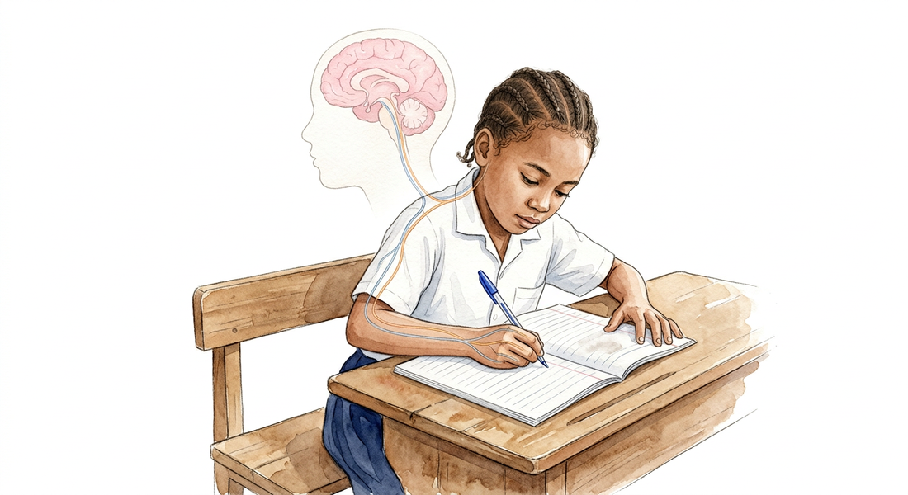


**<span style="color:#C00000">Le mouvement volontaire</span>**

**<span style="color:#1E7B34">1. Définition</span>**

Le **mouvement volontaire** est un mouvement **décidé**. Nous choisissons de l'accomplir, nous choisissons le moment, et nous pouvons y renoncer ou l'interrompre en cours d'exécution.

Aller chercher un livre sur l'étagère, ranger une clé dans sa poche, écrire, se diriger vers un endroit précis, prendre la parole : tous ces actes sont volontaires.

**<span style="color:#1E7B34">2. Son déroulement</span>**

Contrairement au réflexe, il comporte une véritable **étape de décision** :

1. Les organes des sens recueillent une information — je vois le livre.
2. Cette information gagne le **cerveau** par les nerfs sensitifs.
3. Le cerveau l'analyse, la confronte à la mémoire et à mes intentions, puis **décide** — je veux ce livre.
4. L'ordre part du cerveau, descend par la moelle épinière, puis par les nerfs moteurs.
5. Les muscles se contractent et le bras se tend.

Le **cervelet** intervient pendant tout le geste pour en ajuster la force et la précision, de sorte que la main s'arrête exactement sur le livre.

**<span style="color:#1E7B34">3. Ses caractères</span>**

- **Volontaire** : il dépend entièrement de la décision.
- **Conscient** : nous savons ce que nous faisons pendant que nous le faisons.
- **Modifiable** : on peut le ralentir, l'accélérer, le corriger, l'arrêter.
- **Plus lent que le réflexe** : le trajet est long et comprend une étape de décision.
- **Centre nerveux** : le **cerveau**.

**<span style="color:#1E7B34">4. Comparaison des trois types de réactions</span>**

| | **Réflexe inné** | **Réflexe acquis** | **Mouvement volontaire** |
|---|---|---|---|
| **Volonté** | involontaire | involontaire | **volontaire** |
| **Origine** | présent dès la naissance | **acquis** par apprentissage | décidé à chaque fois |
| **Peut-on l'empêcher ?** | non | difficilement | **oui** |
| **Peut-il disparaître ?** | non | oui, faute de pratique | sans objet |
| **Vitesse** | très rapide | rapide | plus lent |
| **Centre nerveux** | moelle épinière ou tronc cérébral | cerveau | **cerveau** |
| **Exemples** | retirer la main d'une braise, éternuer | freiner à la vue d'un obstacle, faire du vélo | prendre un livre, écrire son nom |

**<span style="color:#1E7B34">5. Du volontaire vers l'automatique</span>**

Ces catégories ne sont pas étanches. Un geste d'abord volontaire peut, à force de répétition, devenir un réflexe acquis.

L'enfant qui apprend à écrire trace chaque lettre en y réfléchissant : ses mouvements sont volontaires et lents. Des années plus tard, il écrit sans songer à la forme des lettres — le geste est devenu automatique, et son attention est disponible pour le **contenu** de ce qu'il écrit.

C'est là tout l'intérêt de l'apprentissage : en transformant des mouvements volontaires en automatismes, le cerveau **libère de l'attention** pour des tâches plus complexes. C'est vrai pour l'écriture, la lecture, la marche, la conduite, la pratique d'un instrument.

### Section EXERCICES

**Exercice 1 (4 points)** — Classe chaque action : **réflexe inné**, **réflexe acquis** ou **mouvement volontaire**.
1. Tousser après avoir avalé de travers
2. Choisir de se lever pour aller au tableau
3. Nager sans réfléchir à ses mouvements
4. Répondre à une question posée par l'enseignant

**Exercice 2 (6 points)** — Vrai ou Faux. Corrige les affirmations fausses.
1. Le mouvement volontaire est plus rapide que le réflexe.
2. Son centre nerveux est le cerveau.
3. On peut interrompre un mouvement volontaire en cours.
4. Un mouvement volontaire ne peut jamais devenir automatique.
5. Le cervelet ajuste la précision du geste.
6. Le réflexe inné peut être empêché par la volonté.

**Exercice 3 (6 points)** — Range dans l'ordre les étapes d'un mouvement volontaire, puis réponds.
*les muscles se contractent · le cerveau décide · l'information gagne le cerveau · les organes des sens perçoivent · l'ordre descend par les nerfs moteurs*
1. Donne l'ordre correct.
2. Quelle étape n'existe pas dans un réflexe inné ?
3. Déduis-en pourquoi le réflexe est plus rapide.

**Exercice 4 (4 points)** — Choisis la bonne réponse.
1. Le mouvement volontaire est commandé par : **A.** la moelle épinière **B.** le cerveau **C.** les nerfs seuls
2. Un geste volontaire répété longtemps peut devenir : **A.** un réflexe inné **B.** un réflexe acquis **C.** impossible
3. Le cervelet intervient pour : **A.** décider **B.** ajuster la précision **C.** mémoriser
4. Le plus rapide des trois est : **A.** le mouvement volontaire **B.** le réflexe inné **C.** ils sont égaux

**TOTAL : 20 points**

### CORRIGÉ

**Ex. 1** — 1. **réflexe inné** · 2. **mouvement volontaire** · 3. **réflexe acquis** · 4. **mouvement volontaire**

**Ex. 2** — 1. **F** — il est plus **lent**, car il comporte une étape de décision. 2. **V** 3. **V** 4. **F** — la répétition peut le transformer en **réflexe acquis**. 5. **V** 6. **F** — le réflexe inné est **inévitable**.

**Ex. 3** — 1. les organes des sens perçoivent → l'information gagne le cerveau → le cerveau décide → l'ordre descend par les nerfs moteurs → les muscles se contractent. 2. L'étape de **décision par le cerveau**. 3. Parce que le message **ne monte pas jusqu'au cerveau** : la moelle épinière élabore directement la réponse. Le trajet étant plus court et sans délibération, la réaction survient bien plus vite.

**Ex. 4** — 1. **B** · 2. **B** · 3. **B** · 4. **B**


---


# SÉANCE 30 / 51 — L'arc réflexe

**Objectif spécifique** : établir le trajet suivi par l'influx nerveux au cours d'un mouvement réflexe.
**Support et matériel** : schéma muet de l'arc réflexe, flèches en papier de couleur, marteau à réflexes.

| Étapes | Enseignant | Apprenants | Technique | Support | Obs. |
|---|---|---|---|---|---|
| **I. RÉVISION** | Quel est le centre du réflexe inné ?<br>Pourquoi le réflexe est-il plus rapide que le mouvement volontaire ? | R.A. : La moelle épinière.<br>R.A. : Parce que le message ne va pas jusqu'au cerveau. | Questionnement oral | — | |
| **II. NOUVELLE LEÇON** ||||||
| 1. Mise en situation | Vous savez que le pied se relève quand on marche sur une épine, et que la moelle épinière commande. Mais par quel chemin exact le message est-il passé, de la plante du pied jusqu'au muscle ? | R.A. : Les élèves proposent des trajets. | Questionnement oral | Tableau noir | |
| 2. Présentation | Aujourd'hui : « L'arc réflexe ». Vous saurez nommer dans l'ordre les cinq éléments que parcourt l'influx nerveux. | Les élèves écoutent. | Exposé | Tableau noir | |
| 3. Observation | Observez ce schéma muet : la peau du pied, un nerf qui monte, la moelle épinière en coupe, un nerf qui descend, le muscle de la jambe. Repérez chaque élément. | Les élèves observent et repèrent. | Observation dirigée | Schéma muet | |
| 4. Analyse | Où l'excitation est-elle perçue ?<br>Par quoi le message monte-t-il ?<br>Où est-il traité ?<br>Par quoi la réponse redescend-elle ?<br>Qui exécute la réponse ?<br>Le cerveau figure-t-il sur ce trajet ? | R.A. : Dans la peau, par les organes sensitifs.<br>R.A. : Par un nerf sensitif.<br>R.A. : Dans la moelle épinière.<br>R.A. : Par un nerf moteur.<br>R.A. : Le muscle.<br>R.A. : Non, il n'y est pas. | Étude de document, travail de groupe | Schéma, flèches | |
| 5. Synthèse | **Donc,** l'**arc réflexe** est le chemin parcouru par l'influx nerveux pendant un réflexe. Il comporte cinq éléments : **organes sensitifs → nerf sensitif → moelle épinière → nerf moteur → muscle**. Le cerveau n'intervient pas dans la commande ; il est informé ensuite, ce qui explique que la douleur soit ressentie après le mouvement. | Les élèves recopient et fléchent le schéma. | Exposé magistral | Schéma, flèches | |
| 6. Application | **Ex. 1** — Remets dans l'ordre : nerf moteur · moelle épinière · organes sensitifs · muscle · nerf sensitif<br><br>**Ex. 2** — Vrai ou Faux : 1. Le cerveau commande le réflexe. 2. Le nerf sensitif conduit vers la moelle. 3. Le muscle est l'organe qui exécute. 4. L'arc réflexe comporte cinq éléments. | **Ex. 1** : organes sensitifs → nerf sensitif → moelle épinière → nerf moteur → muscle<br><br>**Ex. 2** : 1. **F** — c'est la **moelle épinière**. 2. **V** 3. **V** 4. **V** | Travail de groupe | Grande ardoise | |
| **III. ÉVALUATION** | **Ex. 1** — Trace le schéma de l'arc réflexe et nomme les cinq éléments dans l'ordre.<br><br>**Ex. 2** — Explique pourquoi on retire sa main d'une braise **avant** d'avoir mal. | **Ex. 1** : schéma correct, cinq éléments fléchés dans l'ordre.<br><br>**Ex. 2** : Le message emprunte l'**arc réflexe**, un trajet court qui s'arrête à la **moelle épinière** : celle-ci commande immédiatement le retrait. En parallèle, une autre voie fait monter l'information jusqu'au **cerveau**, qui la traite plus tard : la douleur n'est donc perçue qu'**après** le mouvement. | Évaluation écrite | Cahier | |

### Page LEÇON

**<span style="color:#C00000">L'arc réflexe</span>**

**<span style="color:#1E7B34">1. Deux définitions</span>**

Un **réflexe** — que l'on qualifie de rachidien lorsque son centre est la moelle épinière — désigne une réponse immédiate du corps, échappant à la volonté, que déclenche une excitation.

L'**arc réflexe** est le **chemin emprunté par l'influx nerveux** au cours de cette réaction. Le mot « arc » évoque bien la forme du trajet : le message entre par un côté, atteint un point central, et ressort par l'autre côté.

**<span style="color:#1E7B34">2. Pourquoi le cerveau est court-circuité</span>**

Le réflexe sert le plus souvent à protéger l'organisme, et cette protection n'a de valeur que si elle est **immédiate**. Or faire monter l'information jusqu'au cerveau, l'y faire analyser, puis redescendre un ordre, prendrait bien trop de temps quand la peau est en train de brûler.

La solution retenue par l'organisme est une **voie courte**. L'information s'arrête à la moelle épinière, qui élabore la réponse et la renvoie aussitôt. Le cerveau est bien informé, mais **en parallèle et plus tard** : c'est la raison pour laquelle on ressent la douleur une fraction de seconde *après* avoir retiré la main.

**<span style="color:#1E7B34">3. Les cinq étapes du trajet</span>**

| Étape | Élément | Ce qui s'y passe |
|---|---|---|
| 1 | **Organes sensitifs** | situés dans la peau, ils captent l'excitation et la convertissent en influx nerveux |
| 2 | **Nerf sensitif** | il conduit cet influx jusqu'à la moelle épinière |
| 3 | **Moelle épinière** | centre nerveux : elle reçoit l'influx, le traite et élabore une réponse |
| 4 | **Nerf moteur** | il porte l'ordre de la moelle jusqu'au muscle |
| 5 | **Muscle** | organe effecteur : il se contracte, le mouvement a lieu |

**À retenir sous forme de chaîne :**

> **Organes sensitifs → Nerf sensitif → Moelle épinière → Nerf moteur → Muscle**


*Schéma à reproduire au tableau, sans les légendes : les élèves les placent et tracent les deux voies de couleurs différentes. Faire remarquer que le trajet ne passe pas par le cerveau. Le même dessin sert à l'examen de l'unité (séance 35).*

**<span style="color:#1E7B34">4. Un exemple détaillé</span>**

Vous posez le pied nu sur une épine.

1. Des récepteurs de la peau de la plante du pied détectent la piqûre et engendrent un influx nerveux.
2. Cet influx remonte le long de la jambe par un nerf sensitif et parvient au centre nerveux.
3. La moelle épinière analyse ce qui lui arrive et arrête la réponse à donner : fléchir la jambe.
4. L'ordre redescend par un nerf moteur.
5. Les muscles de la jambe se contractent, le pied se relève.

L'ensemble prend moins d'une fraction de seconde. Pendant ce temps, une autre voie transporte l'information vers le cerveau : vous prenez alors conscience de la douleur, et vous pouvez décider de regarder votre pied — ce dernier geste, lui, est volontaire.

**<span style="color:#1E7B34">5. Intérêt médical</span>**

Comme chaque élément de l'arc est indispensable, l'absence d'un réflexe indique une **interruption sur le trajet**. En provoquant le réflexe de la rotule, le médecin teste d'un seul geste la peau, le nerf sensitif, un niveau précis de la moelle, le nerf moteur et le muscle. C'est un examen simple, rapide et très informatif.

### Section EXERCICES

**Exercice 1 (5 points)** — Range les cinq éléments de l'arc réflexe dans l'ordre suivi par l'influx nerveux.
*muscle · nerf sensitif · organes sensitifs · nerf moteur · moelle épinière*

**Exercice 2 (5 points)** — Complète avec : *effecteur, involontaire, moelle épinière, sensitif, moteur*
1. Le réflexe est une réaction rapide et …….
2. L'influx monte par le nerf …….
3. Il est traité par la …….
4. L'ordre redescend par le nerf …….
5. Le muscle est l'organe …….

**Exercice 3 (6 points)** — Un médecin frappe le tendon sous la rotule d'un patient : la jambe ne se relève pas. Chez ce même patient, la peau de la jambe est insensible au toucher.
1. Cite les cinq éléments que ce test met en jeu.
2. Que permet de conclure l'absence de réaction ?
3. L'insensibilité de la peau oriente-t-elle vers un élément plutôt qu'un autre ? Justifie.

**Exercice 4 (4 points)** — Choisis la bonne réponse.
1. L'arc réflexe est : **A.** un os de la colonne **B.** le trajet de l'influx lors d'un réflexe **C.** un muscle
2. Le centre de l'arc réflexe est : **A.** le cerveau **B.** la moelle épinière **C.** le cervelet
3. On ressent la douleur : **A.** avant le retrait **B.** après le retrait **C.** jamais
4. L'organe qui exécute la réponse est : **A.** le nerf **B.** le muscle **C.** la peau

**TOTAL : 20 points**

### CORRIGÉ

**Ex. 1** — organes sensitifs → nerf sensitif → moelle épinière → nerf moteur → muscle

**Ex. 2** — 1. **involontaire** · 2. **sensitif** · 3. **moelle épinière** · 4. **moteur** · 5. **effecteur**

**Ex. 3** — 1. Les récepteurs du tendon et de la peau, le nerf sensitif, la moelle épinière, le nerf moteur, le muscle de la cuisse. 2. Qu'au moins **un élément de l'arc est interrompu** : le réflexe ne peut aboutir si un seul maillon manque. 3. **Oui.** Si la peau est insensible, l'information ne remonte plus : cela oriente vers une atteinte de la **voie sensitive** (récepteurs ou nerf sensitif) plutôt que du nerf moteur ou du muscle. Pour le vérifier, on demanderait au patient de bouger volontairement la jambe : s'il y parvient, la voie motrice et le muscle sont intacts.

**Ex. 4** — 1. **B** · 2. **B** · 3. **B** · 4. **B**


---


# SÉANCE 31 / 51 — Les catégories de substances psychoactives

**Objectif spécifique** : classer les substances psychoactives selon leur effet sur le système nerveux.
**Support et matériel** : fiche de classement à trois colonnes, documents fournis par l'enseignant.

| Étapes | Enseignant | Apprenants | Technique | Support | Obs. |
|---|---|---|---|---|---|
| **I. RÉVISION** | Quel organe commande la pensée et le jugement ?<br>Que transporte un nerf ? | R.A. : Le cerveau.<br>R.A. : L'influx nerveux, le message. | Questionnement oral | — | |
| **II. NOUVELLE LEÇON** ||||||
| 1. Mise en situation | Nous avons vu que le cerveau commande le jugement, l'équilibre et les gestes. Certaines substances, une fois dans le sang, atteignent le cerveau et modifient son fonctionnement. Que devient alors la personne qui en consomme ? | R.A. : Elle ne se comporte plus comme d'habitude. | Questionnement oral | Tableau noir | |
| 2. Présentation | Aujourd'hui : « Les catégories de substances psychoactives ». Vous saurez définir ces substances et les classer en trois groupes selon leur effet. | Les élèves écoutent. | Exposé | Tableau noir | |
| 3. Observation | Étudiez en groupe les documents distribués. Relevez, pour chaque substance citée, ce qu'elle produit : est-ce que le corps s'accélère, se ralentit, ou est-ce que la perception est déformée ? | Les élèves lisent et remplissent la fiche. | Étude de document, travail de groupe | Documents, fiche | |
| 4. Analyse | Quelles substances accélèrent le rythme du cœur et retardent le sommeil ?<br>Lesquelles ralentissent les réflexes et rendent somnolent ?<br>Lesquelles font percevoir des choses qui n'existent pas ?<br>Le tabac et l'alcool sont autorisés : sont-ils pour autant sans effet sur le cerveau ?<br>Un médicament peut-il être une substance psychoactive ? | R.A. : Celles qui excitent.<br>R.A. : Celles qui endorment, comme l'alcool.<br>R.A. : Celles qui provoquent des hallucinations.<br>R.A. : Non, ils agissent aussi sur le système nerveux.<br>R.A. : Oui, certains somnifères. | Travail de groupe, étude de document | Documents | |
| 5. Synthèse | **Donc,** une **substance psychoactive** est une substance qui, parvenue au cerveau, modifie son fonctionnement — donc la perception, l'humeur et le comportement. On les classe en trois groupes selon leur effet : les **excitants**, qui accélèrent l'activité nerveuse ; les **sédatifs**, qui la ralentissent ; les **hallucinogènes**, qui la perturbent. Le caractère autorisé ou interdit d'une substance ne dit rien de sa dangerosité. | Les élèves recopient. | Exposé magistral | Tableau noir | |
| 6. Application | **Ex. 1** — Classe : a) l'alcool · b) le tabac · c) le cannabis · d) un somnifère<br><br>**Ex. 2** — Vrai ou Faux : 1. Une substance autorisée est sans danger. 2. Les excitants accélèrent l'activité nerveuse. 3. Les sédatifs ralentissent les réflexes. 4. Un médicament n'est jamais psychoactif. | **Ex. 1** : a) **sédatif** b) **excitant** c) **hallucinogène** (perturbateur) d) **sédatif**<br><br>**Ex. 2** : 1. **F** — autorisé ne signifie pas inoffensif. 2. **V** 3. **V** 4. **F** — certains le sont, d'où l'importance de la prescription. | Travail de groupe | Grande ardoise | |
| **III. ÉVALUATION** | **Ex. 1** — Définis « substance psychoactive » et cite les trois catégories.<br><br>**Ex. 2** — Pourquoi dit-on que le fait qu'une substance soit en vente libre ne prouve pas qu'elle est inoffensive ? | **Ex. 1** : Substance qui modifie le fonctionnement du cerveau, donc la perception, l'humeur et le comportement. Catégories : excitants, sédatifs, hallucinogènes.<br><br>**Ex. 2** : Parce que l'autorisation de vente résulte de l'**histoire et des habitudes d'une société**, non d'une mesure du danger. Le tabac et l'alcool sont en vente libre alors qu'ils comptent parmi les substances les plus nocives pour la santé. | Évaluation écrite | Cahier | |

### Page LEÇON

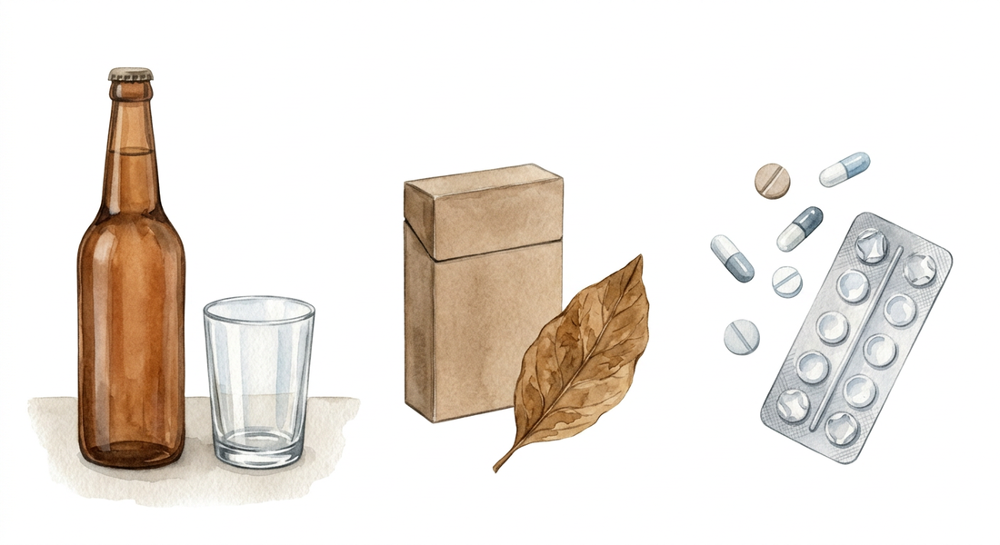


**<span style="color:#C00000">Les catégories de substances psychoactives</span>**

**<span style="color:#1E7B34">1. Définition</span>**

Une **substance psychoactive** est une substance qui, après être passée dans le sang, atteint le cerveau et **modifie son fonctionnement**. Le mot le dit : *psycho* renvoie à l'activité mentale, *active* signifie qu'elle agit dessus.

Les conséquences portent sur trois domaines : la **perception** (ce que l'on voit, entend, ressent), l'**humeur** (l'état émotionnel) et le **comportement** (la façon d'agir et de juger).

**<span style="color:#1E7B34">2. Le classement selon l'effet</span>**

| Catégorie | Effet sur le système nerveux | Ce que l'on observe |
|---|---|---|
| **Les excitants** | ils **accélèrent** l'activité nerveuse | rythme cardiaque augmenté, sommeil retardé, impression d'énergie |
| **Les sédatifs** | ils **ralentissent** l'activité nerveuse | réflexes diminués, somnolence, vigilance et jugement amoindris |
| **Les hallucinogènes** | ils **perturbent** l'activité nerveuse | perceptions déformées, hallucinations, humeur instable |

Ce classement repose sur l'**effet produit**, et non sur le statut légal. Certaines substances relèvent d'ailleurs de plusieurs catégories selon la dose absorbée.

**<span style="color:#1E7B34">3. Autorisé ne veut pas dire inoffensif</span>**

C'est le point le plus souvent mal compris, et le plus important de cette leçon.

Une substance **autorisée** est une substance dont la vente est permise par la loi. Ce statut résulte de l'histoire, des habitudes sociales et d'intérêts économiques — **pas** d'une évaluation du danger. Le **tabac** et l'**alcool** sont en vente libre à Madagascar comme dans la plupart des pays ; ils figurent pourtant parmi les substances les plus nocives, précisément parce que leur usage est répandu et banalisé.

De la même manière, certains **médicaments** — somnifères, calmants — sont des substances psychoactives. Pris sur prescription et sous surveillance médicale, ils soignent. Pris sans contrôle, détournés de leur usage ou associés à l'alcool, ils deviennent dangereux. C'est la raison d'être de l'ordonnance.

**<span style="color:#1E7B34">4. L'accoutumance et la dépendance</span>**

Deux phénomènes expliquent pourquoi il est si difficile d'arrêter.

L'**accoutumance** : à force de recevoir la substance, l'organisme s'y adapte. Il faut alors une quantité toujours plus grande pour obtenir le même effet — donc une exposition croissante.

La **dépendance** : le corps et l'esprit réclament la substance. En son absence apparaît un malaise — irritabilité, angoisse, tremblements — qui pousse à consommer de nouveau. La personne ne consomme plus pour le plaisir, mais **pour faire cesser ce malaise**.

Il faut le dire clairement : la dépendance est un **état de santé**, pas un défaut de caractère. Une personne dépendante n'est ni faible ni coupable. Elle a besoin d'aide, et cette aide existe — médecins, centres de santé, associations. Le rôle de l'entourage est d'orienter vers ces secours, jamais de rejeter.

**<span style="color:#1E7B34">5. Pourquoi l'adolescence est une période à risque</span>**

Le cerveau poursuit sa maturation jusqu'à l'âge adulte. Les régions qui gouvernent le **jugement** et le **contrôle de soi** sont parmi les dernières à achever leur développement.

Deux conséquences. D'abord, une substance psychoactive perturbe un organe encore en construction, et les effets peuvent être durables. Ensuite, la dépendance s'installe **plus vite et plus solidement** quand la première consommation est précoce. C'est pour cette raison que retarder le premier contact protège réellement.

### Section EXERCICES

**Exercice 1 (4 points)** — Indique la catégorie de chaque substance : **excitant**, **sédatif** ou **hallucinogène**.
1. L'alcool
2. Le tabac
3. Le cannabis
4. Un somnifère pris sans prescription

**Exercice 2 (6 points)** — Complète avec : *accoutumance, dépendance, cerveau, jugement, autorisée, perception*
1. Une substance psychoactive agit sur le …….
2. Elle modifie la ……, l'humeur et le comportement.
3. Une substance …… n'est pas forcément sans danger.
4. L'…… oblige à augmenter les quantités.
5. La …… fait réclamer la substance par le corps.
6. Chez l'adolescent, la zone du …… n'est pas encore mûre.

**Exercice 3 (6 points)** — Deux personnes discutent. L'une dit : « Le tabac est vendu au marché, donc ce n'est pas dangereux. » L'autre répond : « Mon oncle a arrêté trois fois et il a recommencé, il n'a aucune volonté. »
1. Que réponds-tu à la première affirmation ?
2. Que réponds-tu à la seconde ?
3. Quel conseil donnerais-tu à cet oncle ?

**Exercice 4 (4 points)** — Choisis la bonne réponse.
1. Une substance psychoactive agit d'abord sur : **A.** les os **B.** le cerveau **C.** les muscles
2. Les sédatifs : **A.** accélèrent l'activité nerveuse **B.** la ralentissent **C.** n'ont aucun effet
3. L'accoutumance signifie qu'il faut : **A.** des quantités croissantes **B.** moins de produit **C.** arrêter seul
4. La dépendance est : **A.** un manque de volonté **B.** un état de santé nécessitant de l'aide **C.** sans conséquence

**TOTAL : 20 points**

### CORRIGÉ

**Ex. 1** — 1. **sédatif** · 2. **excitant** · 3. **hallucinogène** (perturbateur) · 4. **sédatif**

**Ex. 2** — 1. **cerveau** · 2. **perception** · 3. **autorisée** · 4. **accoutumance** · 5. **dépendance** · 6. **jugement**

**Ex. 3** — 1. Le fait qu'une substance soit **en vente libre** tient à l'histoire et aux habitudes d'une société, pas à son innocuité. Le tabac est autorisé et compte pourtant parmi les substances les plus nocives. 2. Les rechutes ne traduisent **pas un manque de volonté** : la dépendance est un **état de santé** qui modifie le fonctionnement du cerveau. Beaucoup de personnes font plusieurs tentatives avant de réussir, et chaque tentative est utile. 3. Lui conseiller de **se faire accompagner** — consulter un médecin ou un centre de santé — plutôt que d'essayer seul, et de solliciter le soutien de son entourage.

**Ex. 4** — 1. **B** · 2. **B** · 3. **A** · 4. **B**


---


# SÉANCE 32 / 51 — Les effets sur l'organisme et sur la vie sociale

**Objectif spécifique** : décrire les conséquences des substances psychoactives sur la santé et sur la vie en société.
**Support et matériel** : tableau à double entrée (organisme / vie sociale), études de cas.

| Étapes | Enseignant | Apprenants | Technique | Support | Obs. |
|---|---|---|---|---|---|
| **I. RÉVISION** | Cite les trois catégories de substances psychoactives.<br>Qu'est-ce que la dépendance ? | R.A. : Excitants, sédatifs, hallucinogènes.<br>R.A. : Un état où le corps réclame la substance. | Questionnement oral | — | |
| **II. NOUVELLE LEÇON** ||||||
| 1. Mise en situation | Un père de famille consacre chaque semaine une partie de son salaire à l'alcool. Sa santé se dégrade, mais il n'est pas le seul touché. Qui d'autre subit les conséquences ? | R.A. : Sa femme, ses enfants, son travail. | Questionnement oral | Tableau noir | |
| 2. Présentation | Aujourd'hui : « Les effets sur l'organisme et sur la vie sociale ». Vous saurez distinguer les deux types de conséquences. | Les élèves écoutent. | Exposé | Tableau noir | |
| 3. Observation | Étudiez les cas distribués. Pour chacun, remplissez deux colonnes : ce qui touche le **corps** de la personne, et ce qui touche **son entourage**. | Les élèves lisent et complètent. | Étude de cas, travail de groupe | Fiches de cas | |
| 4. Analyse | Quels organes sont atteints par le tabac ? par l'alcool ?<br>Pourquoi conduire après avoir bu est-il dangereux ?<br>En quoi la scolarité d'un élève est-elle affectée ?<br>Quelles conséquences pour le budget de la famille ?<br>Ces effets touchent-ils seulement le consommateur ? | R.A. : Les poumons ; le foie, le système nerveux.<br>R.A. : Les réflexes sont ralentis, la vigilance diminue.<br>R.A. : Mémoire et concentration baissent, il s'absente.<br>R.A. : L'argent manque pour la nourriture et l'école.<br>R.A. : Non, toute la famille et la communauté. | Travail de groupe, étude de cas | Fiches de cas | |
| 5. Synthèse | **Donc,** les substances psychoactives produisent deux séries d'effets. Sur l'**organisme** : atteinte du système nerveux, du foie, des poumons, du cœur, et dépendance. Sur la **vie sociale** : accidents, échec scolaire, perte d'emploi, appauvrissement de la famille, violences, isolement. Les conséquences dépassent toujours la seule personne qui consomme. | Les élèves recopient. | Exposé magistral | Tableau noir | |
| 6. Application | **Ex. 1** — Effet sur l'organisme ou sur la vie sociale ? a) cirrhose du foie · b) accident de la route · c) cancer du poumon · d) abandon scolaire<br><br>**Ex. 2** — Vrai ou Faux : 1. Les effets ne touchent que le consommateur. 2. L'alcool ralentit les réflexes. 3. Le tabac atteint les poumons. 4. La consommation n'a pas de coût pour la famille. | **Ex. 1** : a) **organisme** b) **vie sociale** c) **organisme** d) **vie sociale**<br><br>**Ex. 2** : 1. **F** — la famille et la communauté sont touchées. 2. **V** 3. **V** 4. **F** — elle pèse lourdement sur le budget. | Travail de groupe | Grande ardoise | |
| **III. ÉVALUATION** | **Ex. 1** — Cite trois effets sur l'organisme et trois effets sur la vie sociale.<br><br>**Ex. 2** — Explique pourquoi conduire après avoir consommé de l'alcool est particulièrement dangereux, en te servant de ce que tu sais du système nerveux. | **Ex. 1** : Organisme : atteinte du foie, cancers, dépendance, troubles de la mémoire. Vie sociale : accidents, échec scolaire, perte d'emploi, violences, appauvrissement.<br><br>**Ex. 2** : L'alcool est un **sédatif** : il ralentit l'activité du système nerveux. Or conduire exige des **réflexes rapides** et un **jugement sûr**. Le temps de réaction s'allonge, la distance de freinage augmente, et le conducteur **surestime ses capacités** — il se croit apte alors qu'il ne l'est plus, ce qui aggrave encore le risque. | Évaluation écrite | Cahier | |

### Page LEÇON

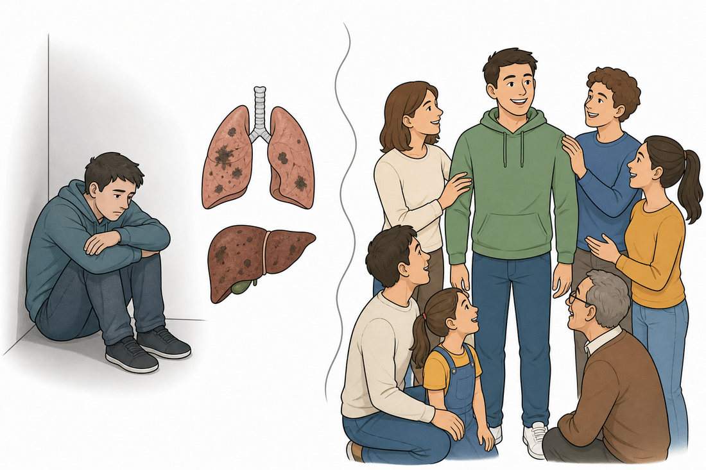


**<span style="color:#C00000">Les effets sur l'organisme et sur la vie sociale</span>**

**<span style="color:#1E7B34">1. Deux séries de conséquences</span>**

On pense d'abord aux maladies. Mais une substance psychoactive abîme aussi les études, le travail, la famille et les relations. Il faut donc examiner séparément ce qui touche le **corps** et ce qui touche la **vie en société**.

**<span style="color:#1E7B34">2. Les effets sur l'organisme</span>**

**a. Sur le système nerveux**
C'est la cible directe. On observe une baisse de la **vigilance**, un allongement du **temps de réaction**, des troubles de la **mémoire** et de la **concentration**, et une altération du **jugement**. À long terme, les lésions du système nerveux peuvent devenir irréversibles — rappelons que les cellules nerveuses se renouvellent très mal.

**b. Sur les autres organes**

| Substance | Principaux organes atteints |
|---|---|
| **Tabac** | poumons (cancers, bronchite chronique, asthme), cœur et vaisseaux, voies digestives |
| **Alcool** | foie (cirrhose), système nerveux, œsophage ; risque de coma en cas d'absorption massive |
| **Cannabis** | appareil respiratoire, troubles psychiatriques |
| **Médicaments détournés** | variable : somnolence, troubles de la mémoire et des gestes |

**c. La dépendance**
Accoutumance et dépendance s'installent progressivement et rendent l'arrêt difficile sans accompagnement.

**<span style="color:#1E7B34">3. Les effets sur la vie sociale</span>**

**a. Les accidents**
Réflexes ralentis et jugement altéré multiplient les accidents de la route et du travail. Le danger vient d'une combinaison redoutable : les capacités diminuent **pendant que** la personne se croit encore capable.

**b. La scolarité et le travail**
Mémoire et concentration atteintes, absences répétées : les résultats chutent. Chez l'adulte, les mêmes causes conduisent aux retards, aux erreurs, puis à la perte de l'emploi.

**c. La famille**
L'argent consacré à la substance manque pour la nourriture, les soins et la scolarité des enfants. Les tensions s'accumulent, les disputes se multiplient, et des violences peuvent apparaître. **Les enfants sont les premières victimes** d'une consommation dont ils ne sont pas responsables.

**d. L'isolement**
La personne s'éloigne peu à peu de ceux qui ne consomment pas. Cet isolement rend le retour en arrière plus difficile, car il supprime précisément le soutien dont elle aurait besoin.

**<span style="color:#1E7B34">4. Un engrenage</span>**

Ces effets s'alimentent les uns les autres : la consommation dégrade les résultats, l'échec provoque du découragement, le découragement pousse à consommer davantage. Comprendre cet enchaînement est essentiel — **il vaut bien mieux ne pas entrer dans l'engrenage que d'essayer d'en sortir**.

**<span style="color:#1E7B34">5. Sortir est possible</span>**

Une chose doit être dite en terminant. Cet engrenage n'est pas une fatalité : des personnes en sortent chaque jour. La condition est presque toujours la même — **ne pas rester seul**. Médecins, centres de santé, associations et entourage proche constituent une aide réelle.

Juger ou rejeter une personne dépendante ne fait qu'aggraver son isolement, donc sa consommation. L'attitude utile est l'inverse : écouter, ne pas condamner, orienter vers ceux qui peuvent aider.

### Section EXERCICES

**Exercice 1 (4 points)** — Classe chaque conséquence : effet sur l'**organisme** ou sur la **vie sociale**.
1. Une bronchite chronique
2. Le renvoi d'un emploi pour absences répétées
3. Des troubles de la mémoire
4. Une dispute violente dans la famille

**Exercice 2 (6 points)** — Vrai ou Faux. Corrige les affirmations fausses.
1. Seul le consommateur subit les conséquences.
2. L'alcool peut provoquer une cirrhose du foie.
3. Le tabac n'a aucun effet sur le cœur.
4. Les cellules nerveuses se renouvellent facilement.
5. L'isolement rend l'arrêt plus difficile.
6. Une personne dépendante peut s'en sortir avec de l'aide.

**Exercice 3 (6 points)** — Depuis six mois, Solo, élève en T9, consomme régulièrement. Ses notes ont chuté, il s'absente, il s'est éloigné de ses anciens camarades et a emprunté de l'argent à plusieurs personnes.
1. Relève **deux** effets sur son organisme et **deux** effets sur sa vie sociale.
2. Explique en quoi l'éloignement de ses camarades aggrave sa situation.
3. Propose deux actions concrètes que ses camarades de classe pourraient entreprendre.

**Exercice 4 (4 points)** — Choisis la bonne réponse.
1. L'alcool atteint principalement : **A.** les os **B.** le foie et le système nerveux **C.** les cheveux
2. Après consommation, le temps de réaction : **A.** diminue **B.** s'allonge **C.** ne change pas
3. Les premières victimes dans une famille sont souvent : **A.** les voisins **B.** les enfants **C.** personne
4. Face à une personne dépendante, il faut : **A.** la rejeter **B.** l'orienter vers une aide **C.** l'ignorer

**TOTAL : 20 points**

### CORRIGÉ

**Ex. 1** — 1. **organisme** · 2. **vie sociale** · 3. **organisme** · 4. **vie sociale**

**Ex. 2** — 1. **F** — la famille, l'école et la communauté subissent aussi les conséquences. 2. **V** 3. **F** — il atteint le **cœur et les vaisseaux**. 4. **F** — elles se renouvellent **très mal**, d'où la gravité des lésions. 5. **V** 6. **V**

**Ex. 3** — 1. Organisme : troubles de la **mémoire** et de la **concentration** (ses notes chutent), fatigue et risque de dépendance. Vie sociale : **échec scolaire** et absences, **isolement**, **dettes**. 2. Parce qu'il perd le **soutien** de ceux qui pourraient l'aider et se rapproche d'un entourage où la consommation est banalisée : l'isolement entretient l'engrenage. 3. Par exemple : **ne pas l'exclure** et continuer à lui parler sans le juger ; **en informer un adulte de confiance** — enseignant, parent, personnel de santé — afin qu'il soit orienté vers une aide compétente.

**Ex. 4** — 1. **B** · 2. **B** · 3. **B** · 4. **B**


---


# SÉANCE 33 / 51 — Hygiène du système nerveux et prévention

**Objectif spécifique** : énoncer les règles d'hygiène du système nerveux et proposer une action de prévention.
**Support et matériel** : grand papier et feutres pour les affiches, tableau des durées de sommeil.

| Étapes | Enseignant | Apprenants | Technique | Support | Obs. |
|---|---|---|---|---|---|
| **I. RÉVISION** | Cite deux effets des substances psychoactives sur la vie sociale.<br>Une personne dépendante peut-elle s'en sortir ? | R.A. : L'échec scolaire et les accidents.<br>R.A. : Oui, si elle est aidée. | Questionnement oral | — | |
| **II. NOUVELLE LEÇON** ||||||
| 1. Mise en situation | Deux élèves passent la même composition. L'un a dormi neuf heures et pris un petit-déjeuner ; l'autre a veillé jusqu'à deux heures du matin et n'a rien mangé. Lequel réussira le mieux, et pourquoi ? | R.A. : Le premier, parce qu'il est reposé et nourri. | Questionnement oral | Tableau noir | |
| 2. Présentation | Aujourd'hui : « Hygiène du système nerveux et prévention ». Vous saurez énoncer les règles qui protègent le système nerveux et concevoir une action de sensibilisation. | Les élèves écoutent. | Exposé | Tableau noir | |
| 3. Observation | Observez ce tableau des durées de sommeil conseillées selon l'âge. Repérez la ligne qui vous concerne et comparez avec vos habitudes réelles. | Les élèves observent et comparent. | Observation dirigée | Tableau des durées | |
| 4. Analyse | Que se passe-t-il dans le corps pendant le sommeil ?<br>Pourquoi un élève qui n'a pas déjeuné a-t-il du mal à suivre en fin de matinée ?<br>Quel lien entre l'activité physique et le système nerveux ?<br>Mieux vaut-il empêcher la première consommation ou soigner la dépendance ? Pourquoi ? | R.A. : Les muscles se reposent, les informations de la journée sont enregistrées.<br>R.A. : Le sucre du sang baisse, il est fatigué.<br>R.A. : Elle évite la sédentarité et aide à bien dormir.<br>R.A. : Mieux vaut l'empêcher, c'est plus facile. | Travail de groupe, discussion | Tableau, documents | |
| 5. Synthèse | **Donc,** le système nerveux exige un **sommeil suffisant et régulier**, une **alimentation équilibrée** comprenant un vrai petit-déjeuner, une **activité physique** régulière, et l'**absence de substances psychoactives**. La prévention vaut mieux que le traitement : refuser la première consommation est bien plus simple que de sortir d'une dépendance installée. | Les élèves recopient. | Exposé magistral | Tableau noir | |
| 6. Application | **Ex. 1** — Bonne ou mauvaise habitude ? a) se coucher à heures régulières · b) veiller devant un écran jusqu'à minuit · c) prendre un petit-déjeuner · d) sauter le repas du matin<br><br>**Ex. 2** — En groupe, rédigez le **slogan** d'une affiche de sensibilisation destinée à votre école. | **Ex. 1** : a) **bonne** b) **mauvaise** c) **bonne** d) **mauvaise**<br><br>**Ex. 2** : slogan court, positif, compréhensible ; exemples : « Mon cerveau grandit encore : je le protège », « Dormir, c'est apprendre ». | Travail de groupe, production | Grande ardoise, papier | |
| **III. ÉVALUATION** | **Ex. 1** — Cite quatre règles d'hygiène du système nerveux.<br><br>**Ex. 2** — Présente en cinq lignes un mini-projet de lutte contre les substances psychoactives réalisable dans ton école : objectif, public visé, action, moyens. | **Ex. 1** : dormir suffisamment et à heures régulières ; manger équilibré, ne pas sauter le petit-déjeuner ; pratiquer une activité physique ; éviter les substances psychoactives ; alterner travail et repos.<br><br>**Ex. 2** : projet cohérent et réalisable — par exemple une exposition d'affiches réalisées par la classe, présentée aux élèves des autres niveaux, avec l'appui d'un agent de santé invité. | Évaluation écrite, mini-projet | Cahier, papier | |

### Page LEÇON

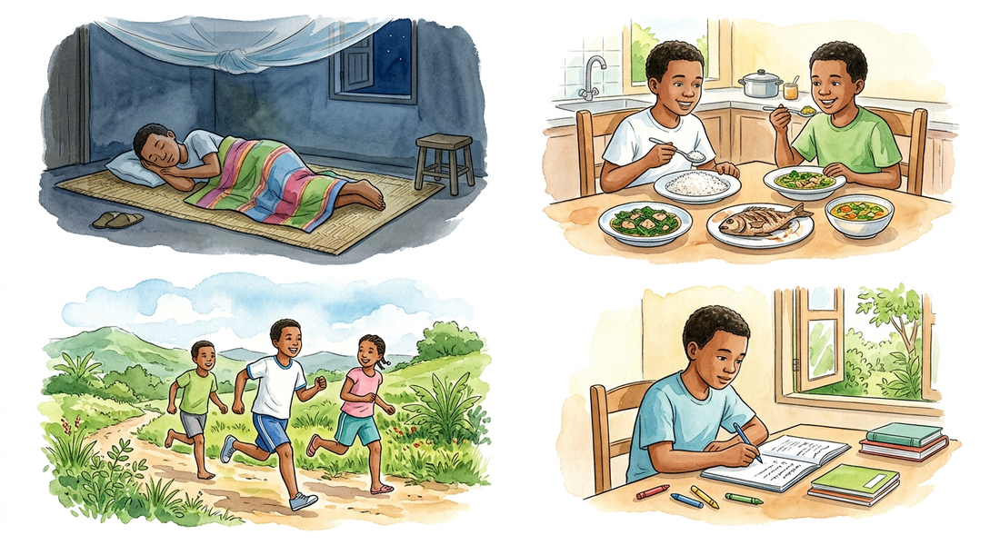


**<span style="color:#C00000">Hygiène du système nerveux et prévention</span>**

**<span style="color:#1E7B34">1. Le sommeil</span>**

Le sommeil n'est pas du temps perdu. Pendant qu'il dure, le corps fonctionne au ralenti, les muscles récupèrent, et le cerveau **trie et enregistre** les informations reçues dans la journée. C'est en dormant que l'on consolide ce que l'on a appris : une nuit blanche avant une composition est donc contre-productive.

Durées conseillées selon l'âge :

| Âge | Durée conseillée |
|---|---|
| Nouveau-né | 14 à 17 h |
| Enfant de 1 à 2 ans | 11 à 14 h |
| Écolier (6 à 13 ans) | 9 à 11 h |
| **Adolescent (14 à 17 ans)** | **8 à 10 h** |
| Adulte | 7 à 9 h |
| Personne âgée | 7 à 8 h |

> **Note sur les chiffres.** Le fascicule du Ministère indique 20 heures pour le nouveau-né. Les recommandations internationales actuelles retiennent une fourchette de 14 à 17 heures. Le tableau ci-dessus reprend ces dernières.

**Les règles d'un bon sommeil** : se coucher à des **heures régulières** ; dormir dans une pièce **silencieuse, sombre et bien ventilée**, dont la température reste modérée ; écarter le soir les boissons excitantes comme le café ou le thé fort ; préférer une activité calme avant le coucher — lecture, musique douce — plutôt qu'un écran, dont la lumière retarde l'endormissement.

**<span style="color:#1E7B34">2. L'alimentation</span>**

Le cerveau consomme beaucoup d'énergie et ne dispose d'aucune réserve : il dépend directement du **sucre apporté par le sang**.

Un élève qui part sans petit-déjeuner voit son taux de sucre sanguin baisser en fin de matinée. Apparaissent alors fatigue, difficultés de concentration, parfois maux de tête. Ce n'est pas un manque de volonté : c'est un manque de carburant.

À l'inverse, un déjeuner trop copieux, pris dans le bruit et la précipitation, provoque une somnolence l'après-midi et perturbe le sommeil de la nuit suivante. Le principe reste celui de l'Unité I : des repas **équilibrés et réguliers**.

**<span style="color:#1E7B34">3. L'activité physique et le repos</span>**

L'exercice régulier améliore l'oxygénation du cerveau, réduit les tensions et facilite l'endormissement. La **sédentarité** — rester assis toute la journée — produit l'effet inverse.

Il faut aussi savoir **alterner travail et repos**. Réviser six heures d'affilée est moins efficace que de travailler par périodes entrecoupées de courtes pauses : l'attention s'épuise et le rendement s'effondre.

**<span style="color:#1E7B34">4. Éviter les substances psychoactives</span>**

Cela découle de tout ce qui précède. Tabac, alcool et autres substances agressent directement l'organe le plus difficile à réparer du corps humain, à l'âge précis où il achève sa construction.

**<span style="color:#1E7B34">5. Prévenir plutôt que guérir</span>**

Sortir d'une dépendance est long, difficile, et ne réussit pas toujours du premier coup. **Ne pas commencer est incomparablement plus simple.** Trois moyens d'agir :

**S'informer.** Beaucoup de premières consommations reposent sur des idées fausses : « ça détend », « ça aide à travailler », « on arrête quand on veut ». Connaître les effets réels permet de ne pas y croire.

**Savoir refuser.** La pression du groupe est le premier facteur d'entrée. Un refus n'a pas besoin d'être long : un « non, merci » ferme et répété suffit. On peut aussi s'appuyer sur ses amis, changer de sujet ou s'éloigner. **Refuser n'est pas se mettre à l'écart : c'est décider pour soi-même.**

**Agir ensemble.** Une action collective — exposition d'affiches, saynète, débat avec un agent de santé, club scolaire — touche plus de monde qu'une décision individuelle et crée dans l'établissement un climat où refuser devient normal.

**<span style="color:#1E7B34">6. Construire un mini-projet de prévention</span>**

Un projet utile tient en quatre questions :

| Question | Exemple de réponse |
|---|---|
| **Quel objectif ?** | faire connaître les effets du tabac aux élèves de l'école |
| **Quel public ?** | les classes de T7 à T9 |
| **Quelle action ?** | une exposition d'affiches réalisées par la classe, avec une saynète en lever de rideau |
| **Quels moyens ?** | papier, feutres, mur du préau, un agent de santé invité |

Le message doit rester **court, positif et exact**. Un slogan qui effraie sans expliquer est vite oublié ; un slogan qui exagère perd toute crédibilité dès que les élèves constatent que la réalité est différente.

### Section EXERCICES

**Exercice 1 (4 points)** — Indique si l'habitude est **bonne** ou **mauvaise** pour le système nerveux.
1. Se coucher chaque soir à peu près à la même heure
2. Boire du café fort juste avant de dormir
3. Prendre un petit-déjeuner avant de partir à l'école
4. Réviser six heures de suite sans aucune pause

**Exercice 2 (6 points)** — Complète avec : *sucre, régulières, enregistre, sédentarité, pauses, obscure*
1. Pendant le sommeil, le cerveau …… les informations de la journée.
2. Il faut se coucher à des heures …….
3. La chambre doit être calme et …….
4. Le cerveau a besoin du …… apporté par le sang.
5. La …… nuit au système nerveux.
6. Il faut entrecouper le travail de courtes …….

**Exercice 3 (6 points)** — Voici l'emploi du temps d'une élève de T9 : coucher à 1 h du matin, lever à 5 h 30, pas de petit-déjeuner, aucune activité physique. Elle se plaint d'être fatiguée et de ne rien retenir.
1. Calcule sa durée de sommeil et compare-la à la durée conseillée pour son âge.
2. Relie chacune de ses trois habitudes à une conséquence précise sur son système nerveux.
3. Propose-lui trois changements concrets.

**Exercice 4 (4 points)** — Choisis la bonne réponse.
1. Un adolescent de 14 ans devrait dormir : **A.** 4 à 5 h **B.** 8 à 10 h **C.** 14 h
2. Pendant le sommeil, le cerveau : **A.** s'arrête complètement **B.** trie et enregistre **C.** grandit en taille
3. Sauter le petit-déjeuner provoque en fin de matinée : **A.** une hausse d'énergie **B.** fatigue et baisse de concentration **C.** aucun effet
4. La meilleure protection contre la dépendance est : **A.** ne pas commencer **B.** commencer peu **C.** arrêter seul

**TOTAL : 20 points**

### CORRIGÉ

**Ex. 1** — 1. **bonne** · 2. **mauvaise** · 3. **bonne** · 4. **mauvaise**

**Ex. 2** — 1. **enregistre** · 2. **régulières** · 3. **obscure** · 4. **sucre** · 5. **sédentarité** · 6. **pauses**

**Ex. 3** — 1. De 1 h à 5 h 30, elle dort **4 h 30**. La durée conseillée à son âge est de **8 à 10 h** : il lui manque donc au minimum **3 h 30** de sommeil chaque nuit. 2. Le **manque de sommeil** empêche le cerveau de consolider ce qu'elle a appris, d'où les difficultés de mémorisation ; l'**absence de petit-déjeuner** fait chuter le sucre sanguin en fin de matinée, d'où la fatigue et le manque de concentration ; l'**absence d'activité physique** dégrade l'oxygénation et rend l'endormissement plus difficile, ce qui entretient le manque de sommeil. 3. Se coucher plus tôt pour atteindre au moins 8 h de sommeil ; prendre un petit-déjeuner, même léger ; pratiquer une activité physique régulière. On peut ajouter : répartir ses révisions sur la semaine plutôt que de veiller la nuit.

**Ex. 4** — 1. **B** · 2. **B** · 3. **B** · 4. **A**


---


# SÉANCE 34 / 51 — Révision de l'Unité III : sujet d'entraînement

**Thème** : Santé et bien-être · **Valeurs à véhiculer** : connaissance de soi, altruisme
**Objectif spécifique** : traiter un sujet complet portant sur les séances 25 à 33, puis identifier ses propres erreurs à l'aide du corrigé commenté.
**Support et matériel** : sujet recopié au tableau ou polycopié, cahier de brouillon.

| Étapes | Enseignant | Apprenants | Technique | Support | Obs. |
|---|---|---|---|---|---|
| **I. RÉVISION** | Sans ouvrir votre cahier : quelles sont les trois parties de l'encéphale ? Qui commande le réflexe de retrait ? | R.A. : Cerveau, cervelet, tronc cérébral.<br>R.A. : La moelle épinière. | Questionnement oral | — | |
| **II. NOUVELLE LEÇON** ||||||
| 1. Mise en situation | Un sujet d'entraînement en conditions d'examen. Il ne compte pas : il sert à repérer ce qui n'est pas acquis. | Les élèves s'installent. | Consigne | Tableau noir | |
| 2. Présentation | Quatre exercices, 20 points. Cahiers fermés, travail individuel. | Les élèves écoutent. | Exposé | Tableau noir | |
| 3. Passation | L'enseignant distribue le sujet et surveille sans intervenir sur le fond. | Les élèves traitent le sujet. | Travail individuel | Sujet, cahier | |
| 4. Correction collective | Exercice par exercice : interroger, faire justifier, donner la réponse, **nommer l'erreur fréquente**. | Les élèves corrigent au stylo de couleur. | Correction dirigée | Tableau noir | |
| 5. Synthèse | **Donc,** les points faibles sont relevés au tableau. Chacun note les deux notions à retravailler avant la séance 35. | Les élèves notent. | Bilan collectif | Cahier | |
| **III. ÉVALUATION** | Chaque élève reporte son score sur 20 et le situe dans les repères. | Les élèves calculent leur score. | Auto-évaluation | Cahier | |

---

## Sujet d'entraînement — Unité III (Santé et bien-être) — **/20**

### Exercice 1 — Connaissances *(4 points)*

**A. Qui commande ?** Associe chaque action à la partie du système nerveux responsable *(2 points)*

| Action | | Partie |
|---|---|---|
| 1. Réciter une leçon | | a. Cervelet |
| 2. Tenir en équilibre sur un pied | | b. Moelle épinière |
| 3. Respirer pendant le sommeil | | c. Cerveau |
| 4. Retirer sa main d'une flamme | | d. Tronc cérébral |

**B. Vrai ou faux — justifie en une phrase** *(2 points)*

1. Le cervelet est le centre du réflexe.
2. Un réflexe acquis s'obtient par répétition.

### Exercice 2 — Exercice chiffré *(6 points)*

Un adolescent de 15 ans dort **6 heures par nuit**. Les recommandations pour son âge sont de **8 à 10 heures**.

1. Quel est son déficit de sommeil par nuit, par rapport au minimum recommandé ? *(1,5 pt)*
2. Quel déficit cela représente-t-il sur une semaine de 7 nuits ? *(1,5 pt)*
3. Exprime ce déficit hebdomadaire en pourcentage du temps de sommeil minimum recommandé sur la semaine. *(2 pts)*
4. Combien d'heures devrait-il dormir par nuit pour atteindre le minimum recommandé ? *(1 pt)*

### Exercice 3 — Étude de document *(6 points)*

On mesure le temps de réaction de 40 élèves à un signal lumineux, avant puis après une nuit de sommeil insuffisant.

| | Temps de réaction moyen | Nombre d'erreurs sur 20 essais |
|---|---|---|
| Après une nuit de 9 heures | 0,25 seconde | 2 |
| Après une nuit de 4 heures | 0,40 seconde | 9 |

1. De combien le temps de réaction augmente-t-il ? Exprime cette augmentation en pourcentage. *(2 pts)*
2. Calcule le taux d'erreur dans chacune des deux situations. *(2 pts)*
3. Quelle conclusion tires-tu sur le rôle du sommeil pour le système nerveux ? *(2 pts)*

### Exercice 4 — Situation *(4 points)*

Un camarade vous dit : « Je prends ce produit seulement le week-end, avec mes amis. Je peux arrêter quand je veux, donc ce n'est pas un problème. »

Réponds-lui en deux arguments, sans le juger.

---

## Corrigé commenté — séance 34

### Exercice 1 *(4 pts)*

**A.** 1 → **c** · 2 → **a** · 3 → **d** · 4 → **b** *(0,5 pt par association)*

**B.** *(1 pt par item)*

1. **Faux.** Le centre du réflexe de retrait est la **moelle épinière**. Le cervelet, lui, coordonne les mouvements et maintient l'équilibre — c'est une fonction différente.
2. **Vrai.** Le réflexe acquis s'installe par **apprentissage et répétition** : pédaler, écrire, freiner. Le réflexe inné, lui, est présent dès la naissance.

> ⚠️ **Erreur fréquente.** Attribuer le réflexe au cervelet, à cause de la ressemblance des mots « coordination » et « commande ». Le trajet d'un réflexe de retrait passe par la **moelle épinière**, sans remonter au cerveau : c'est ce qui le rend si rapide.

### Exercice 2 *(6 pts)*

1. 8 − 6 = **2 heures de déficit par nuit** *(1,5 pt)*
2. 2 × 7 = **14 heures par semaine** *(1,5 pt)*
3. Minimum hebdomadaire : 8 × 7 = 56 heures ; 14 ÷ 56 = 0,25 = **25 %** *(2 pts)*
4. Il devrait dormir **8 heures**, soit **2 heures de plus** qu'actuellement. *(1 pt)*

> ⚠️ **Erreur fréquente.** À la question 3, diviser par le temps réellement dormi (42 h) au lieu du minimum recommandé (56 h). Lire attentivement la référence demandée.

### Exercice 3 *(6 pts)*

1. 0,40 − 0,25 = 0,15 seconde ; 0,15 ÷ 0,25 = 0,60 = **+60 %** *(2 pts)*
2. Après 9 heures : 2 ÷ 20 = **10 %** · Après 4 heures : 9 ÷ 20 = **45 %** *(1 pt chacun)*
3. Le manque de sommeil **dégrade nettement les performances du système nerveux** : les réactions sont plus lentes de 60 % et les erreurs sont multipliées par 4,5. Le sommeil n'est pas du temps perdu, c'est la période pendant laquelle le système nerveux récupère et consolide les apprentissages. Les conséquences sont concrètes : risque d'accident, difficultés de concentration en classe. *(2 pts)*

> ⚠️ **Erreur fréquente.** Écrire « le temps de réaction augmente de 0,15 » sans convertir en pourcentage quand la question le demande explicitement.

### Exercice 4 *(4 pts)*

*(2 pts par argument)*

- **Argument 1 — l'usage occasionnel agit quand même.** Le produit atteint le système nerveux à chaque prise, quelle que soit la fréquence : il modifie la vigilance, les réflexes et le jugement sur le moment. Les risques immédiats — accident, conduite dangereuse, geste regretté — ne dépendent pas de la régularité de la consommation.
- **Argument 2 — « pouvoir arrêter » se vérifie mal de l'intérieur.** L'installation de la dépendance est progressive et l'on s'en aperçoit rarement soi-même ; la conviction de maîtriser en fait partie. Le point important est qu'il n'y a **rien d'irréversible** : on sort d'une dépendance, et d'autant plus facilement qu'on s'y prend tôt et qu'on est aidé — par un adulte de confiance, un enseignant, un centre de santé.

> 🧑‍🏫 **Note à l'enseignant.** Cette question applique la règle de registre posée à l'unité III : on nomme le risque sans jamais désigner un camarade comme coupable, et on **conclut toujours sur une action possible**. Une copie qui condamne le camarade sans ouvrir de porte de sortie ne dépasse pas 2 points.

**Repères de score** : 16-20 acquis · 11-15 à consolider · 6-10 fragile · 0-5 reprendre les séances 25 à 33.


---


# SÉANCE 35 / 51 — Examen de l'Unité III : Santé et bien-être

**Thème** : Santé et bien-être · **Valeurs à véhiculer** : connaissance de soi, altruisme
**Objectif spécifique** : évaluer la maîtrise des notions des séances 25 à 33 — organisation du système nerveux, mouvements réflexes et volontaires, substances psychoactives, hygiène nerveuse.
**Support et matériel** : sujet polycopié ou recopié au tableau, cahier de composition.

| Étapes | Enseignant | Apprenants | Technique | Support | Obs. |
|---|---|---|---|---|---|
| **I. RÉVISION** | Rappel des consignes d'examen. Aucune question de fond pendant l'épreuve. | Les élèves rangent cahiers et livres. | Consigne | — | |
| **II. NOUVELLE LEÇON** ||||||
| 1. Mise en situation | L'enseignant écrit le barème au tableau : 4 + 6 + 6 + 4 = 20. | Les élèves notent le barème. | Consigne | Tableau noir | |
| 2. Présentation | Lecture à voix haute du sujet, sans commentaire. | Les élèves suivent. | Lecture dirigée | Sujet | |
| 3. Passation | Surveillance active, sans reformulation de fond. | Les élèves composent individuellement. | Évaluation écrite | Sujet, cahier | |
| 4. Ramassage | Ramassage des copies, vérification des noms. | Les élèves rendent leur copie. | Organisation | Copies | |
| 5. Synthèse | **Donc,** la correction sera rendue à la séance suivante. | Les élèves écoutent. | Bilan | — | |
| **III. ÉVALUATION** | *(L'épreuve elle-même constitue l'évaluation.)* | | Évaluation écrite | Copies | |

---

## SUJET D'EXAMEN — Unité III : Santé et bien-être — **Durée : ____________ — /20**

### Exercice 1 — Connaissances *(4 points)*

**A. Schéma à légender — l'arc réflexe** *(2 points)*

Reproduis le schéma ci-dessous et place, dans l'ordre du trajet, les cinq éléments suivants :

> nerf moteur · récepteur cutané · moelle épinière · muscle (organe effecteur) · nerf sensitif


*Schéma à reproduire au tableau ou à photocopier. Le trajet est figuré par deux voies de couleurs différentes ; les noms ne sont pas écrits, c'est à l'élève de les placer.*

**B. Complète avec le mot exact** *(2 points)*

1. Le ……………………… coordonne les mouvements et maintient l'équilibre.
2. Le ………………………………… règle la respiration et le rythme du cœur.
3. Les substances qui ralentissent l'activité du système nerveux sont dites ………………………… .
4. Un mouvement ………………………… est décidé et commandé par le cerveau.

### Exercice 2 — Exercice chiffré *(6 points)*

Un message nerveux se propage le long d'un nerf à la vitesse de **60 mètres par seconde**.

Chez un élève, la distance entre la main et la moelle épinière est de **0,90 mètre**.

1. Calcule la durée du trajet du message de la main jusqu'à la moelle épinière. Exprime le résultat en millisecondes. *(2 pts)*
2. Le message de retour, de la moelle jusqu'au muscle du bras, parcourt **0,75 mètre**. Calcule cette durée. *(1,5 pt)*
3. En ajoutant **2 millisecondes** de traitement dans la moelle, quelle est la durée totale du réflexe ? *(1,5 pt)*
4. Le même geste, s'il était volontaire, demanderait environ **200 millisecondes**. Combien de fois le réflexe est-il plus rapide ? *(1 pt)*

### Exercice 3 — Étude de document *(6 points)*

Une enquête est menée auprès de **500 élèves** d'un lycée sur la consommation de substances psychoactives.

| | Nombre d'élèves |
|---|---|
| N'ont jamais consommé | 385 |
| Ont consommé au moins une fois | 115 |
| Parmi ces derniers : déclarent avoir des difficultés de concentration | 69 |
| Parmi les non-consommateurs : déclarent des difficultés de concentration | 77 |

1. Quel pourcentage des élèves interrogés a déjà consommé ? *(1,5 pt)*
2. Calcule, dans chaque groupe, le pourcentage d'élèves déclarant des difficultés de concentration. *(2,5 pts)*
3. Peut-on conclure de ce document que la consommation **cause** les difficultés de concentration ? Justifie. *(2 pts)*

### Exercice 4 — Situation *(4 points)*

Un élève de votre classe dort 5 heures par nuit, regarde un écran jusque tard, et s'endort en cours.

1. Cite **deux** conséquences de ce mode de vie sur son système nerveux. *(2 pts)*
2. Propose **deux** mesures d'hygiène concrètes qu'il pourrait appliquer dès ce soir. *(2 pts)*

---

## CORRIGÉ ET BARÈME — séance 35

### Exercice 1 *(4 pts)*

**A.** *(0,4 pt par élément correctement placé dans l'ordre)*

> récepteur cutané → nerf sensitif → moelle épinière → nerf moteur → muscle (organe effecteur)

| Position sur le dessin | Légende attendue |
|---|---|
| Tache rosée sur le bout du doigt, près de la flamme | **récepteur cutané** |
| Voie **bleue**, du doigt vers la moelle | **nerf sensitif** |
| Coupe ovale à droite, à zone centrale en forme de papillon | **moelle épinière** |
| Voie **rouge**, de la moelle vers le bras | **nerf moteur** |
| Muscle du bras, en bas à gauche | **muscle (organe effecteur)** |

> **Consigne au correcteur.** L'erreur à sanctionner est l'inversion des deux voies : le message **part** du récepteur par le nerf sensitif et **revient** au muscle par le nerf moteur. Un élève qui intervertit bleu et rouge n'a pas compris le sens du trajet, même s'il connaît les cinq mots. Rappel de la leçon : le message **ne remonte pas au cerveau** — c'est ce qui rend le réflexe si rapide.

**B.** *(0,5 pt par mot)*
1. **cervelet** — 2. **tronc cérébral** — 3. **dépresseurs** — 4. **volontaire**

*Renvoi : séances 25, 26, 29, 30, 31.*

### Exercice 2 *(6 pts)*

1. t = d ÷ v = 0,90 ÷ 60 = 0,015 s = **15 millisecondes** *(2 pts — 1 pt pour la formule, 1 pt pour la conversion)*
2. 0,75 ÷ 60 = 0,0125 s = **12,5 millisecondes** *(1,5 pt)*
3. 15 + 12,5 + 2 = **29,5 millisecondes** *(1,5 pt)*
4. 200 ÷ 29,5 ≈ **6,8 fois plus rapide** *(1 pt)*

> **Consigne au correcteur.** Accepter à la question 4 toute réponse entre 6,7 et 6,8. Une réponse exprimée en secondes sans conversion en millisecondes perd **0,5 pt** par question concernée, l'énoncé imposant l'unité.

*Renvoi : séance 30.*

### Exercice 3 *(6 pts)*

1. 115 ÷ 500 = 0,23 = **23 %** *(1,5 pt)*
2. Consommateurs : 69 ÷ 115 = 0,60 = **60 %** · Non-consommateurs : 77 ÷ 385 = 0,20 = **20 %** *(1,25 pt chacun)*
3. **Non, pas à partir de ce seul document.** Il montre une **association** nette — trois fois plus de difficultés déclarées chez les consommateurs — mais une association n'est pas une preuve de cause. D'autres explications sont possibles : des élèves déjà en difficulté peuvent être davantage tentés de consommer, ou un troisième facteur (manque de sommeil, situation familiale difficile) peut agir sur les deux à la fois. Pour conclure à une cause, il faudrait une étude suivie dans le temps. *(2 pts)*

> **Consigne au correcteur.** La question 3 est la plus discriminante du sujet. Attribuer les 2 points seulement si la copie **distingue explicitement association et causalité**. Une copie qui répond « oui, c'est évident » n'obtient aucun point, même avec des calculs justes aux questions précédentes.

*Renvoi : séances 31, 32.*

### Exercice 4 *(4 pts)*

1. *(1 pt par conséquence)* Deux attendues parmi : **baisse de la vigilance et de la concentration** en classe ; **allongement du temps de réaction**, avec risque d'accident ; **troubles de la mémorisation**, le sommeil étant la période de consolidation des apprentissages ; **irritabilité et fatigue** persistantes ; **somnolence diurne**.

2. *(1 pt par mesure)* Deux attendues parmi : **arrêter les écrans au moins une heure avant le coucher** — leur lumière retarde l'endormissement ; **se coucher et se lever à heures régulières**, y compris le week-end ; **éviter le café et le thé le soir** ; **dormir dans l'obscurité et au calme** ; **pratiquer une activité physique dans la journée**, mais pas juste avant le coucher.

> **Consigne au correcteur.** Exiger des mesures **concrètes et applicables**. « Mieux dormir » ou « faire attention » ne valent aucun point : la question demande ce qu'il peut faire **dès ce soir**.

*Renvoi : séance 33.*

**TOTAL : 20 points**


---


# SÉANCE 36 / 51 — La fistule obstétricale : définition et symptômes

**Objectif spécifique** : définir la fistule obstétricale, décrire le mécanisme de sa formation et reconnaître ses symptômes.
**Support et matériel** : schéma du petit bassin au tableau (vessie, utérus, vagin, rectum), cahier.

> 🧑‍🏫 **Note à l'enseignant.** Cette séance aborde un sujet intime. Posez d'emblée deux règles : on utilise les mots justes, et on ne se moque jamais. Il est possible qu'une élève de la classe connaisse une femme concernée. Indiquez qu'une fistule **se soigne par une opération** dès la première séance : les élèves doivent apprendre cette maladie en sachant qu'elle a une issue.

| Étapes | Enseignant | Apprenants | Technique | Support | Obs. |
|---|---|---|---|---|---|
| **I. RÉVISION** | Citez les organes de l'appareil génital féminin que vous connaissez.<br>Quel organe stocke l'urine ? | R.A. : Les ovaires, l'utérus, le vagin.<br>R.A. : La vessie. | Questionnement oral | — | |
| **II. NOUVELLE LEÇON** ||||||
| 1. Mise en situation | Une jeune femme accouche à la maison. Le travail dure trois jours. L'enfant ne survit pas. Depuis, elle perd ses urines sans pouvoir se retenir, jour et nuit. Ce n'est ni une faiblesse ni une malpropreté : c'est une blessure. Laquelle ? | R.A. : Les élèves émettent des hypothèses. | Questionnement oral | Tableau noir | |
| 2. Présentation | Aujourd'hui : « La fistule obstétricale : définition et symptômes ». Vous saurez expliquer ce qu'est une fistule, comment elle se forme et comment on la reconnaît. | Les élèves écoutent. | Exposé | Tableau noir | |
| 3. Observation | Observez le schéma du petit bassin. Repérez trois organes voisins, séparés par de fines parois : la **vessie** en avant, le **vagin** au milieu, le **rectum** en arrière. | Les élèves observent et nomment les organes. | Observation dirigée | Schéma | |
| 4. Analyse | Pendant l'accouchement, la tête du fœtus descend dans le bassin. Si elle reste bloquée plusieurs jours, elle comprime ces parois contre les os. Que se passe-t-il pour un tissu comprimé qui ne reçoit plus de sang ?<br>Si la paroi entre la vessie et le vagin se perce, par où l'urine s'écoule-t-elle ?<br>La femme peut-elle se retenir ?<br>Pourquoi parle-t-on d'une **communication anormale** ? | R.A. : Il meurt, il se nécrose.<br>R.A. : Elle passe dans le vagin et s'écoule en permanence.<br>R.A. : Non, cela ne passe plus par le canal normal.<br>R.A. : Parce qu'il s'est créé un passage là où il ne devrait pas y en avoir. | Étude de document, questionnement | Schéma, tableau | |
| 5. Synthèse | **Donc,** la fistule obstétricale est une **communication anormale** — une ouverture — qui relie le vagin soit à la vessie, soit au rectum. Elle résulte d'un **accouchement qui se prolonge sans être secouru** : la tête du fœtus comprime les tissus contre les os du bassin, le sang ne circule plus, les tissus se nécrosent et se percent. Le symptôme principal est une **fuite permanente et involontaire d'urine**, parfois de matières fécales. **Ce n'est pas une maladie honteuse : c'est une blessure, et elle s'opère.** | Les élèves recopient. | Exposé magistral | Tableau noir | |
| 6. Application | **Ex. 1** — Vrai ou Faux : 1. La fistule est une maladie contagieuse. 2. Elle résulte d'un accouchement trop long. 3. La femme peut retenir ses urines. 4. La fistule peut être opérée.<br><br>**Ex. 2** — Remets dans l'ordre : *nécrose des tissus · travail prolongé · fuite permanente d'urine · compression contre les os · perforation de la paroi* | **Ex. 1** : 1. **F** 2. **V** 3. **F** 4. **V**<br><br>**Ex. 2** : travail prolongé → compression contre les os → nécrose des tissus → perforation de la paroi → fuite permanente d'urine. | Travail de groupe | Grande ardoise | |
| **III. ÉVALUATION** | **Ex. 1** — Définis la fistule obstétricale en une phrase.<br><br>**Ex. 2** — Une camarade affirme : « Cette maladie arrive aux femmes sales. » Que lui réponds-tu ? | **Ex. 1** : C'est une communication anormale reliant le vagin soit à la vessie, soit au rectum, provoquée par un accouchement long et non secouru.<br><br>**Ex. 2** : C'est faux. La fistule n'a **aucun rapport avec l'hygiène** : c'est une blessure interne due à un accouchement trop long sans assistance médicale. L'odeur vient de la fuite d'urine, que la femme ne peut pas retenir — elle la subit, elle n'en est pas responsable. | Évaluation écrite | Cahier | |

### Page LEÇON

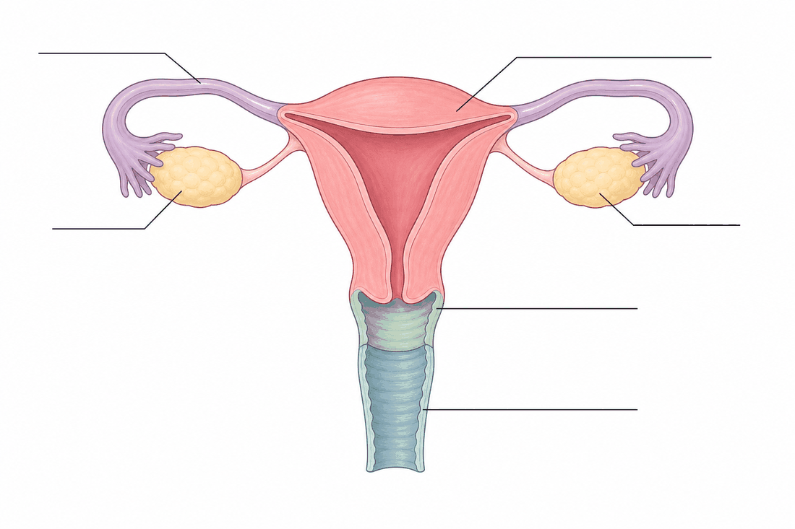


**<span style="color:#C00000">La fistule obstétricale : définition et symptômes</span>**

**<span style="color:#1E7B34">1. Ce qu'est une fistule</span>**

En médecine, une **fistule** est une **communication anormale entre deux organes** qui ne devraient pas être reliés — un passage ouvert là où la nature avait placé une paroi.

Il existe plusieurs sortes de fistules dans le corps humain, qui n'ont rien à voir entre elles : reliant une artère à une veine voisine, à l'intérieur d'un poumon, ou encore entre le rectum et le vagin. Celle qui nous occupe est la **fistule obstétricale**, ainsi nommée parce qu'elle survient **lors d'un accouchement** — c'est le sens du mot *obstétrique*, la médecine de l'accouchement.

On en distingue deux formes selon les organes touchés :

| Forme | Communication | Conséquence |
|---|---|---|
| **Fistule vésico-vaginale** (la plus fréquente) | entre la **vessie** et le **vagin** | fuite permanente d'**urine** |
| **Fistule recto-vaginale** | entre le **rectum** et le **vagin** | fuite de **matières fécales** et de gaz |

Les deux peuvent coexister chez une même patiente lorsque la compression a été très prolongée.

**<span style="color:#1E7B34">2. Le mécanisme, étape par étape</span>**

Comprendre ce mécanisme est essentiel : il explique à la fois pourquoi la fistule survient et comment on l'évite.

Dans le petit bassin, trois organes sont voisins et séparés par de **fines parois de tissus mous** : la **vessie** en avant, le **vagin** au milieu, le **rectum** en arrière. Autour d'eux, les **os du bassin** forment un anneau rigide.

> **1.** Le travail d'accouchement commence, mais la tête du fœtus **ne peut pas franchir** le bassin — il est trop étroit, ou la position est mauvaise.
> **2.** Le travail se prolonge : des heures, parfois **plusieurs jours**, sans césarienne.
> **3.** La tête du fœtus reste bloquée et **comprime les tissus mous** contre les os du bassin.
> **4.** Comprimés, les vaisseaux sanguins ne laissent plus passer le sang. Privés d'oxygène, les tissus **se nécrosent** — ils meurent.
> **5.** Les tissus morts se détachent. Il reste un **trou** : la paroi est perforée. La fistule est constituée.

Dans la grande majorité des cas, le fœtus ne survit pas à un travail aussi long. La femme perd donc son enfant **et** se retrouve blessée.

**<span style="color:#1E7B34">3. Les symptômes</span>**

Le symptôme principal, celui qui fait reconnaître la maladie, est l'**incontinence permanente** : la femme perd ses urines — et parfois ses selles — **en continu, sans pouvoir les retenir**, jour et nuit, sans sensation de besoin.

C'est la conséquence directe du mécanisme : l'urine ne passe plus par le canal prévu, elle s'écoule par la brèche. Aucun effort de volonté n'y change rien.

D'autres manifestations accompagnent souvent la fistule :

- une **odeur persistante** d'urine, que la toilette ne suffit pas à faire disparaître ;
- des **lésions de la peau** des cuisses et du périnée, irritées en permanence par l'humidité ;
- des **infections urinaires** à répétition ;
- des **douleurs** pelviennes ;
- parfois des **lésions nerveuses** provoquant une faiblesse des jambes.

**<span style="color:#1E7B34">4. Trois idées fausses à écarter</span>**

> **« C'est une question de propreté. »** **Faux.** La fistule est une **blessure interne**. Aucune toilette ne peut arrêter une fuite qui provient d'un trou dans une paroi. L'odeur est un symptôme, pas une négligence.

> **« C'est une punition, un mauvais sort. »** **Faux.** Le mécanisme est entièrement décrit par la médecine, étape par étape. Il n'y a là aucun mystère.

> **« On ne peut rien y faire. »** **Faux, et c'est le plus important.** La fistule obstétricale **se répare par une intervention chirurgicale**. Dans la majorité des cas, l'opération permet à la femme de redevenir continente. Des équipes pratiquent ces interventions à Madagascar. Beaucoup de femmes vivent des années avec une fistule simplement **parce qu'elles ignorent qu'elle se soigne**.

C'est précisément pour cela que cette leçon existe : une élève qui sait qu'une fistule s'opère peut, un jour, transmettre l'information à une femme qui l'ignore.

### Section EXERCICES

**Exercice 1 (4 points)** — Réponds par une phrase.
1. Que signifie le mot « fistule » en médecine ?
2. Pourquoi parle-t-on de fistule « obstétricale » ?
3. Quels sont les deux organes concernés par la fistule vésico-vaginale ?
4. Quel est le symptôme principal ?

**Exercice 2 (6 points)** — Complète avec : *nécrose, vessie, prolongé, chirurgicale, involontaire, bassin*
1. La fistule obstétricale fait suite à un travail d'accouchement ……
2. La tête du fœtus comprime les tissus contre les os du ……
3. Privés de sang, les tissus subissent une ……
4. La fistule vésico-vaginale relie le vagin à la ……
5. La fuite d'urine est permanente et ……
6. La réparation de la fistule est ……

**Exercice 3 (6 points)** — Remets dans l'ordre les cinq étapes de la formation d'une fistule, puis explique.
*a. Les tissus morts se détachent et laissent un trou · b. Le travail d'accouchement se prolonge sans césarienne · c. Les tissus privés de sang se nécrosent · d. L'urine s'écoule en permanence par le vagin · e. La tête du fœtus comprime les tissus contre les os*
1. Donne l'ordre correct.
2. Explique en une phrase pourquoi la compression provoque la mort des tissus.
3. Pourquoi la femme ne peut-elle pas retenir ses urines ?

**Exercice 4 (4 points)** — Choisis la bonne réponse.
1. Une fistule est : **A.** une infection **B.** une communication anormale entre deux organes **C.** une tumeur
2. La cause directe est : **A.** un manque d'hygiène **B.** un travail d'accouchement prolongé **C.** un virus
3. La fistule obstétricale est : **A.** contagieuse **B.** non contagieuse **C.** héréditaire
4. Une fistule : **A.** ne se soigne pas **B.** se répare par une opération **C.** guérit seule en une semaine

**TOTAL : 20 points**

### CORRIGÉ

**Ex. 1** — 1. Une **communication anormale entre deux organes** qui ne devraient pas être reliés. 2. Parce qu'elle survient **lors d'un accouchement** (l'obstétrique est la médecine de l'accouchement). 3. La **vessie** et le **vagin**. 4. Une **fuite permanente et involontaire d'urine**.

**Ex. 2** — 1. **prolongé** · 2. **bassin** · 3. **nécrose** · 4. **vessie** · 5. **involontaire** · 6. **chirurgicale**

**Ex. 3** —
1. **b → e → c → a → d**
2. La compression **écrase les vaisseaux sanguins** : le sang n'apporte plus d'oxygène aux tissus, qui meurent.
3. Parce que l'urine **ne passe plus par le canal normal**, muni d'un muscle de fermeture : elle s'échappe directement par la brèche, sur laquelle la femme n'a aucun contrôle.

**Ex. 4** — 1. **B** · 2. **B** · 3. **B** · 4. **B**


---


# SÉANCE 37 / 51 — Causes, conséquences et prévention de la fistule

**Objectif spécifique** : distinguer les causes médicales et les facteurs sociaux de la fistule obstétricale, décrire ses conséquences et énoncer les comportements de prévention.
**Support et matériel** : tableau à deux colonnes au tableau noir, cahier.

| Étapes | Enseignant | Apprenants | Technique | Support | Obs. |
|---|---|---|---|---|---|
| **I. RÉVISION** | Qu'est-ce qu'une fistule obstétricale ?<br>Quel est son symptôme principal ? | R.A. : Une ouverture anormale reliant le vagin à la vessie ou au rectum.<br>R.A. : Une fuite permanente et involontaire d'urine. | Questionnement oral | — | |
| **II. NOUVELLE LEÇON** ||||||
| 1. Mise en situation | Deux femmes accouchent le même jour avec la même difficulté. L'une vit à vingt minutes d'une maternité : on lui fait une césarienne, tout se passe bien. L'autre habite à huit heures de piste : elle développe une fistule. Qu'est-ce qui a fait la différence ? | R.A. : La distance, l'accès aux soins. | Questionnement oral | Tableau noir | |
| 2. Présentation | Aujourd'hui : « Causes, conséquences et prévention de la fistule ». Vous saurez distinguer causes médicales et facteurs sociaux, et énoncer les gestes qui protègent. | Les élèves écoutent. | Exposé | Tableau noir | |
| 3. Observation | Voici une liste : grossesse avant 18 ans · bassin trop étroit · pauvreté · absence de consultations prénatales · éloignement d'une maternité · malnutrition pendant l'enfance · travail prolongé sans césarienne. Classez-les en deux colonnes : causes médicales directes / facteurs sociaux. | Les élèves classent en groupes. | Étude de document, travail de groupe | Tableau à deux colonnes | |
| 4. Analyse | Pourquoi une grossesse très précoce augmente-t-elle le risque ?<br>Quel est le lien entre malnutrition dans l'enfance et fistule à l'âge adulte ?<br>La pauvreté est-elle une cause médicale ? Que fait-elle exactement ?<br>Au-delà du corps, que perd souvent une femme atteinte de fistule ? | R.A. : Le bassin n'a pas fini de grandir, il est trop étroit.<br>R.A. : Un enfant mal nourri a une croissance osseuse insuffisante, donc un bassin plus petit.<br>R.A. : Non, mais elle empêche d'atteindre les soins à temps.<br>R.A. : Son travail, sa place dans la famille, parfois son mariage. | Analyse, travail de groupe | Tableau | |
| 5. Synthèse | **Donc,** la cause médicale directe est toujours la même : un **travail prolongé sans césarienne pratiquée à temps**. Trois facteurs augmentent le risque : la **grossesse précoce** (bassin non achevé), la **malnutrition** (croissance osseuse insuffisante) et l'**absence de suivi prénatal**. À cela s'ajoutent des **facteurs sociaux** — pauvreté, éloignement, manque de personnel qualifié — qui empêchent d'accéder aux soins. Les conséquences sont **médicales** et **sociales**. La prévention repose sur quatre comportements : repousser l'âge de la première grossesse, suivre les consultations prénatales, se nourrir correctement, rejoindre une maternité dès le début du travail. | Les élèves recopient. | Exposé magistral | Tableau noir | |
| 6. Application | **Ex. 1** — Cause médicale ou facteur social ? 1. Bassin trop étroit. 2. Maternité à huit heures de marche. 3. Travail prolongé sans césarienne. 4. Absence de moyens pour payer le transport.<br><br>**Ex. 2** — Cite les quatre comportements qui protègent. | **Ex. 1** : 1. médicale · 2. sociale · 3. médicale · 4. social<br><br>**Ex. 2** : attendre avant d'envisager une première grossesse ; suivre les consultations prénatales ; avoir une alimentation saine et équilibrée ; se rendre à la maternité dès le début du travail. | Travail de groupe | Grande ardoise | |
| **III. ÉVALUATION** | **Ex. 1** — Cite trois conséquences de la fistule non traitée.<br><br>**Ex. 2** — Explique pourquoi la consultation prénatale peut éviter une fistule, alors qu'elle a lieu **avant** l'accouchement. | **Ex. 1** : (trois parmi) incontinence chronique, infections urinaires répétées, lésions cutanées, atteinte rénale, anémie, infertilité, isolement social.<br><br>**Ex. 2** : Parce qu'elle **anticipe**. Le personnel de santé mesure le bassin, suit la croissance du fœtus et repère les grossesses à risque. Il peut alors **programmer** l'accouchement en maternité, voire une césarienne, avant que le travail ne se prolonge. Prévenir suppose d'agir avant le danger, pas pendant. | Évaluation écrite | Cahier | |

### Page LEÇON

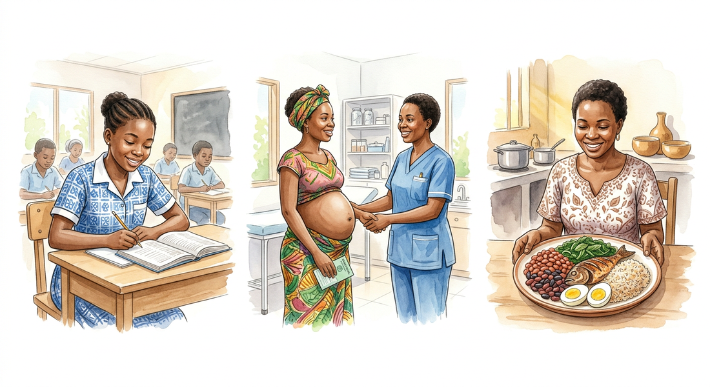


**<span style="color:#C00000">Causes, conséquences et prévention de la fistule</span>**

**<span style="color:#1E7B34">1. Une cause directe, et des facteurs qui y conduisent</span>**

Il faut distinguer deux niveaux, sous peine de ne rien comprendre à la prévention.

**La cause médicale directe est unique** : un **accouchement qui se prolonge parce qu'il est obstrué, sans césarienne pratiquée à temps**. Toutes les fistules obstétricales passent par là.

**Les facteurs de risque** sont les circonstances qui rendent cette situation probable.

| Facteur | Pourquoi il augmente le risque |
|---|---|
| **Grossesse précoce** (avant 18 ans) | le bassin n'a pas achevé sa croissance : il est trop étroit pour laisser passer la tête du fœtus |
| **Malnutrition dans l'enfance** | elle freine la croissance osseuse ; un bassin resté petit gêne l'accouchement des années plus tard |
| **Absence de consultations prénatales** | une grossesse à risque n'est pas repérée, rien n'est anticipé |
| **Éloignement d'une maternité** | le temps de trajet dépasse le temps disponible pour agir |
| **Pauvreté** | elle empêche de payer le transport, les soins, et souvent de s'absenter du travail |
| **Manque de personnel qualifié** | sans possibilité de césarienne d'urgence, l'obstruction ne peut pas être levée |

Une remarque s'impose ici. **Aucun de ces facteurs n'est une faute de la femme.** On ne choisit pas d'avoir été mal nourrie enfant, ni d'habiter loin d'un hôpital, ni d'être pauvre. C'est pourquoi la fistule obstétricale est considérée comme un indicateur de l'état d'un système de santé : elle a pratiquement disparu des pays où toute femme peut accéder à une césarienne en quelques heures.

**<span style="color:#1E7B34">2. Les conséquences médicales</span>**

Non traitée, la fistule entraîne une cascade de complications :

- **incontinence chronique** — émission involontaire et permanente d'urine ;
- **infections urinaires** à répétition, pouvant remonter vers les reins et provoquer une **atteinte rénale** ;
- **lésions cutanées** douloureuses des cuisses et du périnée, irritées en permanence ;
- **anémie** — diminution du nombre de globules rouges — liée à l'état général ;
- **infertilité** fréquente ;
- **lésions nerveuses** pouvant gêner la marche ;
- déshydratation, lorsque la femme réduit volontairement sa consommation d'eau pour limiter les fuites — ce qui **aggrave** les infections au lieu de les diminuer.

> ⚠️ **Un point important pour la prévention des complications.** Beaucoup de femmes atteintes cessent de boire, espérant réduire les fuites. C'est une erreur : une urine concentrée irrite davantage la peau et favorise les infections. Une **hydratation abondante** est au contraire recommandée en attendant l'opération.

**<span style="color:#1E7B34">3. Les conséquences sociales</span>**

Elles sont souvent plus lourdes à porter que les conséquences médicales, et elles reposent entièrement sur des **malentendus**.

Parce que l'odeur est persistante et l'incontinence visible, la femme est fréquemment mise à l'écart : elle cesse de fréquenter le marché, l'église, les réunions du village. Elle perd son activité, parfois son mariage. L'isolement conduit à la détresse psychologique.

Or **rien de tout cela n'est justifié** : la fistule n'est **pas contagieuse**, elle n'a **aucun rapport avec l'hygiène**, et elle **n'est la faute de personne**. L'exclusion repose sur une méconnaissance — et une méconnaissance, cela se corrige. C'est exactement le but de la séance 41.

**<span style="color:#1E7B34">4. La prévention : quatre comportements</span>**

> **1. Différer la première grossesse.** Attendre que le bassin ait terminé sa croissance réduit fortement le risque. C'est la mesure la plus efficace.
> **2. Suivre les consultations prénatales.** Elles permettent de repérer une grossesse à risque et d'organiser l'accouchement à l'avance.
> **3. Avoir une alimentation saine et équilibrée**, apportant suffisamment de protéines et de fer, dès l'enfance et tout au long de la grossesse.
> **4. Se rendre à la maternité dès le début du travail** — ne pas attendre que les difficultés apparaissent, car il est alors souvent trop tard pour faire le trajet.

**<span style="color:#1E7B34">5. Et si la fistule est déjà installée ?</span>**

Il reste une cinquième chose à faire, et elle est décisive : **consulter**. La fistule **se répare chirurgicalement**, y compris après plusieurs années. Une femme qui vit avec une fistule depuis dix ans peut encore être opérée.

Le principal obstacle n'est pas médical, il est **informationnel** : beaucoup de femmes ignorent simplement que cette opération existe. Transmettre cette information est une action à la portée de chacun — et c'est en cela que des élèves de T9 peuvent réellement « participer à la lutte », comme le demande le programme.

### Section EXERCICES

**Exercice 1 (4 points)** — Pour chacun de ces éléments, indique s'il s'agit d'une **cause médicale directe**, d'un **facteur de risque** ou d'une **conséquence**.
1. Travail d'accouchement prolongé sans césarienne.
2. Grossesse à 15 ans.
3. Infections urinaires à répétition.
4. Isolement social de la femme.

**Exercice 2 (6 points)** — Complète avec : *césarienne, prénatales, bassin, hydratation, chirurgicale, précoce*
1. La cause directe est un travail prolongé sans ……
2. Une grossesse …… expose davantage au risque.
3. Avant 18 ans, le …… n'a pas achevé sa croissance.
4. Les consultations …… permettent de repérer les grossesses à risque.
5. Une bonne …… limite les infections en attendant l'opération.
6. La réparation de la fistule est ……

**Exercice 3 (6 points)** — Dans une commune rurale, **6 femmes sur 300** ayant accouché dans l'année ont développé une fistule. Un centre de santé équipé pour les césariennes est ouvert ; l'année suivante, **1 femme sur 320** est concernée.
1. Calcule le taux pour 1 000 accouchements avant l'ouverture du centre.
2. Calcule ce taux après l'ouverture. *(arrondis au dixième)*
3. De combien de cas la situation s'est-elle améliorée pour 1 000 accouchements ? Que conclus-tu sur le rôle de l'accès aux soins ?

**Exercice 4 (4 points)** — Choisis la bonne réponse.
1. La mesure de prévention la plus efficace est : **A.** boire moins d'eau **B.** ne pas entamer trop tôt une première grossesse **C.** rester chez soi
2. Une femme atteinte de fistule devrait : **A.** réduire ses boissons **B.** boire abondamment **C.** ne rien changer
3. La fistule obstétricale est : **A.** contagieuse **B.** non contagieuse **C.** héréditaire
4. Une fistule vieille de dix ans : **A.** ne peut plus être opérée **B.** peut encore être opérée **C.** guérit seule

**TOTAL : 20 points**

### CORRIGÉ

**Ex. 1** — 1. **cause médicale directe** · 2. **facteur de risque** · 3. **conséquence** · 4. **conséquence** (sociale)

**Ex. 2** — 1. **césarienne** · 2. **précoce** · 3. **bassin** · 4. **prénatales** · 5. **hydratation** · 6. **chirurgicale**

**Ex. 3** —
1. 6 / 300 = 0,02 ; × 1 000 = **20 cas pour 1 000 accouchements**.
2. 1 / 320 = 0,003125 ; × 1 000 = 3,125 → **environ 3,1 cas pour 1 000**.
3. 20 − 3,1 = **16,9 cas de moins pour 1 000 accouchements**, soit une diminution d'environ **84 %**. L'accès à une maternité capable de pratiquer une césarienne est **le facteur décisif** : la cause directe de la fistule étant un travail obstrué non levé à temps, rapprocher les soins supprime l'essentiel des cas.

**Ex. 4** — 1. **B** · 2. **B** · 3. **B** · 4. **B**


---


# SÉANCE 38 / 51 — La grossesse précoce et le suivi médical

**Objectif spécifique** : expliquer les risques propres à la grossesse chez l'adolescente et décrire le contenu et l'utilité du suivi prénatal.
**Support et matériel** : schéma comparatif de bassin (adolescente / adulte), carnet de santé maternelle si disponible, cahier.

| Étapes | Enseignant | Apprenants | Technique | Support | Obs. |
|---|---|---|---|---|---|
| **I. RÉVISION** | Quels sont les quatre comportements de prévention de la fistule ?<br>Pourquoi la grossesse précoce est-elle un facteur de risque ? | R.A. : Retarder la première grossesse, consultations prénatales, bonne alimentation, maternité dès le début du travail.<br>R.A. : Parce que le bassin n'est pas fini de grandir. | Questionnement oral | — | |
| **II. NOUVELLE LEÇON** ||||||
| 1. Mise en situation | Le corps d'une fille de 14 ans peut être capable de concevoir un enfant. Cela signifie-t-il qu'il est prêt à en porter un et à accoucher sans danger ? | R.A. : Les élèves discutent. | Questionnement oral | Tableau noir | |
| 2. Présentation | Aujourd'hui : « La grossesse précoce et le suivi médical ». Vous saurez expliquer les risques d'une grossesse à l'adolescence et dire à quoi servent les consultations prénatales. | Les élèves écoutent. | Exposé | Tableau noir | |
| 3. Observation | Observez ces deux schémas de bassin : celui d'une fille de 14 ans, celui d'une femme de 20 ans. Comparez l'ouverture centrale, par laquelle doit passer la tête du fœtus. | Les élèves observent et comparent. | Observation dirigée | Schémas | |
| 4. Analyse | Que constatez-vous sur l'ouverture du bassin ?<br>La puberté rend la grossesse possible : rend-elle le corps prêt pour autant ?<br>Une adolescente enceinte est encore elle-même en croissance. Que se passe-t-il pour les besoins alimentaires ?<br>Que peut-on vérifier lors d'une consultation prénatale ? | R.A. : Elle est plus étroite chez l'adolescente.<br>R.A. : Non, le squelette continue de grandir plusieurs années.<br>R.A. : Elle doit nourrir sa propre croissance **et** celle du fœtus, les besoins sont doublés.<br>R.A. : Le poids, la tension, la position du bébé, les analyses. | Étude de document, analyse | Schémas, carnet | |
| 5. Synthèse | **Donc,** la puberté rend la grossesse **possible**, mais le corps n'est pas encore **prêt** : le bassin achève sa croissance plusieurs années après les premières règles. Une grossesse avant 18 ans expose à un accouchement obstrué, à l'hypertension, à l'anémie, à la prématurité, et interrompt souvent la scolarité. Le **suivi prénatal** permet de repérer ces risques et d'organiser un accouchement sûr. L'OMS recommande au moins **huit contacts** avec un service de santé pendant la grossesse. | Les élèves recopient. | Exposé magistral | Tableau noir | |
| 6. Application | **Ex. 1** — Vrai ou Faux : 1. Pouvoir concevoir signifie que le corps est prêt. 2. Le bassin finit sa croissance après les premières règles. 3. Une adolescente enceinte a des besoins nutritionnels accrus. 4. Une seule consultation prénatale suffit.<br><br>**Ex. 2** — Cite trois éléments vérifiés lors d'une consultation prénatale. | **Ex. 1** : 1. **F** 2. **V** 3. **V** 4. **F**<br><br>**Ex. 2** : (trois parmi) poids, tension artérielle, croissance et position du fœtus, analyses de sang et d'urine, vaccination, dépistage de l'anémie. | Travail de groupe | Grande ardoise | |
| **III. ÉVALUATION** | **Ex. 1** — Cite trois risques d'une grossesse avant 18 ans.<br><br>**Ex. 2** — Une jeune fille enceinte a peur d'aller au centre de santé. Quels arguments lui donnerais-tu ? | **Ex. 1** : (trois parmi) accouchement obstrué et fistule, hypertension de la grossesse, anémie, accouchement prématuré, faible poids du nouveau-né, interruption de la scolarité.<br><br>**Ex. 2** : Le suivi protège **elle et son enfant** : on y repère à temps ce qui pourrait mal se passer. Le personnel de santé est **tenu au secret professionnel**. Plus la première consultation est précoce, plus on peut agir. Ne pas y aller n'annule pas les risques : cela empêche seulement de les voir venir. | Évaluation écrite | Cahier | |

### Page LEÇON

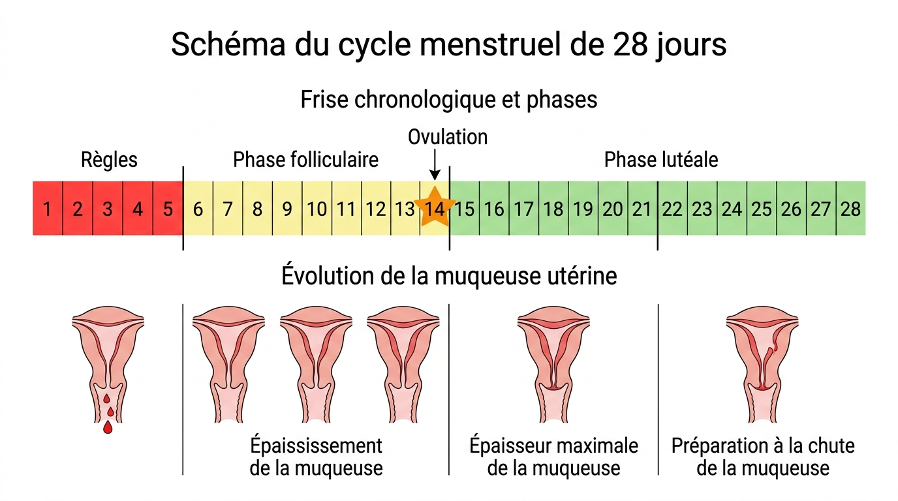


**<span style="color:#C00000">La grossesse précoce et le suivi médical</span>**

**<span style="color:#1E7B34">1. Pouvoir n'est pas être prêt</span>**

La puberté marque le début de la capacité à concevoir. Mais **la capacité de concevoir et la capacité de mener une grossesse sans danger n'apparaissent pas au même moment.**

Après les premières règles, le squelette continue de croître pendant plusieurs années. Le **bassin** est l'un des derniers ensembles osseux à achever sa croissance. Une adolescente de 14 ou 15 ans peut donc être enceinte alors que son bassin est encore trop étroit pour laisser passer la tête d'un nouveau-né — c'est précisément la situation qui conduit à l'accouchement obstrué, puis à la fistule.

C'est pour cette raison que le conseil de **repousser une première grossesse** n'est pas un jugement moral : c'est une **donnée anatomique**.

**<span style="color:#1E7B34">2. Les risques propres à la grossesse adolescente</span>**

| Risque | Explication |
|---|---|
| **Accouchement obstrué** | bassin de taille insuffisante → risque de fistule |
| **Hypertension de la grossesse** | plus fréquente chez les très jeunes mères ; peut devenir grave |
| **Anémie** | l'adolescente doit couvrir sa propre croissance **et** celle du fœtus |
| **Accouchement prématuré** | l'enfant naît avant terme, avec des risques accrus |
| **Faible poids de naissance** | l'enfant est plus fragile durant ses premiers mois |
| **Interruption de la scolarité** | conséquence sociale durable, souvent définitive |

Le cas de l'**anémie** mérite d'être détaillé, car il illustre bien le problème. Une adolescente est elle-même en croissance : ses besoins en fer, en calcium et en protéines sont déjà élevés. Une grossesse y ajoute les besoins du fœtus. Si l'alimentation ne suit pas, le corps puise dans ses réserves, et **les deux croissances en pâtissent**.

**<span style="color:#1E7B34">3. Le suivi prénatal : à quoi il sert concrètement</span>**

Une consultation prénatale n'est pas une formalité. À chaque visite, le personnel de santé vérifie un ensemble de points précis :

- le **poids** et la **tension artérielle** de la femme ;
- la **croissance** du fœtus et, en fin de grossesse, sa **position** ;
- des **analyses** de sang et d'urine — dépistage de l'anémie, des infections ;
- l'état vaccinal ;
- une **évaluation du bassin**, pour anticiper un accouchement difficile.

Ce dernier point est le lien direct avec la leçon précédente : **c'est en consultation prénatale qu'on repère un bassin trop étroit**, donc bien avant le jour de l'accouchement. On peut alors prévoir l'accouchement en maternité, voire programmer une césarienne. Le drame de la fistule est presque toujours celui d'un risque **non repéré à temps**.

L'Organisation mondiale de la santé recommande au minimum **huit contacts** avec un service de santé au cours d'une grossesse, le premier au cours des trois premiers mois.

**<span style="color:#1E7B34">4. Les obstacles, et comment y répondre</span>**

| Obstacle fréquent | Ce qu'il faut savoir |
|---|---|
| « J'ai honte, on va me juger » | le personnel de santé est tenu au **secret professionnel** ; son rôle est de soigner, pas de juger |
| « C'est loin, c'est cher » | difficulté réelle ; il existe souvent des dispositifs d'appui — se renseigner auprès du centre de santé le plus proche |
| « Je me sens bien, c'est inutile » | l'hypertension et l'anémie **ne se sentent pas** au début ; c'est justement pour cela qu'on les dépiste |
| « Ma grand-mère a accouché à la maison sans problème » | beaucoup d'accouchements se passent bien ; le suivi sert à identifier **ceux qui se passeront mal**, ce que personne ne peut deviner à l'avance |

**<span style="color:#1E7B34">5. Ce que cette leçon demande</span>**

Cette séance ne cherche pas à faire peur. Elle transmet trois informations précises :

> **1.** Le corps termine sa croissance après la puberté ; le bassin en particulier.
> **2.** Une grossesse suivie médicalement est **beaucoup plus sûre** qu'une grossesse non suivie, à tout âge.
> **3.** Savoir cela, et le dire autour de soi, fait partie de la responsabilité — l'une des deux valeurs de cette thématique.

### Section EXERCICES

**Exercice 1 (4 points)** — Réponds par une phrase.
1. Pourquoi une adolescente peut-elle être enceinte sans que son corps soit prêt ?
2. Quel os achève sa croissance tardivement et joue un rôle dans l'accouchement ?
3. Pourquoi une adolescente enceinte risque-t-elle l'anémie ?
4. Combien de contacts prénatals l'OMS recommande-t-elle au minimum ?

**Exercice 2 (6 points)** — Complète avec : *huit, secret, prénatale, bassin, prématuré, anémie*
1. Le …… achève sa croissance plusieurs années après les premières règles.
2. Un accouchement avant terme est dit ……
3. Le manque de fer provoque une ……
4. La consultation …… permet de repérer les grossesses à risque.
5. L'OMS recommande au moins …… contacts pendant la grossesse.
6. Le personnel de santé est tenu au …… professionnel.

**Exercice 3 (6 points)** — Dans un district, sur **400 femmes** enceintes, **160** suivent au moins quatre consultations prénatales.
1. Quel pourcentage de femmes suit au moins quatre consultations ?
2. Quel pourcentage n'atteint pas ce seuil ?
3. Le district veut porter ce taux à **75 %**. Combien de femmes supplémentaires doivent être suivies ?

**Exercice 4 (4 points)** — Choisis la bonne réponse.
1. La puberté signifie que le corps est : **A.** prêt pour une grossesse sans risque **B.** capable de concevoir, sans être achevé **C.** adulte
2. L'hypertension de la grossesse : **A.** se sent toujours **B.** peut passer inaperçue au début **C.** est sans danger
3. Le premier contact prénatal devrait avoir lieu : **A.** au dernier mois **B.** dans les trois premiers mois **C.** après l'accouchement
4. Une grossesse suivie médicalement est : **A.** plus risquée **B.** plus sûre **C.** identique

**TOTAL : 20 points**

### CORRIGÉ

**Ex. 1** — 1. Parce que la puberté rend la **conception** possible, alors que le **squelette continue de croître** pendant plusieurs années. 2. Le **bassin**. 3. Parce qu'elle doit couvrir **sa propre croissance et celle du fœtus** : ses besoins en fer sont doublés. 4. **Huit** contacts au minimum.

**Ex. 2** — 1. **bassin** · 2. **prématuré** · 3. **anémie** · 4. **prénatale** · 5. **huit** · 6. **secret**

**Ex. 3** —
1. 160 / 400 = 0,40 = **40 %**.
2. 100 − 40 = **60 %**.
3. 75 % de 400 = 300 femmes ; 300 − 160 = **140 femmes supplémentaires**.

**Ex. 4** — 1. **B** · 2. **B** · 3. **B** · 4. **B**


---


# SÉANCE 39 / 51 — Le cancer du col de l'utérus : anatomie, causes et symptômes

**Objectif spécifique** : localiser le col de l'utérus, identifier la cause virale du cancer du col et reconnaître ses symptômes d'alerte.
**Support et matériel** : schéma de l'appareil génital féminin, cahier.

| Étapes | Enseignant | Apprenants | Technique | Support | Obs. |
|---|---|---|---|---|---|
| **I. RÉVISION** | Citez deux organes du petit bassin.<br>À quoi sert l'utérus ? | R.A. : La vessie, l'utérus, le vagin, le rectum.<br>R.A. : À accueillir et porter le fœtus. | Questionnement oral | — | |
| **II. NOUVELLE LEÇON** ||||||
| 1. Mise en situation | Voici un cancer particulier : dans presque tous les cas, on en connaît la cause exacte, il existe un **vaccin** pour l'éviter et un **examen simple** pour le détecter avant qu'il n'apparaisse. Pourtant, il tue encore beaucoup de femmes. Pourquoi ? | R.A. : Parce que les femmes ne sont pas vaccinées ni dépistées. | Questionnement oral | Tableau noir | |
| 2. Présentation | Aujourd'hui : « Le cancer du col de l'utérus : anatomie, causes et symptômes ». Vous saurez situer le col, nommer la cause et reconnaître les signes d'alerte. | Les élèves écoutent. | Exposé | Tableau noir | |
| 3. Observation | Observez le schéma. L'utérus comporte deux parties : le **corps**, large et arrondi, en haut ; le **col**, étroit et cylindrique, en bas, qui débouche au fond du vagin. | Les élèves observent et repèrent. | Observation dirigée | Schéma | |
| 4. Analyse | Où se situe exactement le col par rapport au vagin ?<br>Ce cancer est causé dans presque tous les cas par un virus, le **HPV**. Que cela change-t-il par rapport à un cancer sans cause connue ?<br>Entre l'infection et le cancer, il s'écoule souvent quinze à vingt ans. Qu'est-ce que cela permet ?<br>Pourquoi les symptômes apparaissent-ils tardivement ? | R.A. : Au fond du vagin, il en constitue l'extrémité supérieure.<br>R.A. : On peut vacciner contre le virus, donc empêcher le cancer.<br>R.A. : Cela laisse le temps de dépister et de traiter avant le cancer.<br>R.A. : Parce que les lésions du début ne font pas mal. | Étude de document, analyse | Schéma, tableau | |
| 5. Synthèse | **Donc,** le **col de l'utérus** est la partie basse et étroite de l'utérus, qui débouche au fond du vagin. Son cancer est causé, dans environ **99 % des cas**, par une infection persistante par le **papillomavirus humain (HPV)** — les types **16 et 18** étant responsables d'environ **70 %** des cas. L'évolution est **très lente** : souvent quinze à vingt ans entre l'infection et le cancer. Les symptômes d'alerte sont des **saignements anormaux** — entre les règles, après un rapport, après la ménopause — et des **pertes vaginales inhabituelles ou malodorantes**. | Les élèves recopient. | Exposé magistral | Tableau noir | |
| 6. Application | **Ex. 1** — Vrai ou Faux : 1. Le col est la partie haute de l'utérus. 2. Le HPV est un virus. 3. Le cancer du col se développe en quelques semaines. 4. Un saignement après la ménopause doit faire consulter.<br><br>**Ex. 2** — Cite trois symptômes d'alerte. | **Ex. 1** : 1. **F** 2. **V** 3. **F** 4. **V**<br><br>**Ex. 2** : (trois parmi) saignements entre les règles, saignements après un rapport sexuel, saignements après la ménopause, pertes vaginales anormales ou malodorantes. | Travail de groupe | Grande ardoise | |
| **III. ÉVALUATION** | **Ex. 1** — Quelle est la cause principale du cancer du col de l'utérus ?<br><br>**Ex. 2** — Pourquoi la longue durée d'évolution de ce cancer est-elle une bonne nouvelle ? | **Ex. 1** : Une **infection persistante par le papillomavirus humain (HPV)**, présente dans environ 99 % des cas.<br><br>**Ex. 2** : Parce qu'elle laisse **beaucoup de temps pour agir**. Avant de devenir un cancer, l'infection provoque des lésions précancéreuses, que le dépistage détecte et que l'on traite simplement. Dépistée à ce stade, la maladie est évitée ; c'est ce qui rend ce cancer largement évitable. | Évaluation écrite | Cahier | |

### Page LEÇON

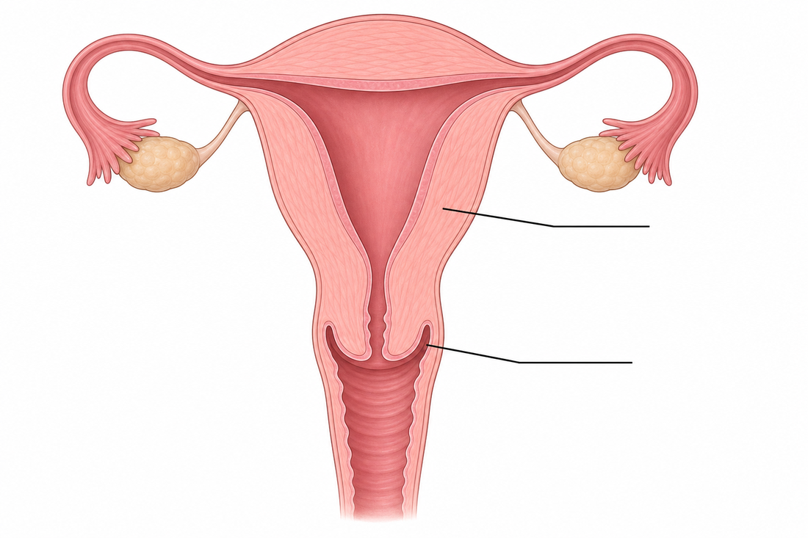


**<span style="color:#C00000">Le cancer du col de l'utérus : anatomie, causes et symptômes</span>**

**<span style="color:#1E7B34">1. Où se trouve le col de l'utérus</span>**

L'**utérus** est l'organe où se développe le fœtus. Logé au creux du petit bassin, il comporte deux parties :

- le **corps de l'utérus** : la partie haute, large, arrondie, dont la cavité accueille la grossesse ;
- le **col de l'utérus**, appelé aussi *cervix* : la partie basse, étroite et cylindrique, dont l'extrémité **s'avance à l'intérieur du vagin**.

Le col assure la communication entre la cavité utérine et le vagin. On y distingue trois zones :

| Zone | Description |
|---|---|
| **L'endocol** | l'intérieur du canal ; il contient des glandes qui sécrètent la **glaire cervicale** |
| **La zone de jonction** | la frontière entre les deux types de tissus — **c'est de là que part la très grande majorité d'entre eux** |
| **L'exocol** | la partie visible depuis le vagin, recouverte d'un tissu proche de celui de la peau |

La **zone de jonction** est le point clé : c'est un lieu de renouvellement cellulaire intense, donc plus vulnérable. C'est aussi la zone que vise le prélèvement lors du dépistage.

**<span style="color:#1E7B34">2. Une cause identifiée : le papillomavirus humain</span>**

Ce cancer présente une particularité remarquable : **on en connaît la cause**.

Dans environ **99 % des cas**, il résulte d'une **infection persistante par le papillomavirus humain (HPV)**, un virus très répandu qui se transmet par contact. Ce fut le premier cancer reconnu comme lié à une infection virale.

Il existe de nombreux types de HPV. Une quinzaine sont dits **à haut risque** ; les types **16 et 18** sont à eux seuls à l'origine d'environ **70 %** de ces cancers.

Trois précisions sont indispensables pour ne pas se tromper :

> **a)** L'infection par le HPV est **très fréquente** et, dans la grande majorité des cas, **l'organisme l'élimine spontanément** en un à deux ans sans aucune conséquence.
> **b)** Seule une infection **persistante** par un type à haut risque peut, après de nombreuses années, conduire à un cancer.
> **c)** Avoir été infectée **ne signifie pas** que l'on développera un cancer. C'est un risque, pas une fatalité.

**Les autres facteurs de risque** agissent tous en favorisant la persistance du virus :

- le **tabagisme** — le facteur le plus important après le HPV lui-même : il double le risque de certaines formes invasives, en affaiblissant les défenses locales du col ;
- un **système immunitaire affaibli**, notamment en cas d'infection par le VIH ;
- l'**absence de dépistage régulier** — qui n'augmente pas le risque d'infection, mais laisse la lésion évoluer sans être détectée.

**<span style="color:#1E7B34">3. Une évolution très lente — et c'est une chance</span>**

Le cancer du col ne se forme pas d'un coup. Il passe par des étapes :

> **infection par le HPV** → *(le plus souvent, élimination spontanée)* → **infection persistante** → **lésions précancéreuses** → **cancer in situ** → **cancer invasif**

Entre l'infection initiale et le cancer invasif, il s'écoule généralement **quinze à vingt ans**.

Cette lenteur est la raison d'être du dépistage. Pendant toutes ces années, la maladie est **détectable** alors qu'elle n'est pas encore un cancer — et à ce stade, le traitement d'une lésion précancéreuse est simple et très efficace. **Un cancer du col de l'utérus diagnostiqué tardivement est presque toujours un cancer qui aurait pu être évité.**

**<span style="color:#1E7B34">4. Les symptômes</span>**

Il faut le dire clairement : **au début, il n'y a aucun symptôme.** Les lésions précancéreuses ne provoquent ni douleur, ni saignement, ni gêne. C'est pourquoi on ne peut pas attendre de « sentir quelque chose » — et pourquoi le dépistage s'adresse à des femmes qui vont bien.

Quand les symptômes apparaissent, la maladie a déjà progressé.

**Signes d'alerte précoces :**
- saignements **entre les règles** ;
- saignements **après un rapport sexuel** ;
- saignements **après la ménopause** ;
- **pertes vaginales** inhabituelles, plus abondantes, parfois malodorantes.

**Signes de stade avancé :**
- douleurs persistantes du bassin, du dos ou des jambes ;
- difficultés à uriner ou à aller à la selle ;
- gonflement d'une jambe ou des deux ;
- fatigue, perte d'appétit, amaigrissement.

> ⚠️ **La règle à retenir.** Ces signes ne signifient pas qu'il y a un cancer — ils ont le plus souvent une autre cause, bénigne. Mais **tout saignement anormal, en particulier après la ménopause ou après un rapport, justifie une consultation.** Consulter tôt pour rien vaut infiniment mieux que consulter trop tard.

### Section EXERCICES

**Exercice 1 (4 points)** — Réponds par une phrase.
1. Où se situe le col de l'utérus ?
2. Quelle zone du col est à l'origine de la plupart des cancers ?
3. Quel virus est responsable de ce cancer ?
4. Quels types de ce virus provoquent environ 70 % des cas ?

**Exercice 2 (6 points)** — Complète avec : *99, persistante, zone de jonction, tabagisme, symptôme, précancéreuses*
1. Le HPV est en cause dans environ …… % des cas.
2. Seule une infection …… peut conduire à un cancer.
3. La majorité de ces cancers prennent naissance au niveau de la ……
4. Le …… est le principal facteur de risque après le HPV.
5. Avant le cancer apparaissent des lésions ……
6. Au début, la maladie ne donne aucun ……

**Exercice 3 (6 points)** — Une campagne dépiste **1 200 femmes**. Chez **96** d'entre elles, on découvre des lésions précancéreuses, traitées immédiatement.
1. Quel pourcentage des femmes dépistées présentait une lésion ?
2. Sans dépistage, ces lésions auraient pu évoluer. Explique en une phrase ce que la campagne a permis d'éviter.
3. Si la campagne avait touché **3 000 femmes** au même taux, combien de lésions auraient été détectées ?

**Exercice 4 (4 points)** — Choisis la bonne réponse.
1. Le col de l'utérus est : **A.** la partie haute **B.** la partie basse débouchant dans le vagin **C.** un organe séparé
2. L'infection par le HPV est : **A.** rare **B.** fréquente et souvent éliminée spontanément **C.** toujours cancéreuse
3. Entre l'infection et le cancer, il s'écoule en général : **A.** quelques semaines **B.** quinze à vingt ans **C.** un an
4. Les lésions précancéreuses provoquent : **A.** de fortes douleurs **B.** aucun symptôme **C.** de la fièvre

**TOTAL : 20 points**

### CORRIGÉ

**Ex. 1** — 1. C'est la **partie basse et étroite de l'utérus**, dont l'extrémité s'avance à l'intérieur du vagin. 2. La **zone de jonction**. 3. Le **papillomavirus humain (HPV)**. 4. Les types **16 et 18**.

**Ex. 2** — 1. **99** · 2. **persistante** · 3. **zone de jonction** · 4. **tabagisme** · 5. **précancéreuses** · 6. **symptôme**

**Ex. 3** —
1. 96 / 1 200 = 0,08 = **8 %**.
2. Elle a permis d'**éviter que ces lésions n'évoluent en cancer** : traitées au stade précancéreux, elles n'atteignent pas le stade invasif.
3. 3 000 × 8 % = **240 lésions**.

**Ex. 4** — 1. **B** · 2. **B** · 3. **B** · 4. **B**


---


# SÉANCE 40 / 51 — Cancer du col : dépistage, vaccination et prévention

**Objectif spécifique** : expliquer les trois niveaux de prévention du cancer du col et justifier la complémentarité de la vaccination et du dépistage.
**Support et matériel** : tableau des trois niveaux de prévention au tableau, cahier.

| Étapes | Enseignant | Apprenants | Technique | Support | Obs. |
|---|---|---|---|---|---|
| **I. RÉVISION** | Quelle est la cause du cancer du col de l'utérus ?<br>Combien de temps s'écoule entre l'infection et le cancer ? | R.A. : Une infection persistante par le HPV.<br>R.A. : Souvent quinze à vingt ans. | Questionnement oral | — | |
| **II. NOUVELLE LEÇON** ||||||
| 1. Mise en situation | Le vaccin contre le HPV s'adresse aux filles de **9 à 14 ans**, bien avant l'âge où le cancer pourrait survenir. Pourquoi si tôt ? | R.A. : Pour protéger avant d'être en contact avec le virus. | Questionnement oral | Tableau noir | |
| 2. Présentation | Aujourd'hui : « Dépistage, vaccination et prévention ». Vous saurez expliquer les trois niveaux de prévention et pourquoi ils se complètent. | Les élèves écoutent. | Exposé | Tableau noir | |
| 3. Observation | Observez ce tableau à trois colonnes : niveau **primaire**, **secondaire**, **tertiaire**. Repérez pour chacune le public concerné et le moment d'intervention. | Les élèves observent et complètent. | Étude de document, travail de groupe | Tableau | |
| 4. Analyse | Pourquoi vacciner avant le début de la vie sexuelle ?<br>Une femme vaccinée doit-elle quand même se faire dépister ? Pourquoi ?<br>Le dépistage empêche-t-il le cancer, ou le détecte-t-il ?<br>Que fait-on lorsqu'une lésion précancéreuse est découverte ? | R.A. : Parce que le vaccin protège avant le contact avec le virus, pas après.<br>R.A. : Oui, car le vaccin ne couvre pas tous les types de HPV.<br>R.A. : Il détecte les lésions avant le cancer, donc il permet de l'empêcher.<br>R.A. : On la traite tout de suite, avant qu'elle n'évolue. | Analyse, travail de groupe | Tableau | |
| 5. Synthèse | **Donc,** la prévention comporte trois niveaux. **Primaire** : empêcher l'infection — **vaccination des filles de 9 à 14 ans**, information, lutte contre le tabac. **Secondaire** : détecter et traiter les lésions **avant** le cancer — **dépistage régulier dès 30 ans**, et dès 25 ans chez les femmes porteuses du VIH. **Tertiaire** : traiter le cancer déclaré. **La vaccination ne remplace pas le dépistage** : les deux sont nécessaires. | Les élèves recopient. | Exposé magistral | Tableau noir | |
| 6. Application | **Ex. 1** — Primaire, secondaire ou tertiaire ? 1. Vacciner une fille de 11 ans. 2. Dépister une femme de 35 ans. 3. Opérer un cancer déclaré. 4. Traiter une lésion précancéreuse.<br><br>**Ex. 2** — Vrai ou Faux : 1. Le vaccin dispense du dépistage. 2. Le dépistage s'adresse aux femmes sans symptôme. 3. Le vaccin agit mieux avant l'exposition au virus. 4. Une lésion précancéreuse est déjà un cancer. | **Ex. 1** : 1. primaire · 2. secondaire · 3. tertiaire · 4. secondaire<br><br>**Ex. 2** : 1. **F** 2. **V** 3. **V** 4. **F** | Travail de groupe | Grande ardoise | |
| **III. ÉVALUATION** | **Ex. 1** — Explique pourquoi on vaccine les filles entre 9 et 14 ans.<br><br>**Ex. 2** — Une femme vaccinée dit : « Je n'ai plus besoin de dépistage. » Réponds-lui. | **Ex. 1** : Parce que le vaccin **prépare les défenses avant le contact** avec le virus. Il protège d'une infection à venir, il ne soigne pas une infection déjà installée. On vaccine donc avant le début de la vie sexuelle, période où la plupart des filles n'ont pas encore rencontré le virus.<br><br>**Ex. 2** : Elle se trompe. Les vaccins protègent contre les types de HPV les plus dangereux, mais **pas contre tous**. Une femme vaccinée conserve donc un risque, plus faible mais réel. Le dépistage reste nécessaire : c'est lui qui détecte une lésion éventuelle à temps. | Évaluation écrite | Cahier | |

### Page LEÇON

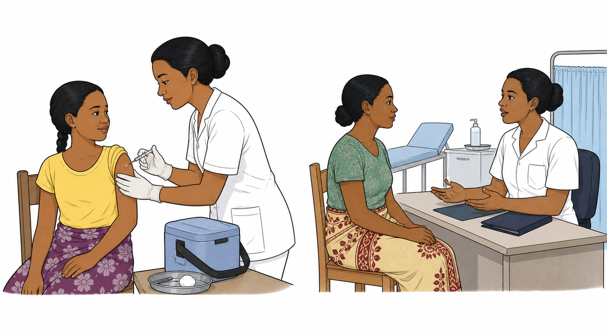


**<span style="color:#C00000">Dépistage, vaccination et prévention</span>**

**<span style="color:#1E7B34">1. Trois niveaux, trois moments</span>**

| | **Niveau primaire** | **Niveau secondaire** | **Niveau tertiaire** |
|---|---|---|---|
| **But** | empêcher l'infection | détecter et traiter **avant** le cancer | traiter le cancer déclaré |
| **Quand** | avant l'exposition au virus | pendant la longue phase silencieuse | une fois le cancer présent |
| **Qui** | filles de **9 à 14 ans** | femmes dès **30 ans** (**25 ans** si VIH) | toute femme atteinte |
| **Moyens** | vaccination anti-HPV, information, lutte contre le tabac | test HPV, frottis cervico-utérin, traitement des lésions | chirurgie, radiothérapie, chimiothérapie, soins de support |

**<span style="color:#1E7B34">2. La vaccination : pourquoi si tôt ?</span>**

La question revient toujours, et la réponse est simple : **un vaccin prépare les défenses de l'organisme avant la rencontre avec l'agent infectieux.** Il ne soigne pas une infection déjà installée.

Le HPV se transmet par contact lors des rapports sexuels. Pour que le vaccin soit pleinement efficace, il faut donc l'administrer **avant le début de la vie sexuelle** — d'où la cible retenue par l'OMS : les filles de **9 à 14 ans** — un âge où la très grande majorité n'a pas encore rencontré le virus.

C'est exactement le raisonnement rencontré à propos de la vaccination des volailles en séance 21 : **on vaccine avant, jamais pendant.** Le principe biologique est le même.

Plusieurs vaccins sont disponibles ; tous protègent contre les types **16 et 18**, à l'origine d'au moins 70 % de ces cancers. Certains couvrent en outre d'autres types à haut risque. Leur sécurité et leur efficacité ont été établies par des essais cliniques et par le suivi de millions de vaccinations. Plusieurs pays vaccinent également les garçons, car le HPV provoque aussi des cancers chez l'homme et parce que cela réduit la circulation du virus.

**<span style="color:#1E7B34">3. Le dépistage : chercher chez celles qui vont bien</span>**

Le dépistage a une logique déroutante au premier abord : **il s'adresse à des femmes qui n'ont aucun symptôme.**

C'est tout son intérêt. Attendre un symptôme, c'est attendre que la maladie soit déjà avancée. Le dépistage intervient pendant la **longue phase silencieuse** de quinze à vingt ans, au moment où il reste tout le temps d'agir.

| Examen | Principe |
|---|---|
| **Test HPV** | recherche la présence du virus à haut risque ; c'est aujourd'hui l'examen recommandé en première intention |
| **Frottis cervico-utérin (FCU)** | prélèvement de cellules au niveau du col, examinées au microscope pour repérer des cellules anormales |

Le prélèvement est **rapide et indolore**. Il se pratique en consultation, sans hospitalisation.

**Rythme recommandé par l'OMS** : dès **30 ans** pour l'ensemble des femmes, au moyen d'un test HPV validé, à renouveler **tous les 5 à 10 ans**. Chez les femmes porteuses du **VIH**, le dépistage débute dès **25 ans** et se répète plus souvent, **tous les 3 à 5 ans**.

Lorsqu'une lésion précancéreuse est détectée, elle est traitée sans attendre. Ces traitements — cryothérapie, ablation par la chaleur — se pratiquent en consultation externe, sans hospitalisation, et sont très efficaces à ce stade.

**<span style="color:#1E7B34">4. Le point le plus important de la leçon</span>**

> **La vaccination ne remplace pas le dépistage.**

Les vaccins protègent contre les types de HPV les plus dangereux, mais **pas contre la totalité** d'entre eux. Une femme vaccinée conserve donc un risque réduit, mais réel. Et les femmes déjà adultes aujourd'hui n'ont, pour la plupart, pas été vaccinées à l'adolescence.

Les deux mesures sont **complémentaires, pas alternatives** :

> **Le vaccin empêche la plupart des infections. Le dépistage rattrape ce qui a échappé au vaccin.**

**<span style="color:#1E7B34">5. Un cancer que l'on sait éliminer</span>**

Le cancer du col de l'utérus occupe une place unique en médecine : c'est l'un des rares cancers dont on connaît la cause, contre lequel il existe un vaccin, et que l'on sait détecter des années avant son apparition. L'OMS a pour cette raison lancé une stratégie mondiale visant son **élimination** comme problème de santé publique.

Les outils existent donc. Ce qui manque encore, dans beaucoup de régions du monde, c'est **l'accès** à ces outils et **l'information** sur leur existence. La seconde partie est à la portée d'une classe de T9 — c'est précisément l'objet de la séance suivante.

### Section EXERCICES

**Exercice 1 (4 points)** — Indique le niveau de prévention (primaire, secondaire ou tertiaire).
1. Vacciner une fille de 12 ans contre le HPV.
2. Réaliser un test HPV chez une femme de 40 ans sans symptôme.
3. Administrer une chimiothérapie à une patiente atteinte.
4. Traiter une lésion précancéreuse découverte au dépistage.

**Exercice 2 (6 points)** — Complète avec : *avant, 30, indolore, remplace, 9 à 14, silencieuse*
1. L'OMS cible la vaccination sur les filles de …… ans.
2. Le vaccin doit être administré …… l'exposition au virus.
3. Le dépistage commence à …… ans dans la population générale.
4. Le prélèvement est rapide et ……
5. Le dépistage agit pendant la longue phase ……
6. La vaccination ne …… pas le dépistage.

**Exercice 3 (6 points)** — Dans un district, **2 500 filles** ont l'âge d'être vaccinées. **1 750** l'ont été.
1. Quel pourcentage des filles est vacciné ?
2. Combien de filles ne le sont pas ?
3. L'objectif national est de **90 %**. Combien de filles supplémentaires faut-il vacciner pour l'atteindre ?

**Exercice 4 (4 points)** — Choisis la bonne réponse.
1. Un vaccin agit : **A.** après l'infection **B.** avant l'exposition **C.** pendant le cancer
2. Le dépistage s'adresse à des femmes : **A.** qui ont des symptômes **B.** sans symptôme **C.** déjà malades
3. Une femme vaccinée : **A.** n'a plus besoin de dépistage **B.** doit continuer à se faire dépister **C.** est immunisée contre tous les cancers
4. Le test HPV recherche : **A.** des cellules cancéreuses **B.** la présence du virus **C.** une anémie

**TOTAL : 20 points**

### CORRIGÉ

**Ex. 1** — 1. **primaire** · 2. **secondaire** · 3. **tertiaire** · 4. **secondaire**

**Ex. 2** — 1. **9 à 14** · 2. **avant** · 3. **30** · 4. **indolore** · 5. **silencieuse** · 6. **remplace**

**Ex. 3** —
1. 1 750 / 2 500 = 0,70 = **70 %**.
2. 2 500 − 1 750 = **750 filles**.
3. 90 % de 2 500 = 2 250 ; 2 250 − 1 750 = **500 filles supplémentaires**.

**Ex. 4** — 1. **B** · 2. **B** · 3. **B** · 4. **B**


---


# SÉANCE 41 / 51 — Mini-projet : concevoir un message de sensibilisation

**Objectif spécifique** : concevoir en groupe un message éducatif qui informe l'entourage sur la prévention de la fistule obstétricale et du cancer du col.
**Support et matériel** : papier kraft, feuilles, crayons de couleur, ciseaux ; grille d'évaluation reproduite ci-dessous.

> 🧑‍🏫 **Note à l'enseignant.** Cette séance répond à une activité **explicitement prescrite par le PE**, qui demande des supports éducatifs ludiques — brochure, affiche, saynète ou slogan — adressés à l'entourage. Elle mobilise toutes les connaissances des séances 36 à 40.

| Étapes | Enseignant | Apprenants | Technique | Support | Obs. |
|---|---|---|---|---|---|
| **I. RÉVISION** | Quelle est la cause directe de la fistule obstétricale ?<br>Quels sont les deux piliers de la prévention du cancer du col ? | R.A. : Un travail d'accouchement prolongé sans césarienne.<br>R.A. : La vaccination et le dépistage. | Questionnement oral | — | |
| **II. NOUVELLE LEÇON** ||||||
| 1. Mise en situation | Vous savez désormais des choses que beaucoup d'adultes de votre entourage ignorent : qu'une fistule s'opère, qu'un cancer du col se dépiste avant d'exister. À quoi sert un savoir que l'on garde pour soi ? | R.A. : À rien, il faut le partager. | Questionnement oral | Tableau noir | |
| 2. Présentation | Aujourd'hui : « Concevoir un message de sensibilisation ». Par groupes, vous allez produire une affiche, une brochure, un slogan ou une saynète destinés à votre communauté. | Les élèves écoutent. | Exposé | Tableau noir | |
| 3. Observation | Voici deux messages. **A** : « La fistule, c'est la honte du village. » **B** : « La fistule se soigne. Parlez-en au centre de santé. » Lequel aidera une femme malade à se faire soigner ? | R.A. : Le B. Le A fait honte et pousse à se cacher. | Étude de document, discussion dirigée | Deux exemples au tableau | |
| 4. Analyse | Pourquoi un message culpabilisant est-il inefficace, voire nuisible ?<br>À qui s'adresse votre message : aux femmes seulement ?<br>Que doit toujours contenir un bon message de prévention ?<br>Quelle langue utiliser pour être compris de tous ? | R.A. : Parce qu'il pousse à se cacher au lieu de consulter.<br>R.A. : Non, aussi aux maris, aux parents, à tout le village.<br>R.A. : Une information juste et une action possible.<br>R.A. : Le malgache, la langue que tout le monde comprend. | Discussion, travail de groupe | Tableau | |
| 5. Synthèse | **Donc,** un bon message de sensibilisation réunit quatre qualités : il est **juste** (aucune information fausse), **clair** (compréhensible par tous, dans la langue de la communauté), **non culpabilisant** (il ne fait honte à personne) et **actionnable** (il indique quoi faire concrètement). Un message qui fait peur sans indiquer d'issue ne sert à rien. | Les élèves recopient. | Exposé magistral | Tableau noir | |
| 6. Application | **Production en groupes.** Chaque groupe choisit un format — affiche, brochure, slogan, saynète — et un thème parmi les deux. Rédaction, puis présentation devant la classe. | Les élèves produisent et présentent. | Travail de groupe, production | Papier kraft, crayons | |
| **III. ÉVALUATION** | Évaluation des productions selon la grille (voir ci-dessous), suivie d'un exercice écrit individuel. | Les élèves présentent puis composent. | Évaluation par grille et écrite | Grille, cahier | |

### 📋 Grille d'évaluation des productions

| Critère | Ce qu'on attend | Points |
|---|---|---|
| **Exactitude** | aucune information fausse ; vocabulaire correct | 6 |
| **Clarté** | message compréhensible par une personne non scolarisée | 4 |
| **Respect** | aucune formulation culpabilisante ou moqueuse | 4 |
| **Action proposée** | le message indique concrètement quoi faire | 4 |
| **Soin et créativité** | présentation lisible, travail collectif visible | 2 |
| **Total** | | **20** |

### 💡 Exemples de messages conformes aux quatre critères

> **Sur la fistule**
> « Un accouchement qui dure trop longtemps est un danger. Allez à la maternité dès les premières douleurs. »
> « Les fuites d'urine après un accouchement ne sont pas une fatalité : **cela s'opère**. Parlez-en au centre de santé. »
> « Une femme atteinte de fistule n'est pas contagieuse. Elle a besoin de soins, pas de silence. »

> **Sur le cancer du col**
> « Ce cancer met quinze ans à se former. Un examen simple le détecte avant qu'il n'existe. »
> « Vacciner sa fille entre 9 et 14 ans, c'est la protéger pour toute sa vie. »
> « Un saignement anormal n'est pas toujours grave — mais il mérite toujours une consultation. »

### ❌ Exemples de messages à ne pas produire, et pourquoi

| Message | Pourquoi il est mauvais |
|---|---|
| « La fistule, c'est la honte du village. » | culpabilisant : il pousse la femme à se cacher au lieu de consulter |
| « Le cancer du col tue, vous allez mourir. » | il fait peur sans proposer d'action : la peur seule paralyse |
| « Les femmes sales attrapent des fistules. » | **factuellement faux** et humiliant |
| « Ne tombez pas enceinte, c'est dangereux. » | inexact : une grossesse **suivie** n'est pas un danger ; le message vise l'âge précoce et l'absence de suivi |

### Page LEÇON

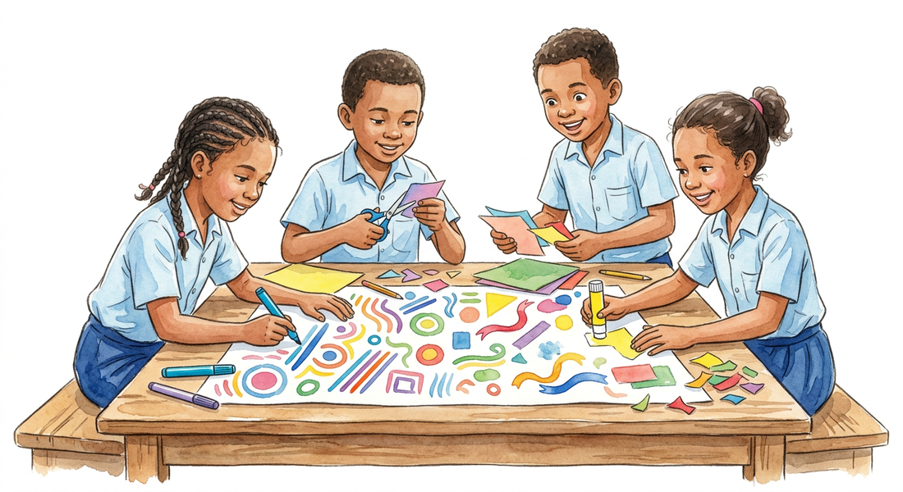


**<span style="color:#C00000">Concevoir un message de sensibilisation</span>**

**<span style="color:#1E7B34">1. Pourquoi ce travail figure au programme</span>**

Les cinq séances précédentes ont établi un constat : pour ces deux maladies, **les moyens d'agir existent déjà**. La fistule s'opère. Le cancer du col se prévient par un vaccin et se détecte par un examen simple.

Ce qui manque le plus souvent n'est pas le traitement, c'est **l'information**. Des femmes vivent des années avec une fistule sans savoir qu'une opération existe. D'autres ignorent qu'un dépistage aurait pu leur éviter un cancer.

Un élève qui sait cela détient une information utile. La transmettre est une action réelle — modeste, mais réelle.

**<span style="color:#1E7B34">2. Les quatre qualités d'un bon message</span>**

> **1. Juste.** Aucune information fausse, aucune exagération. Un message inexact décrédibilise tout le reste.
> **2. Clair.** Compréhensible par une personne qui n'est pas allée à l'école. Des phrases courtes, des mots simples, la langue de la communauté.
> **3. Non culpabilisant.** Jamais de honte, jamais de reproche. Une femme qui se sent jugée ne consulte pas — elle se cache.
> **4. Actionnable.** Le message doit indiquer **quoi faire** : aller au centre de santé, se faire dépister, faire vacciner sa fille. Un message qui alarme sans orienter est inutile.

**<span style="color:#1E7B34">3. À qui s'adresser ?</span>**

Une erreur fréquente consiste à ne viser que les femmes concernées. Or la décision d'aller à la maternité, de payer un transport ou d'accepter une vaccination se prend rarement seule.

| Public | Message à privilégier |
|---|---|
| **Jeunes filles** | le corps finit de grandir après la puberté ; la vaccination protège |
| **Jeunes hommes** | la santé de leur future famille les concerne aussi |
| **Maris et parents** | rejoindre la maternité dès le début du travail ; une femme atteinte a besoin de soins, pas d'exclusion |
| **Communauté entière** | ces maladies ne sont ni contagieuses, ni honteuses, ni des punitions |

**<span style="color:#1E7B34">4. Choisir son format</span>**

| Format | Atout | Point de vigilance |
|---|---|---|
| **Affiche** | visible longtemps, touche beaucoup de monde | peu de texte : une idée forte suffit |
| **Brochure** | permet de développer | inutile si le public lit peu |
| **Slogan** | se retient et se répète | doit rester exact malgré sa brièveté |
| **Saynète** | touche même les non-lecteurs, très efficace | ne jamais tourner la malade en ridicule |

**<span style="color:#1E7B34">5. La règle qui résume tout</span>**

> **Un bon message de santé ne fait pas honte : il donne une raison d'agir et indique où aller.**

C'est là que se rejoignent les deux valeurs de cette thématique. L'**estime de soi** : une femme malade n'a pas à avoir honte de son corps. La **responsabilité** : celui qui sait quelque chose d'utile a le devoir de le transmettre.

### Section EXERCICES

**Exercice 1 (4 points)** — Pour chacun de ces messages, dis s'il est **acceptable** ou **à rejeter**, et justifie en quelques mots.
1. « La fistule se soigne : parlez-en au centre de santé. »
2. « Les femmes qui ne se lavent pas attrapent des fistules. »
3. « Faites vacciner votre fille entre 9 et 14 ans. »
4. « Ce cancer vous tuera. »

**Exercice 2 (6 points)** — Complète avec : *actionnable, juste, culpabilisant, communauté, clair, honte*
1. Un message doit d'abord être ……, sans information fausse.
2. Il doit être …… pour être compris de tous.
3. Il ne doit jamais être ……
4. Il doit être ……, c'est-à-dire indiquer quoi faire.
5. Il s'adresse à toute la ……, pas seulement aux femmes.
6. Une personne qui a …… ne va pas consulter.

**Exercice 3 (6 points)** — Rédige **trois** messages de sensibilisation courts, respectant les quatre critères : un destiné aux jeunes filles, un aux maris et parents, un à l'ensemble du village. Indique pour chacun le critère « action proposée ».

**Exercice 4 (4 points)** — Choisis la bonne réponse.
1. Un message culpabilisant : **A.** incite à consulter **B.** pousse à se cacher **C.** est sans effet
2. Un bon message doit toujours : **A.** faire peur **B.** proposer une action **C.** être long
3. La sensibilisation s'adresse : **A.** aux femmes seulement **B.** à toute la communauté **C.** aux soignants
4. Un message doit être rédigé : **A.** dans une langue savante **B.** dans la langue comprise par tous **C.** en abrégé

**TOTAL : 20 points**

### CORRIGÉ

**Ex. 1** — 1. **Acceptable** : juste, clair, non culpabilisant, et il propose une action. 2. **À rejeter** : **factuellement faux** — la fistule n'a aucun rapport avec l'hygiène — et humiliant. 3. **Acceptable** : information exacte et action précise. 4. **À rejeter** : il fait peur sans indiquer d'issue, et il est inexact puisque ce cancer se prévient et se traite.

**Ex. 2** — 1. **juste** · 2. **clair** · 3. **culpabilisant** · 4. **actionnable** · 5. **communauté** · 6. **honte**

**Ex. 3** — Toute production respectant les quatre critères est acceptée. Exemples :
- *Jeunes filles* : « Ton corps finit de grandir après la puberté. Attendre pour avoir un enfant protège ta santé. » → **action** : en parler au centre de santé, se faire vacciner.
- *Maris et parents* : « Dès les premières douleurs, conduisez-la à la maternité. Quelques heures peuvent tout changer. » → **action** : organiser le transport à l'avance.
- *Village entier* : « La fistule n'est pas contagieuse et ne vient pas d'une faute. Elle s'opère. » → **action** : accompagner la femme au centre de santé plutôt que l'isoler.

**Ex. 4** — 1. **B** · 2. **B** · 3. **B** · 4. **B**


---


# SÉANCE 42 / 51 — Révision de l'Unité IV : sujet d'entraînement

**Thème** : Reproduction humaine · **Valeurs à véhiculer** : estime de soi, responsabilité
**Objectif spécifique** : traiter un sujet complet portant sur les séances 36 à 41, puis identifier ses propres erreurs à l'aide du corrigé commenté.
**Support et matériel** : sujet recopié au tableau ou polycopié, cahier de brouillon.

> 🧑‍🏫 **Note à l'enseignant.** Les quatre règles de registre posées à l'unité IV s'appliquent intégralement à ces deux séances : on **nomme et on explique sans jamais montrer** ; **la malade n'est jamais tenue pour coupable** ; **aucun protocole médical** n'est exigé d'un élève de T9 ; **toute réponse se conclut sur une action possible**. Les corrigés en tiennent compte dans leur barème.

| Étapes | Enseignant | Apprenants | Technique | Support | Obs. |
|---|---|---|---|---|---|
| **I. RÉVISION** | Sans ouvrir votre cahier : qu'est-ce qu'une fistule obstétricale ? À quel âge l'OMS recommande-t-elle de commencer le dépistage ? | R.A. : Une ouverture anormale reliant le vagin à la vessie ou au rectum.<br>R.A. : Dès 30 ans. | Questionnement oral | — | |
| **II. NOUVELLE LEÇON** ||||||
| 1. Mise en situation | Un sujet d'entraînement en conditions d'examen. Il ne compte pas : il sert à repérer ce qui n'est pas acquis. | Les élèves s'installent. | Consigne | Tableau noir | |
| 2. Présentation | Quatre exercices, 20 points. Cahiers fermés, travail individuel. | Les élèves écoutent. | Exposé | Tableau noir | |
| 3. Passation | L'enseignant distribue le sujet et surveille sans intervenir sur le fond. | Les élèves traitent le sujet. | Travail individuel | Sujet, cahier | |
| 4. Correction collective | Exercice par exercice : interroger, faire justifier, donner la réponse, **nommer l'erreur fréquente**. | Les élèves corrigent au stylo de couleur. | Correction dirigée | Tableau noir | |
| 5. Synthèse | **Donc,** les points faibles sont relevés au tableau. Chacun note les deux notions à retravailler avant la séance 43. | Les élèves notent. | Bilan collectif | Cahier | |
| **III. ÉVALUATION** | Chaque élève reporte son score sur 20 et le situe dans les repères. | Les élèves calculent leur score. | Auto-évaluation | Cahier | |

---

## Sujet d'entraînement — Unité IV (Reproduction humaine) — **/20**

### Exercice 1 — Connaissances *(4 points)*

**A. Distingue les causes et les conséquences** *(2 points)*

Recopie le tableau et classe les six propositions :

> incontinence permanente · accouchement prolongé sans césarienne · isolement social · bassin insuffisamment développé · infections urinaires répétées · absence de consultations prénatales

| Causes de la fistule | Conséquences de la fistule |
|---|---|
| | |

**B. Vrai ou faux — justifie en une phrase** *(2 points)*

1. Cette lésion serait, dit-on, impossible à soigner.
2. Une femme vaccinée contre le HPV n'a plus besoin de dépistage.

### Exercice 2 — Exercice chiffré *(6 points)*

Dans un district, **480 accouchements** ont eu lieu l'an dernier. **12 femmes** ont présenté une fistule obstétricale.

1. Calcule la fréquence des fistules pour 1 000 accouchements. *(2 pts)*
2. Dans un district voisin, où 90 % des femmes suivent des consultations prénatales, la fréquence est de **4 pour 1 000**. Quel est l'écart entre les deux districts ? *(1,5 pt)*
3. Exprime cet écart en pourcentage de réduction. *(1,5 pt)*
4. Si le premier district atteignait la même fréquence que le second, combien de femmes auraient été épargnées ? *(1 pt)*

### Exercice 3 — Étude de document *(6 points)*

Une campagne de dépistage est organisée dans une commune comptant **1 600 femmes** de plus de 30 ans.

| | Nombre |
|---|---|
| Femmes venues au dépistage | 1 088 |
| Tests positifs (lésion précancéreuse détectée) | 64 |
| Lésions traitées en consultation externe | 61 |

1. Quel pourcentage de femmes concernées est venu au dépistage ? *(1,5 pt)*
2. Quel pourcentage de tests positifs parmi les femmes dépistées ? *(1,5 pt)*
3. Quel pourcentage de lésions détectées a pu être traité sans hospitalisation ? *(1,5 pt)*
4. Que se serait-il passé pour ces 61 femmes en l'absence de campagne ? *(1,5 pt)*

### Exercice 4 — Situation *(4 points)*

Dans un village, une femme atteinte de fistule est tenue à l'écart des repas collectifs. On dit d'elle qu'elle est « punie » pour une faute.

Rédige une réponse de 4 à 6 lignes, destinée à être lue lors d'une réunion du village.

---

## Corrigé commenté — séance 42

### Exercice 1 *(4 pts)*

**A.** *(2 pts — 0,33 pt par proposition bien classée)*

| Causes de la fistule | Conséquences de la fistule |
|---|---|
| accouchement prolongé sans césarienne · bassin insuffisamment développé · absence de consultations prénatales | incontinence permanente · isolement social · infections urinaires répétées |

**B.** *(1 pt par item)*

1. **Faux.** La fistule obstétricale **s'opère**. L'intervention chirurgicale permet dans la grande majorité des cas de refermer la communication et de rétablir une vie normale. Le véritable obstacle est l'accès aux soins, pas l'absence de traitement.
2. **Faux.** Les vaccins protègent contre les types de virus les plus dangereux, **mais pas contre tous**. Le dépistage reste nécessaire : c'est lui qui détecte une lésion éventuelle à temps.

> ⚠️ **Erreur fréquente.** Croire la fistule définitive. Cette idée fausse est précisément ce qui décourage les femmes de consulter — la corriger fait partie de la leçon.

### Exercice 2 *(6 pts)*

1. 12 ÷ 480 = 0,025 ; 0,025 × 1 000 = **25 pour 1 000** *(2 pts)*
2. 25 − 4 = **21 pour 1 000** d'écart *(1,5 pt)*
3. 21 ÷ 25 = 0,84 = **84 % de réduction** *(1,5 pt)*
4. À 4 pour 1 000 : 480 × 4 ÷ 1 000 = 1,92 ≈ **2 femmes** touchées au lieu de 12, soit **10 femmes épargnées**. *(1 pt)*

> ⚠️ **Erreur fréquente.** À la question 3, diviser par 4 au lieu de 25. La réduction se calcule toujours par rapport à la valeur **de départ**.

### Exercice 3 *(6 pts)*

1. 1 088 ÷ 1 600 = 0,68 = **68 %** *(1,5 pt)*
2. 64 ÷ 1 088 ≈ 0,0588 ≈ **5,9 %** *(1,5 pt)*
3. 61 ÷ 64 ≈ 0,953 ≈ **95,3 %** *(1,5 pt)*
4. Sans campagne, ces lésions seraient **passées inaperçues**. L'évolution vers un cancer est très lente — souvent quinze à vingt ans — et **silencieuse au début** : les femmes n'auraient consulté qu'à l'apparition des symptômes, à un stade où le traitement est beaucoup plus lourd et les chances de guérison moindres. C'est précisément cette lenteur qui rend le dépistage efficace. *(1,5 pt)*

> ⚠️ **Erreur fréquente.** Répondre « elles seraient mortes ». La réponse attendue est plus précise : le dépistage intervient au stade de la **lésion précancéreuse**, avant le cancer.

### Exercice 4 *(4 pts)*

*(Barème : 1 pt par élément, dans la limite de 4 pts)*

La réponse attendue comporte :

- **Le rétablissement du fait médical** — la fistule résulte d'un accouchement qui s'est prolongé sans secours chirurgical à temps. C'est un accident médical, aux causes connues et identifiables.
- **Le refus explicite de la faute** — cette femme n'a commis aucune faute et n'est punie de rien. Les causes sont l'âge d'une première grossesse, l'état nutritionnel, l'absence de suivi, l'éloignement d'une maternité : rien qui relève d'un manquement personnel.
- **La correction d'une crainte** — la maladie **n'est pas contagieuse** : partager un repas ne présente aucun risque.
- **Une action possible** — orienter cette femme vers une structure de soins, la fistule pouvant être **opérée** ; et accompagner sa démarche plutôt que l'isoler.

> 🧑‍🏫 **Note à l'enseignant.** Une copie qui se contente d'exprimer de la compassion, sans rétablir le fait médical ni ouvrir vers une action, ne dépasse pas **2 points**. L'objectif de l'unité est que l'élève sache **quoi dire et quoi faire**, pas seulement ce qu'il ressent.

**Repères de score** : 16-20 acquis · 11-15 à consolider · 6-10 fragile · 0-5 reprendre les séances 36 à 41.


---


# SÉANCE 43 / 51 — Examen de l'Unité IV : Reproduction humaine

**Thème** : Reproduction humaine · **Valeurs à véhiculer** : estime de soi, responsabilité
**Objectif spécifique** : évaluer la maîtrise des notions des séances 36 à 41 — fistule obstétricale, grossesse précoce et suivi médical, cancer du col, dépistage et prévention.
**Support et matériel** : sujet polycopié ou recopié au tableau, cahier de composition.

| Étapes | Enseignant | Apprenants | Technique | Support | Obs. |
|---|---|---|---|---|---|
| **I. RÉVISION** | Rappel des consignes d'examen. Aucune question de fond pendant l'épreuve. | Les élèves rangent cahiers et livres. | Consigne | — | |
| **II. NOUVELLE LEÇON** ||||||
| 1. Mise en situation | L'enseignant écrit le barème au tableau : 4 + 6 + 6 + 4 = 20. | Les élèves notent le barème. | Consigne | Tableau noir | |
| 2. Présentation | Lecture à voix haute du sujet, sans commentaire. | Les élèves suivent. | Lecture dirigée | Sujet | |
| 3. Passation | Surveillance active, sans reformulation de fond. | Les élèves composent individuellement. | Évaluation écrite | Sujet, cahier | |
| 4. Ramassage | Ramassage des copies, vérification des noms. | Les élèves rendent leur copie. | Organisation | Copies | |
| 5. Synthèse | **Donc,** la correction sera rendue à la séance suivante. | Les élèves écoutent. | Bilan | — | |
| **III. ÉVALUATION** | *(L'épreuve elle-même constitue l'évaluation.)* | | Évaluation écrite | Copies | |

---

## SUJET D'EXAMEN — Unité IV : Reproduction humaine — **Durée : ____________ — /20**

### Exercice 1 — Connaissances *(4 points)*

**A. Complète avec le mot exact** *(2 points)*

1. La partie basse et étroite de l'utérus s'appelle le ……………… .
2. Le virus responsable de la quasi-totalité des cancers du col est le ……………………………………… .
3. La zone où prend naissance la majorité de ces cancers est la ………………………………… .
4. L'OMS cible la vaccination sur les filles de …………… à …………… ans.

**B. QCM — une seule réponse exacte** *(2 points)*

1. La fistule obstétricale résulte : **A.** d'une infection sexuelle · **B.** d'un accouchement prolongé et obstrué · **C.** d'une malformation de naissance
2. Chez les femmes porteuses du VIH, le dépistage débute dès : **A.** 25 ans · **B.** 30 ans · **C.** 45 ans
3. L'évolution entre l'infection par le virus et le cancer prend en général : **A.** quelques semaines · **B.** un an · **C.** quinze à vingt ans
4. Une lésion précancéreuse détectée tôt se traite : **A.** obligatoirement à l'hôpital · **B.** en consultation externe · **C.** pas du tout

### Exercice 2 — Exercice chiffré *(6 points)*

Dans une région, **2 000 jeunes filles** de 9 à 14 ans sont recensées. La campagne de vaccination en a vacciné **1 400**.

1. Quel pourcentage de la cible a été vacciné ? *(1,5 pt)*
2. Combien de filles n'ont pas été vaccinées ? *(1 pt)*
3. L'objectif national est de **90 %**. Combien de filles supplémentaires faut-il vacciner pour l'atteindre ? *(2 pts)*
4. Le vaccin est administré en 2 doses par fille. Combien de doses faut-il commander pour ces filles supplémentaires ? *(1,5 pt)*

### Exercice 3 — Étude de document *(6 points)*

Deux maternités d'un même district sont comparées sur une année.

| | Maternité A | Maternité B |
|---|---|---|
| Accouchements | 600 | 600 |
| Femmes ayant suivi au moins 4 consultations prénatales | 180 | 522 |
| Césariennes d'urgence réalisables sur place | non | oui |
| Fistules obstétricales constatées | 15 | 2 |

1. Calcule, pour chaque maternité, le pourcentage de femmes ayant suivi au moins 4 consultations prénatales. *(2 pts)*
2. Calcule la fréquence des fistules pour 1 000 accouchements dans chaque maternité. *(2 pts)*
3. Deux facteurs distinguent ces maternités. Lequel te paraît le plus déterminant, et pourquoi ? *(2 pts)*

### Exercice 4 — Situation *(4 points)*

Une jeune fille de 16 ans est enceinte. Sa famille hésite à l'emmener en consultation, par crainte du regard des voisins.

1. Cite **deux** risques particuliers liés à une grossesse à cet âge. *(2 pts)*
2. Quels arguments donnerais-tu à cette famille pour qu'elle consulte ? *(2 pts)*

---

## CORRIGÉ ET BARÈME — séance 43

### Exercice 1 *(4 pts)*

**A.** *(0,5 pt par réponse)*
1. **col** (de l'utérus) — 2. **papillomavirus humain (HPV)** — 3. **zone de jonction** — 4. **9 à 14 ans**

**B.** *(0,5 pt par item)*
1. **B** · 2. **A** · 3. **C** · 4. **B**

*Renvoi : séances 36, 39, 40.*

### Exercice 2 *(6 pts)*

1. 1 400 ÷ 2 000 = 0,70 = **70 %** *(1,5 pt)*
2. 2 000 − 1 400 = **600 filles** *(1 pt)*
3. 90 % de 2 000 = 1 800 ; 1 800 − 1 400 = **400 filles supplémentaires** *(2 pts)*
4. 400 × 2 = **800 doses** *(1,5 pt)*

*Renvoi : séance 40.*

### Exercice 3 *(6 pts)*

1. Maternité A : 180 ÷ 600 = **30 %** · Maternité B : 522 ÷ 600 = **87 %** *(1 pt chacun)*
2. Maternité A : 15 ÷ 600 × 1 000 = **25 pour 1 000** · Maternité B : 2 ÷ 600 × 1 000 ≈ **3,3 pour 1 000** *(1 pt chacun)*
3. *(2 pts)* Les deux facteurs — suivi prénatal et accès à la césarienne — agissent, et la réponse doit le reconnaître. Mais **la possibilité de pratiquer une césarienne d'urgence sur place est le facteur décisif** : le suivi prénatal permet de **repérer** les grossesses à risque, alors que la césarienne est ce qui **interrompt** l'accouchement prolongé au moment où la lésion se produit. Un bon suivi sans recours chirurgical possible laisse la femme sans solution le jour venu.

> **Consigne au correcteur.** Accepter la réponse inverse — le suivi prénatal jugé plus déterminant — **si elle est argumentée** par le fait qu'un dépistage précoce du risque permet d'orienter la femme à temps vers une structure équipée. Ce qui est évalué est la qualité du raisonnement, non le choix lui-même. Une copie qui ne cite qu'un seul facteur sans comparer n'obtient que 1 point.

*Renvoi : séances 37, 38.*

### Exercice 4 *(4 pts)*

1. *(1 pt par risque)* Deux attendus parmi : **bassin encore insuffisamment développé**, d'où un risque accru d'accouchement obstrué et de **fistule** ; **anémie et carences**, la grossesse s'ajoutant aux besoins de la croissance de l'adolescente ; **hypertension et complications** plus fréquentes ; **prématurité et faible poids** de naissance ; **interruption de la scolarité**.

2. *(2 pts)* Les arguments attendus : les consultations prénatales permettent de **repérer à temps** une grossesse à risque et d'orienter vers une maternité équipée ; le personnel de santé est tenu à la **confidentialité** ; la crainte du regard des voisins est un risque **social**, alors que l'absence de suivi est un risque **vital** — les deux ne pèsent pas le même poids ; consulter tôt laisse le plus de solutions ouvertes.

> **Consigne au correcteur.** Aucun point pour une copie qui blâme la jeune fille. La règle de registre de l'unité est explicite : **la patiente n'est jamais présentée comme fautive**, et la réponse doit se conclure sur une **action possible**.

*Renvoi : séance 38.*

**TOTAL : 20 points**


---


# SÉANCE 44 / 51 — Les trois familles de pierres gemmes

**Objectif spécifique** : distinguer les pierres précieuses, les pierres fines et les pierres organiques, et justifier ce classement.
**Support et matériel** : échantillons de pierres si disponibles (quartz, améthyste, agate, morceau de corail ou de nacre), photographies, tableau à double entrée au tableau noir.

| Étapes | Enseignant | Apprenants | Technique | Support | Obs. |
|---|---|---|---|---|---|
| **I. RÉVISION** | Citez des richesses du sous-sol malgache.<br>Connaissez-vous des pierres extraites à Madagascar ? | R.A. : L'or, le graphite, le nickel, les pierres.<br>R.A. : Le saphir, le rubis, parfois l'améthyste. | Questionnement oral | — | |
| **II. NOUVELLE LEÇON** ||||||
| 1. Mise en situation | Deux pierres se ressemblent : même couleur rouge, même éclat. L'une vaut quelques milliers d'ariary, l'autre plusieurs millions. Comment expliquer une telle différence ? | R.A. : Les élèves proposent : la rareté, la dureté, la qualité. | Questionnement oral | Tableau noir | |
| 2. Présentation | Aujourd'hui : « Les trois familles de pierres gemmes ». À la fin, vous saurez ranger une pierre dans l'une des trois familles et dire pourquoi. | Les élèves écoutent. | Exposé | Tableau noir | |
| 3. Observation | Observez ces pierres et ces images. Certaines sont transparentes, d'autres non. Certaines viennent du sol, d'autres proviennent d'êtres vivants. Essayez de les regrouper. | Les élèves observent et proposent des regroupements. | Observation dirigée, travail de groupe | Échantillons, photos | |
| 4. Analyse | Qu'est-ce qu'une gemme, au fond ?<br>Quatre pierres seulement sont dites précieuses. Lesquelles connaissez-vous ?<br>Le corail et la nacre sont-ils des minéraux ? D'où viennent-ils ?<br>Pourquoi les pierres organiques se cassent-elles plus facilement ? | R.A. : Une pierre belle, rare et résistante, utilisée en bijouterie.<br>R.A. : Le diamant, le rubis, le saphir, l'émeraude.<br>R.A. : Non, ils viennent d'animaux marins.<br>R.A. : Parce qu'elles sont plus tendres, elles ne sont pas minérales. | Étude de document, travail de groupe | Échantillons, tableau | |
| 5. Synthèse | **Donc,** on classe les gemmes en **trois familles**. Les **pierres précieuses** : diamant, rubis, saphir, émeraude — quatre seulement, par convention. Les **pierres fines**, autrefois dites semi-précieuses : toutes les autres gemmes d'origine minérale — améthyste, tourmaline, grenat, aigue-marine… Les **pierres organiques** : celles produites par des êtres vivants — ambre, corail, nacre, jais ; elles sont généralement plus fragiles. | Les élèves recopient. | Exposé magistral | Tableau noir | |
| 6. Application | **Ex. 1** — Classe : rubis · améthyste · corail · saphir · ambre · tourmaline.<br><br>**Ex. 2** — Vrai ou Faux : 1. Il existe dix pierres précieuses. 2. La nacre est une pierre organique. 3. Une pierre fine est une pierre de mauvaise qualité. 4. Le rubis et le saphir sont deux variétés d'un même minéral. | **Ex. 1** : précieuses = **rubis, saphir** · fines = **améthyste, tourmaline** · organiques = **corail, ambre**<br><br>**Ex. 2** : 1. **F** — quatre. 2. **V** 3. **F** — c'est un classement conventionnel, pas un jugement de qualité. 4. **V** — toutes deux sont du corindon. | Travail de groupe | Grande ardoise | |
| **III. ÉVALUATION** | **Ex. 1** — Cite les quatre pierres précieuses.<br><br>**Ex. 2** — Explique en deux phrases ce qui distingue une pierre organique d'une pierre fine. | **Ex. 1** : diamant, rubis, saphir, émeraude.<br><br>**Ex. 2** : Une pierre fine est un **minéral**, formé dans les roches du sous-sol. Une pierre organique est produite par un **être vivant** — animal ou végétal — et elle est généralement plus tendre et plus fragile. | Évaluation écrite | Cahier | |

### Page LEÇON


**<span style="color:#C00000">Les trois familles de pierres gemmes</span>**

**<span style="color:#1E7B34">1. Qu'est-ce qu'une gemme ?</span>**

Une **gemme** est une pierre que l'on taille et que l'on polit pour en faire un ornement. Toutes les pierres n'y parviennent pas : il faut réunir trois qualités.

- **La beauté** — une couleur, une transparence ou un éclat qui attirent l'œil.
- **La rareté** — une pierre que l'on ramasse partout n'acquiert aucune valeur.
- **La résistance** — une pierre qui se raye ou se brise au premier choc ne peut pas être portée.

Ces trois qualités doivent être réunies **en même temps**. Une pierre magnifique mais trop tendre ne devient pas une gemme ; une pierre extrêmement rare mais terne non plus.

**<span style="color:#1E7B34">2. Les trois familles</span>**

| Famille | Définition | Exemples |
|---|---|---|
| **Pierres précieuses** | quatre gemmes seulement, par convention | **diamant, rubis, saphir, émeraude** |
| **Pierres fines** (autrefois « semi-précieuses ») | toutes les autres gemmes d'origine **minérale** | améthyste, tourmaline, grenat, aigue-marine, agate, citrine, quartz rose, labradorite, jade, obsidienne, jaspe |
| **Pierres organiques** | gemmes produites par des **êtres vivants** | ambre (résine fossilisée), corail, nacre, perle, jais |

**<span style="color:#1E7B34">3. Trois précisions qui évitent les erreurs</span>**

**a) « Pierre fine » ne veut pas dire « pierre médiocre ».** Le classement en quatre pierres précieuses est une **convention commerciale ancienne**, pas une mesure scientifique. Une belle tourmaline de Madagascar peut valoir plus cher qu'un saphir de qualité ordinaire. Le terme « semi-précieuse » est d'ailleurs progressivement abandonné, parce qu'il laisse croire à une demi-valeur.

**b) Le rubis et le saphir sont le même minéral.** Tous deux sont du **corindon**, de formule Al₂O₃. Ce sont de minuscules quantités d'autres éléments qui font la couleur : du chrome donne le **rouge** du rubis, du fer et du titane donnent le **bleu** du saphir. Quand un corindon gemme n'est pas rouge — bleu, rose, jaune, vert — on l'appelle saphir. Cela explique qu'on trouve les deux **dans les mêmes gisements**, à Madagascar comme ailleurs.

**c) La rareté seule ne suffit pas.** Certains minéraux sont beaucoup plus rares que le diamant sans être considérés comme précieux : la **painite** ou la **rhodizite** — cette dernière présente à Madagascar — sont des raretés de collectionneurs, mais elles n'ont jamais intégré le classement des pierres précieuses. Il y faut aussi la beauté, la résistance, et une demande du marché.

**<span style="color:#1E7B34">4. Les pierres organiques</span>**

Elles se distinguent nettement des deux autres familles : elles ne sont pas nées dans la roche mais **dans le vivant**.

- L'**ambre** est une résine d'arbre fossilisée depuis des millions d'années ; elle emprisonne parfois des insectes.
- Le **corail** est le squelette calcaire d'animaux marins coloniaux.
- La **nacre** et la **perle** sont sécrétées par certains coquillages.
- Le **jais** est un charbon fossile très noir, issu de bois enfoui.

Étant d'origine biologique, elles sont **plus tendres et plus cassantes** que les gemmes minérales : elles craignent les chocs, la chaleur et les produits acides. Un bijou de corail ou d'ambre demande donc plus de précautions qu'un saphir.

> **Une remarque de responsabilité.** Le corail est prélevé sur des récifs vivants, qui abritent une part considérable de la vie marine et protègent les côtes de l'érosion. À Madagascar, où les récifs sont déjà fragilisés, cette exploitation pose un problème direct de **bien commun** — la valeur même que porte cette thématique du programme.

### Section EXERCICES

**Exercice 1 (4 points)** — Classe ces huit gemmes en trois familles : **émeraude · nacre · grenat · diamant · jais · labradorite · saphir · ambre**.

**Exercice 2 (6 points)** — Complète avec : *corindon, organique, chrome, quatre, convention, résistance*
1. Il existe …… pierres précieuses.
2. Le rubis et le saphir sont deux variétés de ……
3. C'est le …… qui donne au rubis sa couleur rouge.
4. Une gemme doit réunir beauté, rareté et ……
5. L'ambre est une pierre ……
6. Le classement en pierres précieuses est une ……, non une mesure scientifique.

**Exercice 3 (6 points)** — Un marchand propose à un touriste « une pierre semi-précieuse, donc forcément bon marché ». Il s'agit d'une belle tourmaline de la région d'Antsirabe.
1. L'expression « semi-précieuse » est-elle correcte ? Comment dit-on aujourd'hui ?
2. L'argument « semi-précieuse donc bon marché » est-il valable ? Justifie.
3. Cite **deux** critères qui feront réellement le prix de cette tourmaline.

**Exercice 4 (4 points)** — Choisis la bonne réponse.
1. Le corail est une pierre : **A.** précieuse **B.** fine **C.** organique
2. Le minéral du rubis et du saphir s'appelle : **A.** le quartz **B.** le corindon **C.** le béryl
3. Les pierres organiques sont en général : **A.** plus dures **B.** plus fragiles **C.** identiques aux minérales
4. Une pierre très rare mais terne et fragile : **A.** est forcément précieuse **B.** n'est pas une gemme recherchée **C.** vaut plus que le diamant

**TOTAL : 20 points**

### CORRIGÉ

**Ex. 1** — précieuses = **émeraude, diamant, saphir** · fines = **grenat, labradorite** · organiques = **nacre, jais, ambre**

**Ex. 2** — 1. **quatre** · 2. **corindon** · 3. **chrome** · 4. **résistance** · 5. **organique** · 6. **convention**

**Ex. 3** — 1. **Non**, le terme est abandonné car il laisse croire à une demi-valeur ; on dit **pierre fine**. 2. **Non** : le classement est une convention commerciale, pas une échelle de prix. Une belle tourmaline peut valoir plus cher qu'un saphir médiocre. 3. (deux parmi) la **qualité de la couleur**, la **pureté** (absence d'inclusions visibles), le **poids en carats**, la **qualité de la taille**.

**Ex. 4** — 1. **C** · 2. **B** · 3. **B** · 4. **B**


---


# SÉANCE 45 / 51 — Les propriétés physiques des pierres gemmes

**Objectif spécifique** : déterminer les propriétés physiques d'échantillons — couleur, éclat, transparence, dureté, cassure et clivage — et s'en servir pour identifier une pierre.
**Support et matériel** : échantillons de pierres, loupe, **lunettes de protection**, **gants**, clou ou lame d'acier, morceau de verre, pièce de cuivre, ongle.

> ⚠️ **Sécurité — à lire avant la séance.** Le test de rayure projette de fines particules. **Lunettes de protection et gants sont obligatoires** ; ce sont les matériels que le PE prévoit lui-même. Les tests se font **sur une table, jamais dans la main**. L'enseignant réalise seul toute manipulation nécessitant un marteau. On ne teste **jamais** un bijou appartenant à quelqu'un.

| Étapes | Enseignant | Apprenants | Technique | Support | Obs. |
|---|---|---|---|---|---|
| **I. RÉVISION** | Citez les trois familles de gemmes.<br>Quelles sont les trois qualités d'une gemme ? | R.A. : Précieuses, fines, organiques.<br>R.A. : Beauté, rareté, résistance. | Questionnement oral | — | |
| **II. NOUVELLE LEÇON** ||||||
| 1. Mise en situation | Deux pierres transparentes et incolores sont posées devant vous. L'une est un diamant, l'autre un morceau de quartz. Sans laboratoire, comment les distinguer ? | R.A. : Les élèves proposent des idées. | Questionnement oral | Deux échantillons | |
| 2. Présentation | Aujourd'hui : « Les propriétés physiques des pierres gemmes ». Vous saurez décrire une pierre avec six critères précis et utiliser l'échelle de dureté. | Les élèves écoutent. | Exposé | Tableau noir | |
| 3. Observation | Par groupes, décrivez chaque échantillon : sa couleur, son éclat, laisse-t-il passer la lumière ? Ensuite — **avec les lunettes** — essayez de le rayer avec l'ongle, puis avec une pièce de cuivre, puis avec un clou d'acier. | Les élèves observent et testent en remplissant le tableau. | Observation dirigée, expérimentation, travail de groupe | Échantillons, loupe, lunettes, gants, clou | |
| 4. Analyse | Qu'avez-vous constaté : toutes les pierres se rayent-elles de la même façon ?<br>Si une pierre raye le verre, que peut-on en déduire ?<br>Regardez à la loupe une pierre cassée : la cassure est-elle lisse et plane, ou irrégulière ?<br>Pourquoi la couleur est-elle un mauvais critère d'identification à elle seule ? | R.A. : Non, certaines sont rayées par l'ongle, d'autres résistent au clou.<br>R.A. : Qu'elle est plus dure que le verre, donc assez dure.<br>R.A. : Cela dépend des pierres, certaines cassent net, d'autres non.<br>R.A. : Parce que plusieurs pierres différentes ont la même couleur. | Expérimentation, analyse, travail de groupe | Échantillons, loupe | |
| 5. Synthèse | **Donc,** on décrit une gemme par **six propriétés** : la **couleur**, l'**éclat**, la **transparence**, la **dureté**, la **cassure** et le **clivage**. La **dureté** se mesure sur l'**échelle de Mohs**, de 1 (talc) à 10 (diamant) : un minéral raye tous ceux qui ont un indice inférieur au sien. Aucune propriété ne suffit seule : c'est **l'ensemble** qui permet d'identifier une pierre. | Les élèves recopient. | Exposé magistral | Tableau noir | |
| 6. Application | **Ex. 1** — Range par dureté croissante : quartz · talc · diamant · corindon.<br><br>**Ex. 2** — Une pierre raye le verre mais est rayée par le corindon. Entre quelles valeurs se situe sa dureté ? | **Ex. 1** : talc (1) < quartz (7) < corindon (9) < diamant (10).<br><br>**Ex. 2** : Elle est plus dure que le verre (≈ 5,5) et moins dure que le corindon (9) : sa dureté est **comprise entre environ 5,5 et 9**. | Travail de groupe | Grande ardoise | |
| **III. ÉVALUATION** | **Ex. 1** — Cite les six propriétés physiques d'une gemme.<br><br>**Ex. 2** — Le diamant est la pierre la plus dure. Peut-on pour autant le briser d'un coup de marteau ? Explique. | **Ex. 1** : couleur, éclat, transparence, dureté, cassure, clivage.<br><br>**Ex. 2** : **Oui.** La dureté est la résistance **à la rayure**, pas au choc. Le diamant possède un clivage parfait : frappé au bon endroit, il se fend. Dureté et ténacité sont deux propriétés différentes. | Évaluation écrite | Cahier | |

### Page LEÇON


**<span style="color:#C00000">Les propriétés physiques des pierres gemmes</span>**

**<span style="color:#1E7B34">1. Pourquoi des critères précis ?</span>**

« Une belle pierre rouge » ne veut rien dire pour un géologue : le rubis, le grenat, la tourmaline rubellite et le spinelle rouge se ressemblent tous à l'œil nu. Pour identifier une pierre, on la décrit par des **propriétés physiques mesurables**. Le programme en retient **six**.

**<span style="color:#1E7B34">2. Les six propriétés</span>**

| Propriété | Ce qu'elle décrit | Comment l'observer |
|---|---|---|
| **Couleur** | la teinte de la pierre | à l'œil, en pleine lumière du jour |
| **Éclat** | la façon dont la surface renvoie la lumière | éclat vitreux, gras, nacré, métallique… |
| **Transparence** | la quantité de lumière qui traverse | transparente, translucide, opaque |
| **Dureté** | la résistance **à la rayure** | par comparaison, échelle de Mohs |
| **Cassure** | l'aspect d'une surface brisée **au hasard** | cassure lisse en coquille, ou irrégulière |
| **Clivage** | l'aptitude à se fendre selon des **plans nets** | clivage parfait, imparfait, ou absent |

**<span style="color:#1E7B34">3. L'échelle de Mohs</span>**

En **1812**, le minéralogiste allemand **Friedrich Mohs** propose une méthode d'une grande simplicité : **un minéral plus dur raye un minéral plus tendre.** Il choisit dix minéraux de référence et les numérote de 1 à 10.

| Indice | Minéral | Repère pratique |
|---:|---|---|
| 1 | Talc | s'effrite sous l'ongle |
| 2 | Gypse | rayé par l'ongle |
| 3 | Calcite | rayé par une pièce de cuivre |
| 4 | Fluorine | rayé facilement par un couteau |
| 5 | Apatite | rayé difficilement par un couteau |
| 6 | Orthose | raye le verre |
| 7 | Quartz | raye nettement le verre |
| 8 | Topaze | raye le quartz |
| 9 | Corindon *(rubis, saphir)* | raye la topaze |
| 10 | Diamant | n'est rayé que par un autre diamant |

Trois repères suffisent en classe : **l'ongle** (≈ 2,5), **la pièce de cuivre** (≈ 3,5), **le clou d'acier** (≈ 5,5, comme le verre).

⚠️ **L'échelle de Mohs n'est pas une échelle de mesure régulière.** Le passage de 9 à 10 correspond à un écart de dureté bien plus grand que celui de 1 à 9 : le diamant est environ **quatre fois plus dur** que le corindon, alors qu'un seul rang les sépare. L'échelle donne un **ordre**, pas des proportions.

**<span style="color:#1E7B34">4. Dureté n'est pas solidité</span>**

C'est la confusion la plus répandue, et elle a des conséquences pratiques.

> **La dureté** est la résistance **à la rayure**. **La ténacité** est la résistance **aux chocs**. Ce sont deux choses différentes.

Le diamant est le minéral le plus dur qui soit : rien ne le raye. Mais il possède un **clivage parfait**, c'est-à-dire des plans de moindre résistance : frappé précisément dans la bonne direction, il **se fend en deux**. C'est d'ailleurs ce que le lapidaire exploite pour le tailler. Un diamant ne se raye pas, mais il se casse.

À l'inverse, le **jade** n'a qu'une dureté moyenne, mais sa structure en fibres enchevêtrées le rend remarquablement résistant aux chocs.

**<span style="color:#1E7B34">5. Identifier, c'est croiser les indices</span>**

Aucune propriété ne suffit à elle seule — et surtout pas la couleur. On procède comme une enquête, en croisant les résultats :

> *La pierre est rouge. Elle raye le verre sans effort : sa dureté dépasse 6. Elle n'est pas rayée par la topaze : elle atteint donc au moins 8. Son éclat est vitreux et vif, sa transparence bonne.* → **Le corindon (rubis) devient l'hypothèse la plus probable.**

Le grenat, également rouge, aurait été rayé par la topaze — sa dureté ne dépasse pas 7,5. C'est ce croisement qui permet de trancher entre deux pierres d'apparence identique, et c'est ainsi que travaille un gemmologue avant même de recourir à des appareils.

### Section EXERCICES

**Exercice 1 (4 points)** — Donne l'indice de dureté de Mohs de ces quatre minéraux et range-les du plus tendre au plus dur : **corindon · talc · quartz · calcite**.

**Exercice 2 (6 points)** — Complète avec : *rayure, clivage, 1812, opaque, dix, ordre*
1. L'échelle de Mohs a été créée en ……
2. Elle comprend …… minéraux de référence.
3. La dureté est la résistance à la ……
4. Une pierre qui ne laisse pas passer la lumière est ……
5. Le …… est l'aptitude d'une pierre à se fendre selon des plans nets.
6. L'échelle de Mohs donne un …… et non des proportions.

**Exercice 3 (6 points)** — Un élève teste une pierre jaune transparente. Résultats : elle **n'est pas rayée** par le clou d'acier ; elle **raye le quartz** ; elle **est rayée** par le corindon.
1. Que déduit-on du fait qu'elle raye le quartz ?
2. Que déduit-on du fait qu'elle est rayée par le corindon ?
3. Entre quelles valeurs se situe sa dureté ? Propose un nom de pierre compatible avec ce résultat.

**Exercice 4 (4 points)** — Choisis la bonne réponse.
1. La dureté mesure la résistance : **A.** aux chocs **B.** à la rayure **C.** à la chaleur
2. Un diamant frappé au marteau : **A.** ne peut pas se briser **B.** peut se fendre selon son clivage **C.** fond
3. Le verre a une dureté d'environ : **A.** 2 **B.** 5,5 **C.** 9
4. Pour identifier une pierre, la couleur seule est : **A.** suffisante **B.** insuffisante **C.** inutile

**TOTAL : 20 points**

### CORRIGÉ

**Ex. 1** — talc **1** < calcite **3** < quartz **7** < corindon **9**.

**Ex. 2** — 1. **1812** · 2. **dix** · 3. **rayure** · 4. **opaque** · 5. **clivage** · 6. **ordre**

**Ex. 3** —
1. Qu'elle est **plus dure que le quartz**, donc que sa dureté dépasse **7**.
2. Qu'elle est **moins dure que le corindon**, donc inférieure à **9**.
3. Sa dureté se situe **entre 7 et 9**, vraisemblablement autour de **8** : la **topaze** correspond à ce résultat. *(Le béryl jaune — héliodore — dont la dureté avoisine 7,5 à 8, est également accepté si l'élève le justifie.)*

**Ex. 4** — 1. **B** · 2. **B** · 3. **B** · 4. **B**


---


# SÉANCE 46 / 51 — La répartition géographique des pierres gemmes à Madagascar

**Objectif spécifique** : localiser sur une carte de Madagascar les principaux gisements de pierres gemmes et distinguer gisement primaire et gisement secondaire.
**Support et matériel** : **carte de Madagascar** au tableau ou polycopiée (support prévu par le PE), crayons de couleur, cahier.

| Étapes | Enseignant | Apprenants | Technique | Support | Obs. |
|---|---|---|---|---|---|
| **I. RÉVISION** | Quelles sont les six propriétés physiques d'une gemme ?<br>Quelle est la dureté du corindon ? | R.A. : Couleur, éclat, transparence, dureté, cassure, clivage.<br>R.A. : 9 sur l'échelle de Mohs. | Questionnement oral | — | |
| **II. NOUVELLE LEÇON** ||||||
| 1. Mise en situation | En 1998, un village du Sud-Ouest comptait quelques dizaines d'habitants. Deux ans plus tard, des dizaines de milliers de personnes y vivaient. Ce village s'appelle Ilakaka. Que s'est-il passé ? | R.A. : On y a découvert des pierres précieuses. | Questionnement oral | Carte | |
| 2. Présentation | Aujourd'hui : « La répartition géographique des pierres gemmes à Madagascar ». Vous saurez placer les principaux gisements sur la carte et expliquer comment ils se sont formés. | Les élèves écoutent. | Exposé | Carte | |
| 3. Observation | Observez la carte. Repérez les régions citées : Ilakaka et l'Isalo au Sud-Ouest, Andilamena au centre-nord, Antsirabe et le mont Ibity au centre, Mananjary à l'est, Andapa et Ambilobe au nord, Diego, Nosy Be. | Les élèves repèrent et colorient les zones. | Observation, travail de groupe | Carte, crayons | |
| 4. Analyse | Les gemmes se trouvent-elles partout ou dans certaines zones ?<br>Où se forme réellement une pierre : à l'endroit où on la ramasse, ou ailleurs ?<br>Pourquoi trouve-t-on beaucoup de gemmes dans le sable des rivières ?<br>Quelle différence entre un gisement primaire et un gisement secondaire ? | R.A. : Dans certaines zones seulement.<br>R.A. : Parfois ailleurs, elle a été transportée.<br>R.A. : Parce que l'eau les a arrachées à la roche et déplacées.<br>R.A. : Le primaire est là où la pierre s'est formée ; le secondaire est là où elle a été transportée. | Étude de document, travail de groupe | Carte, tableau | |
| 5. Synthèse | **Donc,** Madagascar est l'un des pays les plus riches du monde en pierres gemmes, grâce à un **socle ancien** et à de nombreuses **pegmatites**. On distingue le **gisement primaire** — la pierre est encore dans la roche où elle s'est formée — et le **gisement secondaire ou alluvial** — la roche a été désagrégée, et l'eau a transporté les pierres jusqu'aux sables et graviers des rivières. **L'essentiel des saphirs et rubis malgaches provient de gisements secondaires.** | Les élèves recopient. | Exposé magistral | Tableau noir | |
| 6. Application | **Ex. 1** — Associe : Ilakaka · Mananjary · mont Ibity · Antsirabe → *(béryl · saphir · émeraude · tourmaline)*<br><br>**Ex. 2** — Gisement primaire ou secondaire ? 1. Saphirs ramassés dans le gravier d'une rivière. 2. Rubis extraits d'un filon dans la roche. 3. Pierres trouvées dans le sable d'un ancien lit de cours d'eau. | **Ex. 1** : Ilakaka → **saphir** · Mananjary → **émeraude** · mont Ibity → **béryl** · Antsirabe → **tourmaline**<br><br>**Ex. 2** : 1. **secondaire** 2. **primaire** 3. **secondaire** | Travail de groupe | Grande ardoise | |
| **III. ÉVALUATION** | **Ex. 1** — Cite trois localités malgaches et la gemme correspondante.<br><br>**Ex. 2** — Explique en deux phrases pourquoi on trouve des pierres gemmes dans le lit des rivières alors qu'elles ne s'y forment pas. | **Ex. 1** : (trois parmi) Ilakaka → saphir · Andilamena → rubis · Mananjary → émeraude · Antsirabe → tourmaline · mont Ibity → béryl · Andapa ou Ambilobe → aigue-marine.<br><br>**Ex. 2** : Les pierres se forment en profondeur dans la roche. Sous l'action de l'eau, du vent et du temps, la roche se désagrège ; les gemmes, plus dures et plus résistantes, sont libérées puis transportées par les cours d'eau et s'accumulent dans les graviers. | Évaluation écrite | Cahier | |

### 🗺️ Tableau des localités à recopier

*Liste établie d'après le Programme d'Études T9.*

| Gemme | Principales localités |
|---|---|
| **Saphir** | Ilakaka, Isalo, Andranondambo, Diego (Antsiranana), Nosy Be |
| **Rubis** | Andilamena, Vatomandry, région d'Antsirabe |
| **Émeraude** | Mananjary |
| **Tourmaline** | Antsirabe, Fianarantsoa, vallée de la Sahatany |
| **Béryl** | mont Ibity |
| **Aigue-marine** | Andapa, Ambilobe |
| **Rhodizite** | Fianarantsoa |
| **Améthyste, quartz rose, labradorite** | régions du Nord et de l'Ouest |

### Page LEÇON


**<span style="color:#C00000">La répartition géographique des pierres gemmes à Madagascar</span>**

**<span style="color:#1E7B34">1. Un sous-sol exceptionnel</span>**

Madagascar figure parmi les pays les plus riches du monde en pierres gemmes. Cette richesse n'est pas un hasard : elle tient à l'**histoire géologique** de l'île.

L'essentiel du territoire repose sur un **socle cristallin très ancien**, formé de roches métamorphiques qui ont subi de fortes pressions et de hautes températures. Ces conditions sont précisément celles qui permettent la croissance de beaux cristaux. Le socle est de plus traversé de nombreuses **pegmatites** — des filons dans lesquels les cristaux ont eu la place et le temps de grandir. Les pegmatites malgaches sont réputées depuis plus d'un siècle : dès les années 1910, les tourmalines du mont Ibity et de la vallée de la Sahatany étaient exploitées.

**<span style="color:#1E7B34">2. Gisement primaire, gisement secondaire</span>**

C'est la distinction essentielle de cette leçon.

| | **Gisement primaire** | **Gisement secondaire** (alluvial) |
|---|---|---|
| Définition | la gemme se trouve **dans la roche où elle s'est formée** | la gemme a été **transportée** loin de sa roche d'origine |
| Formation | cristallisation en profondeur | désagrégation de la roche, puis transport par l'eau |
| Où | filons, pegmatites, roche en place | sables et graviers des rivières, anciens lits |
| Extraction | mine à ciel ouvert ou souterraine | lavage et tamisage des sédiments |

Le passage de l'un à l'autre s'explique simplement. La roche qui contient les gemmes s'altère lentement sous l'effet de la pluie, du soleil et des racines. Elle se désagrège en grains. Les **gemmes, plus dures et plus résistantes que la roche qui les entourait**, survivent à cette destruction. Emportées par les cours d'eau, elles roulent, s'usent un peu, et finissent par se déposer là où le courant faiblit — dans les graviers, avec les autres éléments lourds.

Un gisement secondaire concentre donc les pierres de toute une région, rassemblées par la rivière. C'est ce qui le rend souvent plus facile à exploiter qu'un gisement primaire : nul besoin de creuser la roche dure, il suffit de laver du sable.

> **À Madagascar, les gisements primaires de pierres précieuses sont rares.** L'essentiel des saphirs et des rubis provient de **gisements secondaires**. Le seul gisement primaire de rubis d'importance connu se situe à **Soamiakatra**, dans la région d'Antsirabe.

**<span style="color:#1E7B34">3. Les grandes zones gemmifères</span>**

**Le Sud-Ouest — Ilakaka et l'Isalo.** C'est aujourd'hui la zone la plus importante économiquement. Le gisement d'Ilakaka, sur la route nationale 7 entre Ihosy et Toliara, a été découvert en **1998**. Il s'agit d'un vaste champ alluvial qui compte parmi les plus grands gisements de saphirs au monde. On y trouve des corindons de toutes les couleurs, accompagnés de tourmalines, de spinelles et de chrysobéryls.

**Le Centre — Antsirabe, mont Ibity, vallée de la Sahatany.** Domaine historique des pegmatites : tourmalines, béryls, kunzite. **Antsirabe** est devenue la capitale malgache de la **taille des pierres** : les gemmes de toute l'île y convergent pour être taillées et polies.

**Le Centre-Nord — Andilamena.** Zone de rubis, entrée en activité intense à partir de 2001.

**L'Est — Mananjary.** Région des émeraudes.

**Le Nord — Andapa, Ambilobe, Diego, Nosy Be.** Aigues-marines, saphirs bleus et jaunes, améthystes, béryls.

**<span style="color:#1E7B34">4. Une richesse et une responsabilité</span>**

La découverte d'un gisement transforme un territoire en quelques mois. Ilakaka est passé d'un hameau à une ville de plusieurs dizaines de milliers de personnes en deux ans. Cette arrivée massive apporte des revenus, mais aussi des difficultés : logements précaires, écoles insuffisantes, eau et assainissement débordés, insécurité.

Une question se pose alors, et elle appartient pleinement à cette leçon : **à qui profite cette richesse ?** Une pierre extraite par un creuseur malgache pour quelques milliers d'ariary peut être revendue plusieurs milliers de dollars une fois taillée et certifiée à l'étranger. La valeur ne se crée pas seulement dans le trou : elle se crée aussi dans la **taille**, la **certification** et le **commerce** — des étapes longtemps réalisées hors du pays. C'est précisément pour cela que le développement des ateliers de taille malgaches, comme ceux d'Antsirabe, importe autant que l'extraction elle-même.

### Section EXERCICES

**Exercice 1 (4 points)** — Associe chaque localité à sa gemme : **Mananjary · Andilamena · mont Ibity · Ilakaka** → *béryl · saphir · émeraude · rubis*.

**Exercice 2 (6 points)** — Complète avec : *secondaire, pegmatites, 1998, Antsirabe, primaire, socle*
1. Madagascar repose sur un …… cristallin très ancien.
2. Les filons où grandissent les grands cristaux s'appellent des ……
3. Le gisement d'Ilakaka a été découvert en ……
4. Un gisement …… contient la gemme dans sa roche d'origine.
5. Un gisement …… résulte du transport des gemmes par l'eau.
6. La ville de …… est la capitale malgache de la taille des pierres.

**Exercice 3 (6 points)** — Dans un village, on ramasse des saphirs dans les graviers d'une rivière. Un habitant affirme : « Les saphirs poussent dans le sable de la rivière. »
1. Cette affirmation est-elle exacte ? Justifie.
2. Explique en trois étapes comment les saphirs sont arrivés dans ce sable.
3. Comment appelle-t-on ce type de gisement ?

**Exercice 4 (4 points)** — Choisis la bonne réponse.
1. Le gisement d'Ilakaka est un gisement : **A.** primaire **B.** secondaire **C.** souterrain
2. Les émeraudes malgaches proviennent surtout de : **A.** Mananjary **B.** Nosy Be **C.** Ilakaka
3. Les gemmes résistent à la destruction de la roche parce qu'elles sont : **A.** plus légères **B.** plus dures **C.** plus colorées
4. À Madagascar, les gisements primaires de pierres précieuses sont : **A.** les plus nombreux **B.** rares **C.** inexistants

**TOTAL : 20 points**

### CORRIGÉ

**Ex. 1** — Mananjary → **émeraude** · Andilamena → **rubis** · mont Ibity → **béryl** · Ilakaka → **saphir**

**Ex. 2** — 1. **socle** · 2. **pegmatites** · 3. **1998** · 4. **primaire** · 5. **secondaire** · 6. **Antsirabe**

**Ex. 3** —
1. **Non.** Une gemme ne se forme pas dans le sable : elle cristallise en profondeur, dans la roche, sous forte pression et température.
2. **Première étape** : les saphirs se forment dans la roche du socle. **Deuxième étape** : sous l'action de la pluie, du soleil et du temps, cette roche se désagrège ; les saphirs, plus durs, sont libérés intacts. **Troisième étape** : les eaux de ruissellement et la rivière les transportent, puis les déposent dans les graviers là où le courant ralentit.
3. Un **gisement secondaire**, ou **gisement alluvial**.

**Ex. 4** — 1. **B** · 2. **A** · 3. **B** · 4. **B**


---


# SÉANCE 47 / 51 — Les utilisations des pierres gemmes

**Objectif spécifique** : mettre en relation les propriétés physiques d'une gemme et ses utilisations en joaillerie et dans l'industrie.
**Support et matériel** : photographies de bijoux, montre mécanique ouverte si disponible, vitre rayée, échantillons, cahier.

| Étapes | Enseignant | Apprenants | Technique | Support | Obs. |
|---|---|---|---|---|---|
| **I. RÉVISION** | Quelle est la différence entre gisement primaire et secondaire ?<br>Citez deux localités gemmifères malgaches. | R.A. : Le primaire est la roche d'origine, le secondaire résulte d'un transport.<br>R.A. : Ilakaka, Andilamena. | Questionnement oral | — | |
| **II. NOUVELLE LEÇON** ||||||
| 1. Mise en situation | Les disques de coupe des scies industrielles sont garnis de diamant. Pourquoi utiliser en usine une pierre que l'on associe d'ordinaire aux bijoux ? | R.A. : Parce que le diamant est très dur, il coupe tout. | Questionnement oral | Tableau noir | |
| 2. Présentation | Aujourd'hui : « Les utilisations des pierres gemmes ». Vous saurez relier chaque usage à une propriété physique précise. | Les élèves écoutent. | Exposé | Tableau noir | |
| 3. Observation | Observez ces images : une bague, une montre mécanique, une vitre de téléphone, un foret de perceuse. Cherchez, dans chaque cas, quelle pierre intervient et pourquoi. | Les élèves observent et émettent des hypothèses. | Observation dirigée, travail de groupe | Photos, montre | |
| 4. Analyse | Pourquoi une pierre taillée brille-t-elle autant ?<br>Dans une montre mécanique, de minuscules rubis servent de coussinets aux axes. Quelle propriété exploite-t-on ?<br>Pourquoi met-on du saphir sur certains verres de montre et lentilles ?<br>Pourquoi le diamant sert-il à couper et à forer ? | R.A. : Parce que la taille renvoie la lumière dans tous les sens.<br>R.A. : Sa dureté : il s'use très peu malgré le frottement.<br>R.A. : Parce qu'il se raye très difficilement.<br>R.A. : Parce que c'est le plus dur, il raye tous les autres matériaux. | Étude de document, travail de groupe | Photos, montre | |
| 5. Synthèse | **Donc,** les gemmes ont deux grands domaines d'usage. En **joaillerie**, on exploite la **beauté** : couleur, transparence, et surtout la capacité de la pierre à renvoyer la lumière une fois taillée. Dans l'**industrie**, on exploite la **dureté** et la **résistance** : le diamant coupe, perce et abrase ; le rubis et le saphir synthétiques servent de pièces d'usure, de verres inrayables, de lentilles et de composants pour lasers. **À chaque usage correspond une propriété physique.** | Les élèves recopient. | Exposé magistral | Tableau noir | |
| 6. Application | **Ex. 1** — Associe l'usage à la propriété : 1. bague · 2. foret diamanté · 3. coussinet de montre · 4. verre de montre inrayable → *(dureté · beauté et éclat · résistance à l'usure · résistance à la rayure)*<br><br>**Ex. 2** — Vrai ou Faux : 1. Le diamant n'a aucun usage industriel. 2. Les rubis des montres sont aujourd'hui synthétiques. 3. La taille sert à faire briller la pierre. 4. Une pierre opaque convient pour une lentille optique. | **Ex. 1** : 1. beauté et éclat · 2. dureté · 3. résistance à l'usure · 4. résistance à la rayure<br><br>**Ex. 2** : 1. **F** 2. **V** 3. **V** 4. **F** | Travail de groupe | Grande ardoise | |
| **III. ÉVALUATION** | **Ex. 1** — Cite deux usages industriels des gemmes et la propriété exploitée dans chaque cas.<br><br>**Ex. 2** — Pourquoi une pierre brute paraît-elle terne alors que la même pierre taillée est éclatante ? | **Ex. 1** : (deux parmi) foret ou disque de coupe diamanté → **dureté** ; coussinet de montre en rubis → **résistance à l'usure** ; verre ou lentille en saphir → **résistance à la rayure et transparence**.<br><br>**Ex. 2** : Brute, sa surface est irrégulière et dépolie : elle disperse la lumière au hasard. La **taille** crée des **facettes planes et polies**, disposées de manière à réfléchir la lumière entrée dans la pierre et à la renvoyer vers l'œil. | Évaluation écrite | Cahier | |

### Page LEÇON


**<span style="color:#C00000">Les utilisations des pierres gemmes</span>**

**<span style="color:#1E7B34">1. Une règle unique</span>**

Toute cette leçon tient dans une phrase :

> **Chaque utilisation d'une gemme s'explique par une propriété physique précise.**

Cette règle vaut aussi bien pour le bijou que pour l'outil de chantier.

**<span style="color:#1E7B34">2. La joaillerie</span>**

La joaillerie associe une gemme à un métal précieux — or ou platine — pour réaliser un bijou. Trois propriétés y sont recherchées : la **couleur**, la **transparence** et surtout la façon dont la pierre **renvoie la lumière**.

Une pierre brute est terne : sa surface irrégulière disperse la lumière dans toutes les directions. La **taille** change tout. En créant des **facettes** planes et polies, orientées selon des angles calculés, le lapidaire fait en sorte que la lumière qui entre dans la pierre soit réfléchie à l'intérieur puis ressorte vers l'œil de l'observateur. C'est ce trajet qui produit l'éclat et les jeux de couleurs.

Les gemmes conviennent d'autant mieux à cet usage qu'elles sont **dures** : un bijou se porte, se frotte aux vêtements, se cogne. Une pierre tendre se dépolirait en quelques mois et perdrait son éclat.

La valeur d'une gemme en joaillerie se juge sur quatre points : la **couleur**, la **pureté** (absence d'inclusions visibles), la **taille** (qualité du travail du lapidaire) et le **poids**, exprimé en **carats** — 1 carat vaut **0,2 gramme**.

**<span style="color:#1E7B34">3. Les usages industriels</span>**

Ici, la beauté ne compte plus. Seules importent la **dureté** et la **résistance**.

| Usage | Gemme | Propriété exploitée |
|---|---|---|
| Forets, disques de coupe, meules abrasives | **diamant** | dureté maximale : il raye tous les matériaux |
| Coussinets des axes de montres mécaniques | **rubis** | résistance à l'usure par frottement |
| Verres de montre et vitres inrayables | **saphir** | très haute résistance à la rayure |
| Lentilles et fenêtres optiques résistantes | **saphir** | dureté **et** transparence |
| Composants pour lasers | **rubis, saphir** | propriétés optiques du corindon |

Le cas de la **montre mécanique** illustre parfaitement la règle. À l'intérieur, de minuscules axes tournent des millions de fois. Un support en métal s'userait. On y place donc de petites pièces de rubis : quasi inusables, elles font durer le mécanisme des décennies. C'est de là que vient la mention « 17 rubis » gravée sur certaines montres — une indication technique, pas décorative.

> **Important.** Les rubis et saphirs utilisés dans l'industrie sont presque toujours **synthétiques** : on sait fabriquer du corindon en laboratoire depuis la fin du XIXᵉ siècle. Il a exactement les mêmes propriétés physiques que la pierre naturelle, pour un coût sans comparaison. Une montre à 17 rubis ne contient donc aucune pierre précieuse extraite d'une mine.

**<span style="color:#1E7B34">4. Une mise en garde scientifique</span>**

On rencontre fréquemment l'affirmation selon laquelle les pierres soigneraient des maladies, apaiseraient le stress ou rééquilibreraient l'organisme par des « énergies » ou des « vibrations ». Cette pratique porte le nom de lithothérapie.

> ⚠️ **Aucune preuve scientifique n'appuie ces affirmations.** Les études menées en conditions contrôlées — en comparant de vraies pierres à des imitations d'apparence identique, sans que les participants sachent ce qu'ils tiennent — ne montrent aucun effet attribuable à la pierre elle-même. Les minéraux n'émettent aucun rayonnement capable d'agir sur le corps humain. Les spécialistes de minéralogie sont unanimes sur ce point.

Il faut être clair sur ce qui est en jeu, car ce n'est pas une querelle de mots. Croire qu'une pierre soigne peut conduire une personne malade à **retarder ou refuser un traitement médical**. Des cas de ce type sont documentés, et certains ont eu des conséquences graves.

Le commerce des pierres dites « de soin » existe, et il est important à Madagascar comme ailleurs : c'est un **fait social et économique** que l'on peut constater. Mais **constater une croyance n'est pas la valider**. Dans un cours de sciences, on distingue ce qui est démontré de ce qui ne l'est pas — et c'est justement à quoi sert une démarche scientifique.

### Section EXERCICES

**Exercice 1 (4 points)** — Pour chacun de ces objets, indique la gemme utilisée et la propriété exploitée : 1. un foret de perceuse pour béton · 2. un coussinet d'axe de montre · 3. un verre de montre inrayable · 4. une bague.

**Exercice 2 (6 points)** — Complète avec : *facettes, carat, synthétiques, 0,2, dureté, taille*
1. Le poids d'une gemme s'exprime en ……
2. Un carat vaut …… gramme.
3. La …… crée des facettes qui font briller la pierre.
4. Les …… réfléchissent la lumière vers l'œil.
5. Les rubis des montres sont presque toujours ……
6. L'usage industriel du diamant repose sur sa ……

**Exercice 3 (6 points)** — Un vendeur propose une pierre en affirmant : « Elle est naturelle, donc elle soignera vos maux de tête. »
1. L'argument est-il scientifiquement fondé ? Justifie ta réponse.
2. Quel danger peut présenter une telle affirmation pour une personne malade ?
3. Un joaillier vend la même pierre pour sa beauté. Son argument est-il, lui, recevable ? Explique la différence entre les deux situations.

**Exercice 4 (4 points)** — Choisis la bonne réponse.
1. Un carat correspond à : **A.** 1 g **B.** 0,2 g **C.** 2 g
2. Les rubis des montres mécaniques servent de : **A.** décoration **B.** pièces résistant à l'usure **C.** source de lumière
3. Le saphir sert en optique parce qu'il est : **A.** dur et transparent **B.** tendre et coloré **C.** opaque
4. L'affirmation « les pierres soignent les maladies » est : **A.** démontrée **B.** sans preuve scientifique **C.** vraie pour le diamant seulement

**TOTAL : 20 points**

### CORRIGÉ

**Ex. 1** — 1. **diamant** → dureté maximale · 2. **rubis** (synthétique) → résistance à l'usure par frottement · 3. **saphir** (synthétique) → résistance à la rayure · 4. toute gemme, par exemple un **saphir naturel** → beauté : couleur, transparence, éclat après taille.

**Ex. 2** — 1. **carat** · 2. **0,2** · 3. **taille** · 4. **facettes** · 5. **synthétiques** · 6. **dureté**

**Ex. 3** —
1. **Non.** Aucune étude contrôlée n'a mis en évidence d'effet des pierres sur une maladie. Le caractère « naturel » d'une substance ne prouve d'ailleurs jamais son efficacité : beaucoup de produits naturels sont sans effet, et certains sont toxiques.
2. Elle peut conduire la personne à **retarder ou refuser un véritable traitement**, laissant la maladie s'aggraver.
3. **Oui, il est recevable.** Le joaillier vend un **objet d'ornement** et l'annonce comme tel : la beauté de la pierre se constate directement. Le premier vendeur, lui, promet un **effet thérapeutique** qu'aucune preuve n'appuie. La différence tient à la nature de la promesse : l'un vend ce que la pierre est, l'autre vend ce qu'elle ne fait pas.

**Ex. 4** — 1. **B** · 2. **B** · 3. **A** · 4. **B**


---


# SÉANCE 48 / 51 — Les techniques d'exploitation

**Objectif spécifique** : identifier les trois grandes techniques d'extraction des pierres gemmes et les relier au type de gisement.
**Support et matériel** : photographies de sites d'extraction, schémas au tableau, bassine, sable et graviers, tamis pour la démonstration de lavage.

| Étapes | Enseignant | Apprenants | Technique | Support | Obs. |
|---|---|---|---|---|---|
| **I. RÉVISION** | Quelle est la différence entre gisement primaire et secondaire ?<br>D'où vient l'essentiel des saphirs malgaches ? | R.A. : Le primaire est la roche d'origine, le secondaire résulte d'un transport par l'eau.<br>R.A. : De gisements secondaires. | Questionnement oral | — | |
| **II. NOUVELLE LEÇON** ||||||
| 1. Mise en situation | Pour extraire une pierre, faut-il toujours creuser un trou profond ? Comment fait-on quand la pierre se trouve dans les graviers d'une rivière ? | R.A. : Il suffit peut-être de laver le sable. | Questionnement oral | Tableau noir | |
| 2. Présentation | Aujourd'hui : « Les techniques d'exploitation ». Vous saurez nommer les trois techniques et dire laquelle convient à quel gisement. | Les élèves écoutent. | Exposé | Tableau noir | |
| 3. Observation | Observez ces images : une vaste fosse en gradins à ciel ouvert, l'entrée d'un puits étroit, des personnes qui lavent du gravier dans une rivière. Décrivez ce que vous voyez. | Les élèves observent et décrivent. | Observation dirigée, travail de groupe | Photos | |
| 4. Analyse | Dans la fosse à ciel ouvert, que doit-on d'abord enlever avant d'atteindre la pierre ?<br>Pourquoi creuser un puits plutôt qu'une fosse ?<br>Démonstration : je remue ce gravier dans l'eau. Que deviennent les éléments lourds ?<br>Quelle technique demande le plus de matériel ? Laquelle en demande le moins ? | R.A. : La couche de terre et de roche qui recouvre le gisement.<br>R.A. : Quand la pierre est trop profonde pour tout enlever au-dessus.<br>R.A. : Ils descendent au fond, les légers partent avec l'eau.<br>R.A. : La mine à ciel ouvert demande des engins ; le lavage demande peu de chose. | Expérimentation, étude de document | Bassine, sable, tamis, photos | |
| 5. Synthèse | **Donc,** il existe **trois techniques**. La **mine à ciel ouvert** : on retire la couche de terrain qui recouvre le gisement et on creuse une fosse en gradins — convient aux gisements **primaires peu profonds**. La **mine souterraine** : on creuse puits et galeries pour atteindre un gisement **primaire profond**. L'**exploitation alluviale** : on lave et on tamise sables et graviers pour récupérer les pierres — convient aux gisements **secondaires**, et c'est la technique dominante à Madagascar. | Les élèves recopient. | Exposé magistral | Tableau noir | |
| 6. Application | **Ex. 1** — Associe la technique au gisement : 1. ciel ouvert · 2. souterraine · 3. alluviale → *(gisement secondaire · primaire profond · primaire peu profond)*<br><br>**Ex. 2** — Vrai ou Faux : 1. Le lavage exploite le fait que les gemmes sont lourdes. 2. La mine souterraine sert aux gisements de surface. 3. Les morts-terrains recouvrent le gisement. 4. L'exploitation alluviale est dominante à Madagascar. | **Ex. 1** : 1. primaire peu profond · 2. primaire profond · 3. secondaire<br><br>**Ex. 2** : 1. **V** 2. **F** 3. **V** 4. **V** | Travail de groupe | Grande ardoise | |
| **III. ÉVALUATION** | **Ex. 1** — Cite les trois techniques d'exploitation.<br><br>**Ex. 2** — Explique en deux phrases le principe physique du lavage des graviers. | **Ex. 1** : mine à ciel ouvert, mine souterraine, exploitation alluviale.<br><br>**Ex. 2** : On agite le mélange de sable, de gravier et d'eau. Les éléments **les plus denses**, dont les gemmes, se rassemblent au fond, tandis que l'eau emporte les éléments légers : on les sépare ainsi sans machine. | Évaluation écrite | Cahier | |

### Page LEÇON


**<span style="color:#C00000">Les techniques d'exploitation</span>**

**<span style="color:#1E7B34">1. La technique dépend du gisement</span>**

On ne choisit pas une technique d'extraction au hasard : elle est **imposée par la nature du gisement** et par sa profondeur.

| Technique | Type de gisement | Principe |
|---|---|---|
| **Mine à ciel ouvert** | primaire, **peu profond** | retirer le terrain de couverture, creuser une fosse en gradins |
| **Mine souterraine** | primaire, **profond** | creuser un puits d'accès puis des galeries |
| **Exploitation alluviale** | **secondaire** | laver et tamiser sables et graviers |

**<span style="color:#1E7B34">2. La mine à ciel ouvert</span>**

Quand le gisement est proche de la surface, on commence par dégager ce que les mineurs appellent les **morts-terrains** : tout ce qui se trouve au-dessus de la zone utile, terre et roche sans valeur. On creuse ensuite une fosse, aménagée en **gradins** successifs, qui permettent aux engins de circuler et évitent l'effondrement des parois.

Cette méthode extrait de grands volumes rapidement. Elle laisse en revanche une **empreinte considérable** : le paysage est profondément modifié et, si la fosse n'est pas comblée en fin d'exploitation, elle demeure définitivement.

**<span style="color:#1E7B34">3. La mine souterraine</span>**

Lorsque le gisement est trop profond pour qu'on puisse retirer tout ce qui le recouvre, on creuse un **puits d'accès** vertical, puis des **galeries** horizontales qui suivent le filon. C'est la méthode employée pour certaines émeraudes, certains saphirs et certains rubis en filon.

Elle bouleverse moins la surface que la mine à ciel ouvert, mais elle est **beaucoup plus dangereuse** : risques d'effondrement, manque d'air, inondation des galeries. Ces risques deviennent extrêmes lorsque le creusement est réalisé à la main, sans étaiement ni ventilation.

**<span style="color:#1E7B34">4. L'exploitation alluviale</span>**

C'est la technique **dominante à Madagascar**, conséquence directe du fait que la plupart des gisements y sont secondaires.

Le principe est celui de la **séparation par densité**. On extrait sable, gravier et boue, puis on les agite dans l'eau : les éléments **les plus denses** — dont les gemmes — se rassemblent au fond du récipient, tandis que le courant emporte les particules légères. Il ne reste plus qu'à examiner le concentré à la main.

Ses avantages expliquent son succès : **peu de matériel** (une bêche, une bassine, un tamis), aucune machine indispensable, résultat immédiat. C'est ce qui permet à des dizaines de milliers de personnes de travailler dans la zone d'Ilakaka.

Ses inconvénients sont tout aussi nets. Le travail se déroule **dans l'eau et dans la boue**, souvent au fond de puits creusés à la main dans des sables instables. Les **effondrements** sont la première cause d'accidents. L'eau des rivières est **troublée** par les rejets sur de longues distances, ce qui affecte les usages situés en aval — c'est l'objet de la séance suivante.

**<span style="color:#1E7B34">5. Deux échelles d'exploitation</span>**

| | **Exploitation artisanale** | **Exploitation industrielle** |
|---|---|---|
| Qui | creuseurs indépendants, familles | sociétés disposant de capitaux |
| Moyens | outils à main, bassines, tamis | engins, pompes, installations de lavage |
| Volume | faible par personne | très élevé |
| Sécurité | souvent aucune protection | réglementée, au moins en principe |
| Revenus | irréguliers, dépendants des acheteurs | salaires ou profits d'entreprise |

À Madagascar, l'exploitation **artisanale domine largement** en nombre de personnes. Elle fait vivre des communautés entières, mais dans des conditions de sécurité très précaires et avec des revenus incertains — le creuseur vend sa trouvaille sur place, sans connaître sa valeur réelle sur le marché mondial.

> ⚠️ **Une réalité que ce cours n'ignore pas.** Le travail des enfants est présent dans certaines zones d'extraction artisanale. Un enfant qui descend dans un puits de sable ne va pas à l'école, et court un risque vital. Aucune pierre ne justifie cela. C'est l'une des raisons pour lesquelles des dispositifs de traçabilité des gemmes se développent : ils visent à garantir qu'une pierre n'a pas été extraite au prix de la scolarité ou de la vie d'un enfant.

### Section EXERCICES

**Exercice 1 (4 points)** — Associe chaque situation à sa technique d'exploitation.
1. Un gisement de rubis situé à 200 mètres de profondeur dans un filon.
2. Des saphirs dans les graviers d'une rivière.
3. Un gisement affleurant sous deux mètres de terre.
4. Des pierres dans le sable d'un ancien lit de cours d'eau.

**Exercice 2 (6 points)** — Complète avec : *morts-terrains, densité, gradins, galeries, alluviale, artisanale*
1. On appelle …… la couche stérile qui recouvre un gisement.
2. Une fosse à ciel ouvert est creusée en ……
3. Dans une mine souterraine, on creuse un puits puis des ……
4. Le lavage sépare les matériaux selon leur ……
5. L'exploitation …… est dominante à Madagascar.
6. L'exploitation …… emploie le plus grand nombre de personnes.

**Exercice 3 (6 points)** — Un groupe lave du gravier dans une rivière. Sur **300 seaux** de gravier traités, ils récupèrent **12 pierres** exploitables.
1. Quelle est la proportion de seaux ayant fourni une pierre ? Exprime-la en pourcentage.
2. Combien de seaux faut-il traiter, en moyenne, pour obtenir une pierre ?
3. S'ils veulent obtenir 30 pierres, combien de seaux devront-ils traiter au même rythme ?

**Exercice 4 (4 points)** — Choisis la bonne réponse.
1. Les morts-terrains sont : **A.** les pierres sans valeur **B.** la couche recouvrant le gisement **C.** les outils usés
2. Le lavage des graviers utilise le fait que les gemmes sont : **A.** plus légères **B.** plus denses **C.** plus colorées
3. La mine souterraine s'emploie quand le gisement est : **A.** en surface **B.** profond **C.** dans une rivière
4. À Madagascar, l'exploitation dominante est : **A.** souterraine **B.** alluviale **C.** sous-marine

**TOTAL : 20 points**

### CORRIGÉ

**Ex. 1** — 1. **mine souterraine** · 2. **exploitation alluviale** · 3. **mine à ciel ouvert** · 4. **exploitation alluviale**

**Ex. 2** — 1. **morts-terrains** · 2. **gradins** · 3. **galeries** · 4. **densité** · 5. **alluviale** · 6. **artisanale**

**Ex. 3** —
1. 12 ÷ 300 = 0,04 = **4 %**.
2. 300 ÷ 12 = **25 seaux** en moyenne par pierre.
3. 30 × 25 = **750 seaux**. *(Vérification : 750 × 4 % = 30 pierres.)*

**Ex. 4** — 1. **B** · 2. **B** · 3. **B** · 4. **B**


---


# SÉANCE 49 / 51 — Les impacts environnementaux et la responsabilité

**Objectif spécifique** : analyser les impacts environnementaux de l'exploitation des gemmes sur l'eau, les sols, la forêt et les populations, et proposer des mesures de réduction.
**Support et matériel** : photographies de sites avant/après exploitation, bassine d'eau claire et de terre pour la démonstration de turbidité, cahier.

| Étapes | Enseignant | Apprenants | Technique | Support | Obs. |
|---|---|---|---|---|---|
| **I. RÉVISION** | Citez les trois techniques d'exploitation.<br>Laquelle domine à Madagascar ? | R.A. : Ciel ouvert, souterraine, alluviale.<br>R.A. : L'exploitation alluviale. | Questionnement oral | — | |
| **II. NOUVELLE LEÇON** ||||||
| 1. Mise en situation | Un village se trouve en aval d'un site d'extraction. Depuis deux ans, l'eau de la rivière est trouble, les poissons ont disparu et les rizières rendent moins. Pourtant, personne n'a rien déversé de toxique. Comment l'expliquer ? | R.A. : Les élèves émettent des hypothèses. | Questionnement oral | Tableau noir | |
| 2. Présentation | Aujourd'hui : « Les impacts environnementaux et la responsabilité ». Vous saurez analyser les conséquences d'une exploitation et proposer des solutions. | Les élèves écoutent. | Exposé | Tableau noir | |
| 3. Observation | Démonstration : je verse de la terre dans cette eau claire et j'agite. Observez. Maintenant, imaginez cette eau multipliée par des milliers de lavages chaque jour, dans une rivière dont un village dépend. | Les élèves observent l'eau se troubler. | Expérimentation, observation | Bassine, eau, terre | |
| 4. Analyse | Que devient l'eau ? Peut-on encore la boire, y pêcher ?<br>Les poissons ont besoin de lumière et d'oxygène : que se passe-t-il quand l'eau est durablement troublée ?<br>Une fosse qu'on laisse ouverte, que devient-elle avec les pluies ?<br>Pourquoi défriche-t-on la forêt autour des sites ?<br>Qui subit ces conséquences : ceux qui extraient, ou d'autres ? | R.A. : Elle est trouble, on ne peut plus la boire.<br>R.A. : La lumière ne passe plus, les branchies s'encrassent, les poissons partent ou meurent.<br>R.A. : Elle s'élargit, les bords s'effondrent, le sol s'érode.<br>R.A. : Pour accéder au gisement, pour le bois et pour construire.<br>R.A. : Souvent d'autres, en aval, qui ne profitent de rien. | Analyse, travail de groupe, étude de cas | Bassine, photos | |
| 5. Synthèse | **Donc,** l'exploitation des gemmes a **cinq impacts** principaux : la **pollution des eaux** par les particules en suspension, l'**érosion des sols** liée aux fosses non comblées, la **déforestation** et ses conséquences sur la faune, la **perturbation des milieux aquatiques**, et les **conséquences pour les populations** privées d'eau et de terres. Ces impacts ne sont pas inévitables : ils résultent d'une exploitation **non maîtrisée**. Des mesures existent — combler les fosses, décanter l'eau, replanter, encadrer les sites. | Les élèves recopient. | Exposé magistral | Tableau noir | |
| 6. Application | **Ex. 1** — Associe l'activité à son impact : 1. fosse non comblée · 2. lavage des graviers · 3. défrichement · 4. déviation d'un cours d'eau → *(perte d'habitat pour la faune · érosion des sols · eau trouble en aval · perturbation du milieu aquatique)*<br><br>**Ex. 2** — Propose une mesure de réduction pour chacun de ces quatre impacts. | **Ex. 1** : 1. érosion des sols · 2. eau trouble en aval · 3. perte d'habitat · 4. perturbation du milieu aquatique<br><br>**Ex. 2** : combler et végétaliser les fosses · laisser décanter l'eau dans des bassins avant rejet · replanter et limiter les surfaces défrichées · éviter de dévier les cours d'eau, ou rétablir le lit ensuite. | Travail de groupe | Grande ardoise | |
| **III. ÉVALUATION** | **Ex. 1** — Cite trois impacts environnementaux de l'exploitation des gemmes.<br><br>**Ex. 2** — « L'exploitation des pierres est forcément une catastrophe pour l'environnement. » Discute cette affirmation en quelques lignes. | **Ex. 1** : (trois parmi) pollution et turbidité des eaux, érosion des sols, déforestation, destruction des habitats de la faune, privation d'eau pour les populations en aval.<br><br>**Ex. 2** : L'affirmation est **excessive**. Les dégâts constatés résultent d'une exploitation **non maîtrisée** : fosses abandonnées, rejets directs dans les rivières, défrichement sans limite. Une exploitation encadrée — bassins de décantation, comblement et replantation des fosses, protection des berges, contrôle des sites — réduit fortement ces impacts. Le problème ne tient pas à l'extraction elle-même, mais à **l'absence de règles et de contrôle**. | Évaluation écrite | Cahier | |

### Page LEÇON


**<span style="color:#C00000">Les impacts environnementaux et la responsabilité</span>**

**<span style="color:#1E7B34">1. Une phrase à retenir</span>**

> **Ce ne sont pas les pierres qui abîment l'environnement, c'est la manière dont on les extrait.**

Cette nuance est au cœur de la leçon. Les dégâts observés autour des sites ne sont pas la conséquence inévitable de l'extraction : ils résultent d'une exploitation **non maîtrisée**, c'est-à-dire menée sans règles, sans contrôle et sans remise en état.

**<span style="color:#1E7B34">2. Les cinq impacts principaux</span>**

**a) La pollution et la turbidité des eaux.** Le lavage des graviers met en suspension d'énormes quantités de fines particules. L'eau devient trouble sur des kilomètres en aval. Les conséquences s'enchaînent : l'eau n'est plus potable, la lumière ne traverse plus la colonne d'eau — ce qui empêche les plantes aquatiques de se développer —, et les particules encrassent les branchies des poissons, qui meurent ou fuient. Les villages situés en aval perdent à la fois leur eau de boisson et leur ressource en poisson.

**b) L'érosion des sols.** Les fosses abandonnées ne restent pas en l'état. Les pluies attaquent leurs bords, qui s'effondrent ; la fosse s'élargit, les ravines progressent, et le sol fertile est emporté. Un terrain autrefois cultivable peut devenir définitivement inutilisable.

**c) La déforestation.** On défriche pour accéder au gisement, pour installer le campement, pour se procurer du bois de construction et de cuisson. La forêt disparaît, et avec elle les espèces qu'elle abrite. Sur les pentes, la disparition du couvert végétal a une autre conséquence : les racines ne retiennent plus la terre. Aux premières grosses pluies, le sol gorgé d'eau part en **coulées boueuses**, et des pans entiers de versant peuvent **glisser**.

**d) La perturbation des milieux aquatiques.** Détourner un cours d'eau ou construire un barrage temporaire pour exploiter un lit de rivière bouleverse tout le milieu : les poissons perdent leurs zones de reproduction, la circulation des espèces est interrompue, et les berges se déstabilisent.

**e) Les conséquences pour les populations.** L'extraction consomme de grandes quantités d'eau, parfois dans des régions où elle est déjà rare. Quand l'eau vient à manquer, les cultures en pâtissent, se laver et cuisiner proprement devient difficile, et les maladies gagnent du terrain. À cela s'ajoute l'afflux soudain d'habitants : logements, écoles et dispensaires sont vite débordés, et les terres cultivables reculent.

**<span style="color:#1E7B34">3. Une injustice à nommer</span>**

Ces impacts ont une caractéristique qui mérite d'être relevée : **ceux qui les subissent ne sont pas ceux qui en profitent.**

Le village situé en aval n'a pas ouvert la mine, ne vend aucune pierre, et n'en tirera aucun revenu. Il perd pourtant son eau, ses poissons et parfois ses rizières. C'est la définition même d'un problème de **bien commun** — la valeur que le programme associe à cette thématique. L'eau d'une rivière, la forêt, la fertilité d'un sol n'appartiennent à personne en particulier, mais tout le monde en dépend.

**<span style="color:#1E7B34">4. Que peut-on faire ?</span>**

| Impact | Mesure de réduction |
|---|---|
| Eau trouble | faire **décanter** l'eau de lavage dans des bassins avant tout rejet ; ne jamais laver directement dans la rivière |
| Fosses abandonnées | **combler** les excavations et **replanter** en fin d'exploitation |
| Déforestation | limiter les surfaces défrichées ; **reboiser** ; utiliser des foyers économes |
| Cours d'eau détournés | éviter la déviation ; rétablir le lit naturel après exploitation |
| Insécurité et travail des enfants | encadrer les sites, faire respecter la scolarité obligatoire |
| Répartition des revenus | développer la **taille et la certification sur place** pour que la valeur reste au pays |

Aucune de ces mesures n'est hors de portée. La décantation demande un simple bassin creusé à côté du site. Le comblement d'une fosse coûte une fraction de ce que la pierre a rapporté. Ce qui manque n'est pas la technique : ce sont les **règles**, leur **contrôle**, et la conscience que le sous-sol malgache est un bien collectif.

**<span style="color:#1E7B34">5. Une richesse qui ne se renouvelle pas</span>**

Un gisement est une ressource **non renouvelable**. Les pierres qu'il contient se sont formées en des millions d'années ; une fois extraites, elles ne se reconstituent pas. Une région gemmifère connaît donc presque toujours le même cycle : découverte, afflux, activité intense, épuisement progressif, puis départ.

La vraie question n'est donc pas seulement « combien peut-on extraire ? », mais « **que restera-t-il quand il n'y aura plus rien à extraire ?** » Un paysage ravagé, une rivière morte et des sols stériles — ou des terres remises en état, des compétences acquises et des revenus qui ont servi à construire autre chose. Cette différence ne se joue pas au moment de la fermeture du site : elle se joue **dès le premier jour de l'exploitation**.

### Section EXERCICES

**Exercice 1 (4 points)** — Pour chacune de ces pratiques, indique l'impact environnemental qu'elle provoque.
1. Laver le gravier directement dans la rivière.
2. Abandonner une fosse sans la combler.
3. Défricher la forêt sur une pente.
4. Dévier un cours d'eau pour exploiter son lit.

**Exercice 2 (6 points)** — Complète avec : *décantation, non renouvelable, aval, turbide, combler, bien commun*
1. Une eau chargée de particules est dite ……
2. Les villages situés en …… subissent la pollution sans en tirer profit.
3. La …… consiste à laisser les particules se déposer avant de rejeter l'eau.
4. Il faut …… les fosses en fin d'exploitation.
5. Un gisement est une ressource ……
6. L'eau et la forêt sont des éléments du ……

**Exercice 3 (6 points)** — Un site d'extraction est installé en amont d'un village de **250 habitants** qui vit de la pêche et de la riziculture. Après deux ans, l'eau est trouble en permanence, les prises de poisson ont chuté de **80 %**, et deux rizières sur les six du village sont ensablées.
1. Quelle fraction des rizières du village a été perdue ? Exprime-la en pourcentage.
2. Si le village pêchait 400 kg de poisson par mois avant l'exploitation, quelle quantité pêche-t-il désormais ?
3. Les habitants n'ont reçu aucune part des revenus de l'extraction. Explique en quoi cette situation pose un problème de bien commun, et propose **deux** mesures concrètes.

**Exercice 4 (4 points)** — Choisis la bonne réponse.
1. La turbidité de l'eau empêche surtout : **A.** la lumière de passer **B.** l'eau de couler **C.** le sable de se déposer
2. Une fosse non comblée provoque à terme : **A.** un reboisement **B.** l'érosion des sols **C.** une amélioration du sol
3. Un gisement de pierres gemmes est une ressource : **A.** renouvelable **B.** non renouvelable **C.** infinie
4. Les impacts observés résultent surtout : **A.** de l'extraction elle-même **B.** d'une exploitation non maîtrisée **C.** du climat

**TOTAL : 20 points**

### CORRIGÉ

**Ex. 1** — 1. **Pollution et turbidité de l'eau en aval** : eau non potable, mort ou fuite des poissons. 2. **Érosion des sols** : les bords s'effondrent, les ravines progressent, la terre fertile est emportée. 3. **Déforestation** et, sur une pente, **coulées de boue et glissements de terrain** ; perte d'habitat pour la faune. 4. **Perturbation du milieu aquatique** : destruction des zones de reproduction, déstabilisation des berges.

**Ex. 2** — 1. **turbide** · 2. **aval** · 3. **décantation** · 4. **combler** · 5. **non renouvelable** · 6. **bien commun**

**Ex. 3** —
1. 2 ÷ 6 = 0,333… soit environ **33 %** des rizières (un tiers).
2. Une chute de 80 % laisse 20 % des prises : 400 × 20 / 100 = **80 kg par mois**. *(Vérification : la perte est de 400 − 80 = 320 kg, soit bien 80 % de 400.)*
3. Le village **subit les dommages sans percevoir aucun bénéfice** : l'eau de la rivière, les poissons et la fertilité des sols sont des ressources communes dont il dépend, dégradées au profit d'acteurs extérieurs. **Deux mesures** (parmi) : imposer des **bassins de décantation** avant tout rejet dans la rivière ; **reverser une part des revenus** de l'extraction à la commune ; **remettre en état** les terrains en fin d'exploitation ; **associer les habitants** aux décisions d'ouverture d'un site.

**Ex. 4** — 1. **A** · 2. **B** · 3. **B** · 4. **B**


---


# SÉANCE 50 / 51 — Révision de l'Unité V : sujet d'entraînement

**Thème** : Géologie · **Valeurs à véhiculer** : responsabilité, sens du bien commun
**Objectif spécifique** : traiter un sujet complet portant sur les séances 44 à 49, puis identifier ses propres erreurs à l'aide du corrigé commenté.
**Support et matériel** : sujet recopié au tableau ou polycopié, carte de Madagascar, cahier de brouillon.

| Étapes | Enseignant | Apprenants | Technique | Support | Obs. |
|---|---|---|---|---|---|
| **I. RÉVISION** | Sans ouvrir votre cahier : quel minéral occupe le rang 10 de l'échelle de Mohs ? Quelle localité est célèbre pour le saphir ? | R.A. : Le diamant.<br>R.A. : Ilakaka. | Questionnement oral | — | |
| **II. NOUVELLE LEÇON** ||||||
| 1. Mise en situation | Un sujet d'entraînement en conditions d'examen. Il ne compte pas : il sert à repérer ce qui n'est pas acquis. | Les élèves s'installent. | Consigne | Tableau noir | |
| 2. Présentation | Quatre exercices, 20 points. Cahiers fermés, travail individuel. | Les élèves écoutent. | Exposé | Tableau noir | |
| 3. Passation | L'enseignant distribue le sujet et surveille sans intervenir sur le fond. | Les élèves traitent le sujet. | Travail individuel | Sujet, cahier | |
| 4. Correction collective | Exercice par exercice : interroger, faire justifier, donner la réponse, **nommer l'erreur fréquente**. | Les élèves corrigent au stylo de couleur. | Correction dirigée | Tableau noir | |
| 5. Synthèse | **Donc,** les points faibles sont relevés au tableau. Chacun note les deux notions à retravailler avant la séance 51. | Les élèves notent. | Bilan collectif | Cahier | |
| **III. ÉVALUATION** | Chaque élève reporte son score sur 20 et le situe dans les repères. | Les élèves calculent leur score. | Auto-évaluation | Cahier | |

---

## Sujet d'entraînement — Unité V (Géologie) — **/20**

### Exercice 1 — Connaissances *(4 points)*

**A. Associe chaque pierre à sa localité malgache** *(2 points)*

| Pierre | | Localité |
|---|---|---|
| 1. Saphir | | a. Mananjary |
| 2. Rubis | | b. Ilakaka |
| 3. Émeraude | | c. Sahatany |
| 4. Tourmaline | | d. Andilamena |

**B. Vrai ou faux — justifie en une phrase** *(2 points)*

1. Le diamant, le plus dur des minéraux, est aussi incassable.
2. Une pierre qui raye le verre a une dureté supérieure à 5,5.

### Exercice 2 — Exercice chiffré *(6 points)*

Un lot de **350 grammes** de pierres brutes est extrait d'un gisement.

Après taille, la masse de pierres utilisables ne représente plus que **28 %** du brut.

1. Quelle est la masse de pierres taillées obtenue ? *(1,5 pt)*
2. Quelle masse a été perdue lors de la taille ? *(1,5 pt)*
3. Sachant que **1 carat = 0,2 gramme**, convertis la masse taillée en carats. *(1,5 pt)*
4. Si le carat se négocie à 30 000 ariary, quelle est la valeur du lot taillé ? *(1,5 pt)*

### Exercice 3 — Étude de document *(6 points)*

Deux sites d'extraction sont comparés après cinq ans d'activité.

| | Site A (artisanal non encadré) | Site B (encadré) |
|---|---|---|
| Surface exploitée | 40 hectares | 40 hectares |
| Surface réhabilitée | 2 hectares | 34 hectares |
| Puits laissés ouverts | 180 | 12 |
| Cours d'eau turbides en aval | 3 sur 3 | 1 sur 3 |

1. Calcule le taux de réhabilitation de chaque site. *(2 pts)*
2. Quel est le rapport entre le nombre de puits laissés ouverts sur les deux sites ? *(1,5 pt)*
3. Cite deux conséquences concrètes des puits laissés ouverts. *(1,5 pt)*
4. Qu'est-ce que la turbidité d'un cours d'eau révèle ? *(1 pt)*

### Exercice 4 — Situation *(4 points)*

Un exploitant affirme : « Cette terre ne servait à rien avant. Après l'extraction, je pars, et la nature reprendra ses droits toute seule. »

Réponds-lui en deux arguments.

---

## Corrigé commenté — séance 50

### Exercice 1 *(4 pts)*

**A.** 1 → **b** · 2 → **d** · 3 → **a** · 4 → **c** *(0,5 pt par association)*

**B.** *(1 pt par item)*

1. **Faux.** Le diamant est le plus **dur** — il raye tous les autres minéraux — mais il est **clivable** : un choc bien orienté le brise. La dureté (résistance à la rayure) et la ténacité (résistance au choc) sont deux propriétés différentes.
2. **Vrai.** Le verre se situe autour de **5,5** sur l'échelle de Mohs : une pierre qui le raye lui est donc supérieure en dureté.

> ⚠️ **Erreur fréquente.** Confondre dureté et solidité. C'est l'erreur la plus courante de l'unité, et elle a des conséquences pratiques : un lapidaire d'Antsirabe sait qu'une pierre très dure peut se fendre d'un seul coup mal placé.

### Exercice 2 *(6 pts)*

1. 350 × 0,28 = **98 grammes** *(1,5 pt)*
2. 350 − 98 = **252 grammes perdus** *(1,5 pt)*
3. 98 ÷ 0,2 = **490 carats** *(1,5 pt)*
4. 490 × 30 000 = **14 700 000 ariary** *(1,5 pt)*

> ⚠️ **Erreur fréquente.** À la question 3, **multiplier** par 0,2 au lieu de diviser. Un carat étant plus petit qu'un gramme, le nombre de carats est forcément **plus grand** que le nombre de grammes. Vérifier l'ordre de grandeur avant de conclure.

### Exercice 3 *(6 pts)*

1. Site A : 2 ÷ 40 = 0,05 = **5 %** · Site B : 34 ÷ 40 = 0,85 = **85 %** *(1 pt chacun)*
2. 180 ÷ 12 = **15 fois plus** de puits ouverts sur le site A *(1,5 pt)*
3. *(0,75 pt par conséquence)* Deux attendues parmi : **chutes** de personnes ou d'animaux ; **effondrement** des parois ; **stagnation d'eau** propice aux moustiques ; **perte définitive** de terres cultivables. *(1,5 pt)*
4. La turbidité — l'eau devenue trouble — révèle la mise en suspension de **sédiments** arrachés par le lavage des graviers. Elle asphyxie la vie aquatique, rend l'eau impropre à la consommation et envase les rizières en aval. *(1 pt)*

### Exercice 4 *(4 pts)*

*(2 pts par argument)*

- **Argument 1 — la terre n'était pas sans usage.** Avant extraction, elle portait un couvert végétal, retenait le sol et alimentait éventuellement des cultures ou des pâturages. L'extraction retire la couche fertile et bouleverse le relief : ce n'est pas un terrain vide qui est utilisé, c'est un terrain utile qui est consommé.
- **Argument 2 — la reprise spontanée est très lente, parfois nulle.** Sans terre végétale remise en place ni replantation, un site décapé reste nu pendant des décennies : les pluies emportent ce qui reste, les puits ne se rebouchent pas seuls. La réhabilitation — reboucher, remettre la terre arable, replanter — est une **obligation de l'exploitant**, pas une faveur laissée à la nature. Le site B du document le démontre : 85 % de réhabilitation là où l'abandon n'en produit que 5 %.

**Repères de score** : 16-20 acquis · 11-15 à consolider · 6-10 fragile · 0-5 reprendre les séances 44 à 49.


---


# SÉANCE 51 / 51 — Examen de l'Unité V : Géologie

**Thème** : Géologie · **Valeurs à véhiculer** : responsabilité, sens du bien commun
**Objectif spécifique** : évaluer la maîtrise des notions des séances 44 à 49 — familles de pierres gemmes, propriétés physiques, répartition à Madagascar, utilisations, exploitation et impacts.
**Support et matériel** : sujet polycopié ou recopié au tableau, carte de Madagascar, cahier de composition.

| Étapes | Enseignant | Apprenants | Technique | Support | Obs. |
|---|---|---|---|---|---|
| **I. RÉVISION** | Rappel des consignes d'examen. Aucune question de fond pendant l'épreuve. | Les élèves rangent cahiers et livres. | Consigne | — | |
| **II. NOUVELLE LEÇON** ||||||
| 1. Mise en situation | L'enseignant écrit le barème au tableau : 4 + 6 + 6 + 4 = 20. Dernière évaluation de l'année. | Les élèves notent le barème. | Consigne | Tableau noir | |
| 2. Présentation | Lecture à voix haute du sujet, sans commentaire. | Les élèves suivent. | Lecture dirigée | Sujet | |
| 3. Passation | Surveillance active, sans reformulation de fond. | Les élèves composent individuellement. | Évaluation écrite | Sujet, cahier | |
| 4. Ramassage | Ramassage des copies, vérification des noms. | Les élèves rendent leur copie. | Organisation | Copies | |
| 5. Synthèse | **Donc,** la correction clôturera l'année. Un bilan des cinq unités sera présenté. | Les élèves écoutent. | Bilan | — | |
| **III. ÉVALUATION** | *(L'épreuve elle-même constitue l'évaluation.)* | | Évaluation écrite | Copies | |

---

## SUJET D'EXAMEN — Unité V : Géologie — **Durée : ____________ — /20**

### Exercice 1 — Connaissances *(4 points)*

**A. Classe ces pierres dans les trois familles** *(2 points)*

> rubis · ambre · améthyste · perle · saphir · tourmaline

| Pierres précieuses | Pierres fines | Pierres organiques |
|---|---|---|
| | | |

**B. QCM — une seule réponse exacte** *(2 points)*

1. L'échelle de Mohs mesure : **A.** la valeur · **B.** la dureté · **C.** la transparence
2. Le quartz occupe le rang : **A.** 5 · **B.** 7 · **C.** 9
3. Antsirabe est connue pour : **A.** ses gisements de saphir · **B.** ses ateliers de taille · **C.** ses mines de diamant
4. Le clivage désigne : **A.** la couleur en lumière naturelle · **B.** la rupture selon des plans nets · **C.** l'éclat après polissage

### Exercice 2 — Exercice chiffré *(6 points)*

Une coopérative de 25 mineurs extrait, sur un mois, **6 kg** de corindon brut.

Le tri révèle que **15 %** de cette masse est de qualité gemme, le reste étant de qualité industrielle.

1. Quelle masse de qualité gemme obtient-on ? Exprime le résultat en grammes. *(1,5 pt)*
2. Convertis cette masse en carats. *(1,5 pt)*
3. La qualité gemme se vend 80 000 ariary le carat, la qualité industrielle 500 ariary le gramme. Calcule la recette totale du mois. *(2 pts)*
4. Si la recette est partagée également entre les 25 mineurs, que reçoit chacun ? *(1 pt)*

### Exercice 3 — Étude de document *(6 points)*

Un village de 800 habitants connaît une ruée minière.

| | Avant la ruée | Trois ans après |
|---|---|---|
| Habitants | 800 | 4 200 |
| Enfants scolarisés | 240 | 190 |
| Surface rizicole cultivée | 60 hectares | 22 hectares |
| Puits d'eau potable | 4 | 4 |

1. Calcule l'augmentation de la population en pourcentage. *(1,5 pt)*
2. Calcule le nombre d'habitants par puits avant et après. *(1,5 pt)*
3. La population a fortement augmenté, mais le nombre d'enfants scolarisés a baissé. Comment l'expliques-tu ? *(1,5 pt)*
4. Quel risque la diminution de la surface rizicole fait-elle peser sur le village le jour où le gisement s'épuisera ? *(1,5 pt)*

### Exercice 4 — Situation *(4 points)*

Une commune doit se prononcer sur l'ouverture d'un site d'extraction sur son territoire.

Rédige un avis argumenté (6 à 8 lignes) énonçant **trois conditions** que la commune devrait exiger avant d'autoriser l'exploitation.

---

## CORRIGÉ ET BARÈME — séance 51

### Exercice 1 *(4 pts)*

**A.** *(2 pts — 0,33 pt par pierre bien classée)*

| Pierres précieuses | Pierres fines | Pierres organiques |
|---|---|---|
| rubis · saphir | améthyste · tourmaline | ambre · perle |

**B.** *(0,5 pt par item)*
1. **B** · 2. **B** · 3. **B** · 4. **B**

*Renvoi : séances 44, 45, 46.*

### Exercice 2 *(6 pts)*

1. 6 kg = 6 000 g ; 6 000 × 0,15 = **900 grammes** *(1,5 pt)*
2. 900 ÷ 0,2 = **4 500 carats** *(1,5 pt)*
3. Qualité gemme : 4 500 × 80 000 = 360 000 000 Ar. Qualité industrielle : 6 000 − 900 = 5 100 g ; 5 100 × 500 = 2 550 000 Ar. **Total : 362 550 000 ariary** *(2 pts — 0,75 pt par sous-total, 0,5 pt pour la somme)*
4. 362 550 000 ÷ 25 = **14 502 000 ariary par mineur** *(1 pt)*

> **Consigne au correcteur.** À la question 3, la réponse qui oublie la part industrielle vaut **1,25 pt** : le calcul principal est juste, la lecture complète de l'énoncé est en défaut. Noter que la qualité gemme représente 15 % de la masse mais plus de **99 %** de la recette — remarque à valoriser si l'élève la formule.

*Renvoi : séances 45, 47.*

### Exercice 3 *(6 pts)*

1. 4 200 − 800 = 3 400 ; 3 400 ÷ 800 = 4,25 = **+425 %** *(1,5 pt)*
2. Avant : 800 ÷ 4 = **200 habitants par puits** · Après : 4 200 ÷ 4 = **1 050 habitants par puits** *(1,5 pt)*
3. Des enfants ont **quitté l'école pour travailler sur le site** ou pour aider leur famille ; l'arrivée massive de migrants n'a pas été accompagnée de nouvelles classes ni de nouveaux enseignants ; l'attrait d'un gain immédiat détourne de la scolarité. *(1,5 pt)*
4. Le village a **abandonné les deux tiers de sa surface rizicole**, donc sa capacité à se nourrir. Un gisement s'épuise toujours. Le jour venu, la population restante se retrouvera sans ressource minière **et** sans production vivrière suffisante — les rizières abandonnées ne se remettent pas en culture en une saison. C'est le risque d'un appauvrissement durable après un enrichissement passager. *(1,5 pt)*

> **Consigne au correcteur.** La question 4 est la plus discriminante. Accorder les 1,5 point seulement si la copie articule **l'épuisement inévitable du gisement** et **la perte de l'agriculture vivrière**. Une réponse limitée à « ils auront faim » vaut 0,5 pt.

*Renvoi : séances 48, 49.*

### Exercice 4 *(4 pts)*

*(1 pt par condition correctement énoncée et justifiée, dans la limite de 3 pts ; 1 pt pour la qualité de la rédaction et de l'argumentation)*

Trois conditions attendues parmi :

| Condition | Justification attendue |
|---|---|
| **Engagement de réhabilitation** | reboucher les puits, remettre la terre arable, replanter — garanti avant le début des travaux |
| **Protection de l'eau** | bassins de décantation, distance minimale aux cours d'eau et aux points de captage |
| **Interdiction du travail des enfants** | et maintien de la scolarisation sur le territoire de la commune |
| **Sécurité des mineurs** | étayage des galeries, équipement de protection, interdiction des puits non consolidés |
| **Retombées locales** | part des revenus affectée à la commune, emploi local prioritaire |
| **Périmètre délimité** | préservation des rizières et des zones d'habitation |

> **Consigne au correcteur.** Valoriser les copies qui posent une **garantie préalable** — caution, engagement écrit, contrôle — plutôt qu'une simple promesse. C'est la différence entre une commune qui subit l'exploitation et une commune qui la régule : l'objectif de l'unité, énoncé dans ses valeurs, est le **sens du bien commun**.

*Renvoi : séances 48, 49.*

**TOTAL : 20 points**


---


# Annexes

Les sections ci-dessous documentent les choix de fond, les vérifications et les sources, unité par unité. Elles s'adressent à l'enseignant et au validateur pédagogique, non aux élèves.


## Récapitulatif de l'Unité I — Alimentation de l'homme

| N° | Séance | Types d'exercices (section EXERCICES) | Total |
|---:|---|---|---:|
| 1 | Ration alimentaire et groupes d'aliments | classement · V/F · étude de cas · QCM | 20 |
| 2 | Glucides, lipides et protéines | identification · texte à trous · étude de cas · QCM | 20 |
| 3 | Vitamines, sels minéraux et eau | identification · V/F · étude de cas · QCM | 20 |
| 4 | Valeur énergétique des nutriments | calculs · V/F · calculs · QCM | 20 |
| 5 | Métabolisme et besoins énergétiques | classement ordonné · texte à trous · étude de cas · QCM | 20 |
| 6 | Calculer les besoins énergétiques | calculs · calculs guidés · étude de cas · QCM | 20 |
| 7 | Construire un menu varié | complétion · texte à trous · production · QCM | 20 |
| 8 | Importance de l'équilibre alimentaire | classement · V/F · comparaison chiffrée · QCM | 20 |
| 9 | Malnutrition aiguë et carences | appariement · texte à trous · étude de cas · QCM | 20 |
| 10 | Surpoids, obésité et menus d'appoint | classement · V/F · étude de cas double · QCM | 20 |

**Variété respectée** : les types tournent d'une séance à l'autre (règle « Variété entre séances »). Chaque exercice compte **au moins 4 items**.

**Progression** : les séances s'enchaînent sans redite — la 2 s'appuie sur les groupes vus en 1, la 6 réutilise les coefficients de la 4, la 8 exploite les calculs de la 6, la 10 complète la 9. C'est la fin du partage de contenu entre séances voisines constaté dans l'audit.

**Chiffres vérifiés** : tous les calculs ont été contrôlés par script, y compris le menu de la séance 7 (2 210 kcal, réparti 55 % / 15 % / 30 %, dans la plage 2 200-2 900 kcal d'un adolescent).

---


## Vérifications externes de cette unité — Organisation des êtres vivants — plantes

| Fait avancé | Vérification |
|---|---|
| Voandelaka = *Melia azedarach*, distinct du neem *Azadirachta indica* | Concordance de plusieurs sources botaniques, dont l'inventaire des plantes invasives de Madagascar qui nomme explicitement « Lilas de Perse ou *Voandelaka* (*Melia azedarach*) » |
| Toxicité de *Melia azedarach* | Toutes les parties toxiques ; l'ingestion d'un petit nombre de fruits peut être mortelle pour la plupart des mammifères |
| Efficacité du purin de feuilles (pucerons, chenilles, mouches mineuses ; oïdium, rouille), rémanence de quelques jours | Fiches botaniques concordantes |
| Knop et von Sachs, culture en solution minérale sans sol, vers 1860 | Travaux datés de 1860-1865 ; solution de Knop à six éléments minéraux |
| Dutrochet, osmose, communication de 1826 | Premiers résultats sur l'endosmose présentés à l'Académie des sciences en octobre 1826 |
| Calculs des exercices 17.3 et 18.3 | Vérifiés par script : 12 L au 1/5 → 2,4 L + 9,6 L ; 240 g de feuilles ; 10 mL et 30 mL |


## Vérification des calculs — Organisation des êtres vivants — élevage

Tous les résultats numériques des exercices ont été recalculés :

| Séance | Calcul | Vérification |
|---|---|---|
| 20 · Ex. 2 (appl.) | 10 poules × 35 g | 350 g/j ; × 7 = 2 450 g = 2,45 kg ✅ |
| 20 · tableau | 5 / 10 / 20 poules | 175 / 350 / 700 g par jour ✅ ; × 30 = 5,25 / 10,5 / 21 kg ✅ |
| 20 · Ex. 3 | 15 × 35 | 525 g/j ✅ ; × 7 = 3 675 g = 3,675 kg ✅ ; 25 000 ÷ 525 = 47,6 → **47 j** ✅ |
| 21 · Ex. 2 (appl.) | 12 ÷ 4 | 3 campagnes ✅ |
| 21 · Ex. 3 | 30 + 25 + 45 | **100 doses = 1 flacon exactement** ✅ ; 3 campagnes ✅ ; 3 flacons/an ✅ |
| 22 · Ex. 2 (appl.) | (96 − 45) × 10 | 510 œufs ✅ |
| 22 · Ex. 3 | 96 − 45 = 51 ; × 20 | 1 020 œufs ✅ (900 → 1 920) |
| 22 · Ex. 3.3 | 50 × 43 % ; 50 × 87 % | 21,5 → 21 ; 43,5 → 43 ; écart 22 ✅ |

**Barèmes** : 4 + 6 + 6 + 4 = **20 points** pour les quatre séances ✅

---


## Documentation (Fanovozan-kevitra) — Organisation des êtres vivants — élevage

- **Programme d'Études T9 — Sciences de la vie et de la terre**, DCRP, MEN Madagascar.
- **FAO**, *L'aviculture familiale*, collection Production et santé animales n° 1, ISSN 1810-1127 — systèmes d'élevage, ressources alimentaires locales, conception des abris.
- **FAO / AIEA**, essais d'amélioration de l'aviculture villageoise à Madagascar — résultats chiffrés de ponte et de viabilité des poussins.
- **FAO**, documentation sur la vaccination contre la maladie de Newcastle en milieu villageois — délais d'immunité, périodicité, règles d'organisation collective.
- **CIRAD**, rapports sur l'élevage bovin à Madagascar — conduite du zébu, effets de la complémentation en saison sèche.

> Les faits, chiffres et repères issus de ces sources ont été **reformulés intégralement** ; aucune phrase n'en est reprise. Les sources sont citées pour que l'enseignant puisse les consulter, conformément à la règle critique 15 du skill v18.

---


## Vérifications externes de cette unité — Santé et bien-être

| Fait avancé | Vérification |
|---|---|
| Rôles comparés du cervelet (coordination, équilibre) et de la moelle épinière (réflexes rachidiens) | Sources d'anatomie concordantes ; le cervelet n'est pas décrit comme centre réflexe |
| Réflexe conditionné de Pavlov, distinction inné / conditionné | Travaux de Pavlov à partir de 1889 ; salivation devant la nourriture = innée, au signal appris = conditionnée |
| Trajet de l'arc réflexe en 5 éléments, cerveau non impliqué dans la commande | Description standard concordante : récepteur → nerf sensitif → centre → nerf moteur → effecteur |
| Durées de sommeil par âge | Fourchettes de la National Sleep Foundation (ado 14-17 ans : 8-10 h ; nouveau-né : 14-17 h) |
| Classement des substances en dépresseurs / stimulants / perturbateurs | Classification standard en santé publique ; alcool = dépresseur, tabac = stimulant |
| Maturation tardive des zones du jugement, vulnérabilité accrue à l'adolescence | Concordant avec les données sur le développement cérébral |


## Vérification des calculs — Reproduction humaine

| Séance | Calcul | Vérification |
|---|---|---|
| 37 · Ex. 3.1 | 6/300 × 1000 | **20 pour 1 000** ✅ |
| 37 · Ex. 3.2 | 1/320 × 1000 | 3,125 → **3,1** ✅ |
| 37 · Ex. 3.3 | 20 − 3,125 | 16,875 → **16,9** ✅ ; baisse 16,875/20 = **84,4 %** ✅ |
| 38 · Ex. 3 | 160/400 | **40 %** ✅ ; complément **60 %** ✅ ; 0,75×400−160 = **140** ✅ |
| 39 · Ex. 3 | 96/1200 | **8 %** ✅ ; 3000×0,08 = **240** ✅ |
| 40 · Ex. 3 | 1750/2500 | **70 %** ✅ ; reste **750** ✅ ; 0,90×2500−1750 = **500** ✅ |

**Barèmes** : 4 + 6 + 6 + 4 = **20 points** pour les six séances ✅ (la grille de la séance 41 totalise également 20)

---


## Documentation (Fanovozan-kevitra) — Reproduction humaine

- **Programme d'Études T9 — Sciences de la vie et de la terre**, DCRP, MEN Madagascar.
- **Organisation mondiale de la Santé** — stratégie d'élimination du cancer du col de l'utérus ; recommandations de vaccination anti-HPV (filles 9-14 ans) et de dépistage (30 ans, 25 ans en cas de VIH) ; recommandations relatives au suivi prénatal.
- **Institut Pasteur**, **Ligue contre le cancer**, **ARCAGY** — facteurs de risque du cancer du col de l'utérus, distinction avec le cancer de l'endomètre.

---


## Vérification des calculs — Géologie

| Séance | Calcul | Vérification |
|---|---|---|
| 48 · Ex. 3.1 | 12 / 300 | 0,04 = **4 %** ✅ |
| 48 · Ex. 3.2 | 300 / 12 | **25 seaux** par pierre ✅ |
| 48 · Ex. 3.3 | 30 × 25 | **750 seaux** ✅ (contrôle : 750 × 0,04 = 30) |
| 49 · Ex. 3.1 | 2 / 6 | 0,333… = **33 %** ✅ |
| 49 · Ex. 3.2 | 400 × 20 % | **80 kg** ✅ (perte 320 = 80 % de 400) |
| 45 · Ex. 3 | encadrement 7 < d < 9 | cohérent avec topaze = 8 ✅ |
| 44 · Ex. 2 | conversion carat | 1 ct = **0,2 g** ✅ |

**Barèmes** : 4 + 6 + 6 + 4 = **20 points** pour les six séances ✅

---


## Documentation (Fanovozan-kevitra) — Géologie

- **Programme d'Études T9 — Sciences de la vie et de la terre**, DCRP, MEN Madagascar.
- **Friedrich Mohs**, échelle de dureté des minéraux, 1812.
- Travaux de l'**IRD** et de l'**université d'Antananarivo** (Département des sciences de la Terre) sur la genèse des gisements de corindons malgaches.
- Documentation gemmologique publique sur les gisements d'Ilakaka, d'Andilamena et d'Antsirabe.

---


## Tableau de vérification des calculs — Révisions et examens

Tous les résultats chiffrés ci-dessous ont été **recalculés par script** après rédaction.

| Séance | Exercice | Calcul | Résultat |
|---|---|---|---|
| 11 | Ex. 2 | 130×4 ; 25×4 ; 20×9 ; total ; 520/800 | 520 · 100 · 180 · 800 kcal · 65 % ✅ |
| 11 | Ex. 3 | (48+24)/200 ; 0,80×200−128 | 36 % · 32 enfants ✅ |
| 12 | Ex. 2 | 480/2400 ; 960/2400 ; 2400−1440 ; 0,55×2400/4 | 20 % · 40 % · 960 kcal · 330 g ✅ |
| 12 | Ex. 3 | 66/150 ; 30/150 | 44 % · 20 % ✅ |
| 23 | Ex. 2 | 15×35 ; ×7 ; 25000/525 ; 20×35×7 | 525 g · 3,675 kg · 47 j · 4,9 kg ✅ |
| 23 | Ex. 3 | 40×45 ; 40×96 ; 86/200 ; 174/200 | 1800 · 3840 · 43 % · 87 % ✅ |
| 24 | Ex. 2 | 12/4 ; 60×3 ; 180/100 | 3 · 180 doses · 2 flacons ✅ |
| 24 | Ex. 3 | 248−320 ; 336−320 ; 72/320 | −72 kg · +16 kg · 22,5 % ✅ |
| 34 | Ex. 2 | 8−6 ; ×7 ; 14/56 | 2 h · 14 h · 25 % ✅ |
| 34 | Ex. 3 | (0,40−0,25)/0,25 ; 2/20 ; 9/20 | +60 % · 10 % · 45 % ✅ |
| 35 | Ex. 2 | 0,90/60 ; 0,75/60 ; +2 ms ; 200/29,5 | 15 ms · 12,5 ms · 29,5 ms · ≈6,8× ✅ |
| 35 | Ex. 3 | 115/500 ; 69/115 ; 77/385 | 23 % · 60 % · 20 % ✅ |
| 42 | Ex. 2 | 12/480×1000 ; 25−4 ; 21/25 ; 12−2 | 25‰ · 21 · 84 % · 10 femmes ✅ |
| 42 | Ex. 3 | 1088/1600 ; 64/1088 ; 61/64 | 68 % · 5,9 % · 95,3 % ✅ |
| 43 | Ex. 2 | 1400/2000 ; 600 ; 1800−1400 ; ×2 | 70 % · 600 · 400 · 800 doses ✅ |
| 43 | Ex. 3 | 180/600 ; 522/600 ; 15/600×1000 ; 2/600×1000 | 30 % · 87 % · 25‰ · 3,3‰ ✅ |
| 50 | Ex. 2 | 350×0,28 ; 350−98 ; 98/0,2 ; ×30000 | 98 g · 252 g · 490 ct · 14 700 000 Ar ✅ |
| 50 | Ex. 3 | 2/40 ; 34/40 ; 180/12 | 5 % · 85 % · 15× ✅ |
| 51 | Ex. 2 | 6000×0,15 ; /0,2 ; 4500×80000+5100×500 ; /25 | 900 g · 4500 ct · 362 550 000 Ar · 14 502 000 Ar ✅ |
| 51 | Ex. 3 | 3400/800 ; 800/4 ; 4200/4 | +425 % · 200 · 1050 ✅ |

---


## Contrôle anti-plagiat — Révisions et examens

Commande exécutée :

```
python3 scripts/check_plagiat.py Revisions-et-examens-SVT-T9.md sources-frp/frp_svt3e_full.txt --n 6 --min-car 25
```

**Résultat : 0,00 % de recouvrement** — aucun passage commun avec les ressources consultées.

Ce résultat était attendu : les énoncés dérivent des séances 1 à 49, elles-mêmes déjà contrôlées à 0 %, et les données chiffrées ont été construites pour ce lot.

---


## Documentation — Révisions et examens

- **Programme d'Études T9 (SVT)**, DCRP, Ministère de l'Éducation Nationale — résultats attendus, contenus, valeurs à véhiculer.
- **Séances 1 à 49 du présent manuel** — seule source des notions évaluées.
- **Skill `jlearn-manuel-scolaire` v18** — structure de fiche, barème, règles de rédaction.

Les données chiffrées des exercices sont **fictives**. Elles ne décrivent aucun district, aucune maternité, aucune commune ni aucune coopérative réels.

