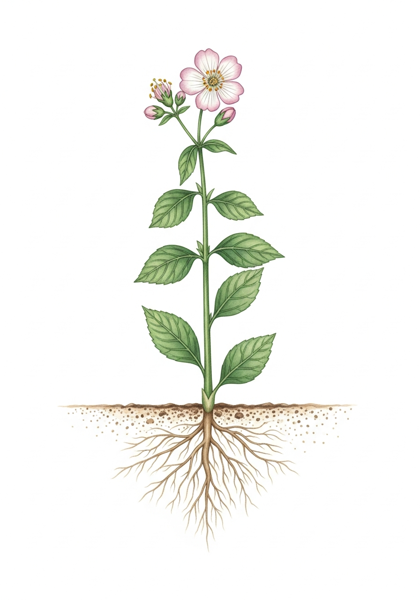
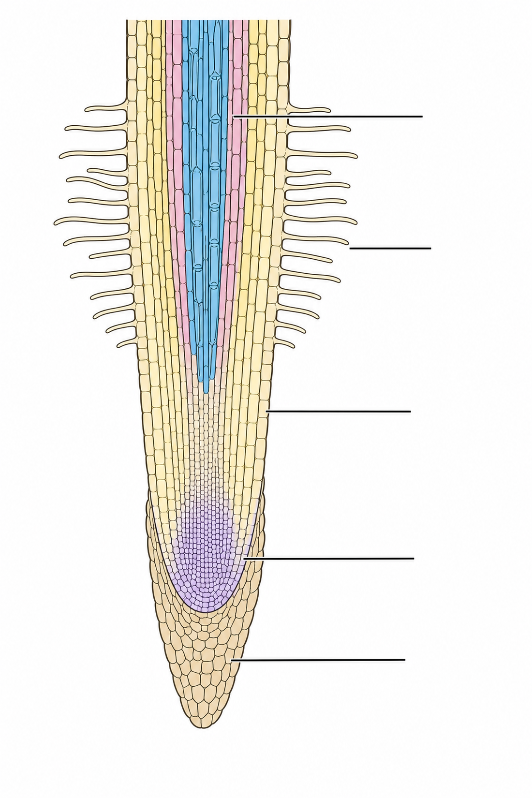
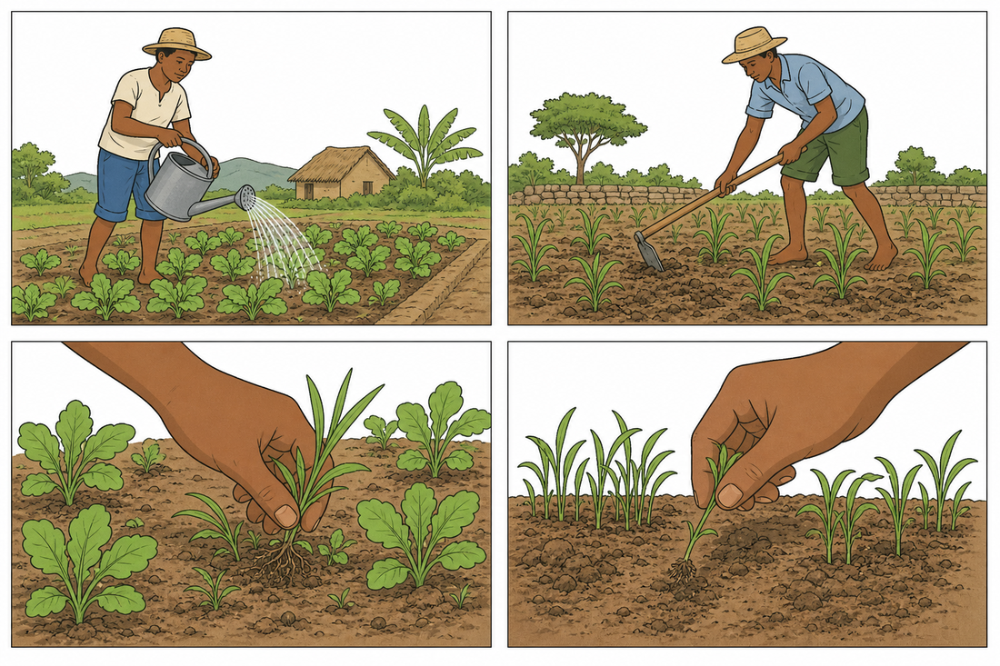
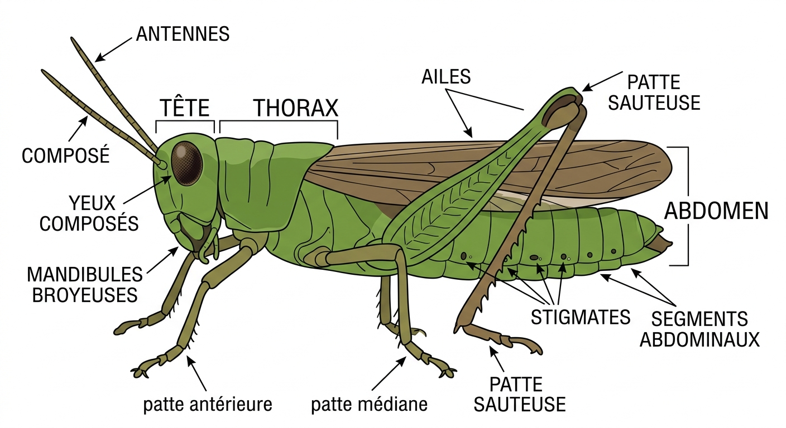
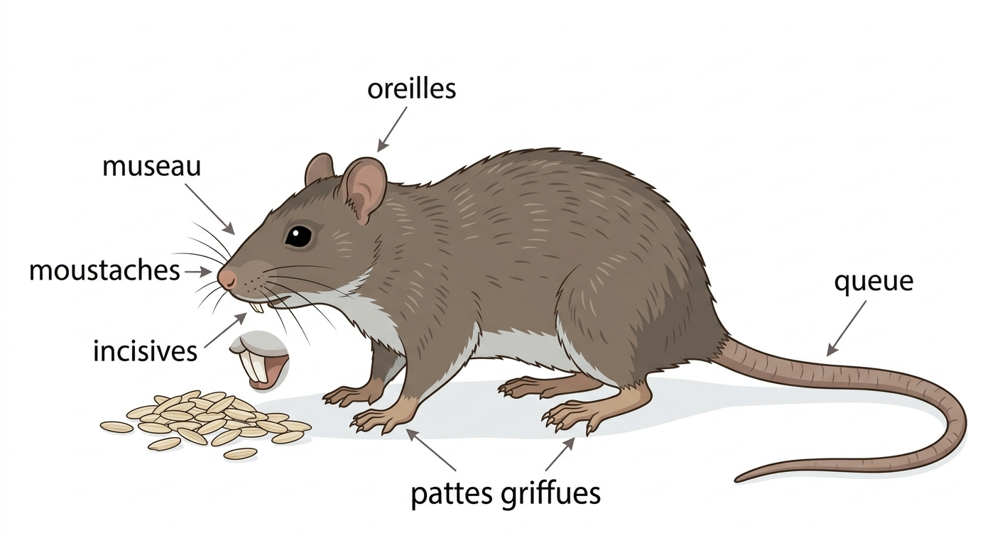
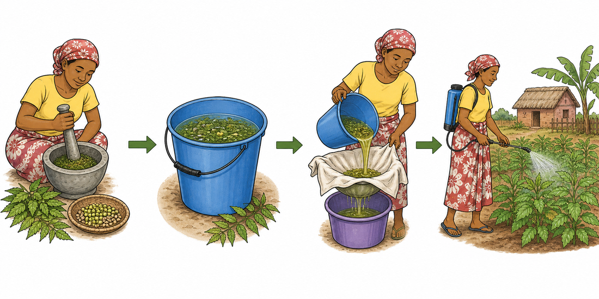
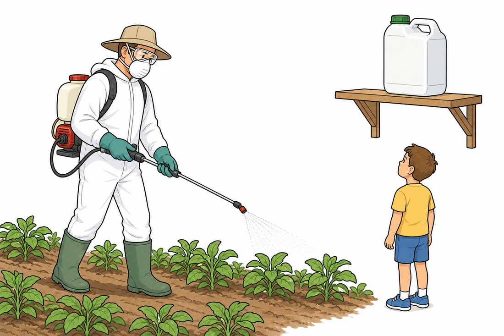

# Unité II — Organisation des êtres vivants · Séances 13 à 18 (partie « plantes »)

**Manuel** : `SVT T9 [PE] Fiche de preparation sujet corrigés J-Learn (1).docx`
**Référentiel** : skill `jlearn-manuel-scolaire` **v18**
**Sources** : `PE_T9 (1).docx` (RAS, contenus, stratégies, valeurs) · `FRP_3eme_SVT.pdf` MEN/DDIS, thématique II RES 2.a → 2.f (faits scientifiques) · vérifications externes citées en fin de document
**Statut** : proposition — **le `.docx` n'a pas été modifié**.

### Rappel du cadre PE pour cette thématique

| Champ | Valeur (source : PE T9) |
|---|---|
| Thème | **Organisation des êtres vivants** |
| Durée totale | 15 heures |
| Valeurs à véhiculer | **respect de toute vie, culture de l'excellence** |
| RAS couvert ici | *Proposer des soins appropriés à un type de plante* |
| RAS des séances 19-22 | *Mettre en relation différentes techniques d'améliorations de l'élevage à chaque espèce connue* — **hors de ce document** |

> ⚠️ **Les séances 19 à 22 (élevage) ne figurent pas ici.** Le FRP SVT 3e ne traite pas l'élevage : zéro occurrence. Il me faut une source avant de les rédiger (voir la section « Suite » en fin de document).

### Arbitrages appliqués (identiques à l'Unité I)

Barème **20 points** · page LEÇON **complète** · champ **Durée laissé vide** · **aucune durée** sur les lignes I/II/III · colonne 1 intitulée **« Étapes »** · tableau de déroulement à 6 colonnes.

**Valeurs à véhiculer** : contrairement à l'Unité I (*autonomie, esprit de créativité*), cette thématique porte **respect de toute vie, culture de l'excellence** — c'est le PE qui change de valeurs d'une thématique à l'autre, pas une inattention.

### Contrôle qualité appliqué

- **Contrôle anti-plagiat `--n 6 --min-car 25`** passé contre le FRP intégral **après rédaction** : résultat reporté en fin de document.
- **Tous les chiffres des exercices vérifiés par script** (dilutions, dosages, proportions).
- **Trois corrections de fond apportées au FRP**, détaillées dans la section « Écarts assumés » : la confusion neem / voandelaka, le conseil d'arrosage, et l'absence totale de consignes de sécurité sur les pesticides.

---

## Structure commune à toutes les fiches

| | |
|---|---|
| **Discipline :** Sciences de la vie et de la terre | **Date :** ____________ |
| **Thème :** Organisation des êtres vivants | **Classe :** T9 |
| **Titre :** *(propre à la séance)* | **Séance n° :** *n* / 51 |
| **Objectif spécifique :** *(propre à la séance)* | **Durée :** ____________ |
| **Documentation :** Programme d'Études T9 (SVT), DCRP | |
| **Support et matériel :** *(propre à la séance)* | **Valeurs à véhiculer :** respect de toute vie, culture de l'excellence |

Tableau de déroulement : **Étapes | Enseignant | Apprenants | Technique et Stratégie | Support et Matériel | Observation**.

---

# SÉANCE 13 / 51 — Les besoins nutritifs des plantes

**Objectif spécifique** : identifier, à partir d'expériences, les quatre éléments dont une plante a besoin pour vivre et croître.
**Support et matériel** : 8 jeunes plants de même taille, bocaux ou boîtes de conserve, eau de pluie, eau salée minéralisée, carton pour l'obscurité.

| Étapes | Enseignant | Apprenants | Technique | Support | Obs. |
|---|---|---|---|---|---|
| **I. RÉVISION** | De quoi l'être humain a-t-il besoin chaque jour pour vivre ? Une plante mange-t-elle comme nous ? | R.A. : De nourriture, d'eau, d'air. R.A. : Non, elle n'a pas de bouche. | Questionnement oral | — | |
| **II. NOUVELLE LEÇON** ||||||
| 1. Mise en situation | Deux pieds de brèdes ont été plantés le même jour. Celui du jardin est vert et vigoureux. Celui qu'on a laissé dans un coin sombre de la cuisine est jaune et mou. Pourtant, on les a arrosés tous les deux. Que manque-t-il au second ? | R.A. : Il manque la lumière du soleil. | Questionnement oral | Tableau noir | |
| 2. Présentation | Aujourd'hui : « Les besoins nutritifs des plantes ». À la fin, vous saurez nommer les quatre éléments nécessaires à une plante et dire quelle expérience le prouve. | Les élèves écoutent. | Exposé | Tableau noir | |
| 3. Observation | Voici quatre montages préparés il y a six jours. Dans chacun, deux plantes identiques ont été traitées différemment : on n'a fait varier **qu'une seule chose** à la fois. Observez et notez l'état de chaque plante. | Les élèves observent et notent. | Observation dirigée, travail de groupe | Les 4 montages | |
| 4. Analyse | Montage 1, l'une a reçu de l'eau, l'autre non : que voyez-vous ? Montage 2, l'une a de l'eau avec sels minéraux, l'autre de l'eau pure : laquelle a le mieux poussé ? Montage 3, l'une est à l'air libre, l'autre privée de dioxyde de carbone : que constatez-vous ? Montage 4, l'une à la lumière, l'autre sous un carton : décrivez. Pourquoi ne change-t-on qu'un seul élément par montage ? | R.A. : Celle sans eau est fanée, elle meurt. R.A. : Celle qui a reçu les sels minéraux ; l'autre reste chétive. R.A. : Celle privée de CO₂ ne grandit presque pas. R.A. : Celle du carton est jaune pâle et sa tige s'allonge anormalement. R.A. : Pour savoir lequel est responsable du changement. | Expérimentation, travail de groupe | Les 4 montages, cahier | |
| 5. Synthèse | **Donc,** une plante a besoin de quatre éléments : **l'eau**, les **sels minéraux**, le **dioxyde de carbone** et la **lumière**. Chaque montage compare deux plantes qui ne diffèrent que par un seul élément : c'est ce qui permet de conclure. La plante sans lumière jaunit parce qu'elle ne fabrique plus sa matière verte. | Les élèves recopient. | Exposé magistral | Tableau noir | |
| 6. Application | **Ex. 1** — Associe chaque montage à l'élément qu'il teste : 1. avec/sans eau · 2. eau minéralisée/eau pure · 3. avec/sans CO₂ · 4. lumière/obscurité  **Ex. 2** — Vrai ou Faux : 1. Une plante mange de la terre. 2. La plante privée de lumière jaunit. 3. Les sels minéraux sont visibles dans l'eau. 4. Il faut changer plusieurs éléments à la fois pour bien conclure. | **Ex. 1** : 1. **l'eau** · 2. **les sels minéraux** · 3. **le dioxyde de carbone** · 4. **la lumière**  **Ex. 2** : 1. **F** — elle y puise l'eau et les sels minéraux, elle ne la mange pas. 2. **V** 3. **F** — ils y sont dissous, donc invisibles. 4. **F** — un seul à la fois. | Travail de groupe | Grande ardoise | |
| **III. ÉVALUATION** | **Ex. 1** — Cite les quatre besoins d'une plante.  **Ex. 2** — Un élève place deux plantes sous un carton, l'une arrosée, l'autre non. Il conclut que la lumière est indispensable. A-t-il raison ? Justifie. | **Ex. 1** : eau, sels minéraux, dioxyde de carbone, lumière.  **Ex. 2** : **Non.** Les deux plantes sont dans le noir, il n'a donc pas comparé lumière et obscurité. Son montage teste l'eau, pas la lumière. | Évaluation écrite | Cahier | |

### Page LEÇON

**Les besoins nutritifs des plantes**

**1. Une question ancienne**

*Dessin de référence pour situer les organes dont il sera question dans toute l'unité. Il ne porte pas de légende : les élèves peuvent les placer sur leur cahier.*

Une plante grandit sans jamais se déplacer et sans rien avaler. Pendant longtemps, on a cru qu'elle « mangeait la terre ». Pour savoir de quoi elle a réellement besoin, il faut **expérimenter** : priver la plante d'un élément et observer ce qui se passe.

**2. Le principe de l'expérience**

On compare toujours **deux plantes semblables** — même espèce, même taille, même récipient. L'une, appelée **témoin**, reçoit tout ce qu'il lui faut. L'autre est privée d'**un seul** élément. Si elle pousse moins bien, c'est que cet élément lui était nécessaire.

La règle est stricte : **on ne fait varier qu'une chose à la fois**. Si l'on modifiait deux éléments en même temps, on ne saurait plus lequel des deux explique le résultat. L'expérience doit durer assez longtemps pour que la différence devienne visible — cinq à six jours suffisent pour de jeunes plants.

**3. Les quatre besoins mis en évidence**

| Montage | Ce que l'on compare | Résultat observé | Conclusion |
|---|---|---|---|
| 1 | avec eau / sans eau | la plante privée d'eau se fane, puis meurt | l'**eau** est indispensable |
| 2 | eau minéralisée / eau pure | la plante en eau pure reste chétive | les **sels minéraux** sont indispensables |
| 3 | avec CO₂ / sans CO₂ | sans dioxyde de carbone, la croissance s'arrête | le **dioxyde de carbone** est indispensable |
| 4 | lumière / obscurité | à l'obscurité, la plante jaunit et sa tige s'allonge anormalement | la **lumière** est indispensable |

**4. Ce que ces besoins signifient**

L'**eau** transporte les substances dissoutes et maintient la plante rigide : une plante qui manque d'eau s'affaisse. Les **sels minéraux** — azote, phosphore, potassium principalement — sont des éléments que la plante puise dans le sol pour fabriquer sa propre matière. Le **dioxyde de carbone** est prélevé dans l'air par les feuilles. La **lumière** fournit l'énergie nécessaire à la fabrication de la matière organique ; privée de lumière, la plante ne produit plus sa matière verte, d'où son aspect jaune pâle.

Ces quatre besoins expliquent tous les gestes du jardinier : arroser, fumer le sol, espacer les plants, les exposer au soleil.

> **Repère historique.** Vers 1860, deux chercheurs allemands, **Wilhelm Knop** et **Julius von Sachs**, sont parvenus à faire pousser des plantes dans de l'eau additionnée de sels minéraux, sans aucune terre. Cette expérience a démontré que ce n'est pas la terre elle-même qui nourrit la plante, mais les éléments minéraux qu'elle contient. C'est l'origine des cultures hors-sol pratiquées aujourd'hui.

### Section EXERCICES

**Exercice 1 (4 points)** — Indique, pour chaque montage, l'élément dont on veut prouver la nécessité.
1. Deux plantes, l'une arrosée, l'autre non.
2. Deux plantes dans l'eau, l'une avec sels minéraux, l'autre sans.
3. Deux plantes, l'une à l'air libre, l'autre dans une enceinte sans dioxyde de carbone.
4. Deux plantes, l'une au soleil, l'autre sous un seau renversé.

**Exercice 2 (6 points)** — Complète avec : *témoin, sels minéraux, lumière, un seul, dissous, jaunit*
1. La plante qui reçoit tout ce qu'il lui faut sert de …….
2. On ne fait varier que …… élément à la fois.
3. Les sels minéraux sont …… dans l'eau.
4. Privée de lumière, la plante …….
5. La plante puise dans le sol l'eau et les …….
6. L'énergie nécessaire à la fabrication de matière vient de la …….

**Exercice 3 (6 points)** — Rakoto veut savoir si les sels minéraux sont utiles. Il met un pied de brèdes dans un bocal d'eau de pluie posé sur le rebord ensoleillé de la fenêtre, et un autre dans un bocal d'eau minéralisée posé sous la table.
1. Quels sont les **deux** éléments qui diffèrent entre ses deux bocaux ?
2. Pourquoi ne pourra-t-il rien conclure sur les sels minéraux ?
3. Propose une correction de son montage.

**Exercice 4 (4 points)** — Choisis la bonne réponse.
1. Une plante prélève le dioxyde de carbone : **A.** dans le sol **B.** dans l'air **C.** dans l'eau d'arrosage
2. Une plante privée de lumière devient : **A.** verte et haute **B.** jaune pâle **C.** rouge
3. Le rôle du montage témoin est de : **A.** servir de point de comparaison **B.** pousser plus vite **C.** remplacer la plante malade
4. Faire pousser une plante dans l'eau sans terre prouve que : **A.** la terre est inutile à tout **B.** ce sont les minéraux, et non la terre elle-même, qui nourrissent **C.** les plantes n'ont pas besoin de minéraux

**TOTAL : 20 points**

### CORRIGÉ

**Ex. 1** — 1. **l'eau** · 2. **les sels minéraux** · 3. **le dioxyde de carbone** · 4. **la lumière**

**Ex. 2** — 1. **témoin** · 2. **un seul** · 3. **dissous** · 4. **jaunit** · 5. **sels minéraux** · 6. **lumière**

**Ex. 3** — 1. La **présence de sels minéraux** et l'**exposition à la lumière**. 2. Deux éléments changent en même temps : si une plante pousse mieux, il ne saura pas si c'est grâce aux sels minéraux ou grâce au soleil. 3. Placer les **deux bocaux au même endroit ensoleillé** et ne faire varier que la présence des sels minéraux.

**Ex. 4** — 1. **B** · 2. **B** · 3. **A** · 4. **B**

---

# SÉANCE 14 / 51 — Le lieu et le mode d'absorption de l'eau

**Objectif spécifique** : localiser la zone d'absorption de l'eau sur une racine et décrire le trajet de l'eau jusqu'aux vaisseaux conducteurs.
**Support et matériel** : jeunes plants de maïs ou de haricot germés sur coton humide (racines visibles), loupe, schéma de racine au tableau, deux tubes avec huile.

| Étapes | Enseignant | Apprenants | Technique | Support | Obs. |
|---|---|---|---|---|---|
| **I. RÉVISION** | Citez les quatre besoins d'une plante. Par quelle partie la plante prend-elle l'eau du sol ? | R.A. : Eau, sels minéraux, dioxyde de carbone, lumière. R.A. : Par les racines. | Questionnement oral | — | |
| **II. NOUVELLE LEÇON** ||||||
| 1. Mise en situation | La racine est parfois très longue. L'eau entre-t-elle partout sur toute sa longueur, ou seulement à un endroit précis ? | R.A. : Les élèves proposent des hypothèses. | Questionnement oral | Tableau noir | |
| 2. Présentation | Aujourd'hui : « Le lieu et le mode d'absorption de l'eau ». Vous saurez situer la zone qui absorbe et expliquer le trajet de l'eau dans la racine. | Les élèves écoutent. | Exposé | Tableau noir | |
| 3. Observation | Observez à la loupe la racine de ces jeunes plants. Regardez bien les trois zones : l'extrémité pointue, la région un peu plus haut couverte d'un duvet blanc, et la partie lisse près de la tige. | Les élèves observent à la loupe. | Observation dirigée | Plants germés, loupe | |
| 4. Analyse | Décrivez le duvet blanc que vous voyez. Voici deux tubes contenant la même quantité d'eau, recouverte d'huile pour empêcher l'évaporation. Dans le premier, la racine trempe par son duvet ; dans le second, seule la partie lisse trempe. Dans lequel le niveau a-t-il baissé ? Qu'en concluez-vous ? À quoi sert la couche d'huile ? | R.A. : Ce sont de très fins poils blancs, serrés les uns contre les autres. R.A. : Dans le premier, celui où trempe le duvet. R.A. : C'est le duvet qui absorbe l'eau. R.A. : À empêcher l'eau de s'évaporer, pour être sûr que la baisse vient bien de la plante. | Étude de document, expérimentation | Tubes, huile, plants | |
| 5. Synthèse | **Donc,** l'eau et les sels minéraux entrent par les **poils absorbants**, groupés sur la **zone pilifère** de la racine, un peu en arrière de l'extrémité. De là, l'eau traverse l'épaisseur de la racine jusqu'au centre, où des vaisseaux appelés **xylème** la conduisent vers la tige et les feuilles. | Les élèves recopient le schéma. | Exposé magistral | Schéma au tableau | |
| 6. Application | **Ex. 1** — Nomme les trois zones de la racine, de la pointe vers la tige.  **Ex. 2** — Complète : a) Les poils absorbants sont groupés sur la zone ……. b) L'eau circule ensuite dans le ……. c) La racine sert aussi à …… la plante au sol. | **Ex. 1** : la **coiffe** à l'extrémité, la **zone pilifère** couverte de poils, la **zone lisse** (ou subéreuse).  **Ex. 2** : a) **pilifère** b) **xylème** c) **fixer** (ancrer) | Travail de groupe | Grande ardoise | |
| **III. ÉVALUATION** | **Ex. 1** — Dessine une racine et place : coiffe, zone pilifère, xylème.  **Ex. 2** — Pourquoi une plante arrachée brutalement du sol reprend-elle difficilement, même bien arrosée ? | **Ex. 1** : schéma correct, trois légendes bien placées.  **Ex. 2** : L'arrachage **détruit les poils absorbants**, très fragiles. Privée d'eux, la plante n'absorbe presque plus d'eau, même si le sol en contient. Il faut le temps qu'elle en forme de nouveaux. | Évaluation écrite | Cahier | |

### Page LEÇON

**Le lieu et le mode d'absorption de l'eau**

**1. Les rôles de la racine**

Chez la plupart des plantes, la racine forme l'appareil enfoui dans le sol. Trois rôles lui reviennent :

- elle **absorbe** l'eau et les sels minéraux du sol ;
- elle **fixe** solidement la plante, qui résiste ainsi au vent et à la pluie ;
- chez certaines espèces, elle **met en réserve** des substances nutritives. Le manioc, la patate douce et la carotte sont des racines de réserve, et c'est précisément ce que nous mangeons.

**2. Où l'eau entre-t-elle ?**

En observant une jeune racine à la loupe, on distingue trois régions :

| Région | Situation | Aspect |
|---|---|---|
| La **coiffe** | tout à l'extrémité | petit capuchon dur qui protège la pointe quand elle s'enfonce |
| La **zone pilifère** | juste en arrière de la pointe | couverte d'un duvet blanc très fin |
| La **zone lisse** | vers la tige | plus âgée, sans duvet |

*Schéma à reproduire au tableau. Il ne porte aucune légende : les élèves les placent eux-mêmes, en s'aidant du tableau ci-dessus. Le même dessin sert à l'examen de l'unité (séance 24).*

Ce duvet est formé de **poils absorbants**. Chaque poil est le prolongement en doigt de gant d'une cellule de la surface de la racine. Ils sont extrêmement nombreux et très fins.

C'est **par eux, et presque uniquement par eux, que l'eau pénètre**. On le démontre simplement : on place une racine dans un tube d'eau recouverte d'une mince couche d'huile. L'huile flotte et bloque l'évaporation ; toute baisse du niveau est donc due à la plante. Quand la zone pilifère trempe, le niveau baisse nettement. Quand seule la zone lisse trempe, il ne bouge presque pas.

La finesse et le nombre des poils absorbants offrent une immense surface de contact avec le sol, alors que la racine occupe peu de place. Mais cette finesse a un prix : **les poils absorbants sont très fragiles** et se déchirent au moindre arrachage. C'est pourquoi on repique les jeunes plants avec leur motte de terre.

**3. Le trajet de l'eau dans la racine**

Une fois entrée par un poil absorbant, l'eau ne reste pas sur place. Elle progresse **de la surface vers le centre** de la racine, en traversant les cellules. Au centre se trouvent les **vaisseaux du xylème**, sortes de tuyaux qui conduisent l'eau chargée de sels minéraux — appelée **sève brute** — vers la tige, puis vers les feuilles.

Le trajet complet tient en une phrase : *sol → poil absorbant → cellules de la racine → xylème → tige → feuilles*.

**4. Pourquoi l'eau entre-t-elle toute seule ?**

L'eau n'est pas aspirée par une pompe. Elle passe spontanément à travers la paroi du poil absorbant parce que le liquide contenu dans la cellule est plus concentré en substances dissoutes que l'eau du sol. Ce passage spontané à travers une paroi porte le nom d'**osmose**. Il a été décrit et nommé par le physiologiste français **Henri Dutrochet**, qui en a présenté les premiers résultats à l'Académie des sciences en 1826.

### Section EXERCICES

**Exercice 1 (5 points)** — Range dans l'ordre suivi par l'eau, de son entrée jusqu'à la feuille :
*xylème · poil absorbant · feuille · cellules de la racine · tige*

**Exercice 2 (5 points)** — Vrai ou Faux. Corrige les affirmations fausses.
1. L'eau entre sur toute la longueur de la racine.
2. Les poils absorbants sont des prolongements de cellules.
3. La coiffe absorbe l'eau.
4. Le xylème conduit la sève brute.
5. Le manioc est une racine de réserve.

**Exercice 3 (6 points)** — On dispose deux tubes d'eau de même niveau, chacun recouvert d'une couche d'huile. Dans le tube A, un jeune plant trempe par sa zone pilifère. Dans le tube B, un plant identique trempe seulement par sa zone lisse. Après deux jours, le niveau a baissé dans A et n'a presque pas bougé dans B.
1. Que conclut-on de cette expérience ?
2. À quoi sert la couche d'huile ?
3. Pourquoi faut-il deux plants de même taille ?

**Exercice 4 (4 points)** — Choisis la bonne réponse.
1. Les poils absorbants se trouvent : **A.** sur la coiffe **B.** sur la zone pilifère **C.** sur la tige
2. La sève brute est composée : **A.** d'eau chargée de sels minéraux **B.** de sucre uniquement **C.** d'huile
3. Dans la racine, l'eau va : **A.** du centre vers la surface **B.** de la surface vers le centre **C.** de haut en bas
4. On repique les plants avec leur motte pour : **A.** les alourdir **B.** protéger les poils absorbants **C.** les faire fleurir

**TOTAL : 20 points**

### CORRIGÉ

**Ex. 1** — poil absorbant → cellules de la racine → xylème → tige → feuille

**Ex. 2** — 1. **F** — elle entre essentiellement par la **zone pilifère**. 2. **V** 3. **F** — la coiffe **protège** la pointe, elle n'absorbe pas. 4. **V** 5. **V**

**Ex. 3** — 1. L'absorption de l'eau se fait **au niveau de la zone pilifère**, donc par les poils absorbants. 2. Elle **empêche l'évaporation** : la baisse observée ne peut venir que de la plante. 3. Pour que les deux tubes ne diffèrent **que par la zone en contact avec l'eau** ; sinon une plante plus grande boirait davantage et fausserait la comparaison.

**Ex. 4** — 1. **B** · 2. **A** · 3. **B** · 4. **B**

---

# SÉANCE 15 / 51 — Les soins à apporter aux plantes cultivées

**Objectif spécifique** : décrire et justifier les quatre principaux soins d'entretien d'une culture.
**Support et matériel** : sarcloir ou angady, plate-bande de l'école ou pot de semis trop dense, arrosoir.

| Étapes | Enseignant | Apprenants | Technique | Support | Obs. |
|---|---|---|---|---|---|
| **I. RÉVISION** | Par où la plante absorbe-t-elle l'eau ? Que se passe-t-il si les poils absorbants sont détruits ? | R.A. : Par les poils absorbants, groupés sur la zone pilifère. R.A. : Elle n'absorbe presque plus d'eau. | Questionnement oral | — | |
| **II. NOUVELLE LEÇON** ||||||
| 1. Mise en situation | Dans un jardin laissé à l'abandon pendant deux mois, les plants de brèdes sont petits et étouffés par d'autres herbes. Que s'est-il passé ? | R.A. : Les mauvaises herbes ont pris la place et la nourriture. | Questionnement oral | Tableau noir | |
| 2. Présentation | Aujourd'hui : « Les soins à apporter aux plantes cultivées ». Vous saurez nommer quatre soins et expliquer à quel besoin de la plante chacun répond. | Les élèves écoutent. | Exposé | Tableau noir | |
| 3. Observation | Sortons observer la plate-bande. Regardez : ici les plants sont serrés, là des herbes poussent entre les rangs, là le sol est dur et craquelé. | Les élèves observent et complètent la fiche. | Observation dirigée, enquête | Plate-bande, fiche d'observation | |
| 4. Analyse | Pourquoi les herbes qui poussent entre les rangs gênent-elles nos plants ? Ces jeunes plants serrés les uns contre les autres pourront-ils tous grossir ? Faut-il arroser tous les jours, même en saison des pluies ? Que devient un sol tassé quand on l'arrose ? | R.A. : Elles prennent l'eau et les sels minéraux du sol. R.A. : Non, ils vont se gêner ; il faut en enlever. R.A. : Non, c'est inutile quand le sol est déjà humide. R.A. : L'eau ruisselle au lieu de pénétrer. | Travail de groupe, enquête | Plate-bande | |
| 5. Synthèse | **Donc,** entretenir une culture consiste à supprimer la concurrence et à donner à chaque plant la place, l'eau et les éléments nutritifs dont il a besoin. Quatre gestes principaux : le **désherbage**, le **sarclage**, l'**éclaircissage** et l'**arrosage raisonné**. | Les élèves recopient. | Exposé magistral | Tableau noir | |
| 6. Application | **Ex. 1** — Nomme le soin décrit : a) arracher les mauvaises herbes à la main · b) enlever quelques plantules trop serrées · c) couper les herbes sous la surface du sol avec un outil  **Ex. 2** — Vrai ou Faux : 1. Les mauvaises herbes concurrencent les cultures. 2. Il faut arroser tous les jours en toute saison. 3. L'éclaircissage consiste à ajouter des plants. 4. Le sarclage ameublit aussi le sol. | **Ex. 1** : a) **désherbage** b) **éclaircissage** c) **sarclage**  **Ex. 2** : 1. **V** 2. **F** — on arrose selon l'état du sol. 3. **F** — on en **retire**. 4. **V** | Travail de groupe | Grande ardoise | |
| **III. ÉVALUATION** | **Ex. 1** — Cite quatre soins et, pour chacun, le besoin de la plante auquel il répond.  **Ex. 2** — Un paysan arrose son champ tous les matins, même après une nuit de pluie. Que lui conseilles-tu et pourquoi ? | **Ex. 1** : désherbage/sarclage → accès à l'eau et aux sels minéraux ; éclaircissage → place et lumière ; arrosage → eau ; apport de fumier → sels minéraux.  **Ex. 2** : Lui conseiller de **vérifier l'humidité du sol avant d'arroser**. Arroser un sol déjà gorgé d'eau gaspille l'eau et son travail, et l'excès d'eau chasse l'air du sol, ce qui asphyxie les racines. | Évaluation écrite | Cahier | |

### Page LEÇON

**Les soins à apporter aux plantes cultivées**

**1. Pourquoi entretenir une culture ?**

Semer ne suffit pas. Une plante cultivée est en **concurrence** permanente : d'autres végétaux poussent autour d'elle et puisent dans le même sol la même eau et les mêmes sels minéraux. Ses voisines de rang lui disputent la lumière. Entretenir, c'est réduire cette concurrence et répondre aux quatre besoins étudiés en séance 13.

**2. Les quatre soins principaux**

**a. Le désherbage**
Il consiste à arracher à la main les herbes indésirables. C'est la seule méthode possible dans les endroits difficiles d'accès, près des pieds ou entre des plants serrés. Il est bien plus efficace quand les herbes sont **encore jeunes** — leurs racines cèdent facilement — et quand le sol est **ameubli**, ce qui évite de le casser en tirant.

**b. Le sarclage**
À l'aide d'un instrument tranchant — sarcloir, petite houe ou angady — on sectionne les herbes indésirables **un peu en dessous du niveau de la terre**, de façon à trancher le collet. Le travail avance beaucoup plus vite qu'à la main. Le sarclage présente un second avantage : il **ameublit la couche superficielle**, si bien que l'eau de pluie pénètre au lieu de ruisseler sur un sol durci.

**c. L'éclaircissage**
Quand les graines ont été semées dru, les plantules lèvent serrées les unes contre les autres. On en retire alors une partie pour ne garder que les plus vigoureuses, régulièrement espacées. Les plants conservés disposent enfin d'assez de place, de lumière et d'éléments nutritifs pour se développer. Un semis trop dense reste par ailleurs humide longtemps, ce qui favorise les maladies.

**d. L'arrosage raisonné**
On arrose **en fonction de l'état du sol**, pas par habitude. Avant d'arroser, on vérifie l'humidité en enfonçant un doigt dans la terre : si elle est encore fraîche en profondeur, on attend. En saison sèche, mieux vaut un arrosage abondant et espacé qu'un petit arrosage quotidien : l'eau descend alors en profondeur et les racines la suivent, au lieu de rester en surface. On arrose de préférence tôt le matin ou en fin de journée, pour limiter l'évaporation.

Attention toutefois : ne jamais arroser n'est pas un « soin ». Un sol desséché en profondeur tue les jeunes plants avant que leurs racines aient pu s'installer. La règle est d'**observer avant d'agir**.

**3. Nourrir le sol**

Une culture prélève chaque saison des sels minéraux. Si l'on ne rend rien au sol, il s'appauvrit. L'apport de **fumier** ou de **compost** reconstitue cette réserve, tout en améliorant la structure du sol, qui retient mieux l'eau.

**4. À retenir**

| Soin | Geste | Besoin satisfait |
|---|---|---|
| Désherbage | arracher à la main | eau, sels minéraux |
| Sarclage | couper sous la surface | eau, sels minéraux, pénétration de l'eau |
| Éclaircissage | retirer les plants en surnombre | place, lumière |
| Arrosage raisonné | arroser selon l'état du sol | eau |
| Fumure | apporter fumier ou compost | sels minéraux |

### Section EXERCICES

**Exercice 1 (4 points)** — Nomme le soin correspondant à chaque geste.
1. Retirer une partie des plantules d'une ligne trop dense.
2. Couper les herbes indésirables sous la surface du sol avec un outil tranchant.
3. Répandre du fumier avant le semis.
4. Arracher à la main les herbes poussant au pied des plants.

**Exercice 2 (6 points)** — Complète avec : *concurrence, ameublit, jeunes, motte, compost, humidité*
1. Les mauvaises herbes exercent une …… sur les cultures.
2. Le désherbage est plus facile quand les herbes sont encore …….
3. Le sarclage …… la couche superficielle du sol.
4. Avant d'arroser, on vérifie l'…… du sol.
5. Le fumier ou le …… enrichit le sol en sels minéraux.
6. On repique un jeune plant avec sa …….

**Exercice 3 (6 points)** — Deux voisins cultivent des brèdes sur des parcelles identiques. Naivo sarcle deux fois et arrose quand le sol est sec. Bema n'a pas le temps de sarcler mais arrose tous les jours. À la récolte, Naivo obtient de belles brèdes, Bema de petites.
1. Donne **deux** raisons expliquant le mauvais résultat de Bema.
2. Bema affirme qu'il a pourtant donné plus d'eau. Explique pourquoi cela n'a pas suffi.
3. Quel conseil lui donnes-tu pour la saison prochaine ?

**Exercice 4 (4 points)** — Choisis la bonne réponse.
1. L'éclaircissage consiste à : **A.** ajouter des plants **B.** retirer des plants en surnombre **C.** arroser davantage
2. Le sarclage se pratique : **A.** au-dessus des feuilles **B.** légèrement en dessous du niveau de la terre **C.** à un mètre de profondeur
3. Un semis trop dense favorise : **A.** les maladies **B.** la floraison **C.** l'enracinement
4. On arrose de préférence : **A.** à midi en plein soleil **B.** tôt le matin ou en fin de journée **C.** jamais

**TOTAL : 20 points**

### CORRIGÉ

**Ex. 1** — 1. **éclaircissage** · 2. **sarclage** · 3. **fumure** (apport de fumier) · 4. **désherbage**

**Ex. 2** — 1. **concurrence** · 2. **jeunes** · 3. **ameublit** · 4. **humidité** · 5. **compost** · 6. **motte**

**Ex. 3** — 1. Les **mauvaises herbes non supprimées** ont prélevé l'eau et les sels minéraux ; le **sol non ameubli** est resté tassé, l'eau ruisselait au lieu de pénétrer. 2. Parce que l'eau apportée était en partie **captée par les mauvaises herbes** et en partie **perdue par ruissellement** sur le sol durci : elle n'atteignait pas les racines des brèdes. L'excès d'eau quotidien chasse en outre l'air du sol. 3. **Sarcler régulièrement** et arroser en fonction de l'état du sol plutôt que tous les jours.

**Ex. 4** — 1. **B** · 2. **B** · 3. **A** · 4. **B**

---

# SÉANCE 16 / 51 — Les bio-agresseurs des cultures

**Objectif spécifique** : définir un bio-agresseur et classer des exemples dans les trois grandes familles.
**Support et matériel** : feuilles attaquées récoltées par les élèves (trouées, tachées, enroulées), loupe, tableau de classement.

| Étapes | Enseignant | Apprenants | Technique | Support | Obs. |
|---|---|---|---|---|---|
| **I. RÉVISION** | Cite deux soins apportés aux cultures. Pourquoi supprime-t-on les mauvaises herbes ? | R.A. : Le sarclage et l'arrosage raisonné. R.A. : Parce qu'elles prennent l'eau et les sels minéraux. | Questionnement oral | — | |
| **II. NOUVELLE LEÇON** ||||||
| 1. Mise en situation | J'ai ici trois feuilles ramassées dans trois jardins. La première est percée de trous, la deuxième porte des taches brunes poudreuses, la troisième est intacte mais poussait au milieu des herbes. Les trois plantes vont mal. Est-ce pour la même raison ? | R.A. : Non, les dégâts ne se ressemblent pas. | Questionnement oral | Les 3 feuilles | |
| 2. Présentation | Aujourd'hui : « Les bio-agresseurs des cultures ». Vous saurez définir un bio-agresseur et reconnaître à quelle famille il appartient. | Les élèves écoutent. | Exposé | Tableau noir | |
| 3. Observation | Observez à la loupe les feuilles que vous avez rapportées. Notez ce que vous voyez : des trous ? des taches ? un insecte ? | Les élèves observent et notent. | Observation dirigée | Feuilles, loupe | |
| 4. Analyse | Qu'est-ce qui peut percer une feuille de cette façon ? Ces taches poudreuses, est-ce un animal ? Et la plante étouffée par les herbes, a-t-elle été mangée ou malade ? Peut-on ranger ces trois cas dans une même catégorie ? | R.A. : Un insecte, une chenille qui l'a mangée. R.A. : Non, on ne voit pas de bête ; cela ressemble à une moisissure. R.A. : Ni l'un ni l'autre, elle a manqué de place et de nourriture. R.A. : Non, il faut trois catégories. | Travail de groupe, étude de document | Feuilles, tableau | |
| 5. Synthèse | **Donc,** un **bio-agresseur** est un être vivant qui nuit aux cultures ou aux récoltes. On en distingue trois familles : les **agents pathogènes** qui provoquent des maladies, les **ravageurs** qui dévorent ou parasitent la plante, et les **adventices**, ces plantes qui poussent là où on ne les veut pas et entrent en concurrence avec la culture. | Les élèves recopient. | Exposé magistral | Tableau noir | |
| 6. Application | **Ex. 1** — Classe : a) le criquet · b) le champignon de la rouille · c) le chiendent · d) le puceron  **Ex. 2** — Vrai ou Faux : 1. Un bio-agresseur est toujours un insecte. 2. Les adventices sont des plantes. 3. Un champignon est un agent pathogène. 4. Les bio-agresseurs peuvent attaquer aussi les récoltes stockées. | **Ex. 1** : a) **ravageur** b) **agent pathogène** c) **adventice** d) **ravageur**  **Ex. 2** : 1. **F** — ce peut être un champignon, une bactérie, un virus ou une plante. 2. **V** 3. **V** 4. **V** | Travail de groupe | Grande ardoise | |
| **III. ÉVALUATION** | **Ex. 1** — Définis « bio-agresseur » et cite les trois familles.  **Ex. 2** — Deux plants de haricot sont chétifs. Sur le premier, les feuilles sont couvertes de petits insectes verts. Le second est sain mais entouré d'herbes hautes. Identifie le bio-agresseur dans chaque cas. | **Ex. 1** : Tout être vivant dont la présence abîme une culture ou une récolte. Trois familles : agents pathogènes, ravageurs, adventices.  **Ex. 2** : Premier plant : des **pucerons**, donc des **ravageurs**. Second plant : les herbes hautes sont des **adventices** qui lui font concurrence. | Évaluation écrite | Cahier | |

### Page LEÇON

**Les bio-agresseurs des cultures**

**1. Définition**

Un **bio-agresseur** — appelé aussi « ennemi des cultures » — désigne tout **être vivant** dont la présence abîme une culture sur pied ou une récolte déjà rentrée. Le mot contient « bio », qui signifie vivant : la grêle, la sécheresse ou le gel abîment les cultures, mais ce ne sont pas des bio-agresseurs, car ce ne sont pas des êtres vivants.

**2. Les trois familles**

**a. Les agents pathogènes**
Ce sont des organismes, souvent microscopiques, qui rendent la plante **malade** : champignons, bactéries, virus. On ne voit généralement pas l'agresseur lui-même, seulement les **symptômes** : taches sur les feuilles, poudre blanche ou rouille, pourriture des racines, flétrissement brutal.

**b. Les ravageurs**

*Le criquet est le ravageur le plus redouté des cultures malgaches. Ses mandibules broyeuses expliquent les dégâts observés sur les feuilles.*

Ce sont des animaux qui **dévorent** la plante ou vivent à ses dépens : criquets, chenilles, pucerons, mouches mineuses, larves du sol, mais aussi rats et oiseaux dans les récoltes stockées.

*Le rat ne s'attaque pas seulement aux plantes sur pied : il s'en prend surtout au riz stocké. Ses incisives, qui poussent en permanence, l'obligent à ronger sans cesse — d'où les dégâts sur les sacs et les greniers.* Les dégâts sont directement visibles : feuilles trouées ou dévorées, tiges sectionnées, fruits percés.

**c. Les adventices**
Cette troisième famille regroupe des **végétaux** installés à un endroit où le cultivateur n'en veut pas : au milieu d'un champ, d'un jardin ou d'une planche de fleurs. L'usage courant les nomme « mauvaises herbes ». Elles ne sont ni malades ni voraces : elles nuisent par **concurrence**, en prélevant l'eau, les sels minéraux et la lumière que la culture aurait utilisés. Certaines sont d'ailleurs des plantes utiles ailleurs ; c'est leur emplacement qui pose problème, pas leur nature.

**3. Reconnaître par les dégâts**

| Ce que l'on observe | Famille probable |
|---|---|
| Feuilles trouées, bords grignotés | ravageur |
| Taches brunes, poudre blanche, rouille | agent pathogène |
| Culture étouffée par d'autres plantes | adventice |
| Petits insectes groupés sous les feuilles | ravageur (pucerons) |
| Plant qui flétrit sans raison apparente | agent pathogène (racines atteintes) |

**4. Pourquoi les identifier ?**

Le traitement dépend entièrement de la famille en cause. Un produit contre les insectes n'aura **aucun effet** sur un champignon, et désherber ne guérira pas une plante malade. Traiter sans avoir identifié le bio-agresseur, c'est dépenser de l'argent et répandre des produits pour rien. La première étape est donc toujours l'**observation attentive** de la plante atteinte.

**5. Prévenir avant de traiter**

Beaucoup d'attaques s'évitent par de bonnes pratiques : semer à la bonne densité pour que l'air circule entre les plants, supprimer les adventices dès qu'elles lèvent, ramasser et détruire les feuilles malades au lieu de les laisser au pied, et **alterner les cultures** d'une saison à l'autre sur une même parcelle — les agresseurs spécialisés d'une plante ne retrouvent alors pas leur hôte.

### Section EXERCICES

**Exercice 1 (4 points)** — Indique la famille de chaque bio-agresseur.
1. La chenille légionnaire
2. Le champignon responsable de la rouille
3. Le chiendent poussant entre les pieds de maïs
4. La bactérie provoquant le flétrissement de la tomate

**Exercice 2 (6 points)** — Vrai ou Faux. Corrige les affirmations fausses.
1. La grêle est un bio-agresseur.
2. Les adventices nuisent par concurrence.
3. Un agent pathogène est toujours visible à l'œil nu.
4. Un insecticide soigne les maladies dues aux champignons.
5. Les rats qui attaquent le riz stocké sont des ravageurs.
6. Alterner les cultures aide à limiter les bio-agresseurs.

**Exercice 3 (6 points)** — Trois parcelles de la même école présentent des problèmes différents.
*Parcelle A* : les feuilles de haricot sont couvertes d'une poudre blanche.
*Parcelle B* : les jeunes pousses de maïs sont sectionnées au ras du sol.
*Parcelle C* : les plants de brèdes sont noyés sous des herbes plus hautes qu'eux.
1. Identifie la famille de bio-agresseur en cause dans chaque parcelle.
2. Pourquoi serait-il inutile d'appliquer le même produit sur les trois parcelles ?
3. Propose une action adaptée à la parcelle C.

**Exercice 4 (4 points)** — Choisis la bonne réponse.
1. Un bio-agresseur est : **A.** un phénomène climatique **B.** un être vivant nuisible aux cultures **C.** un engrais
2. Les pucerons appartiennent aux : **A.** adventices **B.** ravageurs **C.** agents pathogènes
3. Les « mauvaises herbes » sont des : **A.** adventices **B.** champignons **C.** virus
4. Avant de traiter, il faut d'abord : **A.** acheter un produit **B.** identifier le bio-agresseur **C.** arroser

**TOTAL : 20 points**

### CORRIGÉ

**Ex. 1** — 1. **ravageur** · 2. **agent pathogène** · 3. **adventice** · 4. **agent pathogène**

**Ex. 2** — 1. **F** — la grêle n'est pas un être vivant. 2. **V** 3. **F** — il est souvent microscopique ; on n'en voit que les symptômes. 4. **F** — un insecticide agit sur les insectes, pas sur les champignons. 5. **V** 6. **V**

**Ex. 3** — 1. A : **agent pathogène** (champignon) · B : **ravageur** (larve ou insecte du sol) · C : **adventices**. 2. Parce que chaque famille exige un traitement différent : un produit contre les insectes n'agit ni sur un champignon ni sur des herbes. 3. **Désherber ou sarcler** la parcelle C pour supprimer la concurrence, puis entretenir régulièrement.

**Ex. 4** — 1. **B** · 2. **B** · 3. **A** · 4. **B**

---

# SÉANCE 17 / 51 — Les méthodes naturelles de protection

**Objectif spécifique** : préparer et utiliser une protection naturelle à partir de plantes locales.
**Support et matériel** : feuilles de voandelaka, piments mûrs, seau, filtre en tissu, savon, pulvérisateur ou bouteille percée.

| Étapes | Enseignant | Apprenants | Technique | Support | Obs. |
|---|---|---|---|---|---|
| **I. RÉVISION** | Cite les trois familles de bio-agresseurs. Pourquoi faut-il identifier l'agresseur avant de traiter ? | R.A. : Agents pathogènes, ravageurs, adventices. R.A. : Parce que le traitement n'est pas le même. | Questionnement oral | — | |
| **II. NOUVELLE LEÇON** ||||||
| 1. Mise en situation | Un paysan voit ses brèdes envahies de pucerons. Il n'a pas d'argent pour acheter un produit au marché. Autour de lui poussent des voandelaka et des piments. Peut-il s'en servir ? | R.A. : Oui, certaines plantes éloignent les insectes. | Questionnement oral | Tableau noir | |
| 2. Présentation | Aujourd'hui : « Les méthodes naturelles de protection ». Vous saurez préparer un purin de feuilles et expliquer comment l'utiliser sans danger. | Les élèves écoutent. | Exposé | Tableau noir | |
| 3. Observation | Observez ces feuilles de voandelaka et ces piments. Sentez les feuilles froissées. Goûteriez-vous ces feuilles ? | Les élèves observent, froissent, sentent. | Observation dirigée | Feuilles, piments | |
| 4. Analyse | Que remarquez-vous à l'odeur ? D'après vous, pourquoi les insectes évitent-ils ces feuilles ? Si ces substances éloignent les insectes, peuvent-elles être dangereuses pour nous ? Comment faire passer la substance des feuilles dans l'eau ? | R.A. : Elle est forte, amère, désagréable. R.A. : À cause de cette substance au goût amer. R.A. : Oui, il faut faire attention, surtout aux fruits. R.A. : En les écrasant et en les laissant tremper. | Travail de groupe, expérimentation | Feuilles, seau d'eau | |
| 5. Synthèse | **Donc,** certaines plantes locales contiennent des substances qui repoussent ou tuent les insectes. En faisant macérer leurs feuilles dans l'eau, on obtient un **purin** que l'on filtre, que l'on dilue et que l'on pulvérise. Ces produits sont peu coûteux et se dégradent vite, mais ils **ne sont pas inoffensifs** : les fruits du voandelaka sont toxiques et ne doivent jamais être consommés. | Les élèves recopient. | Exposé magistral | Tableau noir | |
| 6. Application | **Ex. 1** — Remets dans l'ordre : filtrer · récolter et écraser les feuilles · pulvériser · laisser macérer · diluer  **Ex. 2** — Vrai ou Faux : 1. Le purin s'applique pur. 2. On filtre avant de pulvériser. 3. Les fruits du voandelaka se mangent. 4. Le piment agit contre les pucerons. | **Ex. 1** : récolter et écraser → laisser macérer → filtrer → diluer → pulvériser  **Ex. 2** : 1. **F** — on le **dilue**. 2. **V** 3. **F** — ils sont **toxiques**. 4. **V** | Travail de groupe | Grande ardoise | |
| **III. ÉVALUATION** | **Ex. 1** — Décris en quatre étapes la préparation d'un purin de feuilles.  **Ex. 2** — Cite deux avantages et deux précautions de ces méthodes naturelles. | **Ex. 1** : écraser les feuilles → faire macérer dans l'eau → filtrer → diluer avant pulvérisation.  **Ex. 2** : Avantages : coût quasi nul, matière disponible localement, dégradation rapide. Précautions : ne jamais consommer les fruits ni les feuilles, se laver les mains après manipulation, tenir les préparations hors de portée des jeunes enfants. | Évaluation écrite | Cahier | |

### Page LEÇON

**Les méthodes naturelles de protection**

**1. Le principe**

Certaines plantes se défendent seules contre les insectes : elles fabriquent des substances au goût amer ou à l'odeur forte que les ravageurs fuient. L'idée des méthodes naturelles est simple : **extraire ces substances** et les appliquer sur les cultures que l'on veut protéger. La matière première pousse au village, la préparation ne coûte presque rien.

**2. Deux plantes disponibles à Madagascar**

**a. Le voandelaka**
Cet arbre est commun sur les Hautes Terres. Ses feuilles broyées et macérées donnent un liquide efficace contre de nombreux insectes : pucerons, chenilles, mouches mineuses. Il agit aussi contre certaines maladies dues à des champignons. On peut également enfouir des feuilles dans le sol ou dans le compost pour limiter les larves qui s'y développent.

> **Attention à la confusion.** On lit souvent que le voandelaka est le « neem ». Ce sont en réalité **deux arbres différents** de la même famille : le neem proprement dit est *Azadirachta indica*, tandis que l'arbre appelé voandelaka sur les Hautes Terres malgaches est *Melia azedarach*, aussi nommé lilas de Perse ou faux neem. Leurs feuilles ont des propriétés voisines, ce qui explique la confusion, mais ce ne sont pas les mêmes espèces.

**b. Le piment**
Les fruits mûrs, leur enveloppe et surtout les graines concentrent les substances actives. Broyés et macérés, ils éloignent fourmis, pucerons et chenilles. Le piment pousse partout en zone tropicale et se trouve sur tous les marchés.

**3. Préparer un purin de feuilles**

1. **Récolter et broyer** les feuilles — compter environ 1 kg de feuilles pour 10 litres d'eau.
2. **Laisser macérer** dans un récipient couvert, à l'ombre, pendant 24 heures au moins.
3. **Filtrer** à travers un tissu, pour que la préparation ne bouche pas le pulvérisateur.
4. **Diluer** avant emploi : en général une part de purin pour quatre parts d'eau.
5. **Ajouter un peu de savon** — il fait adhérer le liquide aux feuilles cireuses au lieu de le laisser glisser.
6. **Pulvériser** sur l'ensemble du feuillage, sans oublier le **dessous des feuilles**, où se cachent les pucerons.

On traite de préférence **en fin de journée** : le soleil de midi dégrade les substances actives, et les gouttes peuvent brûler les feuilles. L'effet ne dure que quelques jours ; après une forte pluie, il faut recommencer.

**4. Avantages et limites**

| Avantages | Limites |
|---|---|
| Coût très faible, matière locale | Effet de courte durée, à renouveler |
| Se dégrade vite, ne s'accumule pas | Préparation à refaire régulièrement |
| Pas de matériel spécial nécessaire | Efficacité variable selon l'attaque |

**5. Naturel ne veut pas dire sans danger**

C'est le point le plus important de cette leçon. Une substance capable de tuer un insecte n'est pas anodine pour l'être humain. **Les fruits du voandelaka sont toxiques** : leur ingestion provoque des troubles digestifs graves et peut être mortelle pour un jeune enfant. Toutes les parties de cet arbre doivent être considérées comme non comestibles.

Les règles sont donc les mêmes que pour n'importe quel produit de traitement : ne jamais goûter, se laver les mains après la préparation, ne pas laisser le seau de macération à portée des jeunes enfants ni des animaux, et rincer les légumes avant de les consommer.

### Section EXERCICES

**Exercice 1 (4 points)** — Remets les étapes dans l'ordre : *diluer · filtrer · broyer les feuilles · pulvériser · laisser macérer 24 h*

**Exercice 2 (6 points)** — Complète avec : *savon, dessous, toxiques, voandelaka, diluer, fin de journée*
1. Le …… est un arbre commun des Hautes Terres.
2. Il faut …… le purin avant de l'appliquer.
3. On ajoute un peu de …… pour faire adhérer le liquide.
4. On pulvérise surtout le …… des feuilles.
5. Le traitement se fait de préférence en …….
6. Les fruits de cet arbre sont …….

**Exercice 3 (6 points)** — Un jardinier doit traiter une parcelle qui nécessite **12 litres** de préparation prête à l'emploi. Il utilise une dilution d'**une part de purin pour quatre parts d'eau**, et son purin se prépare à raison d'**1 kg de feuilles pour 10 litres d'eau**.
1. Quel volume de purin doit-il préparer ? Quel volume d'eau ajoutera-t-il ?
2. Quelle masse de feuilles doit-il récolter ?
3. Il envisage de pulvériser à midi pour « profiter de la chaleur ». Que lui réponds-tu ?

**Exercice 4 (4 points)** — Choisis la bonne réponse.
1. Le voandelaka et le neem sont : **A.** le même arbre **B.** deux arbres différents de la même famille **C.** sans rapport
2. On filtre le purin pour : **A.** le rendre plus fort **B.** éviter de boucher le pulvérisateur **C.** le colorer
3. L'effet d'un purin naturel : **A.** dure toute la saison **B.** ne dure que quelques jours **C.** est définitif
4. Une préparation naturelle est : **A.** toujours sans danger **B.** à manipuler avec précaution **C.** comestible

**TOTAL : 20 points**

### CORRIGÉ

**Ex. 1** — broyer les feuilles → laisser macérer 24 h → filtrer → diluer → pulvériser

**Ex. 2** — 1. **voandelaka** · 2. **diluer** · 3. **savon** · 4. **dessous** · 5. **fin de journée** · 6. **toxiques**

**Ex. 3** — 1. Une part de purin pour quatre d'eau donne **cinq parts au total**. Purin : 12 ÷ 5 = **2,4 L**. Eau à ajouter : 12 − 2,4 = **9,6 L**. 2. Pour 2,4 L de purin à raison d'1 kg pour 10 L : 2,4 ÷ 10 = 0,24 kg, soit **240 g de feuilles**. 3. **Mauvaise idée** : le soleil de midi dégrade les substances actives et les gouttes risquent de brûler les feuilles. Il faut traiter **en fin de journée**.

**Ex. 4** — 1. **B** · 2. **B** · 3. **B** · 4. **B**

---

# SÉANCE 18 / 51 — Les méthodes chimiques et leur usage responsable

**Objectif spécifique** : distinguer les trois classes de pesticides et énoncer les règles de sécurité de leur emploi.
**Support et matériel** : emballages vides et **rincés** de produits du commerce (étiquettes lisibles), gants, verre gradué, affiche des pictogrammes de danger.

| Étapes | Enseignant | Apprenants | Technique | Support | Obs. |
|---|---|---|---|---|---|
| **I. RÉVISION** | Comment prépare-t-on un purin de feuilles ? Combien de temps dure son effet ? | R.A. : On broie, on fait macérer, on filtre, on dilue. R.A. : Quelques jours seulement. | Questionnement oral | — | |
| **II. NOUVELLE LEÇON** ||||||
| 1. Mise en situation | Une attaque de criquets ravage un champ de maïs en deux jours. Le purin de feuilles ne suffira pas. Que peut faire le paysan ? | R.A. : Utiliser un produit acheté, plus puissant. | Questionnement oral | Tableau noir | |
| 2. Présentation | Aujourd'hui : « Les méthodes chimiques et leur usage responsable ». Vous saurez nommer les trois classes de pesticides et citer les règles à respecter. | Les élèves écoutent. | Exposé | Tableau noir | |
| 3. Observation | Voici des emballages vides et rincés. Lisez les étiquettes : cherchez le nom du produit, contre quoi il agit, la dose indiquée et les dessins d'avertissement. | Les élèves lisent et relèvent les informations. | Observation dirigée, travail de groupe | Emballages, affiche | |
| 4. Analyse | Contre quoi agit chacun de ces produits ? Que se passerait-il si on doublait la dose indiquée ? Pourquoi l'étiquette indique-t-elle un délai avant la récolte ? Pourquoi ne faut-il pas traiter un jour de vent ? | R.A. : L'un contre les herbes, l'autre contre les insectes, l'autre contre les champignons. R.A. : On gaspille, on pollue et on peut brûler la plante. R.A. : Pour que le produit disparaisse avant qu'on mange les légumes. R.A. : Le produit serait emporté sur nous ou sur le champ voisin. | Étude de document, travail de groupe | Emballages | |
| 5. Synthèse | **Donc,** les pesticides se répartissent en trois classes selon leur cible : les **herbicides** contre les adventices, les **insecticides** contre les insectes, les **fongicides** contre les champignons. Ils sont efficaces mais dangereux : leur usage impose de respecter la dose, de se protéger, et d'attendre le délai indiqué avant la récolte. | Les élèves recopient. | Exposé magistral | Tableau noir | |
| 6. Application | **Ex. 1** — Quel produit contre : a) les pucerons · b) la rouille (champignon) · c) le chiendent ?  **Ex. 2** — Vrai ou Faux : 1. Doubler la dose double l'efficacité. 2. Il faut porter des gants. 3. On peut récolter juste après avoir traité. 4. On traite par temps calme. | **Ex. 1** : a) **insecticide** b) **fongicide** c) **herbicide**  **Ex. 2** : 1. **F** — on gaspille et on pollue. 2. **V** 3. **F** — il faut respecter le **délai avant récolte**. 4. **V** | Travail de groupe | Grande ardoise | |
| **III. ÉVALUATION** | **Ex. 1** — Cite les trois classes de pesticides et leur cible.  **Ex. 2** — Énonce quatre règles de sécurité à respecter lors d'un traitement. | **Ex. 1** : herbicide → adventices ; insecticide → insectes ; fongicide → champignons.  **Ex. 2** : lire l'étiquette et respecter la dose ; porter gants et vêtements couvrants ; ne pas traiter par temps venteux ; respecter le délai avant récolte ; se laver après traitement ; ne jamais réutiliser les emballages. | Évaluation écrite | Cahier | |

### Page LEÇON

**Les méthodes chimiques et leur usage responsable**

**1. Qu'est-ce qu'un pesticide ?**

Un **pesticide** est un produit fabriqué pour détruire ou limiter un bio-agresseur. On y a recours quand l'attaque est trop forte ou trop rapide pour les méthodes naturelles. Ces produits sont puissants — c'est leur intérêt, et c'est aussi tout leur danger.

**2. Les trois classes**

| Classe | Cible | Exemple de situation |
|---|---|---|
| **Herbicide** | les adventices | un champ envahi de chiendent |
| **Insecticide** | les insectes | une invasion de criquets |
| **Fongicide** | les champignons | de la rouille sur les feuilles de haricot |

Chaque classe n'agit que sur sa cible. C'est pourquoi l'identification du bio-agresseur, vue en séance 16, est indispensable **avant** tout achat : un insecticide appliqué sur une maladie fongique ne sert à rien, sinon à polluer et à dépenser de l'argent.

Certains produits agissent **par contact** : ils détruisent l'agresseur qu'ils touchent directement. D'autres sont **systémiques** : absorbés par la plante, ils la rendent toxique pour l'agresseur qui s'en nourrit. Ces derniers restent plus longtemps dans le végétal, ce qui rend le délai avant récolte d'autant plus important.

**3. Les dangers**

Un pesticide ne fait pas le tri entre l'agresseur visé et le reste du vivant. Il peut :

- **intoxiquer la personne qui traite**, par la peau, par les yeux ou par les gouttelettes respirées ;
- **laisser des résidus** sur les légumes récoltés trop tôt après le traitement ;
- **tuer des animaux utiles** — abeilles qui pollinisent, coccinelles qui dévorent les pucerons, vers de terre qui aèrent le sol ;
- **contaminer l'eau** des rizières, des puits et des rivières par ruissellement.

**4. Les règles d'un usage responsable**

1. **Identifier d'abord** le bio-agresseur, puis choisir la classe adaptée.
2. **Lire l'étiquette** entièrement : cible, dose, délai avant récolte, pictogrammes de danger.
3. **Respecter exactement la dose.** Augmenter la dose n'augmente pas l'efficacité : cela gaspille le produit, peut brûler la plante et aggrave la pollution.
4. **Se protéger** : gants, vêtements à manches longues, ne pas manger, boire ni fumer pendant le traitement.
5. **Choisir le bon moment** : par temps calme, jamais par grand vent qui emporterait le produit ; plutôt en fin de journée, quand les abeilles ne butinent plus.
6. **Respecter le délai avant récolte** indiqué sur l'emballage — souvent une à plusieurs semaines. C'est le temps nécessaire pour que le produit se dégrade.
7. **Se laver** soigneusement après le traitement, et laver les vêtements à part.
8. **Ne jamais réutiliser un emballage vide** pour contenir de l'eau ou de la nourriture.

**5. Combiner plutôt qu'opposer**

Méthodes naturelles et chimiques ne s'excluent pas. La démarche raisonnable consiste à **prévenir d'abord** — rotation des cultures, sarclage, densité de semis correcte, ramassage des feuilles malades —, à **recourir ensuite aux préparations naturelles** pour les attaques modérées, et à **réserver le pesticide** aux situations où la récolte est réellement menacée. On protège ainsi à la fois le champ, la santé de la famille et l'environnement.

### Section EXERCICES

**Exercice 1 (4 points)** — Indique la classe de pesticide adaptée à chaque situation.
1. Les feuilles de haricot sont couvertes de rouille.
2. Une invasion de criquets menace le maïs.
3. Le chiendent envahit la parcelle avant le semis.
4. Des pucerons colonisent les jeunes pousses.

**Exercice 2 (6 points)** — Vrai ou Faux. Corrige les affirmations fausses.
1. Doubler la dose rend le traitement deux fois plus efficace.
2. On peut traiter par grand vent sans risque.
3. Le délai avant récolte permet au produit de se dégrader.
4. Les pesticides peuvent tuer des insectes utiles.
5. Un emballage vide peut servir à transporter de l'eau.
6. Un fongicide agit contre les insectes.

**Exercice 3 (6 points)** — L'étiquette d'un fongicide indique : **20 mL pour 10 litres d'eau**, délai avant récolte **14 jours**.
1. Quelle quantité de produit faut-il pour une cuve de 5 L ? pour une cuve de 15 L ?
2. Un jardinier traite ses brèdes et veut les vendre au marché **six jours** plus tard. A-t-il le droit ? Justifie.
3. Il pense que « le double fera plus d'effet ». Donne-lui deux arguments pour l'en dissuader.

**Exercice 4 (4 points)** — Choisis la bonne réponse.
1. Un herbicide agit contre : **A.** les insectes **B.** les adventices **C.** les champignons
2. Un produit systémique est : **A.** absorbé par la plante **B.** posé sur le sol **C.** sans effet
3. On traite de préférence : **A.** par grand vent **B.** par temps calme **C.** sous la pluie
4. La première chose à faire avant de traiter est de : **A.** lire l'étiquette **B.** doubler la dose **C.** récolter

**TOTAL : 20 points**

### CORRIGÉ

**Ex. 1** — 1. **fongicide** · 2. **insecticide** · 3. **herbicide** · 4. **insecticide**

**Ex. 2** — 1. **F** — cela gaspille le produit, risque de brûler la plante et pollue davantage, sans gain d'efficacité. 2. **F** — le vent emporte le produit sur l'applicateur ou les parcelles voisines. 3. **V** 4. **V** 5. **F** — un emballage de pesticide ne doit **jamais** être réutilisé. 6. **F** — un fongicide agit contre les **champignons**.

**Ex. 3** — 1. Pour 5 L : 20 × 5 ÷ 10 = **10 mL**. Pour 15 L : 20 × 15 ÷ 10 = **30 mL**. 2. **Non.** Le délai avant récolte est de **14 jours** ; six jours après le traitement, des résidus subsistent sur les feuilles. Il doit attendre **8 jours supplémentaires**. 3. Le surdosage **n'augmente pas l'efficacité** — le produit agit à la dose prévue ; il **gaspille de l'argent**, **risque de brûler les plants** et **aggrave la pollution** de l'eau et du sol.

**Ex. 4** — 1. **B** · 2. **A** · 3. **B** · 4. **A**

---

## Vérifications externes de cette unité

| Fait avancé | Vérification |
|---|---|
| Voandelaka = *Melia azedarach*, distinct du neem *Azadirachta indica* | Concordance de plusieurs sources botaniques, dont l'inventaire des plantes invasives de Madagascar qui nomme explicitement « Lilas de Perse ou *Voandelaka* (*Melia azedarach*) » |
| Toxicité de *Melia azedarach* | Toutes les parties toxiques ; l'ingestion d'un petit nombre de fruits peut être mortelle pour la plupart des mammifères |
| Efficacité du purin de feuilles (pucerons, chenilles, mouches mineuses ; oïdium, rouille), rémanence de quelques jours | Fiches botaniques concordantes |
| Knop et von Sachs, culture en solution minérale sans sol, vers 1860 | Travaux datés de 1860-1865 ; solution de Knop à six éléments minéraux |
| Dutrochet, osmose, communication de 1826 | Premiers résultats sur l'endosmose présentés à l'Académie des sciences en octobre 1826 |
| Calculs des exercices 17.3 et 18.3 | Vérifiés par script : 12 L au 1/5 → 2,4 L + 9,6 L ; 240 g de feuilles ; 10 mL et 30 mL |

## Suite

**Séances 19 à 22 — élevage : toujours bloquées.** Le RAS du PE est *« Mettre en relation différentes techniques d'améliorations de l'élevage à chaque espèce connue »*, avec pour contenus l'alimentation, les soins (vaccination, amélioration de l'habitat) et la sélection d'espèces. Le FRP SVT 3e ne contient **aucune** matière sur ce thème.

Deux options, il me faut votre choix :
- **(a)** vous me fournissez une source (document du ministère de l'Agriculture et de l'Élevage, support de vulgarisation, manuel existant) ;
- **(b)** vous m'autorisez à m'appuyer sur la **FAO** et la documentation des **services vétérinaires malgaches** (zébu, volaille de basse-cour, porcin), avec citation en Documentation comme pour le FRP.

Ensuite viendront les **séances 25 à 33** (Santé et bien-être), qui contiennent trois des quatre « précis de cours » du FRP — donc le risque de recopie le plus élevé de tout le manuel. Le contrôle `--n 6` y sera déterminant.
