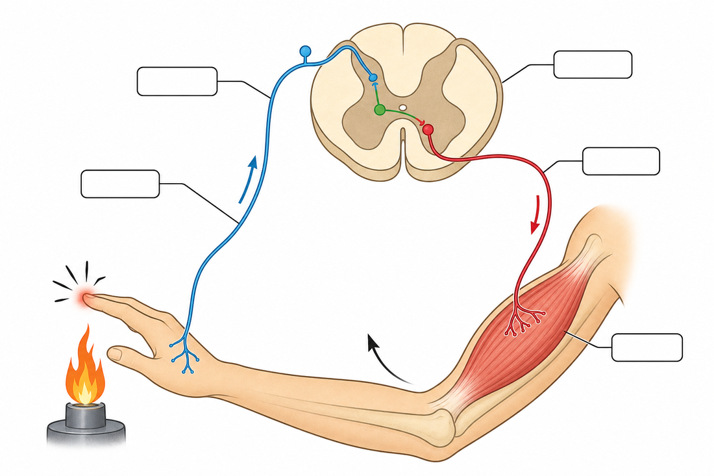

# Unité III — Santé et bien-être · Séances 25 à 33

**Manuel** : `SVT T9 [PE] Fiche de preparation sujet corrigés J-Learn (1).docx`
**Référentiel** : skill `jlearn-manuel-scolaire` **v18**
**Sources** : `PE_T9 (1).docx` (RAS, contenus, stratégies, valeurs) · `FRP_3eme_SVT.pdf` MEN/DDIS, thématique III RES 3.a → 3.e (faits scientifiques) · vérifications externes citées en fin de document
**Statut** : proposition — **le `.docx` n'a pas été modifié**.

### Rappel du cadre PE

| Champ | Valeur (source : PE T9) |
|---|---|
| Thème | **Santé et bien-être** |
| Durée totale | 18 heures |
| Valeurs à véhiculer | **connaissance de soi, altruisme** |
| RAS | *Participer à la lutte contre la prise des substances psychoactives* |

### Arbitrages appliqués

Barème **20 points** · page LEÇON **complète** · champ **Durée laissé vide** · **aucune durée** sur les lignes I/II/III · colonne 1 intitulée **« Étapes »** · tableau de déroulement à 6 colonnes.

### ⚠️ Unité la plus sensible du manuel — deux raisons

**1. Risque de recopie maximal.** Trois des quatre « précis de cours » du FRP se trouvent ici : le tableau comparatif MRI/MRA/MV (RES 3.b) et l'arc réflexe (RES 3.c). Un précis de cours est une leçon déjà rédigée, prête à être recopiée. Le contrôle `--n 6` a donc été appliqué avec une attention particulière ; le nombre de passes nécessaires est indiqué en fin de document.

**2. Sujet socialement sensible.** Les séances 31 à 33 traitent des substances psychoactives devant des élèves d'environ 14 ans. J'ai retenu trois règles de rédaction : aucune description de mode de consommation, aucune donnée susceptible de servir de mode d'emploi, et aucun jugement sur les personnes dépendantes — la dépendance est présentée comme un état dont on peut sortir avec de l'aide, jamais comme une faute morale. Le PE demande de « participer à la lutte », ce qui suppose de comprendre, pas de stigmatiser.

---

## Structure commune à toutes les fiches

| | |
|---|---|
| **Discipline :** Sciences de la vie et de la terre | **Date :** ____________ |
| **Thème :** Santé et bien-être | **Classe :** T9 |
| **Titre :** *(propre à la séance)* | **Séance n° :** *n* / 51 |
| **Objectif spécifique :** *(propre à la séance)* | **Durée :** ____________ |
| **Documentation :** Programme d'Études T9 (SVT), DCRP | |
| **Support et matériel :** *(propre à la séance)* | **Valeurs à véhiculer :** connaissance de soi, altruisme |

Tableau de déroulement : **Étapes | Enseignant | Apprenants | Technique et Stratégie | Support et Matériel | Observation**.

---

# SÉANCE 25 / 51 — L'organisation du système nerveux

**Objectif spécifique** : distinguer le système nerveux central du système nerveux périphérique et nommer leurs constituants.
**Support et matériel** : schéma du système nerveux au tableau, silhouette humaine dessinée sur papier kraft.

| Étapes | Enseignant | Apprenants | Technique | Support | Obs. |
|---|---|---|---|---|---|
| **I. RÉVISION** | Quand vous touchez un objet très chaud, que fait votre main ? Qui a commandé ce mouvement ? | R.A. : Elle se retire tout de suite. R.A. : Le cerveau, ou quelque chose dans le corps. | Questionnement oral | — | |
| **II. NOUVELLE LEÇON** ||||||
| 1. Mise en situation | Vous marchez pieds nus et vous posez le pied sur une épine. Votre pied se relève avant même que vous ayez eu le temps d'y penser. Pourtant, l'épine est loin de la tête. Comment l'information a-t-elle voyagé aussi vite ? | R.A. : Il y a quelque chose qui transporte le message dans le corps. | Questionnement oral | Tableau noir | |
| 2. Présentation | Aujourd'hui : « L'organisation du système nerveux ». Vous saurez nommer les deux grandes parties du système nerveux et ce qui les compose. | Les élèves écoutent. | Exposé | Tableau noir | |
| 3. Observation | Observez ce schéma. Repérez la partie enfermée dans le crâne, celle qui descend le long du dos, et les fils blanchâtres qui partent vers les bras, les jambes, la peau. | Les élèves observent et repèrent. | Observation dirigée | Schéma, silhouette | |
| 4. Analyse | Que protège la boîte crânienne ? Que protège la colonne vertébrale ? Où mènent les fils blanchâtres ? Pourquoi ces deux organes sont-ils les seuls du corps protégés par des os aussi épais ? Si l'on coupait un de ces fils, que se passerait-il pour la partie du corps qu'il dessert ? | R.A. : L'encéphale, dont le cerveau. R.A. : La moelle épinière. R.A. : Vers tous les organes et toute la peau. R.A. : Parce qu'ils sont fragiles et très importants. R.A. : Elle ne recevrait plus de message, on ne la sentirait plus. | Étude de document, travail de groupe | Schéma | |
| 5. Synthèse | **Donc,** le système nerveux comprend deux ensembles. Le **système nerveux central** réunit l'**encéphale**, logé dans le crâne, et la **moelle épinière**, protégée par la colonne vertébrale. Le **système nerveux périphérique** est formé des **nerfs** et des **ganglions** qui relient ce centre à toutes les régions du corps. | Les élèves recopient le schéma. | Exposé magistral | Tableau noir | |
| 6. Application | **Ex. 1** — Classe en central ou périphérique : a) la moelle épinière · b) un nerf du bras · c) l'encéphale · d) un ganglion  **Ex. 2** — Vrai ou Faux : 1. Le cerveau fait partie du système nerveux périphérique. 2. La moelle épinière est protégée par les vertèbres. 3. Les nerfs ne transportent les messages que dans un sens. 4. L'encéphale est logé dans le crâne. | **Ex. 1** : a) **central** b) **périphérique** c) **central** d) **périphérique**  **Ex. 2** : 1. **F** — il appartient au système **central**. 2. **V** 3. **F** — les messages circulent **dans les deux sens**. 4. **V** | Travail de groupe | Grande ardoise | |
| **III. ÉVALUATION** | **Ex. 1** — Complète : a) Le système nerveux central comprend …… et ……. b) Le système nerveux périphérique est formé de …… et de …….  **Ex. 2** — Explique pourquoi une blessure de la colonne vertébrale peut entraîner la paralysie des jambes. | **Ex. 1** : a) **l'encéphale**, **la moelle épinière** b) **nerfs**, **ganglions**  **Ex. 2** : La colonne vertébrale abrite la **moelle épinière**. Si elle est atteinte, les messages ne passent plus entre l'encéphale et les nerfs des jambes : les ordres n'arrivent plus aux muscles et les sensations ne remontent plus. | Évaluation écrite | Cahier | |

### Page LEÇON

**L'organisation du système nerveux**

**1. À quoi sert le système nerveux ?**

Le corps humain est fait d'organes très différents qui doivent travailler ensemble. Quand vous marchez, vos yeux surveillent le sol, vos muscles se contractent dans le bon ordre, votre cœur accélère. Rien de tout cela ne fonctionnerait si ces organes ne pouvaient pas communiquer.

Le **système nerveux** est le réseau qui assure cette communication. Il recueille les informations venues du corps et du milieu extérieur, les traite, puis envoie des ordres aux organes. Il travaille en permanence, y compris pendant le sommeil.

**2. Deux grands ensembles**

**a. Le système nerveux central**

Il est constitué de deux organes, et l'un comme l'autre est enfermé dans un étui osseux, ce qui témoigne de leur importance et de leur fragilité.

- L'**encéphale** occupe la boîte crânienne. Il comprend le **cerveau**, le **cervelet** et le **tronc cérébral**.
- La **moelle épinière** prolonge l'encéphale vers le bas. C'est un long cordon nerveux qui descend dans le canal formé par l'empilement des **vertèbres**.

**b. Le système nerveux périphérique**

Il regroupe tout ce qui se trouve en dehors des deux organes précédents : les **nerfs**, longs cordons blanchâtres qui rayonnent dans tout le corps, et les **ganglions**, petits renflements situés sur leur trajet.

Les nerfs relient le système central à la peau, aux muscles, aux organes des sens et aux viscères. Ils fonctionnent **dans les deux sens** : certains font remonter les informations vers le centre, d'autres redescendent les ordres vers les organes.

**3. Deux modes de commande**

Le système nerveux périphérique se partage lui-même en deux domaines :

| Domaine | Ce qu'il commande | Exemples |
|---|---|---|
| **Somatique** | les mouvements que nous décidons | marcher, écrire, parler |
| **Autonome** | les fonctions que le corps règle seul | battements du cœur, digestion, respiration |

C'est grâce au domaine autonome que votre cœur continue de battre et que votre digestion se poursuit sans que vous ayez à y penser — y compris quand vous dormez.

**4. La cellule nerveuse**

Le système nerveux est bâti à partir d'un type de cellule particulier : le **neurone**. Un neurone possède un corps cellulaire et de longs prolongements, ce qui lui permet de transmettre un message d'un point à un autre du corps. Un nerf n'est rien d'autre qu'un faisceau de très nombreux prolongements de neurones réunis en câble.

Le message qui circule le long d'un neurone porte le nom d'**influx nerveux**. Il se déplace très vite — c'est pourquoi votre pied se relève presque instantanément quand vous marchez sur une épine.

**5. Un système fragile**

Les cellules nerveuses se renouvellent très mal. Une lésion du système nerveux laisse souvent des séquelles définitives : c'est ce qui rend si graves les traumatismes crâniens et les atteintes de la colonne vertébrale. D'où l'importance du casque à moto et des précautions lors des chutes.

### Section EXERCICES

**Exercice 1 (4 points)** — Indique, pour chaque élément, s'il appartient au système nerveux **central** ou **périphérique**.
1. Le cervelet
2. Un nerf de la jambe
3. La moelle épinière
4. Un ganglion nerveux

**Exercice 2 (6 points)** — Complète avec : *vertèbres, neurone, influx nerveux, encéphale, autonome, ganglions*
1. L'…… est protégé par la boîte crânienne.
2. La moelle épinière est protégée par les …….
3. La cellule du système nerveux s'appelle le …….
4. Le message qui circule dans un nerf est l'…….
5. Les nerfs et les …… forment le système périphérique.
6. Le système nerveux …… commande la digestion.

**Exercice 3 (6 points)** — Après une chute, un blessé ne sent plus ses jambes et ne peut plus les bouger, mais son cœur bat normalement et il respire sans difficulté.
1. Quelle partie du système nerveux a probablement été touchée ?
2. Pourquoi les jambes sont-elles à la fois insensibles et immobiles ?
3. Pourquoi le cœur continue-t-il de battre malgré cette atteinte ?

**Exercice 4 (4 points)** — Choisis la bonne réponse.
1. L'encéphale comprend : **A.** cerveau, cervelet, tronc cérébral **B.** cerveau seulement **C.** cerveau et nerfs
2. Les nerfs transportent les messages : **A.** dans un seul sens **B.** dans les deux sens **C.** jamais
3. La respiration est commandée par le système : **A.** somatique **B.** autonome **C.** osseux
4. Un nerf est : **A.** un os creux **B.** un faisceau de prolongements de neurones **C.** un vaisseau sanguin

**TOTAL : 20 points**

### CORRIGÉ

**Ex. 1** — 1. **central** · 2. **périphérique** · 3. **central** · 4. **périphérique**

**Ex. 2** — 1. **encéphale** · 2. **vertèbres** · 3. **neurone** · 4. **influx nerveux** · 5. **ganglions** · 6. **autonome**

**Ex. 3** — 1. La **moelle épinière**, au niveau de la colonne vertébrale. 2. Parce que la moelle conduit les messages **dans les deux sens** : les sensations ne remontent plus vers l'encéphale, et les ordres de mouvement ne descendent plus jusqu'aux muscles. 3. Le cœur est commandé par le système nerveux **autonome**, dont les commandes partent du tronc cérébral et empruntent d'autres voies que celles atteintes par la lésion.

**Ex. 4** — 1. **A** · 2. **B** · 3. **B** · 4. **B**

---

# SÉANCE 26 / 51 — Les rôles des différentes parties

**Objectif spécifique** : attribuer à chaque partie du système nerveux la fonction qu'elle assure.
**Support et matériel** : schéma de l'encéphale, tableau de correspondance à compléter.

| Étapes | Enseignant | Apprenants | Technique | Support | Obs. |
|---|---|---|---|---|---|
| **I. RÉVISION** | Cite les deux parties du système nerveux central. De quoi est fait le système périphérique ? | R.A. : L'encéphale et la moelle épinière. R.A. : Des nerfs et des ganglions. | Questionnement oral | — | |
| **II. NOUVELLE LEÇON** ||||||
| 1. Mise en situation | Un élève récite une leçon apprise hier : il se souvient. Un autre marche sur une poutre étroite sans tomber : il garde l'équilibre. Un troisième dort : il respire quand même. Est-ce la même partie du système nerveux qui agit dans les trois cas ? | R.A. : Sans doute pas, ce sont des choses très différentes. | Questionnement oral | Tableau noir | |
| 2. Présentation | Aujourd'hui : « Les rôles des différentes parties ». Vous saurez dire ce que fait chaque partie du système nerveux. | Les élèves écoutent. | Exposé | Tableau noir | |
| 3. Observation | Observez le schéma de l'encéphale. Repérez la grande masse plissée en haut, la petite masse striée en arrière et en bas, et la tige qui se prolonge vers la moelle épinière. | Les élèves observent et nomment. | Observation dirigée | Schéma de l'encéphale | |
| 4. Analyse | Un boxeur reçoit un coup à l'arrière de la tête et titube sans pouvoir marcher droit : quelle partie a été ébranlée ? Une personne perd la mémoire des mots après un accident : quelle partie est touchée ? Pendant le sommeil, qui commande la respiration ? Quand vous retirez votre main d'un objet brûlant avant d'avoir eu mal, qui a commandé ? | R.A. : La petite masse en arrière, le cervelet. R.A. : Le cerveau. R.A. : Une partie qui fonctionne sans nous, à la base. R.A. : Sûrement pas le cerveau, c'est allé trop vite. | Étude de document, travail de groupe | Schéma | |
| 5. Synthèse | **Donc,** le **cerveau** assure les fonctions conscientes : sensations, mouvements voulus, pensée, parole, mémoire. Le **cervelet** coordonne les mouvements et maintient l'équilibre. Le **tronc cérébral** règle les fonctions vitales — respiration, rythme du cœur — et sert de passage entre l'encéphale et la moelle. La **moelle épinière** conduit les messages dans les deux sens et commande seule les réflexes. Les **nerfs** transportent ces messages. | Les élèves recopient. | Exposé magistral | Tableau noir | |
| 6. Application | **Ex. 1** — Qui commande ? a) réciter un poème · b) garder l'équilibre à vélo · c) la respiration pendant le sommeil · d) retirer la main d'une flamme  **Ex. 2** — Vrai ou Faux : 1. Le cervelet sert à la mémoire. 2. Le tronc cérébral règle le rythme cardiaque. 3. La moelle épinière ne fait que transmettre. 4. Le cerveau commande les mouvements voulus. | **Ex. 1** : a) **cerveau** b) **cervelet** c) **tronc cérébral** d) **moelle épinière**  **Ex. 2** : 1. **F** — c'est le **cerveau** ; le cervelet coordonne et équilibre. 2. **V** 3. **F** — elle **commande aussi les réflexes**. 4. **V** | Travail de groupe | Grande ardoise | |
| **III. ÉVALUATION** | **Ex. 1** — Associe chaque partie à son rôle : cerveau, cervelet, tronc cérébral, moelle épinière, nerfs.  **Ex. 2** — Une personne âgée marche en titubant et ne parvient plus à saisir précisément les objets, mais elle parle et se souvient parfaitement. Quelle partie est probablement atteinte ? Justifie. | **Ex. 1** : cerveau → pensée, mémoire, mouvements voulus ; cervelet → coordination et équilibre ; tronc cérébral → fonctions vitales ; moelle épinière → conduction et réflexes ; nerfs → transport des messages.  **Ex. 2** : Le **cervelet**. La parole et la mémoire, qui relèvent du cerveau, sont intactes ; ce sont **l'équilibre et la précision des gestes** qui sont perturbés, et ce sont précisément les fonctions du cervelet. | Évaluation écrite | Cahier | |

### Page LEÇON

**Les rôles des différentes parties**

**1. Le cerveau**

C'est la partie la plus volumineuse de l'encéphale, reconnaissable à sa surface plissée. Il assure tout ce dont nous avons **conscience** :

- recevoir et interpréter les **sensations** — voir, entendre, sentir, avoir mal ;
- décider et commander les **mouvements volontaires** ;
- la **pensée**, le raisonnement, le jugement ;
- la **parole** et la compréhension du langage ;
- la **mémoire**, qui conserve les apprentissages.

Le cerveau est divisé en deux moitiés, les hémisphères. Fait remarquable : chaque hémisphère commande le **côté opposé** du corps. Une atteinte de l'hémisphère droit se traduit par des troubles du côté gauche.

**2. Le cervelet**

Bien plus petit, situé en arrière et en dessous du cerveau, le cervelet ne décide pas des mouvements : il les **ajuste**. Il règle la force, la vitesse et l'enchaînement des gestes, et maintient l'**équilibre** du corps.

Sans lui, un mouvement voulu reste possible mais devient maladroit et imprécis : la main dépasse l'objet qu'elle veut saisir, la marche devient hésitante. C'est le cervelet qui vous permet de tenir sur un vélo ou de porter un seau d'eau sur la tête sans le renverser.

**3. Le tronc cérébral**

Cette tige relie l'encéphale à la moelle épinière. Elle a deux fonctions :

- elle constitue le **passage obligé** de tous les messages échangés entre l'encéphale et le reste du corps ;
- elle abrite les **centres des fonctions vitales** : rythme respiratoire, rythme cardiaque, pression du sang. Elle commande aussi des réactions de protection comme la toux, l'éternuement et le vomissement.

Ces fonctions ne s'arrêtent jamais. C'est parce que le tronc cérébral travaille sans relâche que nous continuons de respirer pendant notre sommeil.

**4. La moelle épinière**

On la réduit souvent à un simple câble, mais elle remplit deux rôles distincts :

- elle **conduit** les messages dans les deux sens, du corps vers l'encéphale et de l'encéphale vers le corps ;
- elle constitue un **centre nerveux à part entière** : elle reçoit certaines informations, élabore une réponse et commande un mouvement **sans consulter l'encéphale**. C'est ce qui explique la rapidité des réflexes, que nous étudierons en séance 30.

**5. Les nerfs**

Ils assurent le transport. On distingue :

| Type de nerf | Sens de circulation | Rôle |
|---|---|---|
| **Nerfs sensitifs** | du corps vers le centre | font remonter les sensations |
| **Nerfs moteurs** | du centre vers le corps | portent les ordres aux muscles |

La plupart des nerfs contiennent à la fois des fibres sensitives et des fibres motrices : ce sont des nerfs mixtes.

**6. Tableau de synthèse**

| Partie | Rôle principal |
|---|---|
| Cerveau | sensations conscientes, mouvements voulus, pensée, parole, mémoire |
| Cervelet | coordination des gestes, équilibre |
| Tronc cérébral | fonctions vitales, passage des messages |
| Moelle épinière | conduction des messages, centre des réflexes |
| Nerfs | transport des messages dans les deux sens |

### Section EXERCICES

**Exercice 1 (4 points)** — Indique la partie responsable de chaque fonction.
1. Se souvenir d'une table de multiplication
2. Rester debout sur un pied sans tomber
3. Respirer pendant le sommeil
4. Retirer sa main d'une braise sans réfléchir

**Exercice 2 (6 points)** — Vrai ou Faux. Corrige les affirmations fausses.
1. Le cervelet décide des mouvements.
2. Le tronc cérébral commande le rythme cardiaque.
3. Chaque hémisphère commande le côté opposé du corps.
4. Les nerfs moteurs font remonter les sensations.
5. La moelle épinière est uniquement un câble de transmission.
6. La parole relève du cerveau.

**Exercice 3 (6 points)** — Trois patients présentent des troubles différents.
*Patient A* : il comprend et parle normalement, mais ses gestes sont imprécis et il marche en titubant.
*Patient B* : il ne se souvient plus des événements récents et cherche ses mots.
*Patient C* : après une blessure au milieu du dos, il ne sent plus ses jambes.
1. Indique pour chacun la partie du système nerveux probablement atteinte.
2. Pourquoi le patient A parvient-il encore à bouger, alors que ses gestes sont maladroits ?
3. Pourquoi le patient C respire-t-il normalement malgré sa blessure ?

**Exercice 4 (4 points)** — Choisis la bonne réponse.
1. L'équilibre du corps dépend surtout : **A.** du cerveau **B.** du cervelet **C.** des nerfs
2. Les nerfs sensitifs conduisent les messages : **A.** vers les centres nerveux **B.** vers les muscles **C.** vers les os
3. La toux et l'éternuement sont commandés par : **A.** le cervelet **B.** le tronc cérébral **C.** la peau
4. La moelle épinière peut commander un mouvement : **A.** jamais **B.** sans l'intervention de l'encéphale **C.** seulement la nuit

**TOTAL : 20 points**

### CORRIGÉ

**Ex. 1** — 1. **cerveau** · 2. **cervelet** · 3. **tronc cérébral** · 4. **moelle épinière**

**Ex. 2** — 1. **F** — il ne décide pas, il **coordonne et ajuste** les mouvements décidés par le cerveau. 2. **V** 3. **V** 4. **F** — ce sont les nerfs **sensitifs** ; les nerfs moteurs portent les ordres aux muscles. 5. **F** — elle est aussi le **centre des réflexes**. 6. **V**

**Ex. 3** — 1. A : le **cervelet** · B : le **cerveau** · C : la **moelle épinière**. 2. Parce que la décision du mouvement vient du **cerveau**, qui est intact ; c'est seulement l'**ajustement** du geste, assuré par le cervelet, qui fait défaut. 3. Parce que la respiration est commandée par le **tronc cérébral**, situé bien au-dessus de la blessure : les centres respiratoires et leurs voies ne sont pas touchés.

**Ex. 4** — 1. **B** · 2. **A** · 3. **B** · 4. **B**

---

# SÉANCE 27 / 51 — Le mouvement réflexe inné

**Objectif spécifique** : caractériser le mouvement réflexe inné et en reconnaître des exemples.
**Support et matériel** : marteau à réflexes ou règle, lampe de poche, quartier de citron.

| Étapes | Enseignant | Apprenants | Technique | Support | Obs. |
|---|---|---|---|---|---|
| **I. RÉVISION** | Quel est le centre des réflexes ? Que commande le cerveau ? | R.A. : La moelle épinière. R.A. : Les mouvements voulus, la pensée, la mémoire. | Questionnement oral | — | |
| **II. NOUVELLE LEÇON** ||||||
| 1. Mise en situation | Je vais approcher ma main de vos yeux sans vous toucher. *(L'enseignant fait le geste.)* Vos paupières se sont fermées. Qui parmi vous avait décidé de les fermer ? | R.A. : Personne, cela s'est fait tout seul. | Questionnement oral, expérimentation | — | |
| 2. Présentation | Aujourd'hui : « Le mouvement réflexe inné ». Vous saurez le reconnaître et citer ses caractères. | Les élèves écoutent. | Exposé | Tableau noir | |
| 3. Observation | Par deux, réalisez trois essais : l'un tapote doucement sous la rotule de l'autre, jambe pendante ; puis on éclaire brièvement l'œil et on observe la pupille ; enfin on observe ce qui se passe dans la bouche en croquant le citron. Notez chaque réaction. | Les élèves réalisent les essais et notent. | Expérimentation, travail de groupe | Marteau, lampe, citron | |
| 4. Analyse | La jambe s'est-elle levée parce que votre camarade l'avait décidé ? Pouviez-vous empêcher votre pupille de se rétrécir ? Ces réactions, les avez-vous apprises à l'école ? Obtient-on toujours le même résultat en refaisant l'essai ? À quoi servent ces réactions ? | R.A. : Non, cela s'est fait sans lui. R.A. : Non, c'est impossible. R.A. : Non, nous savons faire cela depuis toujours. R.A. : Oui, cela se reproduit à chaque fois. R.A. : À nous protéger. | Expérimentation, travail de groupe | Matériel des essais | |
| 5. Synthèse | **Donc,** un **mouvement réflexe inné** est une réaction déclenchée par une excitation. Il est **involontaire**, **automatique**, **présent dès la naissance** et **inévitable** : il se reproduit toujours de la même façon. Son centre est la **moelle épinière** ou le **tronc cérébral**, jamais le cerveau. Son rôle est le plus souvent de **protéger** le corps. | Les élèves recopient. | Exposé magistral | Tableau noir | |
| 6. Application | **Ex. 1** — Réflexe inné ou non ? a) fermer les paupières devant une projection · b) éternuer · c) écrire son nom · d) retirer la main d'une braise  **Ex. 2** — Vrai ou Faux : 1. On peut empêcher un réflexe inné par la volonté. 2. Il s'apprend à l'école. 3. Son centre peut être la moelle épinière. 4. Il protège souvent l'organisme. | **Ex. 1** : a) **oui** b) **oui** c) **non** d) **oui**  **Ex. 2** : 1. **F** — il est **inévitable**. 2. **F** — il est **inné**. 3. **V** 4. **V** | Travail de groupe | Grande ardoise | |
| **III. ÉVALUATION** | **Ex. 1** — Cite quatre caractères du réflexe inné.  **Ex. 2** — Pourquoi dit-on que le réflexe inné est une réaction de défense ? Donne deux exemples. | **Ex. 1** : involontaire, automatique, inné, inévitable (toujours identique).  **Ex. 2** : Parce qu'il **écarte le corps d'un danger plus vite que la réflexion**. Exemples : retirer la main d'un objet brûlant avant de ressentir la douleur ; fermer les paupières pour protéger l'œil d'une projection. | Évaluation écrite | Cahier | |

### Page LEÇON

**Le mouvement réflexe inné**

**1. Une réaction que nul n'a décidée**

Approchez brusquement la main du visage de quelqu'un : ses paupières se ferment. Il n'a rien décidé, et il n'aurait pas pu s'en empêcher. Voilà un **mouvement réflexe inné** : une réponse du corps déclenchée par une **excitation**, sans aucune intervention de la volonté.

**2. Ses quatre caractères**

| Caractère | Ce que cela signifie |
|---|---|
| **Involontaire** | la volonté n'intervient pas ; on ne peut ni le déclencher ni l'empêcher à son gré |
| **Automatique** | la même excitation produit toujours la même réponse |
| **Inné** | il est présent dès la naissance, sans aucun apprentissage |
| **Inévitable** | il se produit à chaque fois, de façon prévisible |

C'est ce dernier caractère qui en fait un outil médical : en tapotant sous la rotule, le médecin vérifie que le trajet nerveux est intact. Si le réflexe manque, quelque chose est interrompu sur le parcours.

**3. Exemples**

- Retirer vivement la main d'un objet brûlant ou piquant.
- Fermer les paupières quand un objet approche de l'œil ou quand une poussière l'irrite.
- Le rétrécissement de la pupille sous une lumière vive.
- La salivation quand un aliment acide se trouve **dans la bouche**.
- L'éternuement, la toux, le vomissement.
- Le redressement de la jambe quand on frappe le tendon sous la rotule.

**4. Le centre nerveux mis en jeu**

Le réflexe inné n'est **pas commandé par le cerveau**. Selon le cas, son centre est :

- la **moelle épinière** — on parle alors de réflexe rachidien : retrait de la main, réflexe de la rotule ;
- le **tronc cérébral** — pour la toux, l'éternuement, le vomissement, le rétrécissement de la pupille.

Cette différence est capitale. Le message n'a pas à monter jusqu'au cerveau ni à en redescendre : le trajet est bien plus court, donc bien plus rapide. Vous retirez la main **avant** d'avoir ressenti la douleur. La sensation, elle, atteint le cerveau une fraction de seconde plus tard — c'est pourquoi on a mal *après* avoir retiré la main.

> **Attention à une confusion fréquente.** On lit parfois que le **cervelet** serait un centre de réflexes. C'est inexact : le cervelet coordonne les mouvements et maintient l'équilibre, il n'est pas le centre des réflexes innés. Les centres à retenir sont la **moelle épinière** et le **tronc cérébral**.

**5. À quoi servent-ils ?**

Presque tous les réflexes innés sont des **réactions de protection**. Ils mettent le corps à l'abri, ou rétablissent son équilibre, dans un délai que la réflexion ne permettrait jamais d'atteindre. Le temps de comprendre qu'un objet est brûlant et de décider de lâcher, la brûlure serait déjà profonde.

Certains réflexes ne sont observables que chez le nouveau-né et disparaissent ensuite, comme l'agrippement de la main lorsqu'on lui pose un doigt dans la paume. Leur présence, puis leur disparition au bon âge, renseignent le médecin sur le bon développement de l'enfant.

### Section EXERCICES

**Exercice 1 (5 points)** — Indique si la réaction est un réflexe inné. Réponds par **oui** ou **non**.
1. Éternuer quand on respire du poivre
2. Lever la main pour demander la parole
3. Le rétrécissement de la pupille en pleine lumière
4. Retirer le pied qui s'est posé sur une épine
5. Réciter l'alphabet

**Exercice 2 (5 points)** — Complète avec : *inné, involontaire, moelle épinière, protection, inévitable*
1. Le réflexe est …… : la volonté n'y participe pas.
2. Il est …… : il existe dès la naissance.
3. Il est …… : il se produit à chaque fois.
4. Son centre est souvent la …….
5. Son rôle est le plus souvent la …… de l'organisme.

**Exercice 3 (6 points)** — Naivo saisit une marmite brûlante. Sa main s'ouvre aussitôt, puis il ressent la douleur et s'écrie.
1. Pourquoi la main s'ouvre-t-elle **avant** qu'il ait mal ?
2. Quel est le centre nerveux qui a commandé le lâcher ?
3. Quel avantage la rapidité de cette réaction présente-t-elle ?

**Exercice 4 (4 points)** — Choisis la bonne réponse.
1. Un réflexe inné s'acquiert : **A.** par apprentissage **B.** dès la naissance **C.** vers 15 ans
2. Le centre du réflexe de retrait de la main est : **A.** le cerveau **B.** la moelle épinière **C.** le cervelet
3. On peut empêcher un réflexe inné : **A.** facilement **B.** pas du tout **C.** en fermant les yeux
4. Le réflexe de la rotule sert au médecin à : **A.** mesurer la taille **B.** vérifier que le trajet nerveux est intact **C.** tester la mémoire

**TOTAL : 20 points**

### CORRIGÉ

**Ex. 1** — 1. **oui** · 2. **non** · 3. **oui** · 4. **oui** · 5. **non**

**Ex. 2** — 1. **involontaire** · 2. **inné** · 3. **inévitable** · 4. **moelle épinière** · 5. **protection**

**Ex. 3** — 1. Parce que le message ne monte pas jusqu'au cerveau : la **moelle épinière** reçoit l'information et commande directement le lâcher. La sensation de douleur, elle, poursuit son chemin jusqu'au cerveau et n'est perçue qu'ensuite. 2. La **moelle épinière**. 3. Elle **limite la gravité de la brûlure** : le contact cesse en une fraction de seconde, bien avant qu'une décision réfléchie ait pu être prise.

**Ex. 4** — 1. **B** · 2. **B** · 3. **B** · 4. **B**

---

# SÉANCE 28 / 51 — Le mouvement réflexe acquis

**Objectif spécifique** : caractériser le mouvement réflexe acquis et le distinguer du réflexe inné.
**Support et matériel** : image d'un plat très apprécié des élèves, tableau comparatif à compléter.

| Étapes | Enseignant | Apprenants | Technique | Support | Obs. |
|---|---|---|---|---|---|
| **I. RÉVISION** | Cite deux caractères du réflexe inné. Quel est son centre nerveux ? | R.A. : Involontaire et inné. R.A. : La moelle épinière ou le tronc cérébral. | Questionnement oral | — | |
| **II. NOUVELLE LEÇON** ||||||
| 1. Mise en situation | Regardez cette image de *ravitoto* fumant. *(pause)* Plusieurs d'entre vous ont la bouche qui salive. Pourtant, il n'y a rien dans votre bouche : seulement une image. Un enfant qui n'aurait jamais goûté ce plat saliverait-il aussi ? | R.A. : Non, il ne saurait pas que c'est bon. | Questionnement oral | Image | |
| 2. Présentation | Aujourd'hui : « Le mouvement réflexe acquis ». Vous saurez le reconnaître et le distinguer du réflexe inné. | Les élèves écoutent. | Exposé | Tableau noir | |
| 3. Observation | Réfléchissez à ces situations : un cycliste expérimenté qui redresse son guidon sans y penser ; un élève qui se lève dès qu'il entend la cloche ; un conducteur qui freine en voyant un enfant traverser. | Les élèves observent et notent. | Étude de cas, travail de groupe | Tableau noir | |
| 4. Analyse | Le cycliste débutant sait-il redresser son guidon du premier coup ? Comment y est-il arrivé ? Une fois qu'il sait, doit-il encore y penser ? Un élève d'une autre école se lèverait-il à cette cloche ? Que faut-il donc pour que cette réaction existe ? | R.A. : Non, il tombe souvent au début. R.A. : En s'entraînant plusieurs fois. R.A. : Non, cela se fait tout seul. R.A. : Non, il ne connaît pas ce signal. R.A. : Il faut l'avoir appris. | Travail de groupe, étude de cas | Tableau noir | |
| 5. Synthèse | **Donc,** un **mouvement réflexe acquis** est lui aussi involontaire et automatique, mais il **n'existe pas à la naissance** : il s'installe par **apprentissage** ou par **répétition**. Son centre met en jeu le **cerveau**, qui a enregistré l'association entre un signal et une réaction. Faute d'entretien, il peut **s'affaiblir et disparaître**. | Les élèves recopient. | Exposé magistral | Tableau noir | |
| 6. Application | **Ex. 1** — Inné ou acquis ? a) saliver en voyant un plat qu'on aime · b) éternuer · c) freiner en voyant un obstacle · d) fermer l'œil sur une projection  **Ex. 2** — Vrai ou Faux : 1. Le réflexe acquis existe dès la naissance. 2. Il devient automatique avec la répétition. 3. Il met en jeu le cerveau. 4. Il peut disparaître faute de pratique. | **Ex. 1** : a) **acquis** b) **inné** c) **acquis** d) **inné**  **Ex. 2** : 1. **F** — il s'acquiert par **apprentissage**. 2. **V** 3. **V** 4. **V** | Travail de groupe | Grande ardoise | |
| **III. ÉVALUATION** | **Ex. 1** — Définis le réflexe acquis et cite deux exemples.  **Ex. 2** — Pourquoi la salivation devant un citron **vu** est-elle acquise, alors que la salivation due à un citron **mis dans la bouche** est innée ? | **Ex. 1** : Réaction involontaire et automatique installée par apprentissage ou répétition. Exemples : freiner à la vue d'un obstacle, saliver devant un plat connu.  **Ex. 2** : Dans le second cas, le contact de l'acide sur la langue déclenche directement la sécrétion : aucune expérience préalable n'est nécessaire, c'est **inné**. Dans le premier, la vue seule ne suffirait pas si l'on n'avait **jamais goûté** de citron : le cerveau a **appris** à associer cette image au goût acide. La réaction est donc **acquise**. | Évaluation écrite | Cahier | |

### Page LEÇON

**Le mouvement réflexe acquis**

**1. Une réaction apprise, puis devenue automatique**

Un débutant à vélo tombe sans cesse : chaque correction du guidon lui demande un effort de réflexion. Après quelques semaines, il roule en bavardant, sans plus penser à son équilibre. Les mêmes gestes sont devenus **automatiques**.

Voilà le **mouvement réflexe acquis** : une réaction involontaire et rapide, **qui n'existait pas à la naissance** et que la répétition a installée.

**2. Comment il se construit**

Le principe est celui d'une **association**. Un signal qui, au départ, ne déclenchait rien se trouve répété en même temps qu'une situation qui, elle, provoque une réaction. Au bout d'un certain nombre de répétitions, le signal seul suffit à déclencher la réaction.

C'est ce qu'a établi le physiologiste russe **Ivan Pavlov** à la fin du XIXᵉ siècle. Il avait remarqué que ses chiens salivaient non seulement devant la nourriture — réaction innée — mais aussi en entendant les pas de la personne qui les nourrissait. En faisant systématiquement précéder le repas d'un signal sonore, il obtint une salivation déclenchée par ce seul signal. Pavlov a ainsi distingué les réflexes **innés**, présents dès la naissance, des réflexes **conditionnés**, construits par l'expérience.

**3. Ses caractères**

| Caractère | Réflexe acquis |
|---|---|
| Volonté | **involontaire** une fois installé |
| Automatisme | **automatique**, rapide |
| Origine | **acquis** par apprentissage ou répétition |
| Durabilité | **peut disparaître** faute de pratique |
| Centre nerveux | met en jeu le **cerveau** |

Deux points le rapprochent du réflexe inné : il est involontaire et automatique. Deux points l'en séparent nettement : il s'**apprend**, et il peut se **perdre**.

**4. Exemples**

- Saliver à la vue ou à l'odeur d'un plat que l'on connaît et que l'on apprécie.
- Freiner immédiatement à la vue d'un piéton qui s'engage sur la route.
- Se lever en entendant la cloche de l'école.
- Redresser son guidon, nager, jouer d'un instrument sans regarder ses doigts.
- Écrire : l'enfant qui apprend trace chaque lettre laborieusement ; l'adulte écrit sans penser à la forme des lettres.

**5. Une distinction qui demande de la rigueur**

Le même exemple peut relever de l'une ou l'autre catégorie selon la situation exacte — c'est ce qui rend la distinction délicate, et c'est pourquoi il faut se poser la bonne question.

Prenons le citron. S'il est **placé dans la bouche**, l'acide stimule directement la langue et la salivation se déclenche : aucun apprentissage n'est nécessaire, un nourrisson réagirait de même. Le réflexe est **inné**. Si l'on se contente de **regarder** un citron coupé, rien dans cette image n'est acide : c'est le cerveau qui, se souvenant du goût, déclenche la salivation. Le réflexe est **acquis** — quelqu'un n'ayant jamais goûté de citron ne saliverait pas.

**La bonne question à se poser est donc : cette réaction existerait-elle chez une personne qui n'en aurait aucune expérience ?** Si oui, elle est innée. Si non, elle est acquise.

> **Remarque sur une source.** Le fascicule de ressources du Ministère range la salivation devant un citron coupé **à la fois** dans les réflexes innés et dans les réflexes acquis. Il y a là une contradiction. Le critère exposé ci-dessus permet de trancher : la vue relève de l'acquis, le contact en bouche relève de l'inné.

### Section EXERCICES

**Exercice 1 (4 points)** — Indique pour chaque réaction si elle est **innée** ou **acquise**.
1. Le pied se retire d'une épine.
2. Un élève se lève au son de la cloche.
3. Les paupières se ferment sur une projection de sable.
4. Un cycliste redresse son guidon sans y penser.

**Exercice 2 (6 points)** — Complète avec : *apprentissage, cerveau, involontaire, disparaître, Pavlov, répétition*
1. Le réflexe acquis s'installe par …… ou par …….
2. Une fois installé, il est …… comme le réflexe inné.
3. Son centre met en jeu le …….
4. Il peut …… si on ne le pratique plus.
5. Le savant qui a étudié ces réflexes est …….

**Exercice 3 (6 points)** — Hery apprend à conduire une charrette. Les premiers jours, il doit réfléchir à chaque geste et la charrette zigzague. Après deux mois, il conduit en discutant avec son voisin. Un an plus tard, n'ayant plus conduit, il se sent de nouveau maladroit.
1. De quel type de réaction s'agit-il ? Justifie par deux caractères.
2. Qu'est-ce qui explique l'aisance acquise au bout de deux mois ?
3. Pourquoi est-il redevenu maladroit un an plus tard ?

**Exercice 4 (4 points)** — Choisis la bonne réponse.
1. Un réflexe acquis existe : **A.** dès la naissance **B.** après un apprentissage **C.** jamais
2. Saliver en **voyant** un citron coupé est un réflexe : **A.** inné **B.** acquis **C.** volontaire
3. Le centre du réflexe acquis met en jeu : **A.** le cerveau **B.** uniquement la moelle **C.** les os
4. Un réflexe acquis non entretenu : **A.** se renforce **B.** peut s'affaiblir **C.** devient inné

**TOTAL : 20 points**

### CORRIGÉ

**Ex. 1** — 1. **innée** · 2. **acquise** · 3. **innée** · 4. **acquise**

**Ex. 2** — 1. **apprentissage**, **répétition** · 2. **involontaire** · 3. **cerveau** · 4. **disparaître** · 5. **Pavlov**

**Ex. 3** — 1. Un **réflexe acquis** : il **n'existait pas au départ** (les premiers jours étaient laborieux) et il est devenu **automatique et involontaire** après la pratique. 2. La **répétition** : le cerveau a enregistré les associations entre ce qu'il perçoit et les gestes à faire, si bien que la réflexion n'est plus nécessaire. 3. Parce qu'un réflexe acquis **s'affaiblit faute de pratique** : n'ayant plus conduit pendant un an, l'automatisme s'est estompé. Il se réinstallera d'ailleurs plus vite qu'au début.

**Ex. 4** — 1. **B** · 2. **B** · 3. **A** · 4. **B**

---

# SÉANCE 29 / 51 — Le mouvement volontaire

**Objectif spécifique** : caractériser le mouvement volontaire et le comparer aux deux types de réflexes.
**Support et matériel** : objets à saisir, tableau comparatif des trois réactions.

| Étapes | Enseignant | Apprenants | Technique | Support | Obs. |
|---|---|---|---|---|---|
| **I. RÉVISION** | Qu'est-ce qu'un réflexe acquis ? Qu'est-ce qui le distingue du réflexe inné ? | R.A. : Une réaction automatique apprise par répétition. R.A. : Il s'apprend, et il peut se perdre. | Questionnement oral | — | |
| **II. NOUVELLE LEÇON** ||||||
| 1. Mise en situation | Je pose ce livre sur la table. Rasoa, prends-le si tu le souhaites — ou ne le prends pas, c'est toi qui décides. *(L'élève choisit.)* En quoi ce geste diffère-t-il du retrait de la main devant une braise ? | R.A. : Là, elle pouvait choisir ; devant la braise, on ne choisit pas. | Questionnement oral | Livre | |
| 2. Présentation | Aujourd'hui : « Le mouvement volontaire ». Vous saurez le caractériser et le comparer aux deux types de réflexes. | Les élèves écoutent. | Exposé | Tableau noir | |
| 3. Observation | Par deux, effectuez trois actions : prendre un crayon et le reposer, écrire votre prénom, puis renoncer volontairement à lever le bras alors que je vous le demande. Notez ce que vous ressentez à chaque fois. | Les élèves réalisent et notent. | Expérimentation, travail de groupe | Crayon, cahier | |
| 4. Analyse | Avez-vous pu décider de commencer ? Avez-vous pu décider d'arrêter en cours de route ? Pouviez-vous refuser ? Ce type de mouvement est-il plus rapide ou plus lent qu'un réflexe ? Pourquoi cette différence de vitesse ? | R.A. : Oui, nous avons choisi le moment. R.A. : Oui, on peut s'interrompre. R.A. : Oui, on peut ne pas le faire. R.A. : Plus lent. R.A. : Parce qu'il faut réfléchir, le message va jusqu'au cerveau. | Travail de groupe | Matériel | |
| 5. Synthèse | **Donc,** le **mouvement volontaire** est commandé par la **volonté**. Il peut être déclenché, modifié ou interrompu à tout moment. Son centre est le **cerveau**, qui décide puis envoie l'ordre aux muscles. Il est plus **lent** que le réflexe, parce que le trajet est plus long et comporte une étape de décision. | Les élèves recopient. | Exposé magistral | Tableau noir | |
| 6. Application | **Ex. 1** — Volontaire, réflexe inné ou réflexe acquis ? a) ranger son cahier dans son sac · b) éternuer · c) freiner à la vue d'un obstacle · d) lire à voix haute  **Ex. 2** — Vrai ou Faux : 1. On peut interrompre un mouvement volontaire. 2. Il est plus rapide qu'un réflexe. 3. Son centre est le cerveau. 4. Il peut devenir automatique avec l'entraînement. | **Ex. 1** : a) **volontaire** b) **réflexe inné** c) **réflexe acquis** d) **volontaire**  **Ex. 2** : 1. **V** 2. **F** — il est plus **lent**. 3. **V** 4. **V** | Travail de groupe | Grande ardoise | |
| **III. ÉVALUATION** | **Ex. 1** — Complète le tableau comparatif des trois types de réactions (volonté, origine, centre nerveux).  **Ex. 2** — Un débutant réfléchit à chaque note qu'il joue ; un musicien confirmé joue sans regarder ses doigts. Explique ce changement. | **Ex. 1** : voir le tableau de la leçon.  **Ex. 2** : Chez le débutant, chaque note est un **mouvement volontaire** qui exige une décision consciente. La **répétition** transforme peu à peu ces gestes en **automatismes**, c'est-à-dire en réflexes acquis : le cerveau n'a plus à commander chaque doigt séparément, ce qui libère l'attention pour l'interprétation. | Évaluation écrite | Cahier | |

### Page LEÇON

**Le mouvement volontaire**

**1. Définition**

Le **mouvement volontaire** est un mouvement **décidé**. Nous choisissons de l'accomplir, nous choisissons le moment, et nous pouvons y renoncer ou l'interrompre en cours d'exécution.

Aller chercher un livre sur l'étagère, ranger une clé dans sa poche, écrire, se diriger vers un endroit précis, prendre la parole : tous ces actes sont volontaires.

**2. Son déroulement**

Contrairement au réflexe, il comporte une véritable **étape de décision** :

1. Les organes des sens recueillent une information — je vois le livre.
2. Cette information gagne le **cerveau** par les nerfs sensitifs.
3. Le cerveau l'analyse, la confronte à la mémoire et à mes intentions, puis **décide** — je veux ce livre.
4. L'ordre part du cerveau, descend par la moelle épinière, puis par les nerfs moteurs.
5. Les muscles se contractent et le bras se tend.

Le **cervelet** intervient pendant tout le geste pour en ajuster la force et la précision, de sorte que la main s'arrête exactement sur le livre.

**3. Ses caractères**

- **Volontaire** : il dépend entièrement de la décision.
- **Conscient** : nous savons ce que nous faisons pendant que nous le faisons.
- **Modifiable** : on peut le ralentir, l'accélérer, le corriger, l'arrêter.
- **Plus lent que le réflexe** : le trajet est long et comprend une étape de décision.
- **Centre nerveux** : le **cerveau**.

**4. Comparaison des trois types de réactions**

| | **Réflexe inné** | **Réflexe acquis** | **Mouvement volontaire** |
|---|---|---|---|
| **Volonté** | involontaire | involontaire | **volontaire** |
| **Origine** | présent dès la naissance | **acquis** par apprentissage | décidé à chaque fois |
| **Peut-on l'empêcher ?** | non | difficilement | **oui** |
| **Peut-il disparaître ?** | non | oui, faute de pratique | sans objet |
| **Vitesse** | très rapide | rapide | plus lent |
| **Centre nerveux** | moelle épinière ou tronc cérébral | cerveau | **cerveau** |
| **Exemples** | retirer la main d'une braise, éternuer | freiner à la vue d'un obstacle, faire du vélo | prendre un livre, écrire son nom |

**5. Du volontaire vers l'automatique**

Ces catégories ne sont pas étanches. Un geste d'abord volontaire peut, à force de répétition, devenir un réflexe acquis.

L'enfant qui apprend à écrire trace chaque lettre en y réfléchissant : ses mouvements sont volontaires et lents. Des années plus tard, il écrit sans songer à la forme des lettres — le geste est devenu automatique, et son attention est disponible pour le **contenu** de ce qu'il écrit.

C'est là tout l'intérêt de l'apprentissage : en transformant des mouvements volontaires en automatismes, le cerveau **libère de l'attention** pour des tâches plus complexes. C'est vrai pour l'écriture, la lecture, la marche, la conduite, la pratique d'un instrument.

### Section EXERCICES

**Exercice 1 (4 points)** — Classe chaque action : **réflexe inné**, **réflexe acquis** ou **mouvement volontaire**.
1. Tousser après avoir avalé de travers
2. Choisir de se lever pour aller au tableau
3. Nager sans réfléchir à ses mouvements
4. Répondre à une question posée par l'enseignant

**Exercice 2 (6 points)** — Vrai ou Faux. Corrige les affirmations fausses.
1. Le mouvement volontaire est plus rapide que le réflexe.
2. Son centre nerveux est le cerveau.
3. On peut interrompre un mouvement volontaire en cours.
4. Un mouvement volontaire ne peut jamais devenir automatique.
5. Le cervelet ajuste la précision du geste.
6. Le réflexe inné peut être empêché par la volonté.

**Exercice 3 (6 points)** — Range dans l'ordre les étapes d'un mouvement volontaire, puis réponds.
*les muscles se contractent · le cerveau décide · l'information gagne le cerveau · les organes des sens perçoivent · l'ordre descend par les nerfs moteurs*
1. Donne l'ordre correct.
2. Quelle étape n'existe pas dans un réflexe inné ?
3. Déduis-en pourquoi le réflexe est plus rapide.

**Exercice 4 (4 points)** — Choisis la bonne réponse.
1. Le mouvement volontaire est commandé par : **A.** la moelle épinière **B.** le cerveau **C.** les nerfs seuls
2. Un geste volontaire répété longtemps peut devenir : **A.** un réflexe inné **B.** un réflexe acquis **C.** impossible
3. Le cervelet intervient pour : **A.** décider **B.** ajuster la précision **C.** mémoriser
4. Le plus rapide des trois est : **A.** le mouvement volontaire **B.** le réflexe inné **C.** ils sont égaux

**TOTAL : 20 points**

### CORRIGÉ

**Ex. 1** — 1. **réflexe inné** · 2. **mouvement volontaire** · 3. **réflexe acquis** · 4. **mouvement volontaire**

**Ex. 2** — 1. **F** — il est plus **lent**, car il comporte une étape de décision. 2. **V** 3. **V** 4. **F** — la répétition peut le transformer en **réflexe acquis**. 5. **V** 6. **F** — le réflexe inné est **inévitable**.

**Ex. 3** — 1. les organes des sens perçoivent → l'information gagne le cerveau → le cerveau décide → l'ordre descend par les nerfs moteurs → les muscles se contractent. 2. L'étape de **décision par le cerveau**. 3. Parce que le message **ne monte pas jusqu'au cerveau** : la moelle épinière élabore directement la réponse. Le trajet étant plus court et sans délibération, la réaction survient bien plus vite.

**Ex. 4** — 1. **B** · 2. **B** · 3. **B** · 4. **B**

---

# SÉANCE 30 / 51 — L'arc réflexe

**Objectif spécifique** : établir le trajet suivi par l'influx nerveux au cours d'un mouvement réflexe.
**Support et matériel** : schéma muet de l'arc réflexe, flèches en papier de couleur, marteau à réflexes.

| Étapes | Enseignant | Apprenants | Technique | Support | Obs. |
|---|---|---|---|---|---|
| **I. RÉVISION** | Quel est le centre du réflexe inné ? Pourquoi le réflexe est-il plus rapide que le mouvement volontaire ? | R.A. : La moelle épinière. R.A. : Parce que le message ne va pas jusqu'au cerveau. | Questionnement oral | — | |
| **II. NOUVELLE LEÇON** ||||||
| 1. Mise en situation | Vous savez que le pied se relève quand on marche sur une épine, et que la moelle épinière commande. Mais par quel chemin exact le message est-il passé, de la plante du pied jusqu'au muscle ? | R.A. : Les élèves proposent des trajets. | Questionnement oral | Tableau noir | |
| 2. Présentation | Aujourd'hui : « L'arc réflexe ». Vous saurez nommer dans l'ordre les cinq éléments que parcourt l'influx nerveux. | Les élèves écoutent. | Exposé | Tableau noir | |
| 3. Observation | Observez ce schéma muet : la peau du pied, un nerf qui monte, la moelle épinière en coupe, un nerf qui descend, le muscle de la jambe. Repérez chaque élément. | Les élèves observent et repèrent. | Observation dirigée | Schéma muet | |
| 4. Analyse | Où l'excitation est-elle perçue ? Par quoi le message monte-t-il ? Où est-il traité ? Par quoi la réponse redescend-elle ? Qui exécute la réponse ? Le cerveau figure-t-il sur ce trajet ? | R.A. : Dans la peau, par les organes sensitifs. R.A. : Par un nerf sensitif. R.A. : Dans la moelle épinière. R.A. : Par un nerf moteur. R.A. : Le muscle. R.A. : Non, il n'y est pas. | Étude de document, travail de groupe | Schéma, flèches | |
| 5. Synthèse | **Donc,** l'**arc réflexe** est le chemin parcouru par l'influx nerveux pendant un réflexe. Il comporte cinq éléments : **organes sensitifs → nerf sensitif → moelle épinière → nerf moteur → muscle**. Le cerveau n'intervient pas dans la commande ; il est informé ensuite, ce qui explique que la douleur soit ressentie après le mouvement. | Les élèves recopient et fléchent le schéma. | Exposé magistral | Schéma, flèches | |
| 6. Application | **Ex. 1** — Remets dans l'ordre : nerf moteur · moelle épinière · organes sensitifs · muscle · nerf sensitif  **Ex. 2** — Vrai ou Faux : 1. Le cerveau commande le réflexe. 2. Le nerf sensitif conduit vers la moelle. 3. Le muscle est l'organe qui exécute. 4. L'arc réflexe comporte cinq éléments. | **Ex. 1** : organes sensitifs → nerf sensitif → moelle épinière → nerf moteur → muscle  **Ex. 2** : 1. **F** — c'est la **moelle épinière**. 2. **V** 3. **V** 4. **V** | Travail de groupe | Grande ardoise | |
| **III. ÉVALUATION** | **Ex. 1** — Trace le schéma de l'arc réflexe et nomme les cinq éléments dans l'ordre.  **Ex. 2** — Explique pourquoi on retire sa main d'une braise **avant** d'avoir mal. | **Ex. 1** : schéma correct, cinq éléments fléchés dans l'ordre.  **Ex. 2** : Le message emprunte l'**arc réflexe**, un trajet court qui s'arrête à la **moelle épinière** : celle-ci commande immédiatement le retrait. En parallèle, une autre voie fait monter l'information jusqu'au **cerveau**, qui la traite plus tard : la douleur n'est donc perçue qu'**après** le mouvement. | Évaluation écrite | Cahier | |

### Page LEÇON

**L'arc réflexe**

**1. Deux définitions**

Un **réflexe** — que l'on qualifie de rachidien lorsque son centre est la moelle épinière — désigne une réponse immédiate du corps, échappant à la volonté, que déclenche une excitation.

L'**arc réflexe** est le **chemin emprunté par l'influx nerveux** au cours de cette réaction. Le mot « arc » évoque bien la forme du trajet : le message entre par un côté, atteint un point central, et ressort par l'autre côté.

**2. Pourquoi le cerveau est court-circuité**

Le réflexe sert le plus souvent à protéger l'organisme, et cette protection n'a de valeur que si elle est **immédiate**. Or faire monter l'information jusqu'au cerveau, l'y faire analyser, puis redescendre un ordre, prendrait bien trop de temps quand la peau est en train de brûler.

La solution retenue par l'organisme est une **voie courte**. L'information s'arrête à la moelle épinière, qui élabore la réponse et la renvoie aussitôt. Le cerveau est bien informé, mais **en parallèle et plus tard** : c'est la raison pour laquelle on ressent la douleur une fraction de seconde *après* avoir retiré la main.

**3. Les cinq étapes du trajet**

| Étape | Élément | Ce qui s'y passe |
|---|---|---|
| 1 | **Organes sensitifs** | situés dans la peau, ils captent l'excitation et la convertissent en influx nerveux |
| 2 | **Nerf sensitif** | il conduit cet influx jusqu'à la moelle épinière |
| 3 | **Moelle épinière** | centre nerveux : elle reçoit l'influx, le traite et élabore une réponse |
| 4 | **Nerf moteur** | il porte l'ordre de la moelle jusqu'au muscle |
| 5 | **Muscle** | organe effecteur : il se contracte, le mouvement a lieu |

**À retenir sous forme de chaîne :**

> **Organes sensitifs → Nerf sensitif → Moelle épinière → Nerf moteur → Muscle**

*Schéma à reproduire au tableau, sans les légendes : les élèves les placent et tracent les deux voies de couleurs différentes. Faire remarquer que le trajet ne passe pas par le cerveau. Le même dessin sert à l'examen de l'unité (séance 35).*

**4. Un exemple détaillé**

Vous posez le pied nu sur une épine.

1. Des récepteurs de la peau de la plante du pied détectent la piqûre et engendrent un influx nerveux.
2. Cet influx remonte le long de la jambe par un nerf sensitif et parvient au centre nerveux.
3. La moelle épinière analyse ce qui lui arrive et arrête la réponse à donner : fléchir la jambe.
4. L'ordre redescend par un nerf moteur.
5. Les muscles de la jambe se contractent, le pied se relève.

L'ensemble prend moins d'une fraction de seconde. Pendant ce temps, une autre voie transporte l'information vers le cerveau : vous prenez alors conscience de la douleur, et vous pouvez décider de regarder votre pied — ce dernier geste, lui, est volontaire.

**5. Intérêt médical**

Comme chaque élément de l'arc est indispensable, l'absence d'un réflexe indique une **interruption sur le trajet**. En provoquant le réflexe de la rotule, le médecin teste d'un seul geste la peau, le nerf sensitif, un niveau précis de la moelle, le nerf moteur et le muscle. C'est un examen simple, rapide et très informatif.

### Section EXERCICES

**Exercice 1 (5 points)** — Range les cinq éléments de l'arc réflexe dans l'ordre suivi par l'influx nerveux.
*muscle · nerf sensitif · organes sensitifs · nerf moteur · moelle épinière*

**Exercice 2 (5 points)** — Complète avec : *effecteur, involontaire, moelle épinière, sensitif, moteur*
1. Le réflexe est une réaction rapide et …….
2. L'influx monte par le nerf …….
3. Il est traité par la …….
4. L'ordre redescend par le nerf …….
5. Le muscle est l'organe …….

**Exercice 3 (6 points)** — Un médecin frappe le tendon sous la rotule d'un patient : la jambe ne se relève pas. Chez ce même patient, la peau de la jambe est insensible au toucher.
1. Cite les cinq éléments que ce test met en jeu.
2. Que permet de conclure l'absence de réaction ?
3. L'insensibilité de la peau oriente-t-elle vers un élément plutôt qu'un autre ? Justifie.

**Exercice 4 (4 points)** — Choisis la bonne réponse.
1. L'arc réflexe est : **A.** un os de la colonne **B.** le trajet de l'influx lors d'un réflexe **C.** un muscle
2. Le centre de l'arc réflexe est : **A.** le cerveau **B.** la moelle épinière **C.** le cervelet
3. On ressent la douleur : **A.** avant le retrait **B.** après le retrait **C.** jamais
4. L'organe qui exécute la réponse est : **A.** le nerf **B.** le muscle **C.** la peau

**TOTAL : 20 points**

### CORRIGÉ

**Ex. 1** — organes sensitifs → nerf sensitif → moelle épinière → nerf moteur → muscle

**Ex. 2** — 1. **involontaire** · 2. **sensitif** · 3. **moelle épinière** · 4. **moteur** · 5. **effecteur**

**Ex. 3** — 1. Les récepteurs du tendon et de la peau, le nerf sensitif, la moelle épinière, le nerf moteur, le muscle de la cuisse. 2. Qu'au moins **un élément de l'arc est interrompu** : le réflexe ne peut aboutir si un seul maillon manque. 3. **Oui.** Si la peau est insensible, l'information ne remonte plus : cela oriente vers une atteinte de la **voie sensitive** (récepteurs ou nerf sensitif) plutôt que du nerf moteur ou du muscle. Pour le vérifier, on demanderait au patient de bouger volontairement la jambe : s'il y parvient, la voie motrice et le muscle sont intacts.

**Ex. 4** — 1. **B** · 2. **B** · 3. **B** · 4. **B**

---

# SÉANCE 31 / 51 — Les catégories de substances psychoactives

**Objectif spécifique** : classer les substances psychoactives selon leur effet sur le système nerveux.
**Support et matériel** : fiche de classement à trois colonnes, documents fournis par l'enseignant.

| Étapes | Enseignant | Apprenants | Technique | Support | Obs. |
|---|---|---|---|---|---|
| **I. RÉVISION** | Quel organe commande la pensée et le jugement ? Que transporte un nerf ? | R.A. : Le cerveau. R.A. : L'influx nerveux, le message. | Questionnement oral | — | |
| **II. NOUVELLE LEÇON** ||||||
| 1. Mise en situation | Nous avons vu que le cerveau commande le jugement, l'équilibre et les gestes. Certaines substances, une fois dans le sang, atteignent le cerveau et modifient son fonctionnement. Que devient alors la personne qui en consomme ? | R.A. : Elle ne se comporte plus comme d'habitude. | Questionnement oral | Tableau noir | |
| 2. Présentation | Aujourd'hui : « Les catégories de substances psychoactives ». Vous saurez définir ces substances et les classer en trois groupes selon leur effet. | Les élèves écoutent. | Exposé | Tableau noir | |
| 3. Observation | Étudiez en groupe les documents distribués. Relevez, pour chaque substance citée, ce qu'elle produit : est-ce que le corps s'accélère, se ralentit, ou est-ce que la perception est déformée ? | Les élèves lisent et remplissent la fiche. | Étude de document, travail de groupe | Documents, fiche | |
| 4. Analyse | Quelles substances accélèrent le rythme du cœur et retardent le sommeil ? Lesquelles ralentissent les réflexes et rendent somnolent ? Lesquelles font percevoir des choses qui n'existent pas ? Le tabac et l'alcool sont autorisés : sont-ils pour autant sans effet sur le cerveau ? Un médicament peut-il être une substance psychoactive ? | R.A. : Celles qui excitent. R.A. : Celles qui endorment, comme l'alcool. R.A. : Celles qui provoquent des hallucinations. R.A. : Non, ils agissent aussi sur le système nerveux. R.A. : Oui, certains somnifères. | Travail de groupe, étude de document | Documents | |
| 5. Synthèse | **Donc,** une **substance psychoactive** est une substance qui, parvenue au cerveau, modifie son fonctionnement — donc la perception, l'humeur et le comportement. On les classe en trois groupes selon leur effet : les **excitants**, qui accélèrent l'activité nerveuse ; les **sédatifs**, qui la ralentissent ; les **hallucinogènes**, qui la perturbent. Le caractère autorisé ou interdit d'une substance ne dit rien de sa dangerosité. | Les élèves recopient. | Exposé magistral | Tableau noir | |
| 6. Application | **Ex. 1** — Classe : a) l'alcool · b) le tabac · c) le cannabis · d) un somnifère  **Ex. 2** — Vrai ou Faux : 1. Une substance autorisée est sans danger. 2. Les excitants accélèrent l'activité nerveuse. 3. Les sédatifs ralentissent les réflexes. 4. Un médicament n'est jamais psychoactif. | **Ex. 1** : a) **sédatif** b) **excitant** c) **hallucinogène** (perturbateur) d) **sédatif**  **Ex. 2** : 1. **F** — autorisé ne signifie pas inoffensif. 2. **V** 3. **V** 4. **F** — certains le sont, d'où l'importance de la prescription. | Travail de groupe | Grande ardoise | |
| **III. ÉVALUATION** | **Ex. 1** — Définis « substance psychoactive » et cite les trois catégories.  **Ex. 2** — Pourquoi dit-on que le fait qu'une substance soit en vente libre ne prouve pas qu'elle est inoffensive ? | **Ex. 1** : Substance qui modifie le fonctionnement du cerveau, donc la perception, l'humeur et le comportement. Catégories : excitants, sédatifs, hallucinogènes.  **Ex. 2** : Parce que l'autorisation de vente résulte de l'**histoire et des habitudes d'une société**, non d'une mesure du danger. Le tabac et l'alcool sont en vente libre alors qu'ils comptent parmi les substances les plus nocives pour la santé. | Évaluation écrite | Cahier | |

### Page LEÇON

**Les catégories de substances psychoactives**

**1. Définition**

Une **substance psychoactive** est une substance qui, après être passée dans le sang, atteint le cerveau et **modifie son fonctionnement**. Le mot le dit : *psycho* renvoie à l'activité mentale, *active* signifie qu'elle agit dessus.

Les conséquences portent sur trois domaines : la **perception** (ce que l'on voit, entend, ressent), l'**humeur** (l'état émotionnel) et le **comportement** (la façon d'agir et de juger).

**2. Le classement selon l'effet**

| Catégorie | Effet sur le système nerveux | Ce que l'on observe |
|---|---|---|
| **Les excitants** | ils **accélèrent** l'activité nerveuse | rythme cardiaque augmenté, sommeil retardé, impression d'énergie |
| **Les sédatifs** | ils **ralentissent** l'activité nerveuse | réflexes diminués, somnolence, vigilance et jugement amoindris |
| **Les hallucinogènes** | ils **perturbent** l'activité nerveuse | perceptions déformées, hallucinations, humeur instable |

Ce classement repose sur l'**effet produit**, et non sur le statut légal. Certaines substances relèvent d'ailleurs de plusieurs catégories selon la dose absorbée.

**3. Autorisé ne veut pas dire inoffensif**

C'est le point le plus souvent mal compris, et le plus important de cette leçon.

Une substance **autorisée** est une substance dont la vente est permise par la loi. Ce statut résulte de l'histoire, des habitudes sociales et d'intérêts économiques — **pas** d'une évaluation du danger. Le **tabac** et l'**alcool** sont en vente libre à Madagascar comme dans la plupart des pays ; ils figurent pourtant parmi les substances les plus nocives, précisément parce que leur usage est répandu et banalisé.

De la même manière, certains **médicaments** — somnifères, calmants — sont des substances psychoactives. Pris sur prescription et sous surveillance médicale, ils soignent. Pris sans contrôle, détournés de leur usage ou associés à l'alcool, ils deviennent dangereux. C'est la raison d'être de l'ordonnance.

**4. L'accoutumance et la dépendance**

Deux phénomènes expliquent pourquoi il est si difficile d'arrêter.

L'**accoutumance** : à force de recevoir la substance, l'organisme s'y adapte. Il faut alors une quantité toujours plus grande pour obtenir le même effet — donc une exposition croissante.

La **dépendance** : le corps et l'esprit réclament la substance. En son absence apparaît un malaise — irritabilité, angoisse, tremblements — qui pousse à consommer de nouveau. La personne ne consomme plus pour le plaisir, mais **pour faire cesser ce malaise**.

Il faut le dire clairement : la dépendance est un **état de santé**, pas un défaut de caractère. Une personne dépendante n'est ni faible ni coupable. Elle a besoin d'aide, et cette aide existe — médecins, centres de santé, associations. Le rôle de l'entourage est d'orienter vers ces secours, jamais de rejeter.

**5. Pourquoi l'adolescence est une période à risque**

Le cerveau poursuit sa maturation jusqu'à l'âge adulte. Les régions qui gouvernent le **jugement** et le **contrôle de soi** sont parmi les dernières à achever leur développement.

Deux conséquences. D'abord, une substance psychoactive perturbe un organe encore en construction, et les effets peuvent être durables. Ensuite, la dépendance s'installe **plus vite et plus solidement** quand la première consommation est précoce. C'est pour cette raison que retarder le premier contact protège réellement.

### Section EXERCICES

**Exercice 1 (4 points)** — Indique la catégorie de chaque substance : **excitant**, **sédatif** ou **hallucinogène**.
1. L'alcool
2. Le tabac
3. Le cannabis
4. Un somnifère pris sans prescription

**Exercice 2 (6 points)** — Complète avec : *accoutumance, dépendance, cerveau, jugement, autorisée, perception*
1. Une substance psychoactive agit sur le …….
2. Elle modifie la ……, l'humeur et le comportement.
3. Une substance …… n'est pas forcément sans danger.
4. L'…… oblige à augmenter les quantités.
5. La …… fait réclamer la substance par le corps.
6. Chez l'adolescent, la zone du …… n'est pas encore mûre.

**Exercice 3 (6 points)** — Deux personnes discutent. L'une dit : « Le tabac est vendu au marché, donc ce n'est pas dangereux. » L'autre répond : « Mon oncle a arrêté trois fois et il a recommencé, il n'a aucune volonté. »
1. Que réponds-tu à la première affirmation ?
2. Que réponds-tu à la seconde ?
3. Quel conseil donnerais-tu à cet oncle ?

**Exercice 4 (4 points)** — Choisis la bonne réponse.
1. Une substance psychoactive agit d'abord sur : **A.** les os **B.** le cerveau **C.** les muscles
2. Les sédatifs : **A.** accélèrent l'activité nerveuse **B.** la ralentissent **C.** n'ont aucun effet
3. L'accoutumance signifie qu'il faut : **A.** des quantités croissantes **B.** moins de produit **C.** arrêter seul
4. La dépendance est : **A.** un manque de volonté **B.** un état de santé nécessitant de l'aide **C.** sans conséquence

**TOTAL : 20 points**

### CORRIGÉ

**Ex. 1** — 1. **sédatif** · 2. **excitant** · 3. **hallucinogène** (perturbateur) · 4. **sédatif**

**Ex. 2** — 1. **cerveau** · 2. **perception** · 3. **autorisée** · 4. **accoutumance** · 5. **dépendance** · 6. **jugement**

**Ex. 3** — 1. Le fait qu'une substance soit **en vente libre** tient à l'histoire et aux habitudes d'une société, pas à son innocuité. Le tabac est autorisé et compte pourtant parmi les substances les plus nocives. 2. Les rechutes ne traduisent **pas un manque de volonté** : la dépendance est un **état de santé** qui modifie le fonctionnement du cerveau. Beaucoup de personnes font plusieurs tentatives avant de réussir, et chaque tentative est utile. 3. Lui conseiller de **se faire accompagner** — consulter un médecin ou un centre de santé — plutôt que d'essayer seul, et de solliciter le soutien de son entourage.

**Ex. 4** — 1. **B** · 2. **B** · 3. **A** · 4. **B**

---

# SÉANCE 32 / 51 — Les effets sur l'organisme et sur la vie sociale

**Objectif spécifique** : décrire les conséquences des substances psychoactives sur la santé et sur la vie en société.
**Support et matériel** : tableau à double entrée (organisme / vie sociale), études de cas.

| Étapes | Enseignant | Apprenants | Technique | Support | Obs. |
|---|---|---|---|---|---|
| **I. RÉVISION** | Cite les trois catégories de substances psychoactives. Qu'est-ce que la dépendance ? | R.A. : Excitants, sédatifs, hallucinogènes. R.A. : Un état où le corps réclame la substance. | Questionnement oral | — | |
| **II. NOUVELLE LEÇON** ||||||
| 1. Mise en situation | Un père de famille consacre chaque semaine une partie de son salaire à l'alcool. Sa santé se dégrade, mais il n'est pas le seul touché. Qui d'autre subit les conséquences ? | R.A. : Sa femme, ses enfants, son travail. | Questionnement oral | Tableau noir | |
| 2. Présentation | Aujourd'hui : « Les effets sur l'organisme et sur la vie sociale ». Vous saurez distinguer les deux types de conséquences. | Les élèves écoutent. | Exposé | Tableau noir | |
| 3. Observation | Étudiez les cas distribués. Pour chacun, remplissez deux colonnes : ce qui touche le **corps** de la personne, et ce qui touche **son entourage**. | Les élèves lisent et complètent. | Étude de cas, travail de groupe | Fiches de cas | |
| 4. Analyse | Quels organes sont atteints par le tabac ? par l'alcool ? Pourquoi conduire après avoir bu est-il dangereux ? En quoi la scolarité d'un élève est-elle affectée ? Quelles conséquences pour le budget de la famille ? Ces effets touchent-ils seulement le consommateur ? | R.A. : Les poumons ; le foie, le système nerveux. R.A. : Les réflexes sont ralentis, la vigilance diminue. R.A. : Mémoire et concentration baissent, il s'absente. R.A. : L'argent manque pour la nourriture et l'école. R.A. : Non, toute la famille et la communauté. | Travail de groupe, étude de cas | Fiches de cas | |
| 5. Synthèse | **Donc,** les substances psychoactives produisent deux séries d'effets. Sur l'**organisme** : atteinte du système nerveux, du foie, des poumons, du cœur, et dépendance. Sur la **vie sociale** : accidents, échec scolaire, perte d'emploi, appauvrissement de la famille, violences, isolement. Les conséquences dépassent toujours la seule personne qui consomme. | Les élèves recopient. | Exposé magistral | Tableau noir | |
| 6. Application | **Ex. 1** — Effet sur l'organisme ou sur la vie sociale ? a) cirrhose du foie · b) accident de la route · c) cancer du poumon · d) abandon scolaire  **Ex. 2** — Vrai ou Faux : 1. Les effets ne touchent que le consommateur. 2. L'alcool ralentit les réflexes. 3. Le tabac atteint les poumons. 4. La consommation n'a pas de coût pour la famille. | **Ex. 1** : a) **organisme** b) **vie sociale** c) **organisme** d) **vie sociale**  **Ex. 2** : 1. **F** — la famille et la communauté sont touchées. 2. **V** 3. **V** 4. **F** — elle pèse lourdement sur le budget. | Travail de groupe | Grande ardoise | |
| **III. ÉVALUATION** | **Ex. 1** — Cite trois effets sur l'organisme et trois effets sur la vie sociale.  **Ex. 2** — Explique pourquoi conduire après avoir consommé de l'alcool est particulièrement dangereux, en te servant de ce que tu sais du système nerveux. | **Ex. 1** : Organisme : atteinte du foie, cancers, dépendance, troubles de la mémoire. Vie sociale : accidents, échec scolaire, perte d'emploi, violences, appauvrissement.  **Ex. 2** : L'alcool est un **sédatif** : il ralentit l'activité du système nerveux. Or conduire exige des **réflexes rapides** et un **jugement sûr**. Le temps de réaction s'allonge, la distance de freinage augmente, et le conducteur **surestime ses capacités** — il se croit apte alors qu'il ne l'est plus, ce qui aggrave encore le risque. | Évaluation écrite | Cahier | |

### Page LEÇON

**Les effets sur l'organisme et sur la vie sociale**

**1. Deux séries de conséquences**

On pense d'abord aux maladies. Mais une substance psychoactive abîme aussi les études, le travail, la famille et les relations. Il faut donc examiner séparément ce qui touche le **corps** et ce qui touche la **vie en société**.

**2. Les effets sur l'organisme**

**a. Sur le système nerveux**
C'est la cible directe. On observe une baisse de la **vigilance**, un allongement du **temps de réaction**, des troubles de la **mémoire** et de la **concentration**, et une altération du **jugement**. À long terme, les lésions du système nerveux peuvent devenir irréversibles — rappelons que les cellules nerveuses se renouvellent très mal.

**b. Sur les autres organes**

| Substance | Principaux organes atteints |
|---|---|
| **Tabac** | poumons (cancers, bronchite chronique, asthme), cœur et vaisseaux, voies digestives |
| **Alcool** | foie (cirrhose), système nerveux, œsophage ; risque de coma en cas d'absorption massive |
| **Cannabis** | appareil respiratoire, troubles psychiatriques |
| **Médicaments détournés** | variable : somnolence, troubles de la mémoire et des gestes |

**c. La dépendance**
Accoutumance et dépendance s'installent progressivement et rendent l'arrêt difficile sans accompagnement.

**3. Les effets sur la vie sociale**

**a. Les accidents**
Réflexes ralentis et jugement altéré multiplient les accidents de la route et du travail. Le danger vient d'une combinaison redoutable : les capacités diminuent **pendant que** la personne se croit encore capable.

**b. La scolarité et le travail**
Mémoire et concentration atteintes, absences répétées : les résultats chutent. Chez l'adulte, les mêmes causes conduisent aux retards, aux erreurs, puis à la perte de l'emploi.

**c. La famille**
L'argent consacré à la substance manque pour la nourriture, les soins et la scolarité des enfants. Les tensions s'accumulent, les disputes se multiplient, et des violences peuvent apparaître. **Les enfants sont les premières victimes** d'une consommation dont ils ne sont pas responsables.

**d. L'isolement**
La personne s'éloigne peu à peu de ceux qui ne consomment pas. Cet isolement rend le retour en arrière plus difficile, car il supprime précisément le soutien dont elle aurait besoin.

**4. Un engrenage**

Ces effets s'alimentent les uns les autres : la consommation dégrade les résultats, l'échec provoque du découragement, le découragement pousse à consommer davantage. Comprendre cet enchaînement est essentiel — **il vaut bien mieux ne pas entrer dans l'engrenage que d'essayer d'en sortir**.

**5. Sortir est possible**

Une chose doit être dite en terminant. Cet engrenage n'est pas une fatalité : des personnes en sortent chaque jour. La condition est presque toujours la même — **ne pas rester seul**. Médecins, centres de santé, associations et entourage proche constituent une aide réelle.

Juger ou rejeter une personne dépendante ne fait qu'aggraver son isolement, donc sa consommation. L'attitude utile est l'inverse : écouter, ne pas condamner, orienter vers ceux qui peuvent aider.

### Section EXERCICES

**Exercice 1 (4 points)** — Classe chaque conséquence : effet sur l'**organisme** ou sur la **vie sociale**.
1. Une bronchite chronique
2. Le renvoi d'un emploi pour absences répétées
3. Des troubles de la mémoire
4. Une dispute violente dans la famille

**Exercice 2 (6 points)** — Vrai ou Faux. Corrige les affirmations fausses.
1. Seul le consommateur subit les conséquences.
2. L'alcool peut provoquer une cirrhose du foie.
3. Le tabac n'a aucun effet sur le cœur.
4. Les cellules nerveuses se renouvellent facilement.
5. L'isolement rend l'arrêt plus difficile.
6. Une personne dépendante peut s'en sortir avec de l'aide.

**Exercice 3 (6 points)** — Depuis six mois, Solo, élève en T9, consomme régulièrement. Ses notes ont chuté, il s'absente, il s'est éloigné de ses anciens camarades et a emprunté de l'argent à plusieurs personnes.
1. Relève **deux** effets sur son organisme et **deux** effets sur sa vie sociale.
2. Explique en quoi l'éloignement de ses camarades aggrave sa situation.
3. Propose deux actions concrètes que ses camarades de classe pourraient entreprendre.

**Exercice 4 (4 points)** — Choisis la bonne réponse.
1. L'alcool atteint principalement : **A.** les os **B.** le foie et le système nerveux **C.** les cheveux
2. Après consommation, le temps de réaction : **A.** diminue **B.** s'allonge **C.** ne change pas
3. Les premières victimes dans une famille sont souvent : **A.** les voisins **B.** les enfants **C.** personne
4. Face à une personne dépendante, il faut : **A.** la rejeter **B.** l'orienter vers une aide **C.** l'ignorer

**TOTAL : 20 points**

### CORRIGÉ

**Ex. 1** — 1. **organisme** · 2. **vie sociale** · 3. **organisme** · 4. **vie sociale**

**Ex. 2** — 1. **F** — la famille, l'école et la communauté subissent aussi les conséquences. 2. **V** 3. **F** — il atteint le **cœur et les vaisseaux**. 4. **F** — elles se renouvellent **très mal**, d'où la gravité des lésions. 5. **V** 6. **V**

**Ex. 3** — 1. Organisme : troubles de la **mémoire** et de la **concentration** (ses notes chutent), fatigue et risque de dépendance. Vie sociale : **échec scolaire** et absences, **isolement**, **dettes**. 2. Parce qu'il perd le **soutien** de ceux qui pourraient l'aider et se rapproche d'un entourage où la consommation est banalisée : l'isolement entretient l'engrenage. 3. Par exemple : **ne pas l'exclure** et continuer à lui parler sans le juger ; **en informer un adulte de confiance** — enseignant, parent, personnel de santé — afin qu'il soit orienté vers une aide compétente.

**Ex. 4** — 1. **B** · 2. **B** · 3. **B** · 4. **B**

---

# SÉANCE 33 / 51 — Hygiène du système nerveux et prévention

**Objectif spécifique** : énoncer les règles d'hygiène du système nerveux et proposer une action de prévention.
**Support et matériel** : grand papier et feutres pour les affiches, tableau des durées de sommeil.

| Étapes | Enseignant | Apprenants | Technique | Support | Obs. |
|---|---|---|---|---|---|
| **I. RÉVISION** | Cite deux effets des substances psychoactives sur la vie sociale. Une personne dépendante peut-elle s'en sortir ? | R.A. : L'échec scolaire et les accidents. R.A. : Oui, si elle est aidée. | Questionnement oral | — | |
| **II. NOUVELLE LEÇON** ||||||
| 1. Mise en situation | Deux élèves passent la même composition. L'un a dormi neuf heures et pris un petit-déjeuner ; l'autre a veillé jusqu'à deux heures du matin et n'a rien mangé. Lequel réussira le mieux, et pourquoi ? | R.A. : Le premier, parce qu'il est reposé et nourri. | Questionnement oral | Tableau noir | |
| 2. Présentation | Aujourd'hui : « Hygiène du système nerveux et prévention ». Vous saurez énoncer les règles qui protègent le système nerveux et concevoir une action de sensibilisation. | Les élèves écoutent. | Exposé | Tableau noir | |
| 3. Observation | Observez ce tableau des durées de sommeil conseillées selon l'âge. Repérez la ligne qui vous concerne et comparez avec vos habitudes réelles. | Les élèves observent et comparent. | Observation dirigée | Tableau des durées | |
| 4. Analyse | Que se passe-t-il dans le corps pendant le sommeil ? Pourquoi un élève qui n'a pas déjeuné a-t-il du mal à suivre en fin de matinée ? Quel lien entre l'activité physique et le système nerveux ? Mieux vaut-il empêcher la première consommation ou soigner la dépendance ? Pourquoi ? | R.A. : Les muscles se reposent, les informations de la journée sont enregistrées. R.A. : Le sucre du sang baisse, il est fatigué. R.A. : Elle évite la sédentarité et aide à bien dormir. R.A. : Mieux vaut l'empêcher, c'est plus facile. | Travail de groupe, discussion | Tableau, documents | |
| 5. Synthèse | **Donc,** le système nerveux exige un **sommeil suffisant et régulier**, une **alimentation équilibrée** comprenant un vrai petit-déjeuner, une **activité physique** régulière, et l'**absence de substances psychoactives**. La prévention vaut mieux que le traitement : refuser la première consommation est bien plus simple que de sortir d'une dépendance installée. | Les élèves recopient. | Exposé magistral | Tableau noir | |
| 6. Application | **Ex. 1** — Bonne ou mauvaise habitude ? a) se coucher à heures régulières · b) veiller devant un écran jusqu'à minuit · c) prendre un petit-déjeuner · d) sauter le repas du matin  **Ex. 2** — En groupe, rédigez le **slogan** d'une affiche de sensibilisation destinée à votre école. | **Ex. 1** : a) **bonne** b) **mauvaise** c) **bonne** d) **mauvaise**  **Ex. 2** : slogan court, positif, compréhensible ; exemples : « Mon cerveau grandit encore : je le protège », « Dormir, c'est apprendre ». | Travail de groupe, production | Grande ardoise, papier | |
| **III. ÉVALUATION** | **Ex. 1** — Cite quatre règles d'hygiène du système nerveux.  **Ex. 2** — Présente en cinq lignes un mini-projet de lutte contre les substances psychoactives réalisable dans ton école : objectif, public visé, action, moyens. | **Ex. 1** : dormir suffisamment et à heures régulières ; manger équilibré, ne pas sauter le petit-déjeuner ; pratiquer une activité physique ; éviter les substances psychoactives ; alterner travail et repos.  **Ex. 2** : projet cohérent et réalisable — par exemple une exposition d'affiches réalisées par la classe, présentée aux élèves des autres niveaux, avec l'appui d'un agent de santé invité. | Évaluation écrite, mini-projet | Cahier, papier | |

### Page LEÇON

**Hygiène du système nerveux et prévention**

**1. Le sommeil**

Le sommeil n'est pas du temps perdu. Pendant qu'il dure, le corps fonctionne au ralenti, les muscles récupèrent, et le cerveau **trie et enregistre** les informations reçues dans la journée. C'est en dormant que l'on consolide ce que l'on a appris : une nuit blanche avant une composition est donc contre-productive.

Durées conseillées selon l'âge :

| Âge | Durée conseillée |
|---|---|
| Nouveau-né | 14 à 17 h |
| Enfant de 1 à 2 ans | 11 à 14 h |
| Écolier (6 à 13 ans) | 9 à 11 h |
| **Adolescent (14 à 17 ans)** | **8 à 10 h** |
| Adulte | 7 à 9 h |
| Personne âgée | 7 à 8 h |

> **Note sur les chiffres.** Le fascicule du Ministère indique 20 heures pour le nouveau-né. Les recommandations internationales actuelles retiennent une fourchette de 14 à 17 heures. Le tableau ci-dessus reprend ces dernières.

**Les règles d'un bon sommeil** : se coucher à des **heures régulières** ; dormir dans une pièce **silencieuse, sombre et bien ventilée**, dont la température reste modérée ; écarter le soir les boissons excitantes comme le café ou le thé fort ; préférer une activité calme avant le coucher — lecture, musique douce — plutôt qu'un écran, dont la lumière retarde l'endormissement.

**2. L'alimentation**

Le cerveau consomme beaucoup d'énergie et ne dispose d'aucune réserve : il dépend directement du **sucre apporté par le sang**.

Un élève qui part sans petit-déjeuner voit son taux de sucre sanguin baisser en fin de matinée. Apparaissent alors fatigue, difficultés de concentration, parfois maux de tête. Ce n'est pas un manque de volonté : c'est un manque de carburant.

À l'inverse, un déjeuner trop copieux, pris dans le bruit et la précipitation, provoque une somnolence l'après-midi et perturbe le sommeil de la nuit suivante. Le principe reste celui de l'Unité I : des repas **équilibrés et réguliers**.

**3. L'activité physique et le repos**

L'exercice régulier améliore l'oxygénation du cerveau, réduit les tensions et facilite l'endormissement. La **sédentarité** — rester assis toute la journée — produit l'effet inverse.

Il faut aussi savoir **alterner travail et repos**. Réviser six heures d'affilée est moins efficace que de travailler par périodes entrecoupées de courtes pauses : l'attention s'épuise et le rendement s'effondre.

**4. Éviter les substances psychoactives**

Cela découle de tout ce qui précède. Tabac, alcool et autres substances agressent directement l'organe le plus difficile à réparer du corps humain, à l'âge précis où il achève sa construction.

**5. Prévenir plutôt que guérir**

Sortir d'une dépendance est long, difficile, et ne réussit pas toujours du premier coup. **Ne pas commencer est incomparablement plus simple.** Trois moyens d'agir :

**S'informer.** Beaucoup de premières consommations reposent sur des idées fausses : « ça détend », « ça aide à travailler », « on arrête quand on veut ». Connaître les effets réels permet de ne pas y croire.

**Savoir refuser.** La pression du groupe est le premier facteur d'entrée. Un refus n'a pas besoin d'être long : un « non, merci » ferme et répété suffit. On peut aussi s'appuyer sur ses amis, changer de sujet ou s'éloigner. **Refuser n'est pas se mettre à l'écart : c'est décider pour soi-même.**

**Agir ensemble.** Une action collective — exposition d'affiches, saynète, débat avec un agent de santé, club scolaire — touche plus de monde qu'une décision individuelle et crée dans l'établissement un climat où refuser devient normal.

**6. Construire un mini-projet de prévention**

Un projet utile tient en quatre questions :

| Question | Exemple de réponse |
|---|---|
| **Quel objectif ?** | faire connaître les effets du tabac aux élèves de l'école |
| **Quel public ?** | les classes de T7 à T9 |
| **Quelle action ?** | une exposition d'affiches réalisées par la classe, avec une saynète en lever de rideau |
| **Quels moyens ?** | papier, feutres, mur du préau, un agent de santé invité |

Le message doit rester **court, positif et exact**. Un slogan qui effraie sans expliquer est vite oublié ; un slogan qui exagère perd toute crédibilité dès que les élèves constatent que la réalité est différente.

### Section EXERCICES

**Exercice 1 (4 points)** — Indique si l'habitude est **bonne** ou **mauvaise** pour le système nerveux.
1. Se coucher chaque soir à peu près à la même heure
2. Boire du café fort juste avant de dormir
3. Prendre un petit-déjeuner avant de partir à l'école
4. Réviser six heures de suite sans aucune pause

**Exercice 2 (6 points)** — Complète avec : *sucre, régulières, enregistre, sédentarité, pauses, obscure*
1. Pendant le sommeil, le cerveau …… les informations de la journée.
2. Il faut se coucher à des heures …….
3. La chambre doit être calme et …….
4. Le cerveau a besoin du …… apporté par le sang.
5. La …… nuit au système nerveux.
6. Il faut entrecouper le travail de courtes …….

**Exercice 3 (6 points)** — Voici l'emploi du temps d'une élève de T9 : coucher à 1 h du matin, lever à 5 h 30, pas de petit-déjeuner, aucune activité physique. Elle se plaint d'être fatiguée et de ne rien retenir.
1. Calcule sa durée de sommeil et compare-la à la durée conseillée pour son âge.
2. Relie chacune de ses trois habitudes à une conséquence précise sur son système nerveux.
3. Propose-lui trois changements concrets.

**Exercice 4 (4 points)** — Choisis la bonne réponse.
1. Un adolescent de 14 ans devrait dormir : **A.** 4 à 5 h **B.** 8 à 10 h **C.** 14 h
2. Pendant le sommeil, le cerveau : **A.** s'arrête complètement **B.** trie et enregistre **C.** grandit en taille
3. Sauter le petit-déjeuner provoque en fin de matinée : **A.** une hausse d'énergie **B.** fatigue et baisse de concentration **C.** aucun effet
4. La meilleure protection contre la dépendance est : **A.** ne pas commencer **B.** commencer peu **C.** arrêter seul

**TOTAL : 20 points**

### CORRIGÉ

**Ex. 1** — 1. **bonne** · 2. **mauvaise** · 3. **bonne** · 4. **mauvaise**

**Ex. 2** — 1. **enregistre** · 2. **régulières** · 3. **obscure** · 4. **sucre** · 5. **sédentarité** · 6. **pauses**

**Ex. 3** — 1. De 1 h à 5 h 30, elle dort **4 h 30**. La durée conseillée à son âge est de **8 à 10 h** : il lui manque donc au minimum **3 h 30** de sommeil chaque nuit. 2. Le **manque de sommeil** empêche le cerveau de consolider ce qu'elle a appris, d'où les difficultés de mémorisation ; l'**absence de petit-déjeuner** fait chuter le sucre sanguin en fin de matinée, d'où la fatigue et le manque de concentration ; l'**absence d'activité physique** dégrade l'oxygénation et rend l'endormissement plus difficile, ce qui entretient le manque de sommeil. 3. Se coucher plus tôt pour atteindre au moins 8 h de sommeil ; prendre un petit-déjeuner, même léger ; pratiquer une activité physique régulière. On peut ajouter : répartir ses révisions sur la semaine plutôt que de veiller la nuit.

**Ex. 4** — 1. **B** · 2. **B** · 3. **B** · 4. **A**

---

## Vérifications externes de cette unité

| Fait avancé | Vérification |
|---|---|
| Rôles comparés du cervelet (coordination, équilibre) et de la moelle épinière (réflexes rachidiens) | Sources d'anatomie concordantes ; le cervelet n'est pas décrit comme centre réflexe |
| Réflexe conditionné de Pavlov, distinction inné / conditionné | Travaux de Pavlov à partir de 1889 ; salivation devant la nourriture = innée, au signal appris = conditionnée |
| Trajet de l'arc réflexe en 5 éléments, cerveau non impliqué dans la commande | Description standard concordante : récepteur → nerf sensitif → centre → nerf moteur → effecteur |
| Durées de sommeil par âge | Fourchettes de la National Sleep Foundation (ado 14-17 ans : 8-10 h ; nouveau-né : 14-17 h) |
| Classement des substances en dépresseurs / stimulants / perturbateurs | Classification standard en santé publique ; alcool = dépresseur, tabac = stimulant |
| Maturation tardive des zones du jugement, vulnérabilité accrue à l'adolescence | Concordant avec les données sur le développement cérébral |

## Suite

**Reste à produire** :
- **Séances 19 à 22 (élevage)** — toujours bloquées faute de source, votre arbitrage est attendu : (a) une source de votre part, ou (b) l'autorisation d'utiliser FAO + services vétérinaires malgaches.
- **Séances 36 à 41** (Reproduction humaine) — contiennent le quatrième précis de cours, celui sur la **fistule obstétricale** (RES 4.b). Deux points de vigilance déjà identifiés : le **témoignage de Sojina** (UNFPA) est interdit de reprise, et le sujet exige le même soin de rédaction que les substances psychoactives.
- **Séances 44 à 49** (Géologie) — avec le point signalé de longue date : **la lithothérapie de RES 5.d ne sera pas présentée comme un soin**, la séance 47 se limitera à la joaillerie et aux usages industriels.
- **Séances de révision et d'examen** : 11-12, 23-24, 34-35, 42-43, 50-51.
