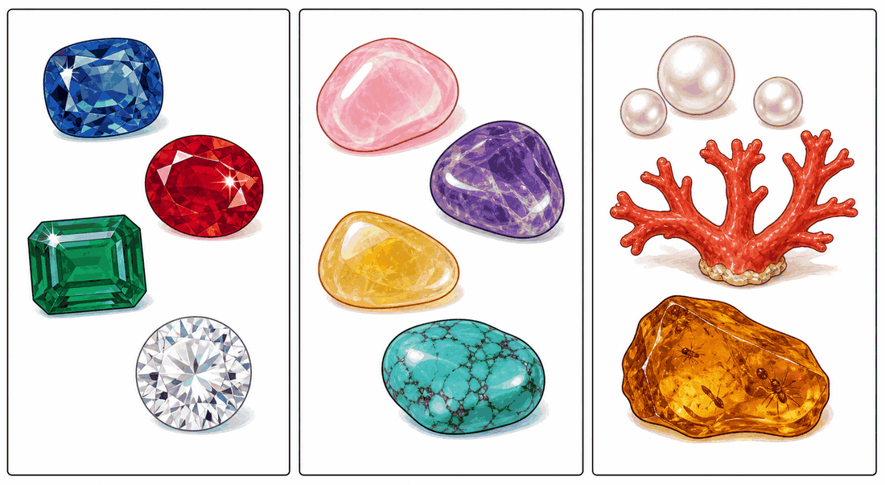
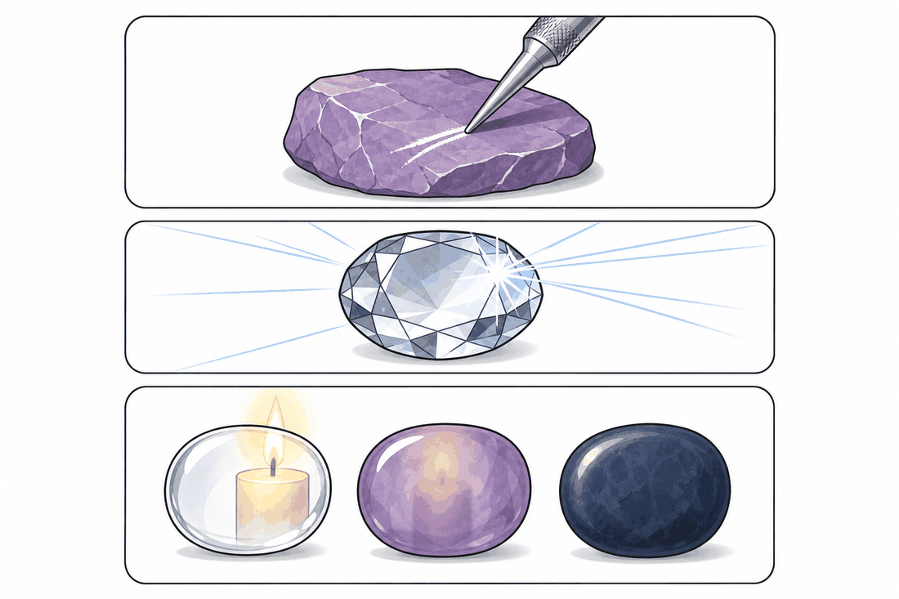
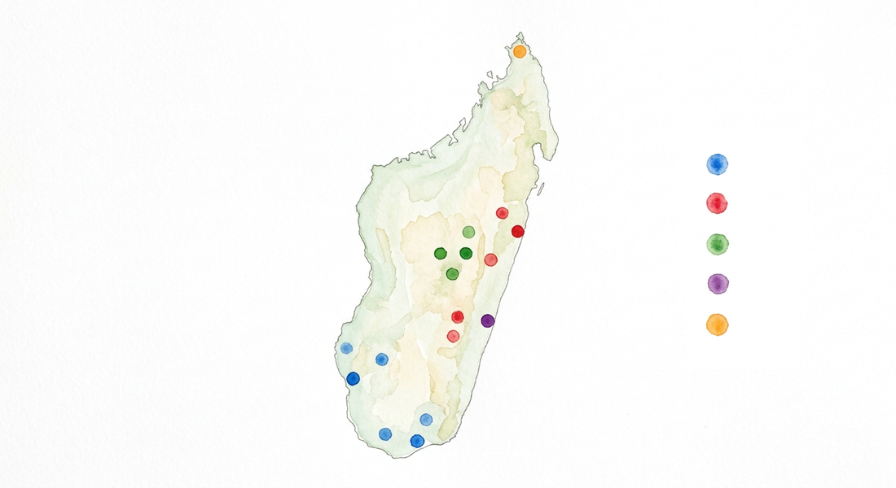
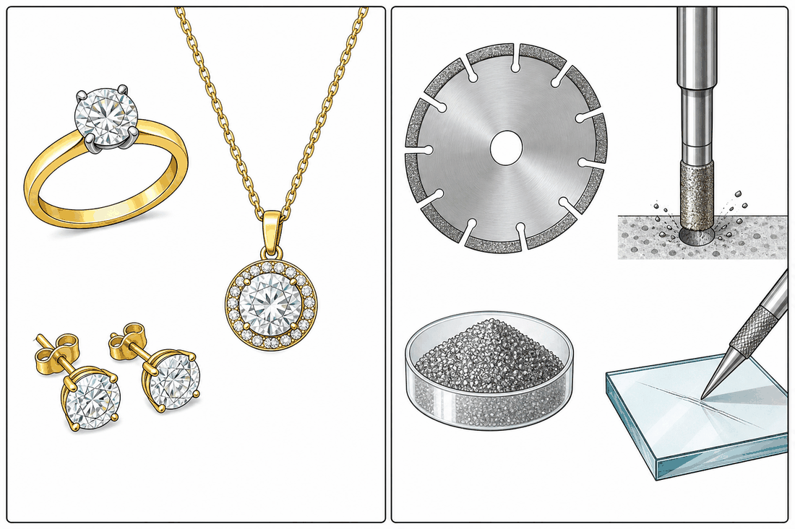
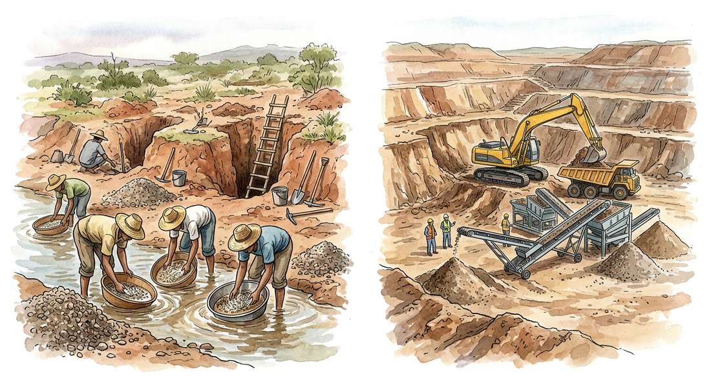
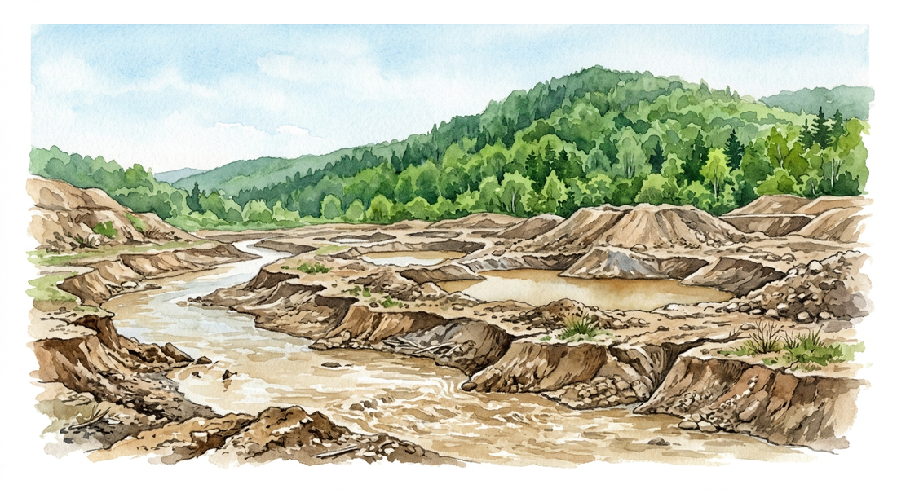

# Unité V — Géologie · Séances 44 à 49 (les pierres gemmes)

**Manuel** : `SVT T9 [PE] Fiche de preparation sujet corrigés J-Learn (1).docx`
**Référentiel** : skill `jlearn-manuel-scolaire` **v18**
**Sources** : `PE_T9 (1).docx` (RAS, contenus, localités, stratégies, valeurs) · `FRP_3eme_SVT.pdf` MEN/DDIS, thématique V RES 5.a → 5.f (faits) · échelle de Mohs (Friedrich Mohs, 1812) · travaux de l'IRD et de l'université d'Antananarivo sur les corindons malgaches · documentation gemmologique publique — citées en fin de document.
**Statut** : proposition — **le `.docx` n'a pas été modifié**.

### Rappel du cadre PE pour cette thématique

| Champ | Valeur (source : PE T9) |
|---|---|
| Thème | **Géologie** |
| Durée totale | 13 heures |
| Valeurs à véhiculer | **responsabilité, sens du bien commun** |
| RAS 1 | *Mettre en relation les caractéristiques et l'utilisation des pierres gemmes* |
| RAS 2 | *Analyser les impacts environnementaux associés à l'exploitation des pierres gemmes* |
| Propriétés exigées | états, **couleur, éclat, transparence, dureté, cassure et clivage** |
| Matériel prévu | loupe, **lunettes de protection**, marteau, couteau, ruban à mesurer, **gants**, carte de Madagascar |

Le PE fournit lui-même la liste des localités à enseigner, reprise intégralement en séance 46.

### Arbitrages appliqués (identiques aux unités précédentes)

Barème **20 points** · page LEÇON **complète** · champ **Durée laissé vide** · **aucune durée** sur les lignes I/II/III · colonne 1 intitulée **« Étapes »** · tableau de déroulement à 6 colonnes.

**Valeurs à véhiculer** : *responsabilité, sens du bien commun* — valeurs propres à la thématique Géologie, différentes de celles des unités précédentes.

### Contrôle qualité appliqué

- **Contrôle anti-plagiat `--n 6 --min-car 25`** contre le FRP intégral, exécuté après rédaction — résultat en fin de document.
- **Quatre écarts de fond assumés** par rapport au FRP, dont **le retrait de la lithothérapie**, détaillés en fin de document.
- **Consignes de sécurité ajoutées** pour les manipulations de la séance 45, que le FRP n'accompagne d'aucune précaution alors que le PE prévoit marteau, couteau et lunettes.

---

## Structure commune à toutes les fiches

| | |
|---|---|
| **Discipline :** Sciences de la vie et de la terre | **Date :** ____________ |
| **Thème :** Géologie | **Classe :** T9 |
| **Titre :** *(propre à la séance)* | **Séance n° :** *n* / 51 |
| **Objectif spécifique :** *(propre à la séance)* | **Durée :** ____________ |
| **Documentation :** Programme d'Études T9 (SVT), DCRP | |
| **Support et matériel :** *(propre à la séance)* | **Valeurs à véhiculer :** responsabilité, sens du bien commun |

Tableau de déroulement : **Étapes | Enseignant | Apprenants | Technique et Stratégie | Support et Matériel | Observation**.

---

# SÉANCE 44 / 51 — Les trois familles de pierres gemmes

**Objectif spécifique** : distinguer les pierres précieuses, les pierres fines et les pierres organiques, et justifier ce classement.
**Support et matériel** : échantillons de pierres si disponibles (quartz, améthyste, agate, morceau de corail ou de nacre), photographies, tableau à double entrée au tableau noir.

| Étapes et Durée | Enseignant | Apprenants | Technique | Support | Obs. |
|---|---|---|---|---|---|
| **I. RÉVISION** | Citez des richesses du sous-sol malgache. Connaissez-vous des pierres extraites à Madagascar ? | R.A. : L'or, le graphite, le nickel, les pierres. R.A. : Le saphir, le rubis, parfois l'améthyste. | Questionnement oral | — | |
| **II. NOUVELLE LEÇON** ||||||
| 1. Mise en situation | Deux pierres se ressemblent : même couleur rouge, même éclat. L'une vaut quelques milliers d'ariary, l'autre plusieurs millions. Comment expliquer une telle différence ? | R.A. : Les élèves proposent : la rareté, la dureté, la qualité. | Questionnement oral | Tableau noir | |
| 2. Présentation | Aujourd'hui : « Les trois familles de pierres gemmes ». À la fin, vous saurez ranger une pierre dans l'une des trois familles et dire pourquoi. | Les élèves écoutent. | Exposé | Tableau noir | |
| 3. Observation | Observez ces pierres et ces images. Certaines sont transparentes, d'autres non. Certaines viennent du sol, d'autres proviennent d'êtres vivants. Essayez de les regrouper. | Les élèves observent et proposent des regroupements. | Observation dirigée, travail de groupe | Échantillons, photos | |
| 4. Analyse | Qu'est-ce qu'une gemme, au fond ? Quatre pierres seulement sont dites précieuses. Lesquelles connaissez-vous ? Le corail et la nacre sont-ils des minéraux ? D'où viennent-ils ? Pourquoi les pierres organiques se cassent-elles plus facilement ? | R.A. : Une pierre belle, rare et résistante, utilisée en bijouterie. R.A. : Le diamant, le rubis, le saphir, l'émeraude. R.A. : Non, ils viennent d'animaux marins. R.A. : Parce qu'elles sont plus tendres, elles ne sont pas minérales. | Étude de document, travail de groupe | Échantillons, tableau | |
| 5. Synthèse | **Donc,** on classe les gemmes en **trois familles**. Les **pierres précieuses** : diamant, rubis, saphir, émeraude — quatre seulement, par convention. Les **pierres fines**, autrefois dites semi-précieuses : toutes les autres gemmes d'origine minérale — améthyste, tourmaline, grenat, aigue-marine… Les **pierres organiques** : celles produites par des êtres vivants — ambre, corail, nacre, jais ; elles sont généralement plus fragiles. | Les élèves recopient. | Exposé magistral | Tableau noir | |
| 6. Application | **Ex. 1** — Classe : rubis · améthyste · corail · saphir · ambre · tourmaline.  **Ex. 2** — Vrai ou Faux : 1. Il existe dix pierres précieuses. 2. La nacre est une pierre organique. 3. Une pierre fine est une pierre de mauvaise qualité. 4. Le rubis et le saphir sont deux variétés d'un même minéral. | **Ex. 1** : précieuses = **rubis, saphir** · fines = **améthyste, tourmaline** · organiques = **corail, ambre**  **Ex. 2** : 1. **F** — quatre. 2. **V** 3. **F** — c'est un classement conventionnel, pas un jugement de qualité. 4. **V** — toutes deux sont du corindon. | Travail de groupe | Grande ardoise | |
| **III. ÉVALUATION** | **Ex. 1** — Cite les quatre pierres précieuses.  **Ex. 2** — Explique en deux phrases ce qui distingue une pierre organique d'une pierre fine. | **Ex. 1** : diamant, rubis, saphir, émeraude.  **Ex. 2** : Une pierre fine est un **minéral**, formé dans les roches du sous-sol. Une pierre organique est produite par un **être vivant** — animal ou végétal — et elle est généralement plus tendre et plus fragile. | Évaluation écrite | Cahier | |

### Page LEÇON

**Les trois familles de pierres gemmes**

**1. Qu'est-ce qu'une gemme ?**

Une **gemme** est une pierre que l'on taille et que l'on polit pour en faire un ornement. Toutes les pierres n'y parviennent pas : il faut réunir trois qualités.

- **La beauté** — une couleur, une transparence ou un éclat qui attirent l'œil.
- **La rareté** — une pierre que l'on ramasse partout n'acquiert aucune valeur.
- **La résistance** — une pierre qui se raye ou se brise au premier choc ne peut pas être portée.

Ces trois qualités doivent être réunies **en même temps**. Une pierre magnifique mais trop tendre ne devient pas une gemme ; une pierre extrêmement rare mais terne non plus.

**2. Les trois familles**

| Famille | Définition | Exemples |
|---|---|---|
| **Pierres précieuses** | quatre gemmes seulement, par convention | **diamant, rubis, saphir, émeraude** |
| **Pierres fines** (autrefois « semi-précieuses ») | toutes les autres gemmes d'origine **minérale** | améthyste, tourmaline, grenat, aigue-marine, agate, citrine, quartz rose, labradorite, jade, obsidienne, jaspe |
| **Pierres organiques** | gemmes produites par des **êtres vivants** | ambre (résine fossilisée), corail, nacre, perle, jais |

**3. Trois précisions qui évitent les erreurs**

**a) « Pierre fine » ne veut pas dire « pierre médiocre ».** Le classement en quatre pierres précieuses est une **convention commerciale ancienne**, pas une mesure scientifique. Une belle tourmaline de Madagascar peut valoir plus cher qu'un saphir de qualité ordinaire. Le terme « semi-précieuse » est d'ailleurs progressivement abandonné, parce qu'il laisse croire à une demi-valeur.

**b) Le rubis et le saphir sont le même minéral.** Tous deux sont du **corindon**, de formule Al₂O₃. Ce sont de minuscules quantités d'autres éléments qui font la couleur : du chrome donne le **rouge** du rubis, du fer et du titane donnent le **bleu** du saphir. Quand un corindon gemme n'est pas rouge — bleu, rose, jaune, vert — on l'appelle saphir. Cela explique qu'on trouve les deux **dans les mêmes gisements**, à Madagascar comme ailleurs.

**c) La rareté seule ne suffit pas.** Certains minéraux sont beaucoup plus rares que le diamant sans être considérés comme précieux : la **painite** ou la **rhodizite** — cette dernière présente à Madagascar — sont des raretés de collectionneurs, mais elles n'ont jamais intégré le classement des pierres précieuses. Il y faut aussi la beauté, la résistance, et une demande du marché.

**4. Les pierres organiques**

Elles se distinguent nettement des deux autres familles : elles ne sont pas nées dans la roche mais **dans le vivant**.

- L'**ambre** est une résine d'arbre fossilisée depuis des millions d'années ; elle emprisonne parfois des insectes.
- Le **corail** est le squelette calcaire d'animaux marins coloniaux.
- La **nacre** et la **perle** sont sécrétées par certains coquillages.
- Le **jais** est un charbon fossile très noir, issu de bois enfoui.

Étant d'origine biologique, elles sont **plus tendres et plus cassantes** que les gemmes minérales : elles craignent les chocs, la chaleur et les produits acides. Un bijou de corail ou d'ambre demande donc plus de précautions qu'un saphir.

> **Une remarque de responsabilité.** Le corail est prélevé sur des récifs vivants, qui abritent une part considérable de la vie marine et protègent les côtes de l'érosion. À Madagascar, où les récifs sont déjà fragilisés, cette exploitation pose un problème direct de **bien commun** — la valeur même que porte cette thématique du programme.

### Section EXERCICES

**Exercice 1 (4 points)** — Classe ces huit gemmes en trois familles : **émeraude · nacre · grenat · diamant · jais · labradorite · saphir · ambre**.

**Exercice 2 (6 points)** — Complète avec : *corindon, organique, chrome, quatre, convention, résistance*
1. Il existe …… pierres précieuses.
2. Le rubis et le saphir sont deux variétés de ……
3. C'est le …… qui donne au rubis sa couleur rouge.
4. Une gemme doit réunir beauté, rareté et ……
5. L'ambre est une pierre ……
6. Le classement en pierres précieuses est une ……, non une mesure scientifique.

**Exercice 3 (6 points)** — Un marchand propose à un touriste « une pierre semi-précieuse, donc forcément bon marché ». Il s'agit d'une belle tourmaline de la région d'Antsirabe.
1. L'expression « semi-précieuse » est-elle correcte ? Comment dit-on aujourd'hui ?
2. L'argument « semi-précieuse donc bon marché » est-il valable ? Justifie.
3. Cite **deux** critères qui feront réellement le prix de cette tourmaline.
4. Le touriste demande si la perle qu'il a achetée la veille appartient à la même famille. Que lui réponds-tu ?

**Exercice 4 (4 points)** — Choisis la bonne réponse.
1. Le corail est une pierre : **A.** précieuse **B.** fine **C.** organique
2. Le minéral du rubis et du saphir s'appelle : **A.** le quartz **B.** le corindon **C.** le béryl
3. Les pierres organiques sont en général : **A.** plus dures **B.** plus fragiles **C.** identiques aux minérales
4. Une pierre très rare mais terne et fragile : **A.** est forcément précieuse **B.** n'est pas une gemme recherchée **C.** vaut plus que le diamant

**TOTAL : 20 points**

### CORRIGÉ

**Ex. 1** — précieuses = **émeraude, diamant, saphir** · fines = **grenat, labradorite** · organiques = **nacre, jais, ambre**

**Ex. 2** — 1. **quatre** · 2. **corindon** · 3. **chrome** · 4. **résistance** · 5. **organique** · 6. **convention**

**Ex. 3** — 1. **Non**, le terme est abandonné car il laisse croire à une demi-valeur ; on dit **pierre fine**. 2. **Non** : le classement est une convention commerciale, pas une échelle de prix. Une belle tourmaline peut valoir plus cher qu'un saphir médiocre. 3. (deux parmi) la **qualité de la couleur**, la **pureté** (absence d'inclusions visibles), le **poids en carats**, la **qualité de la taille**.
4. **Non.** La tourmaline est un **minéral**, formé dans la roche. La perle est une **pierre organique** : elle est produite par un **être vivant**, un mollusque. Elle est d'ailleurs bien plus **tendre** et se raye facilement. Les trois familles se distinguent par leur **origine**, non par leur prix.

**Ex. 4** — 1. **C** · 2. **B** · 3. **B** · 4. **B**

---

# SÉANCE 45 / 51 — Les propriétés physiques des pierres gemmes

**Objectif spécifique** : déterminer les propriétés physiques d'échantillons — couleur, éclat, transparence, dureté, cassure et clivage — et s'en servir pour identifier une pierre.
**Support et matériel** : échantillons de pierres, loupe, **lunettes de protection**, **gants**, clou ou lame d'acier, morceau de verre, pièce de cuivre, ongle.

> ⚠️ **Sécurité — à lire avant la séance.** Le test de rayure projette de fines particules. **Lunettes de protection et gants sont obligatoires** ; ce sont les matériels que le PE prévoit lui-même. Les tests se font **sur une table, jamais dans la main**. L'enseignant réalise seul toute manipulation nécessitant un marteau. On ne teste **jamais** un bijou appartenant à quelqu'un.

| Étapes et Durée | Enseignant | Apprenants | Technique | Support | Obs. |
|---|---|---|---|---|---|
| **I. RÉVISION** | Citez les trois familles de gemmes. Quelles sont les trois qualités d'une gemme ? | R.A. : Précieuses, fines, organiques. R.A. : Beauté, rareté, résistance. | Questionnement oral | — | |
| **II. NOUVELLE LEÇON** ||||||
| 1. Mise en situation | Deux pierres transparentes et incolores sont posées devant vous. L'une est un diamant, l'autre un morceau de quartz. Sans laboratoire, comment les distinguer ? | R.A. : Les élèves proposent des idées. | Questionnement oral | Deux échantillons | |
| 2. Présentation | Aujourd'hui : « Les propriétés physiques des pierres gemmes ». Vous saurez décrire une pierre avec six critères précis et utiliser l'échelle de dureté. | Les élèves écoutent. | Exposé | Tableau noir | |
| 3. Observation | Par groupes, décrivez chaque échantillon : sa couleur, son éclat, laisse-t-il passer la lumière ? Ensuite — **avec les lunettes** — essayez de le rayer avec l'ongle, puis avec une pièce de cuivre, puis avec un clou d'acier. | Les élèves observent et testent en remplissant le tableau. | Observation dirigée, expérimentation, travail de groupe | Échantillons, loupe, lunettes, gants, clou | |
| 4. Analyse | Qu'avez-vous constaté : toutes les pierres se rayent-elles de la même façon ? Si une pierre raye le verre, que peut-on en déduire ? Regardez à la loupe une pierre cassée : la cassure est-elle lisse et plane, ou irrégulière ? Pourquoi la couleur est-elle un mauvais critère d'identification à elle seule ? | R.A. : Non, certaines sont rayées par l'ongle, d'autres résistent au clou. R.A. : Qu'elle est plus dure que le verre, donc assez dure. R.A. : Cela dépend des pierres, certaines cassent net, d'autres non. R.A. : Parce que plusieurs pierres différentes ont la même couleur. | Expérimentation, analyse, travail de groupe | Échantillons, loupe | |
| 5. Synthèse | **Donc,** on décrit une gemme par **six propriétés** : la **couleur**, l'**éclat**, la **transparence**, la **dureté**, la **cassure** et le **clivage**. La **dureté** se mesure sur l'**échelle de Mohs**, de 1 (talc) à 10 (diamant) : un minéral raye tous ceux qui ont un indice inférieur au sien. Aucune propriété ne suffit seule : c'est **l'ensemble** qui permet d'identifier une pierre. | Les élèves recopient. | Exposé magistral | Tableau noir | |
| 6. Application | **Ex. 1** — Range par dureté croissante : quartz · talc · diamant · corindon.  **Ex. 2** — Une pierre raye le verre mais est rayée par le corindon. Entre quelles valeurs se situe sa dureté ? | **Ex. 1** : talc (1) < quartz (7) < corindon (9) < diamant (10).  **Ex. 2** : Elle est plus dure que le verre (≈ 5,5) et moins dure que le corindon (9) : sa dureté est **comprise entre environ 5,5 et 9**. | Travail de groupe | Grande ardoise | |
| **III. ÉVALUATION** | **Ex. 1** — Cite les six propriétés physiques d'une gemme.  **Ex. 2** — Le diamant est la pierre la plus dure. Peut-on pour autant le briser d'un coup de marteau ? Explique. | **Ex. 1** : couleur, éclat, transparence, dureté, cassure, clivage.  **Ex. 2** : **Oui.** La dureté est la résistance **à la rayure**, pas au choc. Le diamant possède un clivage parfait : frappé au bon endroit, il se fend. Dureté et ténacité sont deux propriétés différentes. | Évaluation écrite | Cahier | |

### Page LEÇON

**Les propriétés physiques des pierres gemmes**

**1. Pourquoi des critères précis ?**

« Une belle pierre rouge » ne veut rien dire pour un géologue : le rubis, le grenat, la tourmaline rubellite et le spinelle rouge se ressemblent tous à l'œil nu. Pour identifier une pierre, on la décrit par des **propriétés physiques mesurables**. Le programme en retient **six**.

**2. Les six propriétés**

| Propriété | Ce qu'elle décrit | Comment l'observer |
|---|---|---|
| **Couleur** | la teinte de la pierre | à l'œil, en pleine lumière du jour |
| **Éclat** | la façon dont la surface renvoie la lumière | éclat vitreux, gras, nacré, métallique… |
| **Transparence** | la quantité de lumière qui traverse | transparente, translucide, opaque |
| **Dureté** | la résistance **à la rayure** | par comparaison, échelle de Mohs |
| **Cassure** | l'aspect d'une surface brisée **au hasard** | cassure lisse en coquille, ou irrégulière |
| **Clivage** | l'aptitude à se fendre selon des **plans nets** | clivage parfait, imparfait, ou absent |

**3. L'échelle de Mohs**

En **1812**, le minéralogiste allemand **Friedrich Mohs** propose une méthode d'une grande simplicité : **un minéral plus dur raye un minéral plus tendre.** Il choisit dix minéraux de référence et les numérote de 1 à 10.

| Indice | Minéral | Repère pratique |
|---:|---|---|
| 1 | Talc | s'effrite sous l'ongle |
| 2 | Gypse | rayé par l'ongle |
| 3 | Calcite | rayé par une pièce de cuivre |
| 4 | Fluorine | rayé facilement par un couteau |
| 5 | Apatite | rayé difficilement par un couteau |
| 6 | Orthose | raye le verre |
| 7 | Quartz | raye nettement le verre |
| 8 | Topaze | raye le quartz |
| 9 | Corindon *(rubis, saphir)* | raye la topaze |
| 10 | Diamant | n'est rayé que par un autre diamant |

Trois repères suffisent en classe : **l'ongle** (≈ 2,5), **la pièce de cuivre** (≈ 3,5), **le clou d'acier** (≈ 5,5, comme le verre).

⚠️ **L'échelle de Mohs n'est pas une échelle de mesure régulière.** Le passage de 9 à 10 correspond à un écart de dureté bien plus grand que celui de 1 à 9 : le diamant est environ **quatre fois plus dur** que le corindon, alors qu'un seul rang les sépare. L'échelle donne un **ordre**, pas des proportions.

**4. Dureté n'est pas solidité**

C'est la confusion la plus répandue, et elle a des conséquences pratiques.

> **La dureté** est la résistance **à la rayure**. **La ténacité** est la résistance **aux chocs**. Ce sont deux choses différentes.

Le diamant est le minéral le plus dur qui soit : rien ne le raye. Mais il possède un **clivage parfait**, c'est-à-dire des plans de moindre résistance : frappé précisément dans la bonne direction, il **se fend en deux**. C'est d'ailleurs ce que le lapidaire exploite pour le tailler. Un diamant ne se raye pas, mais il se casse.

À l'inverse, le **jade** n'a qu'une dureté moyenne, mais sa structure en fibres enchevêtrées le rend remarquablement résistant aux chocs.

**5. Identifier, c'est croiser les indices**

Aucune propriété ne suffit à elle seule — et surtout pas la couleur. On procède comme une enquête, en croisant les résultats :

> *La pierre est rouge. Elle raye le verre sans effort : sa dureté dépasse 6. Elle n'est pas rayée par la topaze : elle atteint donc au moins 8. Son éclat est vitreux et vif, sa transparence bonne.* → **Le corindon (rubis) devient l'hypothèse la plus probable.**

Le grenat, également rouge, aurait été rayé par la topaze — sa dureté ne dépasse pas 7,5. C'est ce croisement qui permet de trancher entre deux pierres d'apparence identique, et c'est ainsi que travaille un gemmologue avant même de recourir à des appareils.

### Section EXERCICES

**Exercice 1 (4 points)** — Donne l'indice de dureté de Mohs de ces quatre minéraux et range-les du plus tendre au plus dur : **corindon · talc · quartz · calcite**.

**Exercice 2 (6 points)** — Complète avec : *rayure, clivage, 1812, opaque, dix, ordre*
1. L'échelle de Mohs a été créée en ……
2. Elle comprend …… minéraux de référence.
3. La dureté est la résistance à la ……
4. Une pierre qui ne laisse pas passer la lumière est ……
5. Le …… est l'aptitude d'une pierre à se fendre selon des plans nets.
6. L'échelle de Mohs donne un …… et non des proportions.

**Exercice 3 (6 points)** — Un élève teste une pierre jaune transparente. Résultats : elle **n'est pas rayée** par le clou d'acier ; elle **raye le quartz** ; elle **est rayée** par le corindon.
1. Que déduit-on du fait qu'elle raye le quartz ?
2. Que déduit-on du fait qu'elle est rayée par le corindon ?
3. Entre quelles valeurs se situe sa dureté ? Propose un nom de pierre compatible avec ce résultat.
4. L'élève en conclut que sa pierre est « incassable puisqu'elle est très dure ». Que lui réponds-tu ?

**Exercice 4 (4 points)** — Choisis la bonne réponse.
1. La dureté mesure la résistance : **A.** aux chocs **B.** à la rayure **C.** à la chaleur
2. Un diamant frappé au marteau : **A.** ne peut pas se briser **B.** peut se fendre selon son clivage **C.** fond
3. Le verre a une dureté d'environ : **A.** 2 **B.** 5,5 **C.** 9
4. Pour identifier une pierre, la couleur seule est : **A.** suffisante **B.** insuffisante **C.** inutile

**TOTAL : 20 points**

### CORRIGÉ

**Ex. 1** — talc **1** < calcite **3** < quartz **7** < corindon **9**.

**Ex. 2** — 1. **1812** · 2. **dix** · 3. **rayure** · 4. **opaque** · 5. **clivage** · 6. **ordre**

**Ex. 3** —
1. Qu'elle est **plus dure que le quartz**, donc que sa dureté dépasse **7**.
2. Qu'elle est **moins dure que le corindon**, donc inférieure à **9**.
3. Sa dureté se situe **entre 7 et 9**, vraisemblablement autour de **8** : la **topaze** correspond à ce résultat. *(Le béryl jaune — héliodore — dont la dureté avoisine 7,5 à 8, est également accepté si l'élève le justifie.)*
4. Il confond **dureté** et **solidité**. La dureté mesure la résistance à la **rayure**, pas au **choc**. La topaze est très dure mais possède un **clivage** net : un coup bien placé peut la fendre d'un seul plan. Le diamant lui-même, le plus dur des minéraux, se brise sous un marteau. Une pierre dure se raye difficilement, elle ne devient pas incassable pour autant.

**Ex. 4** — 1. **B** · 2. **B** · 3. **B** · 4. **B**

---

# SÉANCE 46 / 51 — La répartition géographique des pierres gemmes à Madagascar

**Objectif spécifique** : localiser sur une carte de Madagascar les principaux gisements de pierres gemmes et distinguer gisement primaire et gisement secondaire.
**Support et matériel** : **carte de Madagascar** au tableau ou polycopiée (support prévu par le PE), crayons de couleur, cahier.

| Étapes et Durée | Enseignant | Apprenants | Technique | Support | Obs. |
|---|---|---|---|---|---|
| **I. RÉVISION** | Quelles sont les six propriétés physiques d'une gemme ? Quelle est la dureté du corindon ? | R.A. : Couleur, éclat, transparence, dureté, cassure, clivage. R.A. : 9 sur l'échelle de Mohs. | Questionnement oral | — | |
| **II. NOUVELLE LEÇON** ||||||
| 1. Mise en situation | En 1998, un village du Sud-Ouest comptait quelques dizaines d'habitants. Deux ans plus tard, des dizaines de milliers de personnes y vivaient. Ce village s'appelle Ilakaka. Que s'est-il passé ? | R.A. : On y a découvert des pierres précieuses. | Questionnement oral | Carte | |
| 2. Présentation | Aujourd'hui : « La répartition géographique des pierres gemmes à Madagascar ». Vous saurez placer les principaux gisements sur la carte et expliquer comment ils se sont formés. | Les élèves écoutent. | Exposé | Carte | |
| 3. Observation | Observez la carte. Repérez les régions citées : Ilakaka et l'Isalo au Sud-Ouest, Andilamena au centre-nord, Antsirabe et le mont Ibity au centre, Mananjary à l'est, Andapa et Ambilobe au nord, Diego, Nosy Be. | Les élèves repèrent et colorient les zones. | Observation, travail de groupe | Carte, crayons | |
| 4. Analyse | Les gemmes se trouvent-elles partout ou dans certaines zones ? Où se forme réellement une pierre : à l'endroit où on la ramasse, ou ailleurs ? Pourquoi trouve-t-on beaucoup de gemmes dans le sable des rivières ? Quelle différence entre un gisement primaire et un gisement secondaire ? | R.A. : Dans certaines zones seulement. R.A. : Parfois ailleurs, elle a été transportée. R.A. : Parce que l'eau les a arrachées à la roche et déplacées. R.A. : Le primaire est là où la pierre s'est formée ; le secondaire est là où elle a été transportée. | Étude de document, travail de groupe | Carte, tableau | |
| 5. Synthèse | **Donc,** Madagascar est l'un des pays les plus riches du monde en pierres gemmes, grâce à un **socle ancien** et à de nombreuses **pegmatites**. On distingue le **gisement primaire** — la pierre est encore dans la roche où elle s'est formée — et le **gisement secondaire ou alluvial** — la roche a été désagrégée, et l'eau a transporté les pierres jusqu'aux sables et graviers des rivières. **L'essentiel des saphirs et rubis malgaches provient de gisements secondaires.** | Les élèves recopient. | Exposé magistral | Tableau noir | |
| 6. Application | **Ex. 1** — Associe : Ilakaka · Mananjary · mont Ibity · Antsirabe → *(béryl · saphir · émeraude · tourmaline)*  **Ex. 2** — Gisement primaire ou secondaire ? 1. Saphirs ramassés dans le gravier d'une rivière. 2. Rubis extraits d'un filon dans la roche. 3. Pierres trouvées dans le sable d'un ancien lit de cours d'eau. | **Ex. 1** : Ilakaka → **saphir** · Mananjary → **émeraude** · mont Ibity → **béryl** · Antsirabe → **tourmaline**  **Ex. 2** : 1. **secondaire** 2. **primaire** 3. **secondaire** | Travail de groupe | Grande ardoise | |
| **III. ÉVALUATION** | **Ex. 1** — Cite trois localités malgaches et la gemme correspondante.  **Ex. 2** — Explique en deux phrases pourquoi on trouve des pierres gemmes dans le lit des rivières alors qu'elles ne s'y forment pas. | **Ex. 1** : (trois parmi) Ilakaka → saphir · Andilamena → rubis · Mananjary → émeraude · Antsirabe → tourmaline · mont Ibity → béryl · Andapa ou Ambilobe → aigue-marine.  **Ex. 2** : Les pierres se forment en profondeur dans la roche. Sous l'action de l'eau, du vent et du temps, la roche se désagrège ; les gemmes, plus dures et plus résistantes, sont libérées puis transportées par les cours d'eau et s'accumulent dans les graviers. | Évaluation écrite | Cahier | |

### 🗺️ Tableau des localités à recopier

*Liste établie d'après le Programme d'Études T9.*

| Gemme | Principales localités |
|---|---|
| **Saphir** | Ilakaka, Isalo, Andranondambo, Diego (Antsiranana), Nosy Be |
| **Rubis** | Andilamena, Vatomandry, région d'Antsirabe |
| **Émeraude** | Mananjary |
| **Tourmaline** | Antsirabe, Fianarantsoa, vallée de la Sahatany |
| **Béryl** | mont Ibity |
| **Aigue-marine** | Andapa, Ambilobe |
| **Rhodizite** | Fianarantsoa |
| **Améthyste, quartz rose, labradorite** | régions du Nord et de l'Ouest |

### Page LEÇON

**La répartition géographique des pierres gemmes à Madagascar**

**1. Un sous-sol exceptionnel**

Madagascar figure parmi les pays les plus riches du monde en pierres gemmes. Cette richesse n'est pas un hasard : elle tient à l'**histoire géologique** de l'île.

L'essentiel du territoire repose sur un **socle cristallin très ancien**, formé de roches métamorphiques qui ont subi de fortes pressions et de hautes températures. Ces conditions sont précisément celles qui permettent la croissance de beaux cristaux. Le socle est de plus traversé de nombreuses **pegmatites** — des filons dans lesquels les cristaux ont eu la place et le temps de grandir. Les pegmatites malgaches sont réputées depuis plus d'un siècle : dès les années 1910, les tourmalines du mont Ibity et de la vallée de la Sahatany étaient exploitées.

**2. Gisement primaire, gisement secondaire**

C'est la distinction essentielle de cette leçon.

| | **Gisement primaire** | **Gisement secondaire** (alluvial) |
|---|---|---|
| Définition | la gemme se trouve **dans la roche où elle s'est formée** | la gemme a été **transportée** loin de sa roche d'origine |
| Formation | cristallisation en profondeur | désagrégation de la roche, puis transport par l'eau |
| Où | filons, pegmatites, roche en place | sables et graviers des rivières, anciens lits |
| Extraction | mine à ciel ouvert ou souterraine | lavage et tamisage des sédiments |

Le passage de l'un à l'autre s'explique simplement. La roche qui contient les gemmes s'altère lentement sous l'effet de la pluie, du soleil et des racines. Elle se désagrège en grains. Les **gemmes, plus dures et plus résistantes que la roche qui les entourait**, survivent à cette destruction. Emportées par les cours d'eau, elles roulent, s'usent un peu, et finissent par se déposer là où le courant faiblit — dans les graviers, avec les autres éléments lourds.

Un gisement secondaire concentre donc les pierres de toute une région, rassemblées par la rivière. C'est ce qui le rend souvent plus facile à exploiter qu'un gisement primaire : nul besoin de creuser la roche dure, il suffit de laver du sable.

> **À Madagascar, les gisements primaires de pierres précieuses sont rares.** L'essentiel des saphirs et des rubis provient de **gisements secondaires**. Le seul gisement primaire de rubis d'importance connu se situe à **Soamiakatra**, dans la région d'Antsirabe.

**3. Les grandes zones gemmifères**

**Le Sud-Ouest — Ilakaka et l'Isalo.** C'est aujourd'hui la zone la plus importante économiquement. Le gisement d'Ilakaka, sur la route nationale 7 entre Ihosy et Toliara, a été découvert en **1998**. Il s'agit d'un vaste champ alluvial qui compte parmi les plus grands gisements de saphirs au monde. On y trouve des corindons de toutes les couleurs, accompagnés de tourmalines, de spinelles et de chrysobéryls.

**Le Centre — Antsirabe, mont Ibity, vallée de la Sahatany.** Domaine historique des pegmatites : tourmalines, béryls, kunzite. **Antsirabe** est devenue la capitale malgache de la **taille des pierres** : les gemmes de toute l'île y convergent pour être taillées et polies.

**Le Centre-Nord — Andilamena.** Zone de rubis, entrée en activité intense à partir de 2001.

**L'Est — Mananjary.** Région des émeraudes.

**Le Nord — Andapa, Ambilobe, Diego, Nosy Be.** Aigues-marines, saphirs bleus et jaunes, améthystes, béryls.

**4. Une richesse et une responsabilité**

La découverte d'un gisement transforme un territoire en quelques mois. Ilakaka est passé d'un hameau à une ville de plusieurs dizaines de milliers de personnes en deux ans. Cette arrivée massive apporte des revenus, mais aussi des difficultés : logements précaires, écoles insuffisantes, eau et assainissement débordés, insécurité.

Une question se pose alors, et elle appartient pleinement à cette leçon : **à qui profite cette richesse ?** Une pierre extraite par un creuseur malgache pour quelques milliers d'ariary peut être revendue plusieurs milliers de dollars une fois taillée et certifiée à l'étranger. La valeur ne se crée pas seulement dans le trou : elle se crée aussi dans la **taille**, la **certification** et le **commerce** — des étapes longtemps réalisées hors du pays. C'est précisément pour cela que le développement des ateliers de taille malgaches, comme ceux d'Antsirabe, importe autant que l'extraction elle-même.

### Section EXERCICES

**Exercice 1 (4 points)** — Associe chaque localité à sa gemme : **Mananjary · Andilamena · mont Ibity · Ilakaka** → *béryl · saphir · émeraude · rubis*.

**Exercice 2 (6 points)** — Complète avec : *secondaire, pegmatites, 1998, Antsirabe, primaire, socle*
1. Madagascar repose sur un …… cristallin très ancien.
2. Les filons où grandissent les grands cristaux s'appellent des ……
3. Le gisement d'Ilakaka a été découvert en ……
4. Un gisement …… contient la gemme dans sa roche d'origine.
5. Un gisement …… résulte du transport des gemmes par l'eau.
6. La ville de …… est la capitale malgache de la taille des pierres.

**Exercice 3 (6 points)** — Dans un village, on ramasse des saphirs dans les graviers d'une rivière. Un habitant affirme : « Les saphirs poussent dans le sable de la rivière. »
1. Cette affirmation est-elle exacte ? Justifie.
2. Explique en trois étapes comment les saphirs sont arrivés dans ce sable.
3. Comment appelle-t-on ce type de gisement ?
4. Pourquoi trouve-t-on surtout des gemmes, et non n'importe quel minéral, dans ces graviers ?

**Exercice 4 (4 points)** — Choisis la bonne réponse.
1. Le gisement d'Ilakaka est un gisement : **A.** primaire **B.** secondaire **C.** souterrain
2. Les émeraudes malgaches proviennent surtout de : **A.** Mananjary **B.** Nosy Be **C.** Ilakaka
3. Les gemmes résistent à la destruction de la roche parce qu'elles sont : **A.** plus légères **B.** plus dures **C.** plus colorées
4. À Madagascar, les gisements primaires de pierres précieuses sont : **A.** les plus nombreux **B.** rares **C.** inexistants

**TOTAL : 20 points**

### CORRIGÉ

**Ex. 1** — Mananjary → **émeraude** · Andilamena → **rubis** · mont Ibity → **béryl** · Ilakaka → **saphir**

**Ex. 2** — 1. **socle** · 2. **pegmatites** · 3. **1998** · 4. **primaire** · 5. **secondaire** · 6. **Antsirabe**

**Ex. 3** —
1. **Non.** Une gemme ne se forme pas dans le sable : elle cristallise en profondeur, dans la roche, sous forte pression et température.
2. **Première étape** : les saphirs se forment dans la roche du socle. **Deuxième étape** : sous l'action de la pluie, du soleil et du temps, cette roche se désagrège ; les saphirs, plus durs, sont libérés intacts. **Troisième étape** : les eaux de ruissellement et la rivière les transportent, puis les déposent dans les graviers là où le courant ralentit.
3. Un **gisement secondaire**, ou **gisement alluvial**.
4. Parce que le transport par l'eau opère un **tri naturel**. Les minéraux tendres ou fragiles sont **broyés et réduits en poudre** au cours du trajet ; les gemmes, **dures et résistantes**, survivent intactes. Leur **densité élevée** les fait en outre se déposer au même endroit, là où le courant faiblit. La rivière a donc fait le premier travail de sélection à la place du chercheur.

**Ex. 4** — 1. **B** · 2. **A** · 3. **B** · 4. **B**

---

# SÉANCE 47 / 51 — Les utilisations des pierres gemmes

**Objectif spécifique** : mettre en relation les propriétés physiques d'une gemme et ses utilisations en joaillerie et dans l'industrie.
**Support et matériel** : photographies de bijoux, montre mécanique ouverte si disponible, vitre rayée, échantillons, cahier.

| Étapes et Durée | Enseignant | Apprenants | Technique | Support | Obs. |
|---|---|---|---|---|---|
| **I. RÉVISION** | Quelle est la différence entre gisement primaire et secondaire ? Citez deux localités gemmifères malgaches. | R.A. : Le primaire est la roche d'origine, le secondaire résulte d'un transport. R.A. : Ilakaka, Andilamena. | Questionnement oral | — | |
| **II. NOUVELLE LEÇON** ||||||
| 1. Mise en situation | Les disques de coupe des scies industrielles sont garnis de diamant. Pourquoi utiliser en usine une pierre que l'on associe d'ordinaire aux bijoux ? | R.A. : Parce que le diamant est très dur, il coupe tout. | Questionnement oral | Tableau noir | |
| 2. Présentation | Aujourd'hui : « Les utilisations des pierres gemmes ». Vous saurez relier chaque usage à une propriété physique précise. | Les élèves écoutent. | Exposé | Tableau noir | |
| 3. Observation | Observez ces images : une bague, une montre mécanique, une vitre de téléphone, un foret de perceuse. Cherchez, dans chaque cas, quelle pierre intervient et pourquoi. | Les élèves observent et émettent des hypothèses. | Observation dirigée, travail de groupe | Photos, montre | |
| 4. Analyse | Pourquoi une pierre taillée brille-t-elle autant ? Dans une montre mécanique, de minuscules rubis servent de coussinets aux axes. Quelle propriété exploite-t-on ? Pourquoi met-on du saphir sur certains verres de montre et lentilles ? Pourquoi le diamant sert-il à couper et à forer ? | R.A. : Parce que la taille renvoie la lumière dans tous les sens. R.A. : Sa dureté : il s'use très peu malgré le frottement. R.A. : Parce qu'il se raye très difficilement. R.A. : Parce que c'est le plus dur, il raye tous les autres matériaux. | Étude de document, travail de groupe | Photos, montre | |
| 5. Synthèse | **Donc,** les gemmes ont deux grands domaines d'usage. En **joaillerie**, on exploite la **beauté** : couleur, transparence, et surtout la capacité de la pierre à renvoyer la lumière une fois taillée. Dans l'**industrie**, on exploite la **dureté** et la **résistance** : le diamant coupe, perce et abrase ; le rubis et le saphir synthétiques servent de pièces d'usure, de verres inrayables, de lentilles et de composants pour lasers. **À chaque usage correspond une propriété physique.** | Les élèves recopient. | Exposé magistral | Tableau noir | |
| 6. Application | **Ex. 1** — Associe l'usage à la propriété : 1. bague · 2. foret diamanté · 3. coussinet de montre · 4. verre de montre inrayable → *(dureté · beauté et éclat · résistance à l'usure · résistance à la rayure)*  **Ex. 2** — Vrai ou Faux : 1. Le diamant n'a aucun usage industriel. 2. Les rubis des montres sont aujourd'hui synthétiques. 3. La taille sert à faire briller la pierre. 4. Une pierre opaque convient pour une lentille optique. | **Ex. 1** : 1. beauté et éclat · 2. dureté · 3. résistance à l'usure · 4. résistance à la rayure  **Ex. 2** : 1. **F** 2. **V** 3. **V** 4. **F** | Travail de groupe | Grande ardoise | |
| **III. ÉVALUATION** | **Ex. 1** — Cite deux usages industriels des gemmes et la propriété exploitée dans chaque cas.  **Ex. 2** — Pourquoi une pierre brute paraît-elle terne alors que la même pierre taillée est éclatante ? | **Ex. 1** : (deux parmi) foret ou disque de coupe diamanté → **dureté** ; coussinet de montre en rubis → **résistance à l'usure** ; verre ou lentille en saphir → **résistance à la rayure et transparence**.  **Ex. 2** : Brute, sa surface est irrégulière et dépolie : elle disperse la lumière au hasard. La **taille** crée des **facettes planes et polies**, disposées de manière à réfléchir la lumière entrée dans la pierre et à la renvoyer vers l'œil. | Évaluation écrite | Cahier | |

### Page LEÇON

**Les utilisations des pierres gemmes**

**1. Une règle unique**

Toute cette leçon tient dans une phrase :

> **Chaque utilisation d'une gemme s'explique par une propriété physique précise.**

Cette règle vaut aussi bien pour le bijou que pour l'outil de chantier.

**2. La joaillerie**

La joaillerie associe une gemme à un métal précieux — or ou platine — pour réaliser un bijou. Trois propriétés y sont recherchées : la **couleur**, la **transparence** et surtout la façon dont la pierre **renvoie la lumière**.

Une pierre brute est terne : sa surface irrégulière disperse la lumière dans toutes les directions. La **taille** change tout. En créant des **facettes** planes et polies, orientées selon des angles calculés, le lapidaire fait en sorte que la lumière qui entre dans la pierre soit réfléchie à l'intérieur puis ressorte vers l'œil de l'observateur. C'est ce trajet qui produit l'éclat et les jeux de couleurs.

Les gemmes conviennent d'autant mieux à cet usage qu'elles sont **dures** : un bijou se porte, se frotte aux vêtements, se cogne. Une pierre tendre se dépolirait en quelques mois et perdrait son éclat.

La valeur d'une gemme en joaillerie se juge sur quatre points : la **couleur**, la **pureté** (absence d'inclusions visibles), la **taille** (qualité du travail du lapidaire) et le **poids**, exprimé en **carats** — 1 carat vaut **0,2 gramme**.

**3. Les usages industriels**

Ici, la beauté ne compte plus. Seules importent la **dureté** et la **résistance**.

| Usage | Gemme | Propriété exploitée |
|---|---|---|
| Forets, disques de coupe, meules abrasives | **diamant** | dureté maximale : il raye tous les matériaux |
| Coussinets des axes de montres mécaniques | **rubis** | résistance à l'usure par frottement |
| Verres de montre et vitres inrayables | **saphir** | très haute résistance à la rayure |
| Lentilles et fenêtres optiques résistantes | **saphir** | dureté **et** transparence |
| Composants pour lasers | **rubis, saphir** | propriétés optiques du corindon |

Le cas de la **montre mécanique** illustre parfaitement la règle. À l'intérieur, de minuscules axes tournent des millions de fois. Un support en métal s'userait. On y place donc de petites pièces de rubis : quasi inusables, elles font durer le mécanisme des décennies. C'est de là que vient la mention « 17 rubis » gravée sur certaines montres — une indication technique, pas décorative.

> **Important.** Les rubis et saphirs utilisés dans l'industrie sont presque toujours **synthétiques** : on sait fabriquer du corindon en laboratoire depuis la fin du XIXᵉ siècle. Il a exactement les mêmes propriétés physiques que la pierre naturelle, pour un coût sans comparaison. Une montre à 17 rubis ne contient donc aucune pierre précieuse extraite d'une mine.

**4. Une mise en garde scientifique**

On rencontre fréquemment l'affirmation selon laquelle les pierres soigneraient des maladies, apaiseraient le stress ou rééquilibreraient l'organisme par des « énergies » ou des « vibrations ». Cette pratique porte le nom de lithothérapie.

> ⚠️ **Aucune preuve scientifique n'appuie ces affirmations.** Les études menées en conditions contrôlées — en comparant de vraies pierres à des imitations d'apparence identique, sans que les participants sachent ce qu'ils tiennent — ne montrent aucun effet attribuable à la pierre elle-même. Les minéraux n'émettent aucun rayonnement capable d'agir sur le corps humain. Les spécialistes de minéralogie sont unanimes sur ce point.

Il faut être clair sur ce qui est en jeu, car ce n'est pas une querelle de mots. Croire qu'une pierre soigne peut conduire une personne malade à **retarder ou refuser un traitement médical**. Des cas de ce type sont documentés, et certains ont eu des conséquences graves.

Le commerce des pierres dites « de soin » existe, et il est important à Madagascar comme ailleurs : c'est un **fait social et économique** que l'on peut constater. Mais **constater une croyance n'est pas la valider**. Dans un cours de sciences, on distingue ce qui est démontré de ce qui ne l'est pas — et c'est justement à quoi sert une démarche scientifique.

### Section EXERCICES

**Exercice 1 (4 points)** — Pour chacun de ces objets, indique la gemme utilisée et la propriété exploitée : 1. un foret de perceuse pour béton · 2. un coussinet d'axe de montre · 3. un verre de montre inrayable · 4. une bague.

**Exercice 2 (6 points)** — Complète avec : *facettes, carat, synthétiques, 0,2, dureté, taille*
1. Le poids d'une gemme s'exprime en ……
2. Un carat vaut …… gramme.
3. La …… crée des facettes qui font briller la pierre.
4. Les …… réfléchissent la lumière vers l'œil.
5. Les rubis des montres sont presque toujours ……
6. L'usage industriel du diamant repose sur sa ……

**Exercice 3 (6 points)** — Un vendeur propose une pierre en affirmant : « Elle est naturelle, donc elle soignera vos maux de tête. »
1. L'argument est-il scientifiquement fondé ? Justifie ta réponse.
2. Quel danger peut présenter une telle affirmation pour une personne malade ?
3. Un joaillier vend la même pierre pour sa beauté. Son argument est-il, lui, recevable ? Explique la différence entre les deux situations.
4. Le vendeur ajoute : « Beaucoup de clients m'ont dit se sentir mieux, c'est bien une preuve. » Que lui réponds-tu ?

**Exercice 4 (4 points)** — Choisis la bonne réponse.
1. Un carat correspond à : **A.** 1 g **B.** 0,2 g **C.** 2 g
2. Les rubis des montres mécaniques servent de : **A.** décoration **B.** pièces résistant à l'usure **C.** source de lumière
3. Le saphir sert en optique parce qu'il est : **A.** dur et transparent **B.** tendre et coloré **C.** opaque
4. L'affirmation « les pierres soignent les maladies » est : **A.** démontrée **B.** sans preuve scientifique **C.** vraie pour le diamant seulement

**TOTAL : 20 points**

### CORRIGÉ

**Ex. 1** — 1. **diamant** → dureté maximale · 2. **rubis** (synthétique) → résistance à l'usure par frottement · 3. **saphir** (synthétique) → résistance à la rayure · 4. toute gemme, par exemple un **saphir naturel** → beauté : couleur, transparence, éclat après taille.

**Ex. 2** — 1. **carat** · 2. **0,2** · 3. **taille** · 4. **facettes** · 5. **synthétiques** · 6. **dureté**

**Ex. 3** —
1. **Non.** Aucune étude contrôlée n'a mis en évidence d'effet des pierres sur une maladie. Le caractère « naturel » d'une substance ne prouve d'ailleurs jamais son efficacité : beaucoup de produits naturels sont sans effet, et certains sont toxiques.
2. Elle peut conduire la personne à **retarder ou refuser un véritable traitement**, laissant la maladie s'aggraver.
3. **Oui, il est recevable.** Le joaillier vend un **objet d'ornement** et l'annonce comme tel : la beauté de la pierre se constate directement. Le premier vendeur, lui, promet un **effet thérapeutique** qu'aucune preuve n'appuie. La différence tient à la nature de la promesse : l'un vend ce que la pierre est, l'autre vend ce qu'elle ne fait pas.
4. Des témoignages **ne constituent pas une preuve**. Beaucoup de maux, dont les maux de tête, **disparaissent d'eux-mêmes** ; le simple fait de croire à un remède peut par ailleurs soulager passagèrement. Surtout, le vendeur n'entend que les clients satisfaits : ceux pour qui la pierre n'a rien changé ne reviennent pas le lui dire. Pour conclure, il faudrait **comparer** deux groupes semblables, l'un avec la pierre, l'autre sans.

**Ex. 4** — 1. **B** · 2. **B** · 3. **A** · 4. **B**

---

# SÉANCE 48 / 51 — Les techniques d'exploitation

**Objectif spécifique** : identifier les trois grandes techniques d'extraction des pierres gemmes et les relier au type de gisement.
**Support et matériel** : photographies de sites d'extraction, schémas au tableau, bassine, sable et graviers, tamis pour la démonstration de lavage.

| Étapes et Durée | Enseignant | Apprenants | Technique | Support | Obs. |
|---|---|---|---|---|---|
| **I. RÉVISION** | Quelle est la différence entre gisement primaire et secondaire ? D'où vient l'essentiel des saphirs malgaches ? | R.A. : Le primaire est la roche d'origine, le secondaire résulte d'un transport par l'eau. R.A. : De gisements secondaires. | Questionnement oral | — | |
| **II. NOUVELLE LEÇON** ||||||
| 1. Mise en situation | Pour extraire une pierre, faut-il toujours creuser un trou profond ? Comment fait-on quand la pierre se trouve dans les graviers d'une rivière ? | R.A. : Il suffit peut-être de laver le sable. | Questionnement oral | Tableau noir | |
| 2. Présentation | Aujourd'hui : « Les techniques d'exploitation ». Vous saurez nommer les trois techniques et dire laquelle convient à quel gisement. | Les élèves écoutent. | Exposé | Tableau noir | |
| 3. Observation | Observez ces images : une vaste fosse en gradins à ciel ouvert, l'entrée d'un puits étroit, des personnes qui lavent du gravier dans une rivière. Décrivez ce que vous voyez. | Les élèves observent et décrivent. | Observation dirigée, travail de groupe | Photos | |
| 4. Analyse | Dans la fosse à ciel ouvert, que doit-on d'abord enlever avant d'atteindre la pierre ? Pourquoi creuser un puits plutôt qu'une fosse ? Démonstration : je remue ce gravier dans l'eau. Que deviennent les éléments lourds ? Quelle technique demande le plus de matériel ? Laquelle en demande le moins ? | R.A. : La couche de terre et de roche qui recouvre le gisement. R.A. : Quand la pierre est trop profonde pour tout enlever au-dessus. R.A. : Ils descendent au fond, les légers partent avec l'eau. R.A. : La mine à ciel ouvert demande des engins ; le lavage demande peu de chose. | Expérimentation, étude de document | Bassine, sable, tamis, photos | |
| 5. Synthèse | **Donc,** il existe **trois techniques**. La **mine à ciel ouvert** : on retire la couche de terrain qui recouvre le gisement et on creuse une fosse en gradins — convient aux gisements **primaires peu profonds**. La **mine souterraine** : on creuse puits et galeries pour atteindre un gisement **primaire profond**. L'**exploitation alluviale** : on lave et on tamise sables et graviers pour récupérer les pierres — convient aux gisements **secondaires**, et c'est la technique dominante à Madagascar. | Les élèves recopient. | Exposé magistral | Tableau noir | |
| 6. Application | **Ex. 1** — Associe la technique au gisement : 1. ciel ouvert · 2. souterraine · 3. alluviale → *(gisement secondaire · primaire profond · primaire peu profond)*  **Ex. 2** — Vrai ou Faux : 1. Le lavage exploite le fait que les gemmes sont lourdes. 2. La mine souterraine sert aux gisements de surface. 3. Les morts-terrains recouvrent le gisement. 4. L'exploitation alluviale est dominante à Madagascar. | **Ex. 1** : 1. primaire peu profond · 2. primaire profond · 3. secondaire  **Ex. 2** : 1. **V** 2. **F** 3. **V** 4. **V** | Travail de groupe | Grande ardoise | |
| **III. ÉVALUATION** | **Ex. 1** — Cite les trois techniques d'exploitation.  **Ex. 2** — Explique en deux phrases le principe physique du lavage des graviers. | **Ex. 1** : mine à ciel ouvert, mine souterraine, exploitation alluviale.  **Ex. 2** : On agite le mélange de sable, de gravier et d'eau. Les éléments **les plus denses**, dont les gemmes, se rassemblent au fond, tandis que l'eau emporte les éléments légers : on les sépare ainsi sans machine. | Évaluation écrite | Cahier | |

### Page LEÇON

**Les techniques d'exploitation**

**1. La technique dépend du gisement**

On ne choisit pas une technique d'extraction au hasard : elle est **imposée par la nature du gisement** et par sa profondeur.

| Technique | Type de gisement | Principe |
|---|---|---|
| **Mine à ciel ouvert** | primaire, **peu profond** | retirer le terrain de couverture, creuser une fosse en gradins |
| **Mine souterraine** | primaire, **profond** | creuser un puits d'accès puis des galeries |
| **Exploitation alluviale** | **secondaire** | laver et tamiser sables et graviers |

**2. La mine à ciel ouvert**

Quand le gisement est proche de la surface, on commence par dégager ce que les mineurs appellent les **morts-terrains** : tout ce qui se trouve au-dessus de la zone utile, terre et roche sans valeur. On creuse ensuite une fosse, aménagée en **gradins** successifs, qui permettent aux engins de circuler et évitent l'effondrement des parois.

Cette méthode extrait de grands volumes rapidement. Elle laisse en revanche une **empreinte considérable** : le paysage est profondément modifié et, si la fosse n'est pas comblée en fin d'exploitation, elle demeure définitivement.

**3. La mine souterraine**

Lorsque le gisement est trop profond pour qu'on puisse retirer tout ce qui le recouvre, on creuse un **puits d'accès** vertical, puis des **galeries** horizontales qui suivent le filon. C'est la méthode employée pour certaines émeraudes, certains saphirs et certains rubis en filon.

Elle bouleverse moins la surface que la mine à ciel ouvert, mais elle est **beaucoup plus dangereuse** : risques d'effondrement, manque d'air, inondation des galeries. Ces risques deviennent extrêmes lorsque le creusement est réalisé à la main, sans étaiement ni ventilation.

**4. L'exploitation alluviale**

C'est la technique **dominante à Madagascar**, conséquence directe du fait que la plupart des gisements y sont secondaires.

Le principe est celui de la **séparation par densité**. On extrait sable, gravier et boue, puis on les agite dans l'eau : les éléments **les plus denses** — dont les gemmes — se rassemblent au fond du récipient, tandis que le courant emporte les particules légères. Il ne reste plus qu'à examiner le concentré à la main.

Ses avantages expliquent son succès : **peu de matériel** (une bêche, une bassine, un tamis), aucune machine indispensable, résultat immédiat. C'est ce qui permet à des dizaines de milliers de personnes de travailler dans la zone d'Ilakaka.

Ses inconvénients sont tout aussi nets. Le travail se déroule **dans l'eau et dans la boue**, souvent au fond de puits creusés à la main dans des sables instables. Les **effondrements** sont la première cause d'accidents. L'eau des rivières est **troublée** par les rejets sur de longues distances, ce qui affecte les usages situés en aval — c'est l'objet de la séance suivante.

**5. Deux échelles d'exploitation**

| | **Exploitation artisanale** | **Exploitation industrielle** |
|---|---|---|
| Qui | creuseurs indépendants, familles | sociétés disposant de capitaux |
| Moyens | outils à main, bassines, tamis | engins, pompes, installations de lavage |
| Volume | faible par personne | très élevé |
| Sécurité | souvent aucune protection | réglementée, au moins en principe |
| Revenus | irréguliers, dépendants des acheteurs | salaires ou profits d'entreprise |

À Madagascar, l'exploitation **artisanale domine largement** en nombre de personnes. Elle fait vivre des communautés entières, mais dans des conditions de sécurité très précaires et avec des revenus incertains — le creuseur vend sa trouvaille sur place, sans connaître sa valeur réelle sur le marché mondial.

> ⚠️ **Une réalité que ce cours n'ignore pas.** Le travail des enfants est présent dans certaines zones d'extraction artisanale. Un enfant qui descend dans un puits de sable ne va pas à l'école, et court un risque vital. Aucune pierre ne justifie cela. C'est l'une des raisons pour lesquelles des dispositifs de traçabilité des gemmes se développent : ils visent à garantir qu'une pierre n'a pas été extraite au prix de la scolarité ou de la vie d'un enfant.

### Section EXERCICES

**Exercice 1 (4 points)** — Associe chaque situation à sa technique d'exploitation.
1. Un gisement de rubis situé à 200 mètres de profondeur dans un filon.
2. Des saphirs dans les graviers d'une rivière.
3. Un gisement affleurant sous deux mètres de terre.
4. Des pierres dans le sable d'un ancien lit de cours d'eau.

**Exercice 2 (6 points)** — Complète avec : *morts-terrains, densité, gradins, galeries, alluviale, artisanale*
1. On appelle …… la couche stérile qui recouvre un gisement.
2. Une fosse à ciel ouvert est creusée en ……
3. Dans une mine souterraine, on creuse un puits puis des ……
4. Le lavage sépare les matériaux selon leur ……
5. L'exploitation …… est dominante à Madagascar.
6. L'exploitation …… emploie le plus grand nombre de personnes.

**Exercice 3 (6 points)** — Un groupe lave du gravier dans une rivière. Sur **300 seaux** de gravier traités, ils récupèrent **12 pierres** exploitables.
1. Quelle est la proportion de seaux ayant fourni une pierre ? Exprime-la en pourcentage.
2. Combien de seaux faut-il traiter, en moyenne, pour obtenir une pierre ?
3. S'ils veulent obtenir 30 pierres, combien de seaux devront-ils traiter au même rythme ?
4. Le groupe lave environ **10 seaux par heure**. Combien d'heures de travail représente **une seule** pierre ? Que révèle ce chiffre sur ce métier ?

**Exercice 4 (4 points)** — Choisis la bonne réponse.
1. Les morts-terrains sont : **A.** les pierres sans valeur **B.** la couche recouvrant le gisement **C.** les outils usés
2. Le lavage des graviers utilise le fait que les gemmes sont : **A.** plus légères **B.** plus denses **C.** plus colorées
3. La mine souterraine s'emploie quand le gisement est : **A.** en surface **B.** profond **C.** dans une rivière
4. À Madagascar, l'exploitation dominante est : **A.** souterraine **B.** alluviale **C.** sous-marine

**TOTAL : 20 points**

### CORRIGÉ

**Ex. 1** — 1. **mine souterraine** · 2. **exploitation alluviale** · 3. **mine à ciel ouvert** · 4. **exploitation alluviale**

**Ex. 2** — 1. **morts-terrains** · 2. **gradins** · 3. **galeries** · 4. **densité** · 5. **alluviale** · 6. **artisanale**

**Ex. 3** —
1. 12 ÷ 300 = 0,04 = **4 %**.
2. 300 ÷ 12 = **25 seaux** en moyenne par pierre.
3. 30 × 25 = **750 seaux**. *(Vérification : 750 × 4 % = 30 pierres.)*
4. 25 seaux ÷ 10 seaux par heure = **2,5 heures de travail par pierre**, soit près d'une demi-journée — et encore, la plupart de ces pierres sont de petite taille ou de qualité médiocre. Ce chiffre montre que l'exploitation artisanale est un travail **long, pénible et très incertain** : le revenu dépend du hasard des trouvailles, sans aucune garantie. C'est ce qui rend ces chercheurs vulnérables face aux acheteurs qui fixent les prix.

**Ex. 4** — 1. **B** · 2. **B** · 3. **B** · 4. **B**

---

# SÉANCE 49 / 51 — Les impacts environnementaux et la responsabilité

**Objectif spécifique** : analyser les impacts environnementaux de l'exploitation des gemmes sur l'eau, les sols, la forêt et les populations, et proposer des mesures de réduction.
**Support et matériel** : photographies de sites avant/après exploitation, bassine d'eau claire et de terre pour la démonstration de turbidité, cahier.

| Étapes et Durée | Enseignant | Apprenants | Technique | Support | Obs. |
|---|---|---|---|---|---|
| **I. RÉVISION** | Citez les trois techniques d'exploitation. Laquelle domine à Madagascar ? | R.A. : Ciel ouvert, souterraine, alluviale. R.A. : L'exploitation alluviale. | Questionnement oral | — | |
| **II. NOUVELLE LEÇON** ||||||
| 1. Mise en situation | Un village se trouve en aval d'un site d'extraction. Depuis deux ans, l'eau de la rivière est trouble, les poissons ont disparu et les rizières rendent moins. Pourtant, personne n'a rien déversé de toxique. Comment l'expliquer ? | R.A. : Les élèves émettent des hypothèses. | Questionnement oral | Tableau noir | |
| 2. Présentation | Aujourd'hui : « Les impacts environnementaux et la responsabilité ». Vous saurez analyser les conséquences d'une exploitation et proposer des solutions. | Les élèves écoutent. | Exposé | Tableau noir | |
| 3. Observation | Démonstration : je verse de la terre dans cette eau claire et j'agite. Observez. Maintenant, imaginez cette eau multipliée par des milliers de lavages chaque jour, dans une rivière dont un village dépend. | Les élèves observent l'eau se troubler. | Expérimentation, observation | Bassine, eau, terre | |
| 4. Analyse | Que devient l'eau ? Peut-on encore la boire, y pêcher ? Les poissons ont besoin de lumière et d'oxygène : que se passe-t-il quand l'eau est durablement troublée ? Une fosse qu'on laisse ouverte, que devient-elle avec les pluies ? Pourquoi défriche-t-on la forêt autour des sites ? Qui subit ces conséquences : ceux qui extraient, ou d'autres ? | R.A. : Elle est trouble, on ne peut plus la boire. R.A. : La lumière ne passe plus, les branchies s'encrassent, les poissons partent ou meurent. R.A. : Elle s'élargit, les bords s'effondrent, le sol s'érode. R.A. : Pour accéder au gisement, pour le bois et pour construire. R.A. : Souvent d'autres, en aval, qui ne profitent de rien. | Analyse, travail de groupe, étude de cas | Bassine, photos | |
| 5. Synthèse | **Donc,** l'exploitation des gemmes a **cinq impacts** principaux : la **pollution des eaux** par les particules en suspension, l'**érosion des sols** liée aux fosses non comblées, la **déforestation** et ses conséquences sur la faune, la **perturbation des milieux aquatiques**, et les **conséquences pour les populations** privées d'eau et de terres. Ces impacts ne sont pas inévitables : ils résultent d'une exploitation **non maîtrisée**. Des mesures existent — combler les fosses, décanter l'eau, replanter, encadrer les sites. | Les élèves recopient. | Exposé magistral | Tableau noir | |
| 6. Application | **Ex. 1** — Associe l'activité à son impact : 1. fosse non comblée · 2. lavage des graviers · 3. défrichement · 4. déviation d'un cours d'eau → *(perte d'habitat pour la faune · érosion des sols · eau trouble en aval · perturbation du milieu aquatique)*  **Ex. 2** — Propose une mesure de réduction pour chacun de ces quatre impacts. | **Ex. 1** : 1. érosion des sols · 2. eau trouble en aval · 3. perte d'habitat · 4. perturbation du milieu aquatique  **Ex. 2** : combler et végétaliser les fosses · laisser décanter l'eau dans des bassins avant rejet · replanter et limiter les surfaces défrichées · éviter de dévier les cours d'eau, ou rétablir le lit ensuite. | Travail de groupe | Grande ardoise | |
| **III. ÉVALUATION** | **Ex. 1** — Cite trois impacts environnementaux de l'exploitation des gemmes.  **Ex. 2** — « L'exploitation des pierres est forcément une catastrophe pour l'environnement. » Discute cette affirmation en quelques lignes. | **Ex. 1** : (trois parmi) pollution et turbidité des eaux, érosion des sols, déforestation, destruction des habitats de la faune, privation d'eau pour les populations en aval.  **Ex. 2** : L'affirmation est **excessive**. Les dégâts constatés résultent d'une exploitation **non maîtrisée** : fosses abandonnées, rejets directs dans les rivières, défrichement sans limite. Une exploitation encadrée — bassins de décantation, comblement et replantation des fosses, protection des berges, contrôle des sites — réduit fortement ces impacts. Le problème ne tient pas à l'extraction elle-même, mais à **l'absence de règles et de contrôle**. | Évaluation écrite | Cahier | |

### Page LEÇON

**Les impacts environnementaux et la responsabilité**

**1. Une phrase à retenir**

> **Ce ne sont pas les pierres qui abîment l'environnement, c'est la manière dont on les extrait.**

Cette nuance est au cœur de la leçon. Les dégâts observés autour des sites ne sont pas la conséquence inévitable de l'extraction : ils résultent d'une exploitation **non maîtrisée**, c'est-à-dire menée sans règles, sans contrôle et sans remise en état.

**2. Les cinq impacts principaux**

**a) La pollution et la turbidité des eaux.** Le lavage des graviers met en suspension d'énormes quantités de fines particules. L'eau devient trouble sur des kilomètres en aval. Les conséquences s'enchaînent : l'eau n'est plus potable, la lumière ne traverse plus la colonne d'eau — ce qui empêche les plantes aquatiques de se développer —, et les particules encrassent les branchies des poissons, qui meurent ou fuient. Les villages situés en aval perdent à la fois leur eau de boisson et leur ressource en poisson.

**b) L'érosion des sols.** Les fosses abandonnées ne restent pas en l'état. Les pluies attaquent leurs bords, qui s'effondrent ; la fosse s'élargit, les ravines progressent, et le sol fertile est emporté. Un terrain autrefois cultivable peut devenir définitivement inutilisable.

**c) La déforestation.** On défriche pour accéder au gisement, pour installer le campement, pour se procurer du bois de construction et de cuisson. La forêt disparaît, et avec elle les espèces qu'elle abrite. Sur les pentes, la disparition du couvert végétal a une autre conséquence : les racines ne retiennent plus la terre. Aux premières grosses pluies, le sol gorgé d'eau part en **coulées boueuses**, et des pans entiers de versant peuvent **glisser**.

**d) La perturbation des milieux aquatiques.** Détourner un cours d'eau ou construire un barrage temporaire pour exploiter un lit de rivière bouleverse tout le milieu : les poissons perdent leurs zones de reproduction, la circulation des espèces est interrompue, et les berges se déstabilisent.

**e) Les conséquences pour les populations.** L'extraction consomme de grandes quantités d'eau, parfois dans des régions où elle est déjà rare. Quand l'eau vient à manquer, les cultures en pâtissent, se laver et cuisiner proprement devient difficile, et les maladies gagnent du terrain. À cela s'ajoute l'afflux soudain d'habitants : logements, écoles et dispensaires sont vite débordés, et les terres cultivables reculent.

**3. Une injustice à nommer**

Ces impacts ont une caractéristique qui mérite d'être relevée : **ceux qui les subissent ne sont pas ceux qui en profitent.**

Le village situé en aval n'a pas ouvert la mine, ne vend aucune pierre, et n'en tirera aucun revenu. Il perd pourtant son eau, ses poissons et parfois ses rizières. C'est la définition même d'un problème de **bien commun** — la valeur que le programme associe à cette thématique. L'eau d'une rivière, la forêt, la fertilité d'un sol n'appartiennent à personne en particulier, mais tout le monde en dépend.

**4. Que peut-on faire ?**

| Impact | Mesure de réduction |
|---|---|
| Eau trouble | faire **décanter** l'eau de lavage dans des bassins avant tout rejet ; ne jamais laver directement dans la rivière |
| Fosses abandonnées | **combler** les excavations et **replanter** en fin d'exploitation |
| Déforestation | limiter les surfaces défrichées ; **reboiser** ; utiliser des foyers économes |
| Cours d'eau détournés | éviter la déviation ; rétablir le lit naturel après exploitation |
| Insécurité et travail des enfants | encadrer les sites, faire respecter la scolarité obligatoire |
| Répartition des revenus | développer la **taille et la certification sur place** pour que la valeur reste au pays |

Aucune de ces mesures n'est hors de portée. La décantation demande un simple bassin creusé à côté du site. Le comblement d'une fosse coûte une fraction de ce que la pierre a rapporté. Ce qui manque n'est pas la technique : ce sont les **règles**, leur **contrôle**, et la conscience que le sous-sol malgache est un bien collectif.

**5. Une richesse qui ne se renouvelle pas**

Un gisement est une ressource **non renouvelable**. Les pierres qu'il contient se sont formées en des millions d'années ; une fois extraites, elles ne se reconstituent pas. Une région gemmifère connaît donc presque toujours le même cycle : découverte, afflux, activité intense, épuisement progressif, puis départ.

La vraie question n'est donc pas seulement « combien peut-on extraire ? », mais « **que restera-t-il quand il n'y aura plus rien à extraire ?** » Un paysage ravagé, une rivière morte et des sols stériles — ou des terres remises en état, des compétences acquises et des revenus qui ont servi à construire autre chose. Cette différence ne se joue pas au moment de la fermeture du site : elle se joue **dès le premier jour de l'exploitation**.

### Section EXERCICES

**Exercice 1 (4 points)** — Pour chacune de ces pratiques, indique l'impact environnemental qu'elle provoque.
1. Laver le gravier directement dans la rivière.
2. Abandonner une fosse sans la combler.
3. Défricher la forêt sur une pente.
4. Dévier un cours d'eau pour exploiter son lit.

**Exercice 2 (6 points)** — Complète avec : *décantation, non renouvelable, aval, turbide, combler, bien commun*
1. Une eau chargée de particules est dite ……
2. Les villages situés en …… subissent la pollution sans en tirer profit.
3. La …… consiste à laisser les particules se déposer avant de rejeter l'eau.
4. Il faut …… les fosses en fin d'exploitation.
5. Un gisement est une ressource ……
6. L'eau et la forêt sont des éléments du ……

**Exercice 3 (6 points)** — Un site d'extraction est installé en amont d'un village de **250 habitants** qui vit de la pêche et de la riziculture. Après deux ans, l'eau est trouble en permanence, les prises de poisson ont chuté de **80 %**, et deux rizières sur les six du village sont ensablées.
1. Quelle fraction des rizières du village a été perdue ? Exprime-la en pourcentage.
2. Si le village pêchait 400 kg de poisson par mois avant l'exploitation, quelle quantité pêche-t-il désormais ?
3. Les habitants n'ont reçu aucune part des revenus de l'extraction. Explique en quoi cette situation pose un problème de bien commun, et propose **deux** mesures concrètes.
4. Un responsable affirme : « L'exploitation crée des emplois, cela compense largement. » Que lui réponds-tu ?

**Exercice 4 (4 points)** — Choisis la bonne réponse.
1. La turbidité de l'eau empêche surtout : **A.** la lumière de passer **B.** l'eau de couler **C.** le sable de se déposer
2. Une fosse non comblée provoque à terme : **A.** un reboisement **B.** l'érosion des sols **C.** une amélioration du sol
3. Un gisement de pierres gemmes est une ressource : **A.** renouvelable **B.** non renouvelable **C.** infinie
4. Les impacts observés résultent surtout : **A.** de l'extraction elle-même **B.** d'une exploitation non maîtrisée **C.** du climat

**TOTAL : 20 points**

### CORRIGÉ

**Ex. 1** — 1. **Pollution et turbidité de l'eau en aval** : eau non potable, mort ou fuite des poissons. 2. **Érosion des sols** : les bords s'effondrent, les ravines progressent, la terre fertile est emportée. 3. **Déforestation** et, sur une pente, **coulées de boue et glissements de terrain** ; perte d'habitat pour la faune. 4. **Perturbation du milieu aquatique** : destruction des zones de reproduction, déstabilisation des berges.

**Ex. 2** — 1. **turbide** · 2. **aval** · 3. **décantation** · 4. **combler** · 5. **non renouvelable** · 6. **bien commun**

**Ex. 3** —
1. 2 ÷ 6 = 0,333… soit environ **33 %** des rizières (un tiers).
2. Une chute de 80 % laisse 20 % des prises : 400 × 20 / 100 = **80 kg par mois**. *(Vérification : la perte est de 400 − 80 = 320 kg, soit bien 80 % de 400.)*
3. Le village **subit les dommages sans percevoir aucun bénéfice** : l'eau de la rivière, les poissons et la fertilité des sols sont des ressources communes dont il dépend, dégradées au profit d'acteurs extérieurs. **Deux mesures** (parmi) : imposer des **bassins de décantation** avant tout rejet dans la rivière ; **reverser une part des revenus** de l'extraction à la commune ; **remettre en état** les terrains en fin d'exploitation ; **associer les habitants** aux décisions d'ouverture d'un site.
4. L'argument est **incomplet**. Les emplois créés sont souvent **temporaires** — ils cessent avec le gisement, qui ne se renouvelle pas — tandis que les dommages, eux, **durent** : une rizière ensablée et une rivière envasée ne se rétablissent pas d'elles-mêmes. Les emplois ne bénéficient pas non plus nécessairement aux habitants lésés. Comparer n'a de sens que si l'on met en regard un gain **provisoire** et une perte **durable** de moyens de subsistance. Emplois et réparation des dégâts ne s'excluent d'ailleurs pas : on peut exiger les deux.

**Ex. 4** — 1. **A** · 2. **B** · 3. **B** · 4. **B**

---

## Vérification des calculs

| Séance | Calcul | Vérification |
|---|---|---|
| 48 · Ex. 3.1 | 12 / 300 | 0,04 = **4 %** ✅ |
| 48 · Ex. 3.2 | 300 / 12 | **25 seaux** par pierre ✅ |
| 48 · Ex. 3.3 | 30 × 25 | **750 seaux** ✅ (contrôle : 750 × 0,04 = 30) |
| 48 · Ex. 3.4 *(ajouté)* | 25 ÷ 10 | **2,5 h de travail par pierre** ✅ |
| 49 · Ex. 3.1 | 2 / 6 | 0,333… = **33 %** ✅ |
| 49 · Ex. 3.2 | 400 × 20 % | **80 kg** ✅ (perte 320 = 80 % de 400) |
| 45 · Ex. 3 | encadrement 7 < d < 9 | cohérent avec topaze = 8 ✅ |
| 44 · Ex. 2 | conversion carat | 1 ct = **0,2 g** ✅ |

**Barèmes** : 4 + 6 + 6 + 4 = **20 points** pour les six séances ✅

---

## Documentation (Fanovozan-kevitra)

- **Programme d'Études T9 — Sciences de la vie et de la terre**, DCRP, MEN Madagascar.
- **Friedrich Mohs**, échelle de dureté des minéraux, 1812.
- Travaux de l'**IRD** et de l'**université d'Antananarivo** (Département des sciences de la Terre) sur la genèse des gisements de corindons malgaches.
- Documentation gemmologique publique sur les gisements d'Ilakaka, d'Andilamena et d'Antsirabe.

---

## Suite

Séances restantes : **36 à 41** (Reproduction humaine — fistule obstétricale et cancer du col, registre médical), puis les **cinq sujets d'examen** (un par unité, /20 avec corrigé).
